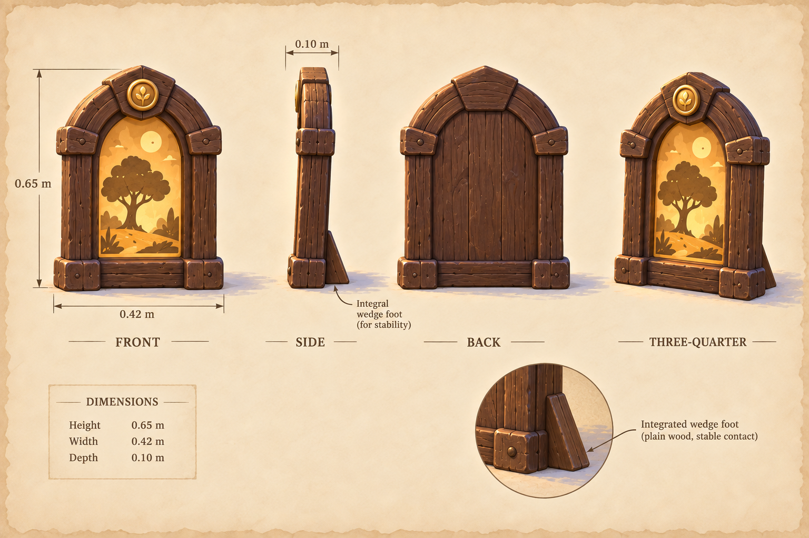

# A memory worth keeping

**memory-keepsake · v001 · Model in production · Tom review pending**

A walnut keepsake frame with a honey token and a clear inset for the journey’s fictional picture.

## Selected construction

One 0.65 m frame, with a separate UV-mapped photo surface and stable wedge foot. The lead selected this concept for the first-pass clearing kit. Preserve the broad silhouette and matte storybook palette while simplifying fine illustration detail for the browser model.

A fresh Astra author is producing the editable master, GLB, matching views and technical record under [WO-010](../../../../.agents/work-orders/010-blender-clearing-kit.md). The model and checks will appear here after actual export and intake; this concept alone is not a finished model candidate.

## Concept provenance

Generated serially by the lead through the built-in image tool on September 11, 2026, using the original [storybook reference set](../storybook-reference/v001.md). The actual output was inspected before authoring. No private photograph, real-person likeness or third-party mesh was supplied. A model ID or random seed was not returned and is not claimed.

[Full-size concept](../../media/memory-keepsake/v001/concept.png) · [Retained prompt](../../media/memory-keepsake/v001/prompt.txt) · [Source record](../../media/memory-keepsake/v001/concept-provenance.json)

Concept PNG: 2,089,695 bytes; SHA-256 `7be0aee5e47bfb9a01a14921db44ddfa2ea16ab4e7d616ff466c7bce371d854b`.

## Review state

Coordinator concept selection permits candidate construction. Tom’s exact-version model/material review is pending; no runtime files are approved or used in gameplay. Geometry, render and browser results have not yet been claimed for this entry.
