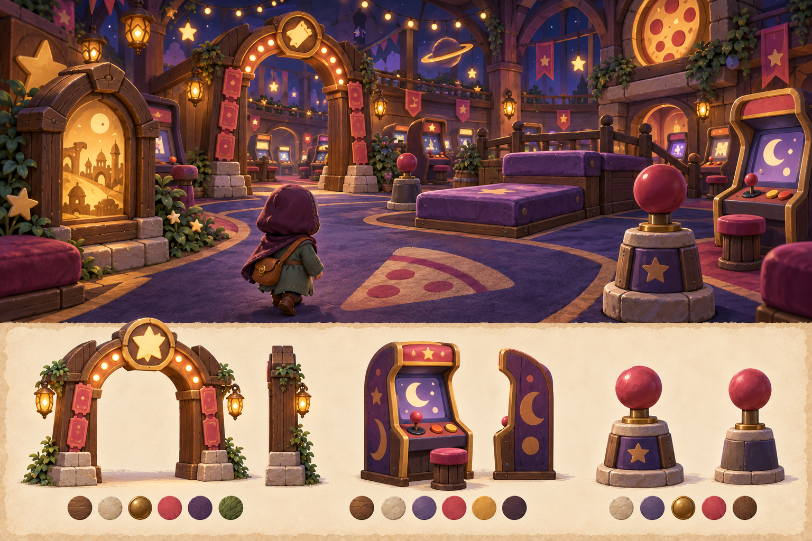
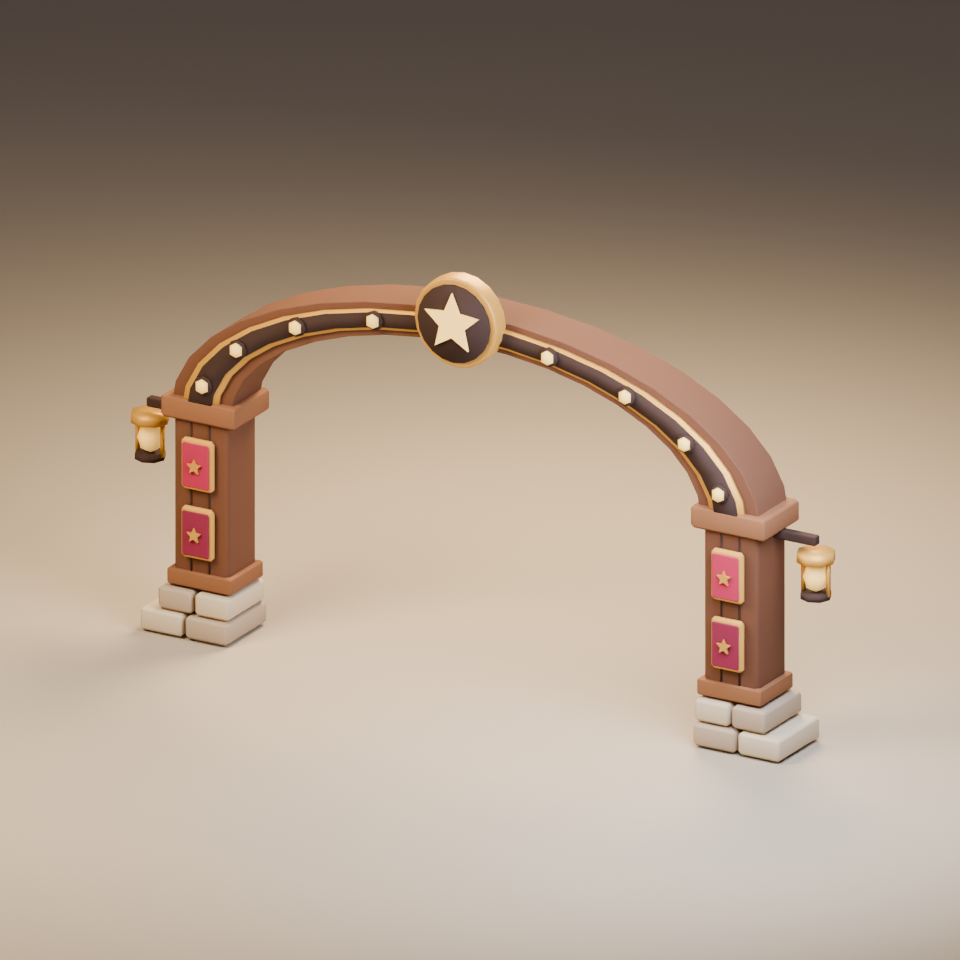
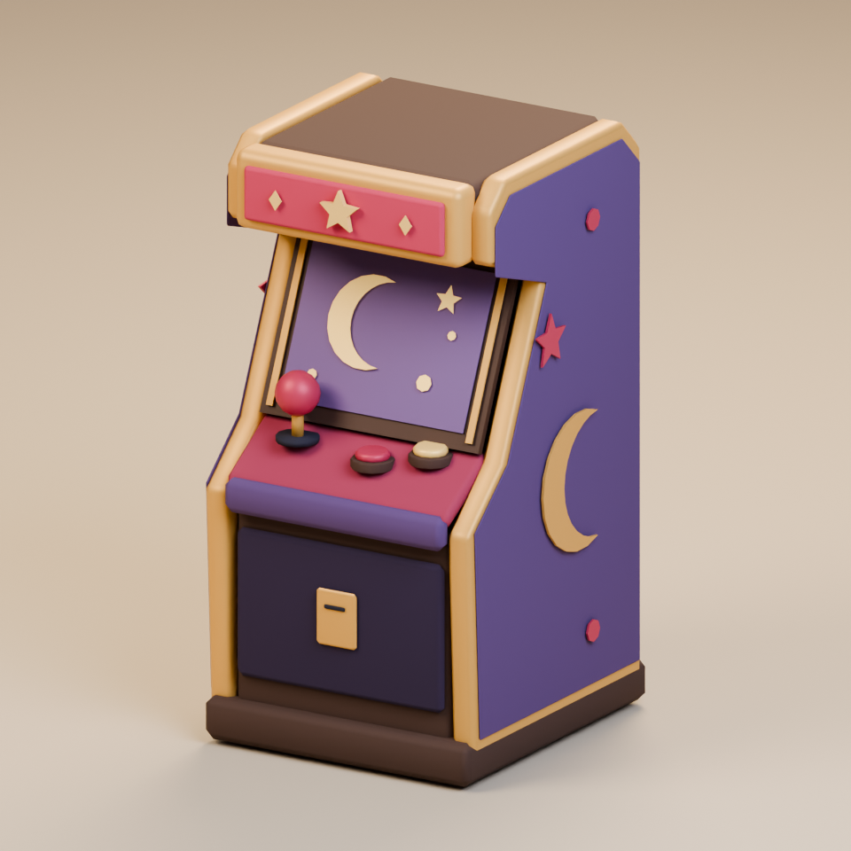
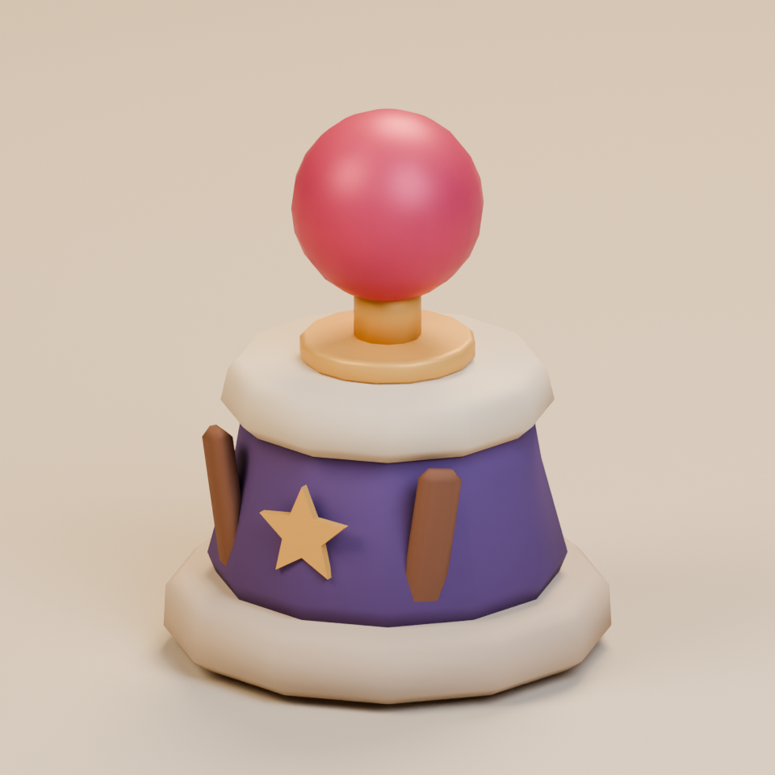
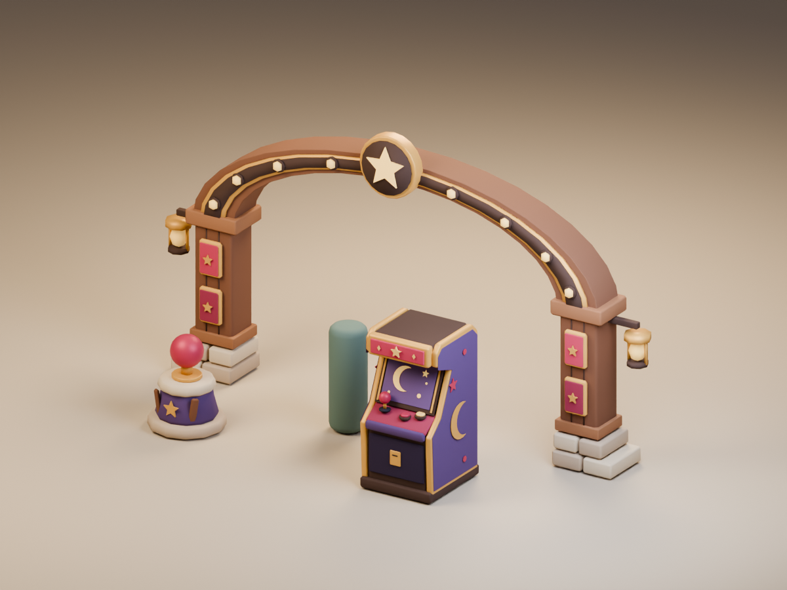

# Midnight arcade kit · v001

**Three completed environment model candidates · Ready for Tom · Studio only.** The coordinator selected the source concept and compared the exported kit with it. Tom has not reviewed or approved these exact models for gameplay.

The broad floor and padded steps set the direction for a forgiving indoor obby. The arch, cabinets and joysticks are scenery. The cabinet's crescent and stars are invented symbols. The current editor uses a procedural arcade preview; these GLBs are available here for review and have no gameplay asset mapping.

[Exact concept prompt](../../media/midnight-arcade-kit/v001/prompt.txt) · [Concept source and checksum](../../media/midnight-arcade-kit/v001/source.json) · [Shared art direction](../../art-direction.md)

## The three models

### Ticket arch {#ticket-arch}

The rounded arch retains a clear opening, warm stone feet and honey bulbs. It measures 6.080 × 3.385 × 0.738 m (width × height × depth), with 4.041 m measured between the feet and 2.80 m under the inner crown. Its wider span follows the concept's generous path.

<model-viewer src="../../media/midnight-arcade-kit/v001/ticket-arch.glb" poster="../../media/midnight-arcade-kit/v001/ticket-arch-beauty.png" alt="Orbit the Midnight arcade ticket arch candidate" camera-controls touch-action="pan-y" shadow-intensity="0.7"></model-viewer>

[Download ticket arch GLB](../../media/midnight-arcade-kit/v001/ticket-arch.glb) · [Side view](../../media/midnight-arcade-kit/v001/ticket-arch-side.png) · [Actual browser view](../../media/midnight-arcade-kit/v001/ticket-arch-browser.png)

### Arcade cabinet {#arcade-cabinet}

The cabinet's plum body, inset moon-and-star screen and tactile controls read from the front and side. It measures 0.946 × 1.790 × 1.020 m. Its screen contains no licensed game image or writing.

<model-viewer src="../../media/midnight-arcade-kit/v001/arcade-cabinet.glb" poster="../../media/midnight-arcade-kit/v001/arcade-cabinet-beauty.png" alt="Orbit the Midnight arcade cabinet candidate" camera-controls touch-action="pan-y" shadow-intensity="0.7"></model-viewer>

[Download cabinet GLB](../../media/midnight-arcade-kit/v001/arcade-cabinet.glb) · [Side view](../../media/midnight-arcade-kit/v001/arcade-cabinet-side.png) · [Actual browser view](../../media/midnight-arcade-kit/v001/arcade-cabinet-browser.png)

### Joystick bollard {#joystick-bollard}

The squat, padded plinth and short cherry ball are a playful landmark rather than a control or obstacle. It measures 0.850 × 1.050 × 0.850 m.

<model-viewer src="../../media/midnight-arcade-kit/v001/joystick-bollard.glb" poster="../../media/midnight-arcade-kit/v001/joystick-bollard-beauty.png" alt="Orbit the Midnight arcade joystick bollard candidate" camera-controls touch-action="pan-y" shadow-intensity="0.7"></model-viewer>

[Download joystick GLB](../../media/midnight-arcade-kit/v001/joystick-bollard.glb) · [Side view](../../media/midnight-arcade-kit/v001/joystick-bollard-side.png) · [Actual browser view](../../media/midnight-arcade-kit/v001/joystick-bollard-browser.png)

## Technical record

| Exact export | Triangles | Materials | Bytes | SHA-256 |
| --- | ---: | ---: | ---: | --- |
| Ticket arch | 2,924 | 3 | 236,656 | `bd06ceeacde3401dc1d484711c2d579bf5e72fca5dcc12f6885fada62b49a265` |
| Arcade cabinet | 2,544 | 3 | 194,624 | `63a54542acd25a1aededf63b563b2926002ff87b14069fa470fe2919c0f20142` |
| Joystick bollard | 1,076 | 2 | 84,880 | `11719fe4ef27242a409e7cb81137a1429903545593f1dcb61e69ae80d9d4754d` |

Each export is static, Y-up, rooted at floor center and self-contained, with no texture or animation dependency. Khronos glTF Validator returned zero errors, warnings, infos or hints for all three. Chromium 153 with the bundled model viewer loaded and visibly rendered each exact GLB over local HTTP; measured bounds matched the export report, with no page, console or request errors. This is a desktop browser check, not physical iPhone or iPad Safari acceptance or gameplay performance evidence.

[Export measurements](../../media/midnight-arcade-kit/v001/glb-measurements.json) · [Browser report](../../media/midnight-arcade-kit/v001/browser-report.json) · [Ticket validator](../../media/midnight-arcade-kit/v001/ticket-arch-validator.json) · [Cabinet validator](../../media/midnight-arcade-kit/v001/arcade-cabinet-validator.json) · [Joystick validator](../../media/midnight-arcade-kit/v001/joystick-bollard-validator.json) · [Render settings](../../media/midnight-arcade-kit/v001/render-settings.json)

## Source and coordinator intake

The driving GPT-6 Astra generated and selected the original fictional concept on September 23, 2026 from this project's existing storybook clearing and material references. A fresh native GPT-6 Astra at max authored the three models in Blender 4.5.13 LTS through the dedicated service. No family image, real-person likeness, outside franchise art or downloaded mesh was used. The image tool supplied no seed.

Editable master: `haynes-quest/midnight-arcade-kit/v001/midnight-arcade-kit.blend` on the dedicated Blender authoring PVC, 1,755,878 bytes, SHA-256 `60ebbb1387e5402ffa5c3ea2c32bf701896398976e8a0db5967de54f7e765be8`. Retrieve it from the service's `/artifacts/haynes-quest/midnight-arcade-kit/v001/midnight-arcade-kit.blend` route and verify the checksum.

[Source construction script](../../media/midnight-arcade-kit/v001/build-kit.py) · [Render script](../../media/midnight-arcade-kit/v001/render-kit.py) · [Construction measurements](../../media/midnight-arcade-kit/v001/construction-measurements.json) · [Catalog intake](../../media/midnight-arcade-kit/v001/catalog-intake.json) · [Remote artifact manifest](../../media/midnight-arcade-kit/v001/remote-artifacts.json) · [Authoring work order](../../../../.agents/work-orders/095-midnight-arcade-kit.md)

The exact three-model assembly carries the concept's crescent silhouette and honey light. The render uses simpler, flatter faces than the illustration. The correct side render includes both arch feet. The models are decorative; no route collision, placement or interaction has been validated for them.

## Tom's review

Please inspect the arch opening and scale, the cabinet's screen and controls, and the joystick's short stalk.

- **Decision / date:** Pending.
- **Approved version and checksums:** None.
- **Use:** Asset studio only. The private editor and playtest use procedural arcade scenery. Changed geometry or materials need a new candidate version before approval or integration.
