# Mischief Kitten Skater · v001

**Coordinator-selected candidate · awaiting Tom's exact-version review.** This roller-skating kitten is a new ordinary enemy for the Harbor cast in [DESIGN-029](../../../designs/029-action-and-inhabited-worlds.md). It is a bigger, faster member of the mayor's [mischief kitten](../mischief-kitten/v001.md) crew: it skates after the player on four roller skates and stomps them flat. Under [PRD-004 Q-03](../../../prds/004-family-release.md#owner-decisions) it may appear in the children's levels while labelled awaiting review here. Coordinator review and owner approval remain separate.

It is built from row 2 of the coordinator's construction reference:

- a lilac tabby with darker purple stripes on its back, tail, forehead and the back of its head, a cream chest and muzzle, and a big chibi head;
- big amber eyes glancing sideways under a dark lash line, naughty arched brows, a pink nose and a smirking open mouth with two tiny fangs and whiskers;
- tall ears with pink insides and white tufts, and a plum mini stovepipe with a raspberry band tilted toward its left ear;
- a raspberry collar with a gold bell, an arched striped tail, and teal roller skates with cream wheels, dark raspberry plates and hubs, and cream laces on all four feet.

**Source: coordinator-generated concept, built as an original Blender model.** The concept is build direction only; no image is projected or pasted onto the model. Every part is modelled geometry painted from one original 1024 × 1024 colour atlas. There are no copied meshes, logos or lettering, and no gore.

[Full concept sheet](../../media/action-minions-a/v001/concept.png) · [Model provenance](../../media/mischief-kitten-skater/v001/provenance.json) · [Construction record](../../media/mischief-kitten-skater/v001/construction.json)

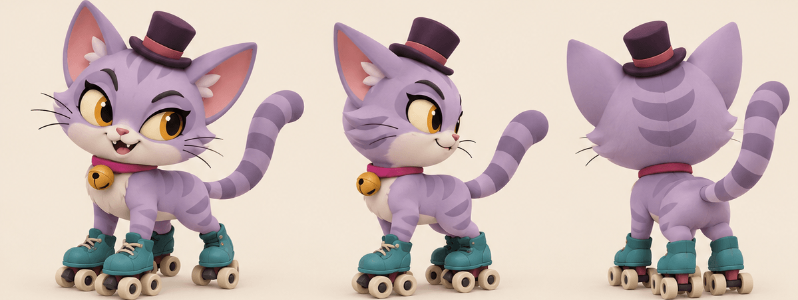

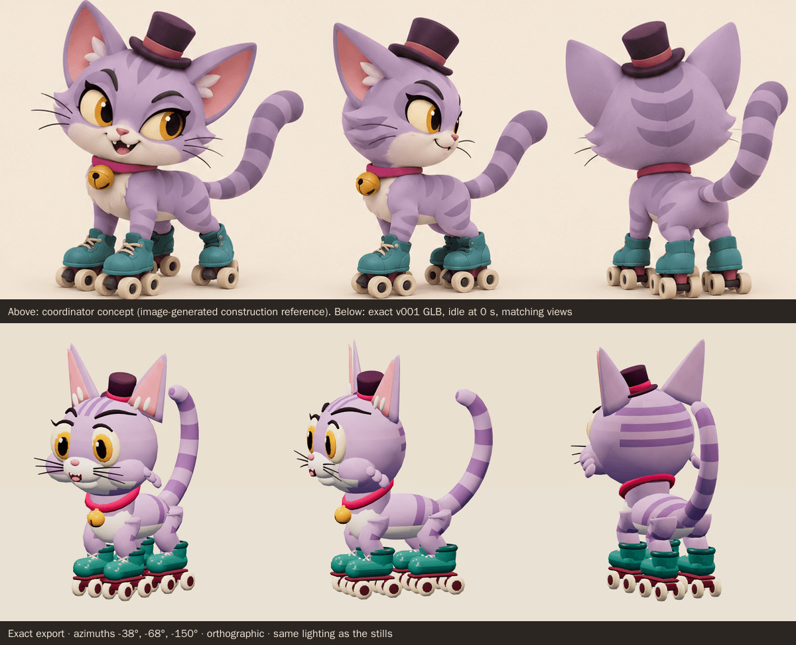

<model-viewer src="../../media/mischief-kitten-skater/v001/mischief-kitten-skater.glb" poster="../../media/mischief-kitten-skater/v001/beauty.png" alt="Orbit the Mischief Kitten Skater and inspect its five animations" camera-controls touch-action="pan-y" data-quest-clips shadow-intensity="0.7" camera-orbit="155deg 78deg auto"></model-viewer>

[Download exact GLB](../../media/mischief-kitten-skater/v001/mischief-kitten-skater.glb) · [Editable Blender master](../../media/mischief-kitten-skater/v001/mischief-kitten-skater.blend) · [Review video (WebM, 737 KiB)](../../media/mischief-kitten-skater/v001/review.webm) · [Artifact manifest](../../media/mischief-kitten-skater/v001/sha256-manifest.json)

<figure>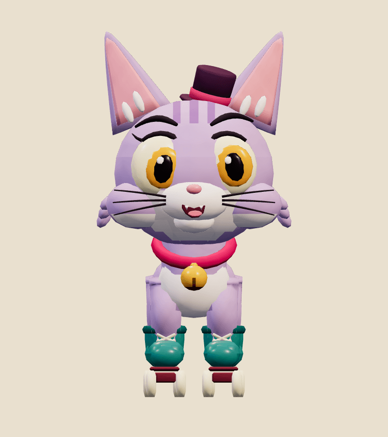<figcaption>Front</figcaption></figure>
<figure>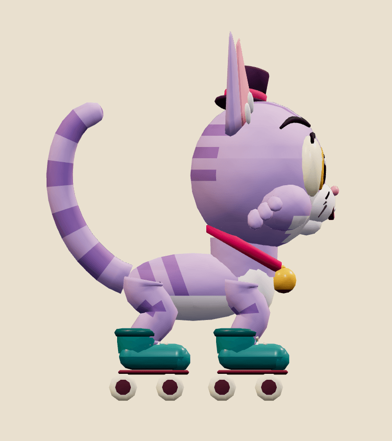<figcaption>Side</figcaption></figure>
<figure>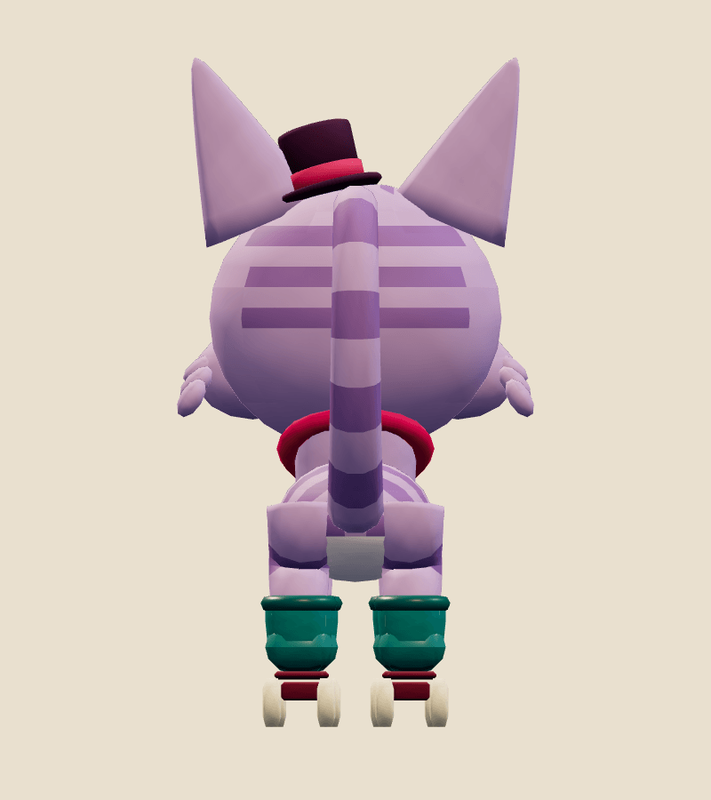<figcaption>Back</figcaption></figure>
<figure>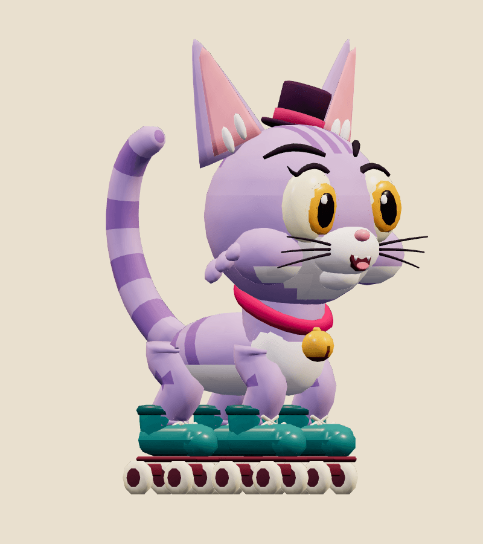<figcaption>Three-quarter</figcaption></figure>

| Exact exported model | Result |
| --- | --- |
| Size and placement | 1.308 m tall in the concept pose, 0.696 m wide and 1.035 m deep. Across all clips it spans -0.73 to 1.26 m across, up to 1.64 m high and -0.74 to 1.11 m front to back; nothing goes below the floor. Metre scale, Y-up, forward −Z, floor-centred stationary root, character right +X |
| Geometry | 14,622 triangles; one skin with 42 joints and at most 2 influences per vertex |
| Materials | 2 opaque materials sampling one atlas: Matte painted clay, Glossy toy accents; one draw primitive each |
| Texture | One original embedded 1024 × 1024 PNG atlas (195,780 bytes), painted procedurally in Blender Python; no external resource or required decoder |
| Download | 1,831,636 bytes; below the 2 MiB budget |
| GLB SHA-256 | `8ae3f8dc4f7f1596c694a6769d474226b784c9bfa37d90975f618a82a9a74bf4` |
| Blender master SHA-256 | `d7fc8fbf767f508259ecdf2ea43a1ff7963de847a1a3cae024db41e2a6388930` |

## Motion and checks

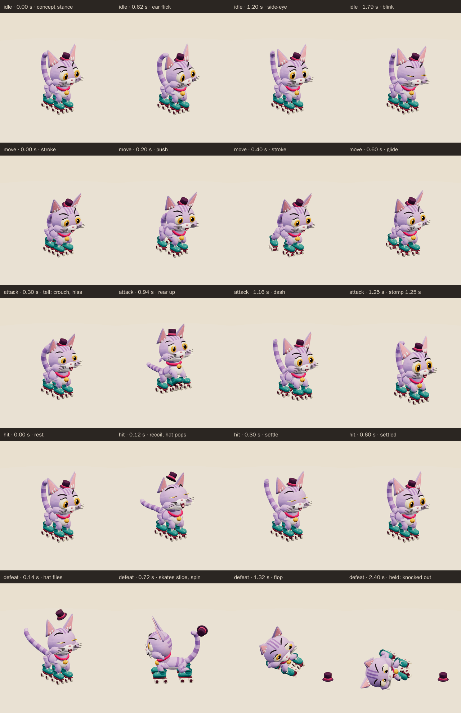

The viewer exposes `idle` (2 s), `move` (0.8 s), `attack` (2 s), `hit` (0.6 s), `defeat` (2.4 s):

- **Idle:** from the concept stance it rolls a little forward and back on its skates with the wheels turning, bobs, tilts its big head, flicks an ear, side-eyes across, raises a brow, blinks, and sways its tail while the bell swings.
- **Move:** it skates: two alternating hind-skate strokes per loop push out and back, lift and return, while the front skates glide. The body leans in and sways with each stroke, all sixteen wheels roll three turns per loop, and the tail streams back with the ears and hat pressed back.
- **Attack:** the tell (to 0.45 s): it crouches and wiggles its bottom, the ears flatten, the eyes narrow, the brows drop, it hisses and lashes its tail. The wind-up (0.45–1.0 s) rears it up on its hind skates with the front skates raised. Then it dashes forward on all four skates and stomps both front skates down in front at **1.25 seconds**, mouth wide, before rolling back to the concept stance.
- **Hit:** it recoils backwards on its skates with its eyes squeezed shut and ears flat, its tail bristles straight back, and the hat pops up and lands again.
- **Defeat:** the hat flies off, its skates slide apart and it spins round dizzily, then flops onto its side with all four skates sticking out. The hat lands upright on the floor; the kitten is cross-eyed with its tongue out. The pose is held from 1.95 s.

The clips keep the root still; gameplay moves and turns the enemy. In the game, the wind-up plays the attack from its start to the 1.25 second contact at the enemy's wind-up speed, so the tell and the wind-up both show.

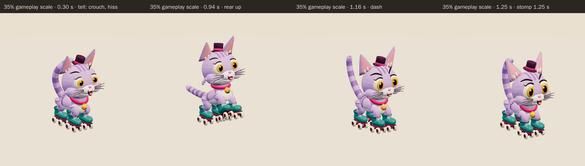

<figure>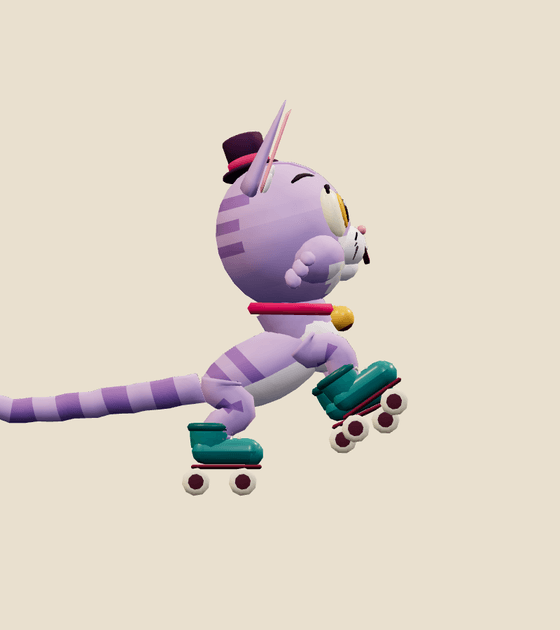<figcaption>Attack wind-up</figcaption></figure>
<figure>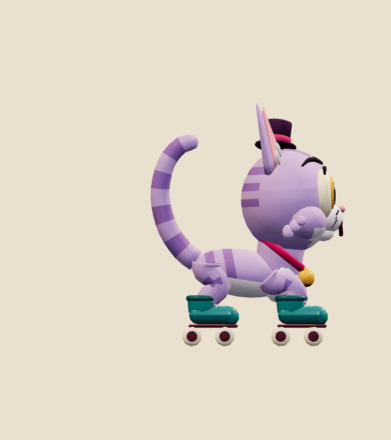<figcaption>Contact, 1.25 s</figcaption></figure>
<figure>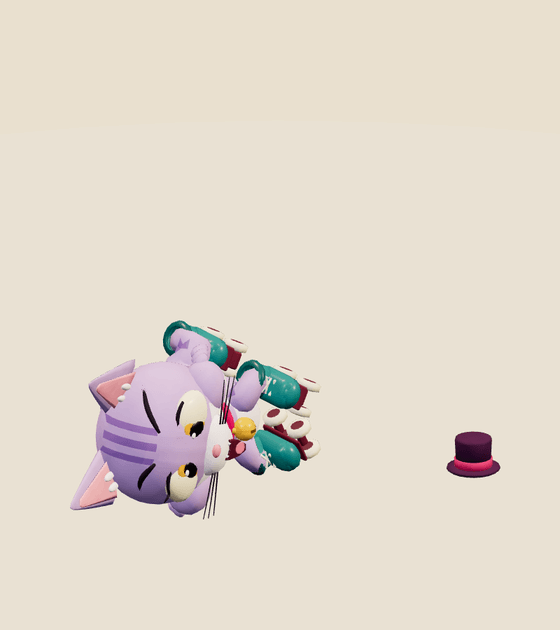<figcaption>Held defeat</figcaption></figure>
<figure>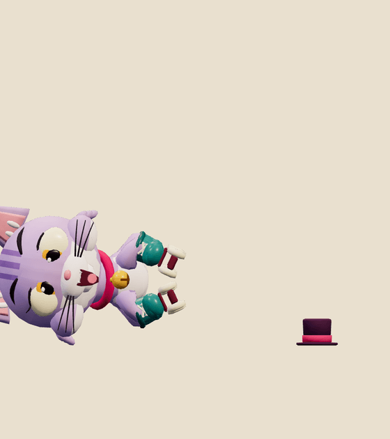<figcaption>Held defeat, front</figcaption></figure>

[Khronos validation](../../media/mischief-kitten-skater/v001/validation.json) reports 0 errors, 0 warnings, 0 infos and 0 hints (gltf-validator 2.0.0-dev.3.10, run in the Blender pod on the exact bytes), and all 20 contract checks pass.

[Three.js inspection](../../media/mischief-kitten-skater/v001/three-inspection.json) reimported the exact GLB with three r186 and the real `src/game/enemy-animation.ts` adapter. It sampled all 13,390 exported vertices at 60 Hz in every clip and passed all 35 checks:

- every track resolves below the scene root, the root never moves, and the weights are normalised with at most four influences;
- `idle` and `move` loop seamlessly, `defeat` holds its final pose, and no clip goes below the floor;
- the culling envelope stored in the model covers every pose;
- it stands 1.31 m tall on the floor, inside the 1.3–1.6 m band, and `idle` starts in the concept pose;
- the adapter's wind-up contact pose matches the clip at 1.25 s, the defeat vanishes, and clones animate independently;
- part clearance: skates vs head; skates vs torso; tail vs head; hat vs head (rest-space part boxes; a proxy, not triangle collision);
- asset beats: idle starts in concept stance; legs stay plugged into skates; wheels touch floor at rest; front skates raised in wind up; front skates stomp floor at contact; stomp lands in front; hind skate lifts in stroke; wheels roll in move; hat pops on hit; hat lands on floor in defeat; knocked out on its side.

[Chromium playback](../../media/mischief-kitten-skater/v001/browser-inspection.json) (Chromium 153.0.8010.12, ANGLE SwiftShader) rendered changing frames for all five clips at full and 35% scale, played each clip in real time at both scales, and drew the character in two draw calls. There were no console, HTTP or WebGL errors and no external requests. The review video is rendered from the exact GLB at 30 fps. No physical-device test has been run.

The author departed from the concept in these deliberate ways:

- **Head turn.** The concept turns the head toward the viewer; the model faces forward in its rest pose and turns its head in `idle`.
- **Collar.** The concept's flat collar band is a round raspberry ring with a gold bell; the bell swings in every clip.
- **Stripes and fur.** Stripes are crisp geometry bands painted from flat atlas tiles; the concept's soft fur texture and cheek tufts are reduced to a few tuft shapes.
- **Legs.** The legs are short and thick so that a real two-bone leg plugs into each skate; the exported ankle never leaves its skate (the largest measured gap is under 1 µm).

The author also fixed these problems along the way:

- The first build was leggy with a small head and an exposed neck; it was re-proportioned to the concept's big-headed chibi kitten, with the head seated on the shoulders and the collar under the chin.
- Bands across the cheeks read as a barcode and were removed; stripes across the back of the head were added to match the concept's back view.
- The legs first overreached their skates by up to 5 cm in `hit` and `defeat`, which would have left gaps. The skates now move with the body and every leg stays attached.
- While rearing, the raised front skate dipped into the chest, and the knocked-out head floated 3.7 cm above the floor. Both were corrected and are now checked.
- The first skates were tall narrow boots on small wheels. They were rebuilt as the concept's low chunky boots on 5 cm cream wheels, staying under the 15k triangle budget.

## Catalog intake

- **Suggested placement:** World A chapter 2, Harbor Rescue (`harbor`): a faster skating member of the mischief kitten crew beside the existing Mischief Kitten, under Mayor Humdrum. It shares the kitten's era window.
- **Suggested catalog entry:** `mischief-kitten-skater@v001`, "Mischief Kitten Skater", ordinary, `ordinary-a`, period `rescue-harbor-v1`, window 2013-08-12 → 2026-12-31.
- **Scene motion:** `contactFraction: 0.625`, `height: 1.308229`.
- **Clip mapping:** idle → `idle`, chasing → `move`, wind-up and strike → `attack` (contact 1.25 s), HP drop → `hit`, defeated → `defeat` (held from 1.95 s).

Selected by the Codex driving session on October 4, 2026 after inspecting the construction comparison and attack at small scale. Owner approval remains pending. [Coordinator record](../../media/mischief-kitten-skater/v001/coordinator-review.json).
