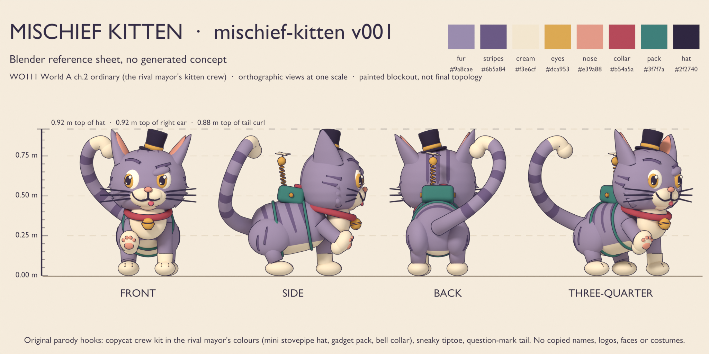
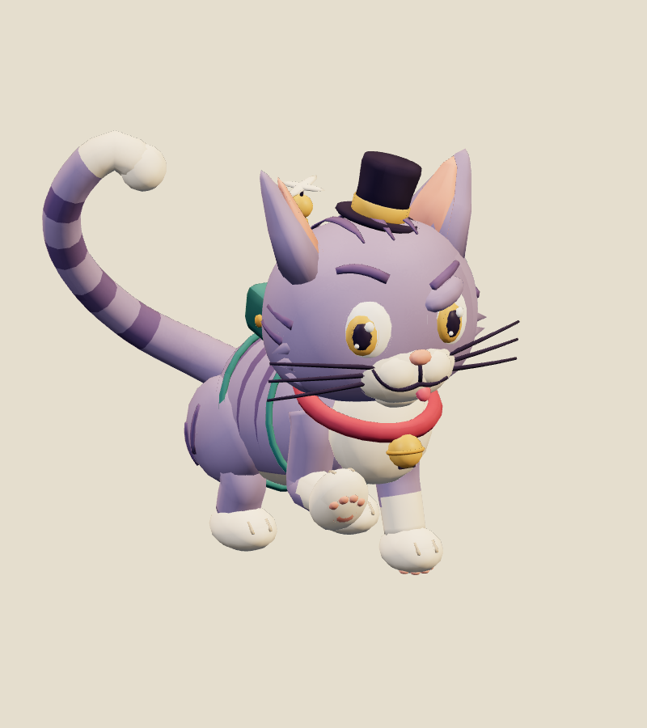
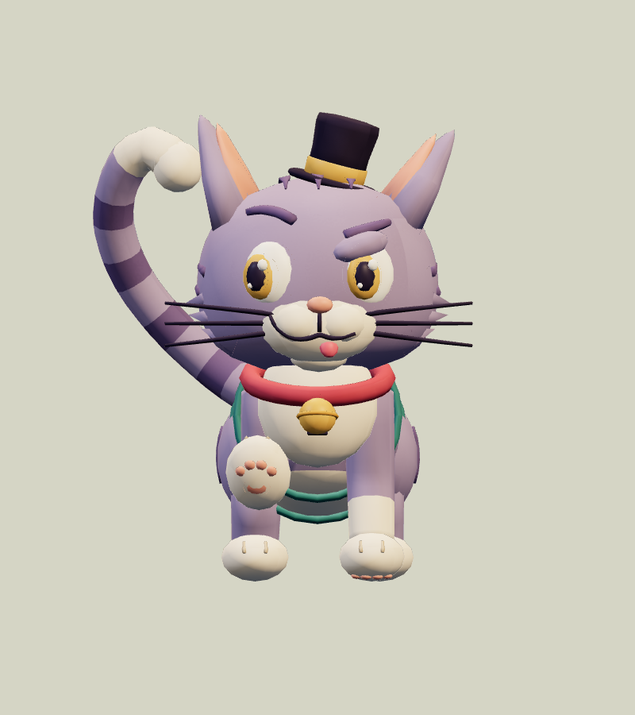
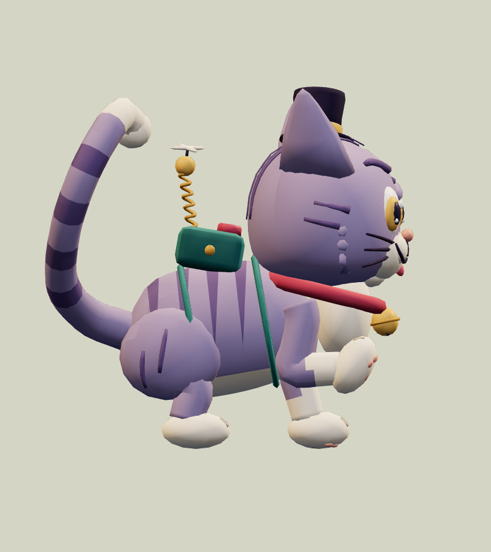
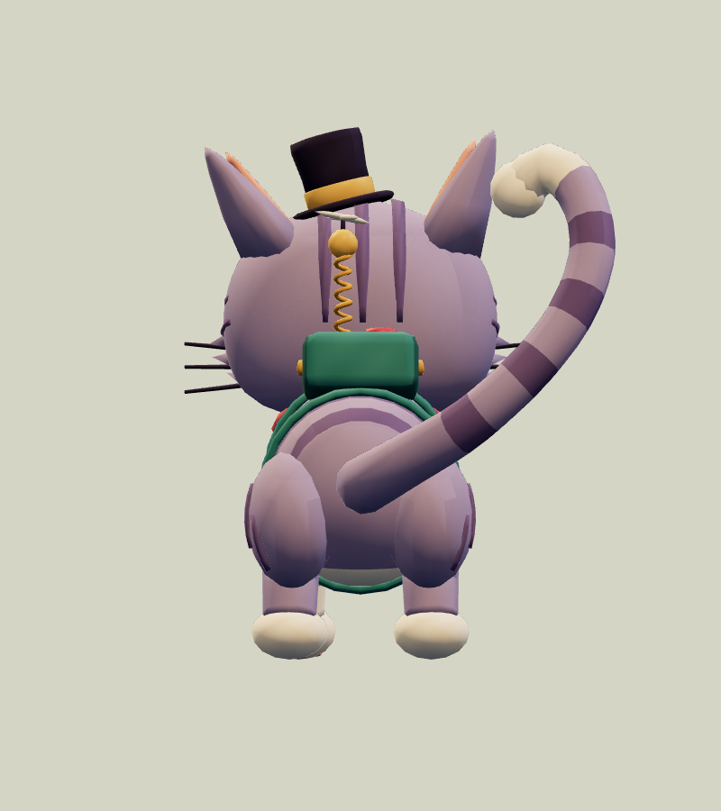
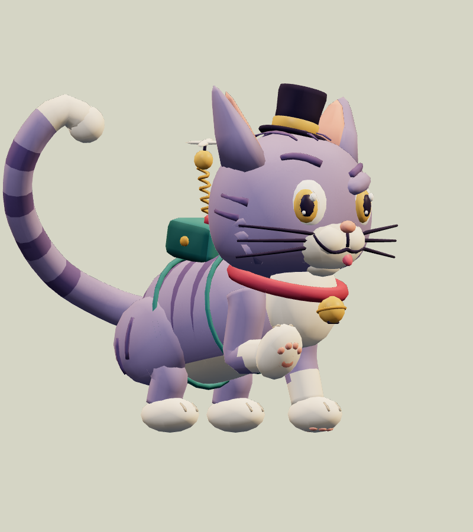
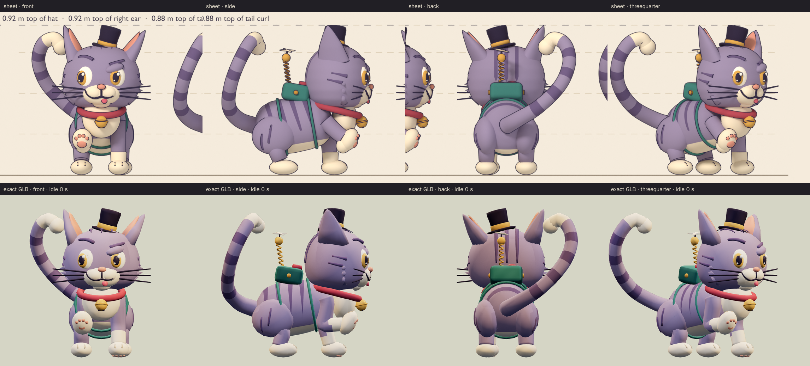
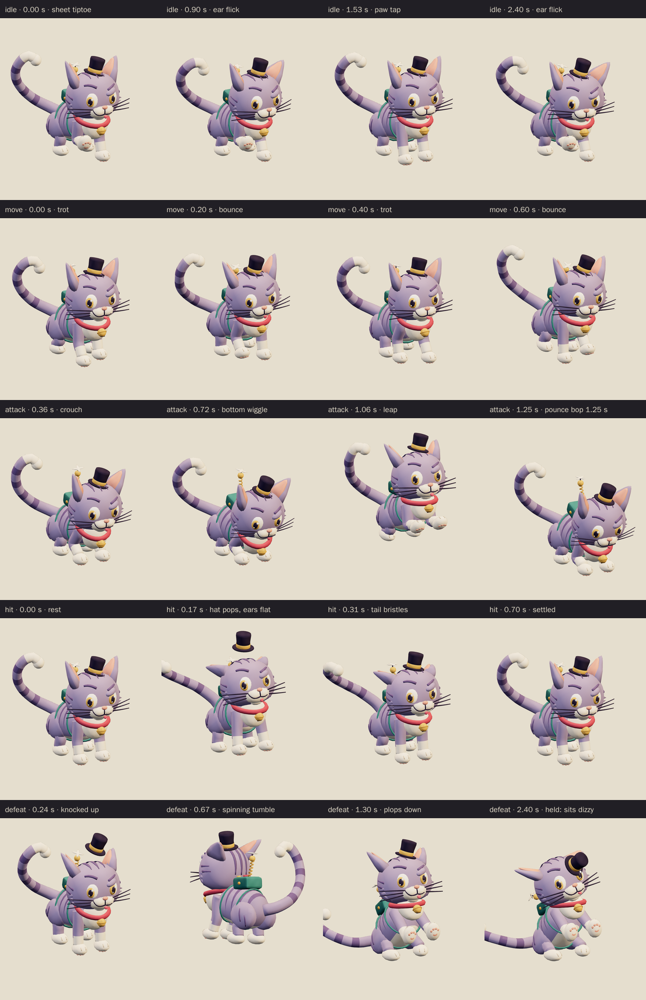
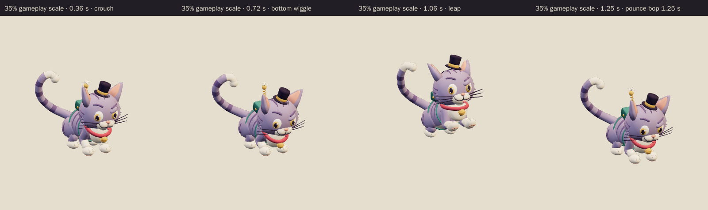

# Mischief Kitten · v001

**Awaiting Tom's review · used in the family release.** This small, bouncy troublemaker is the World A chapter 2 ordinary enemy candidate from [the locked era roster](../../../designs/026-personal-era-casts.md). It belongs to the rival mayor's kitten crew and copies his look: a mini stovepipe hat tipped over one ear, a raspberry bell collar that matches his sash and a teal gadget pack with a spring antenna and propeller that echo his remote. A lopsided smirk, a tongue blep and a question-mark tail keep it cute first and naughty second. Its attack is a wiggle-and-pounce.

**Source: Blender reference sheet, no generated concept.** No image-generation model was used for this asset. Following [PRD-004 Q-07](../../../prds/004-family-release.md#owner-decisions), the author first rendered a painted Blender reference sheet from the written brief, and the coordinator approved it on September 26 before any detailing.

[Reference sheet notes](../../media/mischief-kitten/v001/reference-notes.md) · [Reference source record](../../media/mischief-kitten/v001/source.json) · [Model provenance](../../media/mischief-kitten/v001/provenance.json)

<figure><figcaption>Blender reference sheet, no generated concept</figcaption></figure>
<figure><figcaption>Exact v001 model</figcaption></figure>

<model-viewer src="../../media/mischief-kitten/v001/mischief-kitten.glb" poster="../../media/mischief-kitten/v001/beauty.png" alt="Orbit the Mischief Kitten and inspect its five animations" camera-controls touch-action="pan-y" data-quest-clips shadow-intensity="0.7" camera-orbit="155deg 75deg auto"></model-viewer>

[Download exact GLB](../../media/mischief-kitten/v001/mischief-kitten.glb) · [Editable Blender master](../../media/mischief-kitten/v001/mischief-kitten.blend) · [Reference blockout master](../../media/mischief-kitten/v001/mischief-kitten-blockout.blend) · [Artifact manifest](../../media/mischief-kitten/v001/sha256-manifest.json)

<figure><figcaption>Front</figcaption></figure>
<figure><figcaption>Side</figcaption></figure>
<figure><figcaption>Back</figcaption></figure>
<figure><figcaption>Three-quarter</figcaption></figure>

The comparison above shows the sheet and the exact export at matching angles and one metric scale. The export stills use the first frame of `idle`, which recreates the sheet's tiptoe. The model follows the coordinator's sheet notes:

- It keeps the mini stovepipe hat, the gadget pack, the bell collar and the question-mark tail.
- The attack is a pounce: a low crouch and bottom wiggle, a leap, then a two-paw bop on the floor.
- The height and silhouette match the approved blockout to within 1 mm, and the atlas uses the sheet's 16 colour values.

The author departed from the sheet in five deliberate ways:

- The bind pose stands on all four paws, as the sheet notes suggested. The tiptoe is recreated at the start of `idle`, and the main stills show it; [rest-pose stills](../../media/mischief-kitten/v001/rest-beauty.png) show the bind pose.
- The pack sits 4 cm further back than on the blockout. In the blockout position its top front edge was 3.6 cm inside the back of the head.
- The defeat follows the work-order brief (tumble, then sit dizzy) rather than the sheet notes' roll-onto-its-back idea.
- The paws float 3 mm above the floor so frames interpolated at 60 Hz never dip below it.
- Toe beans are on the front paws only; the hind paws keep the sheet's toe grooves.

The author also fixed these problems along the way:

- The first pass had 15,886 triangles. Painting the crown stripes as thin ribbons and trimming ring counts brought it to 14,174.
- An axis sign error first tipped the crouch and landing nose-up, so the contact read as standing.
- The ears first flattened and drooped along the wrong axes, and the idle ear twitch clipped the hat brim.
- The defeat sit first sank 41 mm below the floor, and the defeat hat first slid behind the head.
- The limp defeat tail first clipped the head, then a hind leg. Its final pose came from a clearance search.
- The bottom wiggle first ran at 8.75 Hz, which stutters at 30 fps; it now runs at about 4.8 Hz.
- A sliver of pink showed under the planted forepaws.

The expression is smug rather than mean, with no claws or teeth, and the pack is a gadget, not a weapon.

| Exact exported model | Result |
| --- | --- |
| Size and placement | 0.726 m wide × 0.919 m tall to the hat top × 0.928 m deep at rest; the paws sit 3 mm above the floor. Across all clips the highest point is 1.139 m, and at attack contact the forepaws land about 0.35 m ahead of their start. Metre scale, Y-up, forward −Z, floor-centered |
| Geometry | 14,174 triangles; one skin with 32 joints and at most two influences per vertex; two opaque material primitives |
| Texture | One original embedded 1024 × 1024 palette atlas; no external resource or required decoder |
| Download | 1,197,116 bytes; below the 2 MiB candidate budget |
| GLB SHA-256 | `ab0e3d2e36115cbc654a065c73f7fb973c136b67b3fce8ba947a3a5ada40b6f6` |
| Blender master SHA-256 | `b95c8d0d69d641b48724d8e79331e1f4706df435c3ed3fc6e66e56ed807baaf1` |
| Reference sheet SHA-256 | `7e2596865059d2b7c6844ed92527f89e58136a842b4f90063fca8cfca18298a3` |

## Motion and checks

The viewer exposes `idle` (3.0 s), `move` (0.8 s), `attack` (2.0 s), `hit` (0.7 s) and `defeat` (2.4 s):

- **Idle:** it starts in the sheet's tiptoe with the right forepaw curled up, taps that paw down at about 1.5 seconds and tilts its head smugly. Its left ear flicks outward, the tail tip flicks and the propeller turns.
- **Move:** a bouncy trot in place, with the pack, antenna and bell jiggling and the tail swaying.
- **Attack:** it crouches low and wiggles its bottom while the propeller spins up, leaps at 0.92 seconds and bops the floor with both forepaws at **1.25 seconds**, chest down and rump up. It squashes into a belly flop, then hops back onto its spot by 1.84 seconds.
- **Hit:** a startled hop back. The hat pops up 11 cm, the ears flatten and the tail bristles straight up.
- **Defeat:** it is knocked up into a spinning tumble, then plops down sitting with a dizzy head wobble. The ears droop, the hat slides over its left eye, the tongue pokes out and the tail lies limp on the floor. The pose is held from about 1.92 seconds.

The clips leave the root stationary; gameplay controls travel and damage. The pounce carries the body 0.30 m forward and back inside the clip.

[Khronos validation](../../media/mischief-kitten/v001/validation.json) reports zero errors, warnings, infos and hints. [Three.js inspection](../../media/mischief-kitten/v001/three-inspection.json) reimported the exact GLB and exercised the real enemy animation adapter. It sampled all 12,301 exported vertices at 541 animation steps and passed all 30 checks:

- The root stays still, and rotation-only joints keep their pivots.
- The idle and move loops are seamless, and the defeat pose holds.
- No clip goes below the floor.
- Idle starts in the sheet tiptoe, the kitten is airborne before contact, and at contact both forepaws bop the floor ahead of it with the head low.
- The hat pops on hit, and in the held defeat the kitten sits on the floor with the hat over its left eye.

The [attachment audit](../../media/mischief-kitten/v001/attachment-inspection.json) checked 16 part pairs on every frame of every clip, including the tail against the head, hat, pack and hind legs, the pack against the head and hat, and the bell against the forelegs and head. It found no overlaps, and the limb and tail joints stayed connected. [Chromium playback](../../media/mischief-kitten/v001/browser-inspection.json) rendered changing frames for all five clips at normal and 35% scale with no page, console, HTTP or WebGL errors and no external requests. [Author's visual notes](../../media/mischief-kitten/v001/visual-review.json) and the [scene release](../../media/mischief-kitten/v001/scene-release.json) record the corrections and the released Blender scene.

The catalog intake checked all 143 local artifact hashes against the manifest. It reran the Three.js inspection against the current enemy animation adapter and got byte-identical results.

The browser evidence uses software Chromium. Physical iPad/iPhone Safari, device frame time and combat feel remain owner checks. This package contains visual animations only; the bell and propeller have no new audio file.

## Provenance and release

Claude Opus 5.5 (`claude-opus-5-5`, effort `xhigh`) authored both stages through Blender 4.5.13 under [WO111](../../../../.agents/work-orders/111-era-cast-art-lead.md), under Tom's September 26 ruling. It built the procedural blockout and rendered the reference sheet on the first Blender authoring service. After the coordinator approved the sheet, it built the final topology, atlas, 32-bone rig and all five clips on the second service, holding an exclusive scene lease from 15:54 to 16:28 UTC. No family photograph, personal likeness, downloaded franchise model, logo, emblem or audio was used; the collar carries a plain bell and the pack has no badge. The [sheet-stage records](../../media/mischief-kitten/v001/sheet-stage/README.md) keep the sheet's own lease, release and manifest. The source scripts live in `scripts/assets/mischief-kitten/v001/`.

[PRD-004 Q-03](../../../prds/004-family-release.md#owner-decisions) permits this candidate in the family release before Tom's review. For now, the current World A template `family-world-a@v2`, like the frozen v1, fills the four chapter 2 ordinary slots and the bonus slot with the Mischief Kitten as a project candidate with neutral placeholder art. The coordinator will register this exact version in a later parody catalog before it appears in levels. Tom's exact-version decision is **pending**. A rejection returns those slots to a placeholder or prior version; catalog inclusion and technical checks do not constitute approval.
