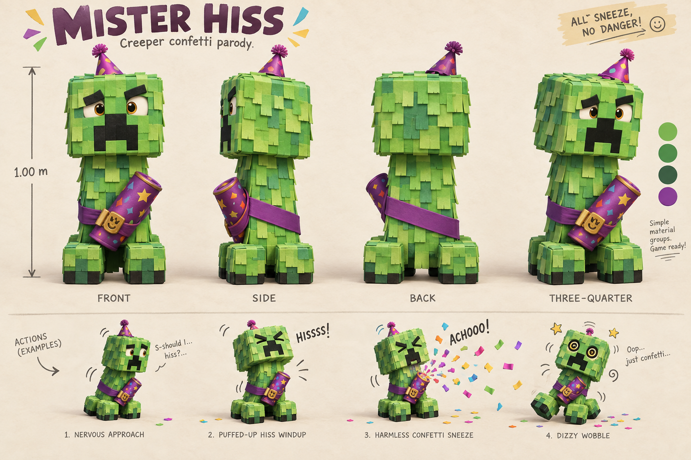

# Mister Hiss

**Recognizable Creeper parody · v001 concept · No model yet**

Mister Hiss tries to deliver a terrifying hiss, then sneezes his own confetti and wobbles. The familiar cuboid head, tall armless body, four feet and pixel face make the Minecraft reference readable. A paper-fringe surface, crooked party hat and strapped party popper supply the joke.

[Exact prompt](../../media/mister-hiss/v001/prompt.txt) · [Concept provenance and checksum](../../media/mister-hiss/v001/concept-provenance.json)

## Intended encounter

A nervous approach leads into a long, visible puff-up. The player steps clear of a short-range confetti burst, then has time to hit while Mister Hiss recovers. This opening encounter must be avoidable without jumping, which the current age progression introduces after the first boss. The confetti gives a harmless-looking bump in the game; the sheet's playful “no danger” slogan is not a claim that the encounter has no collision or consequence.

The reference predates the opening 2020 period: Mojang described the Creeper as Minecraft's iconic monster in its [May 2017 feature](https://www.minecraft.net/en-us/article/meet-creeper). The [period evidence](../../../../.agents/work-orders/022-parody-period-evidence.md) distinguishes reference availability from later popularity.

## Construction checks before modeling

Keep exactly four feet and no arms. The face stays on the front; the rear shows the continuous back of the sash. The party popper, clasp and hat must have consistent attachment points across views. The final model's total height, including the hat, will be stated independently of the illustration's dimension guide. Paper fringe needs a controlled geometry budget and a matching embedded texture; not every illustrated paper layer needs its own mesh.

The lead generated and inspected this sheet serially using the built-in image tool. No family images or external reference images were submitted. It establishes a replacement direction for review, not an exported model, completed animation or deployed enemy. Tom's exact-version approval is pending.
