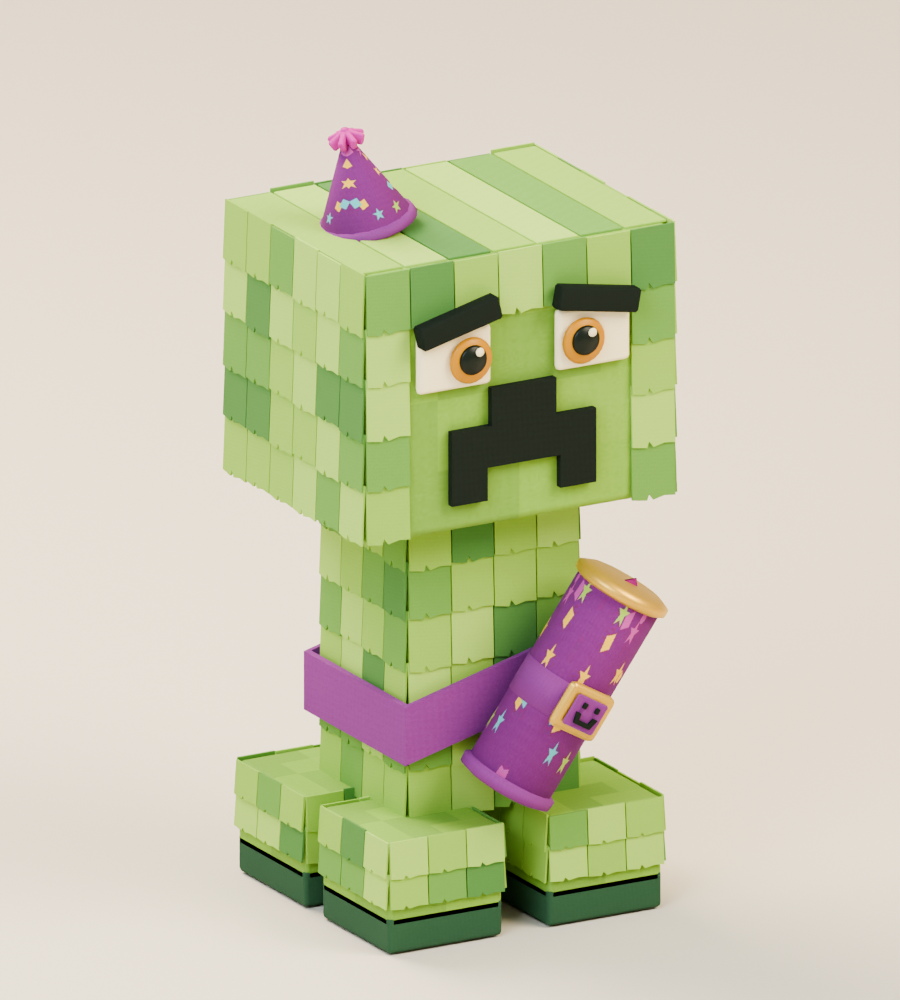
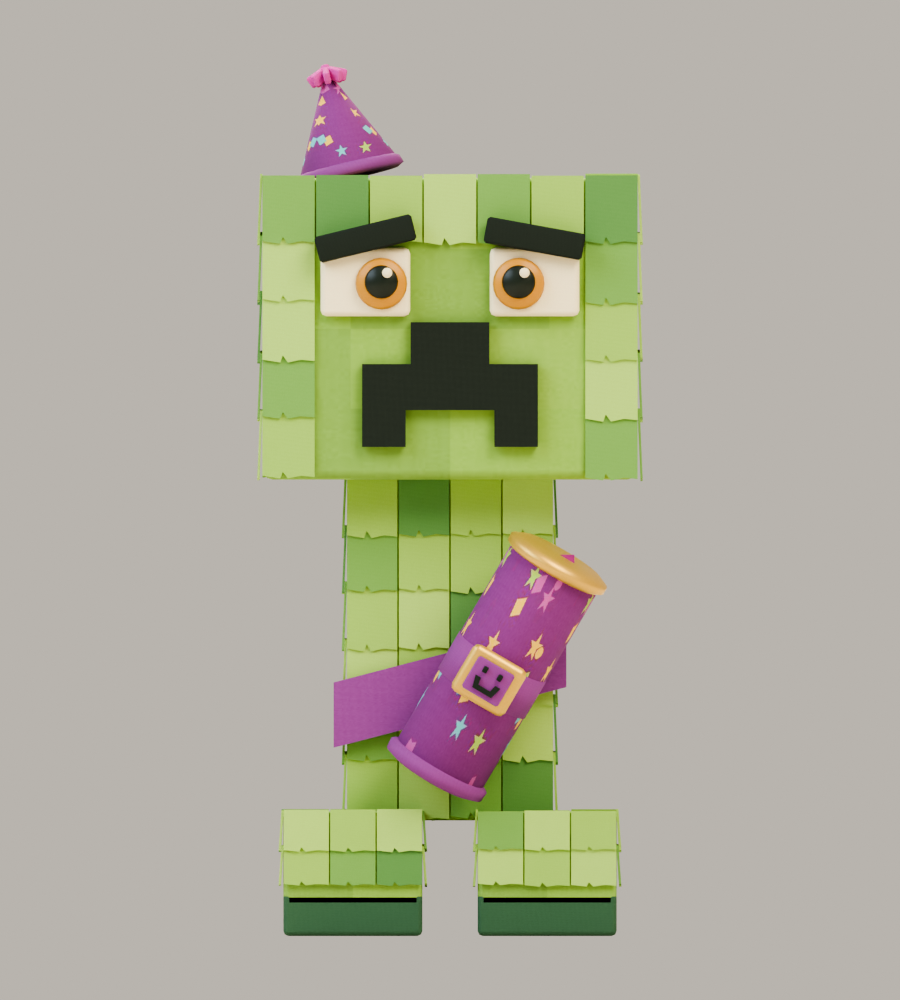
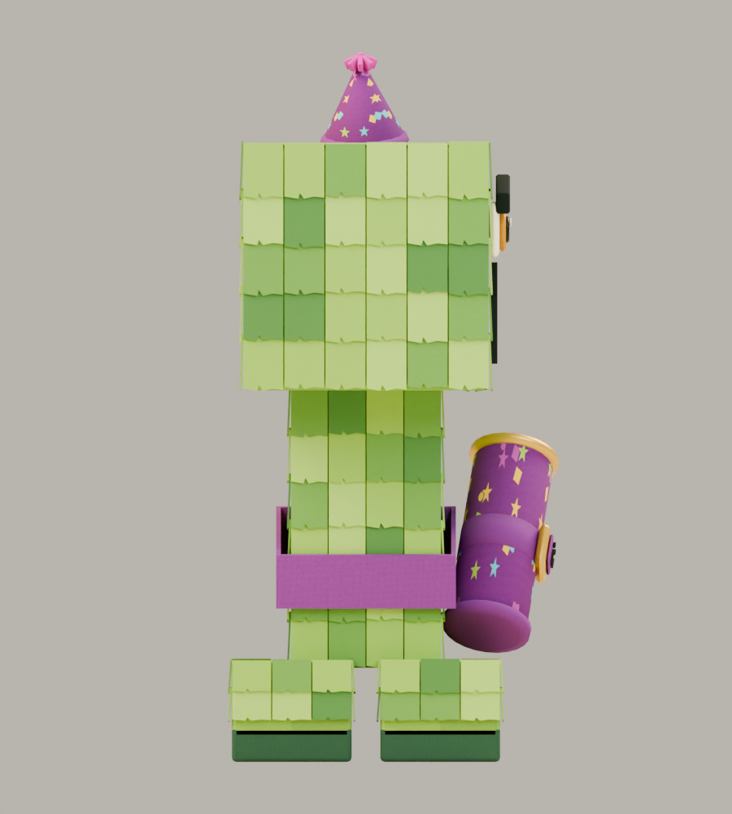
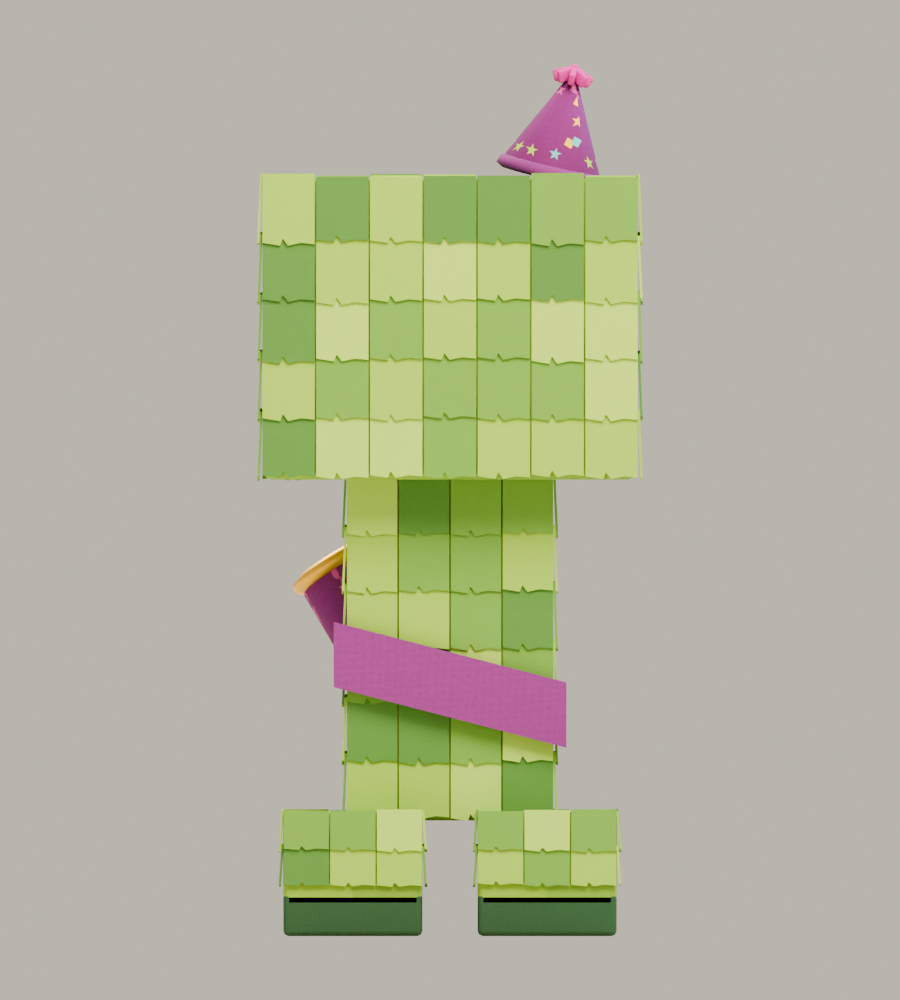

# Mister Hiss

**Recognizable Creeper parody · v001 model candidate · Tom’s review pending**

Mister Hiss tries to deliver a terrifying hiss, then sneezes his own confetti and wobbles. The cuboid head, tall armless body, four feet and pixel face keep the Minecraft reference clear. Paper fringe, a crooked party hat and a strapped party popper supply the joke.

## Concept and exported model

<figure><figcaption>Selected construction reference.</figcaption></figure>
<figure><figcaption>Exact exported v001 model, re-imported for this render.</figcaption></figure>

The model preserves the familiar silhouette and confetti gag. Its paper layers are more regular than the illustration, with shallow geometry and an original embedded texture. The rear sash is continuous; concealed fastening tabs join it to the torso. The tilted hat overlaps the head rather than floating above it.

<model-viewer src="../../media/mister-hiss/v001/mister-hiss.glb" poster="../../media/mister-hiss/v001/front.png" alt="Orbit the Mister Hiss candidate" camera-controls touch-action="pan-y" data-quest-clips shadow-intensity="0.7" camera-orbit="155deg 75deg auto"></model-viewer>

[Download model](../../media/mister-hiss/v001/mister-hiss.glb) · [Exact manifest and source locations](../../media/mister-hiss/v001/manifest.json) · [Concept prompt](../../media/mister-hiss/v001/prompt.txt) · [Concept provenance](../../media/mister-hiss/v001/concept-provenance.json)

<figure><figcaption>Front</figcaption></figure>
<figure><figcaption>Side</figcaption></figure>
<figure><figcaption>Back</figcaption></figure>

## Motion and encounter

<video controls playsinline preload="metadata" poster="../../media/mister-hiss/v001/motion-grid.png" aria-label="Mister Hiss five-clip animation reel"><source src="../../media/mister-hiss/v001/animations.mp4" type="video/mp4"><a href="../../media/mister-hiss/v001/animations.mp4">Download motion reel</a></video>

A nervous approach leads into a visible puff-up. Step clear of the short-range confetti burst, then hit while he recovers. This opening encounter can be avoided without jumping; the first boss reward introduces that ability. The game holds his intact seated defeat before removal.

| Clip | Duration | Playback |
| --- | --- | --- |
| [Idle](../../media/mister-hiss/v001/idle.mp4) | 2.5 s | Repeats |
| [Move](../../media/mister-hiss/v001/move.mp4) | 1.0 s | Repeats |
| [Attack](../../media/mister-hiss/v001/attack.mp4) | 1.5 s | Once; confetti contact at 0.9 s |
| [Hit](../../media/mister-hiss/v001/hit.mp4) | 0.5 s | Once |
| [Defeat](../../media/mister-hiss/v001/defeat.mp4) | 2.0 s | Once; holds final pose |

The viewer offers the same five clips. Movement belongs to the game; the animation’s world root stays fixed. Confetti consists of six small animated paper pieces. No sound is embedded.

## Exact candidate

| Check | Result |
| --- | --- |
| Scale | 1.00 m including hat; feet at ground level; meters, Y-up, forward −Z |
| Geometry | 12,872 triangles; three opaque materials/primitives; 16 joints |
| Texture | Original embedded 1024-pixel pigment atlas; no external resources or decoder |
| Download | 1,202,456 bytes |
| SHA-256 | `14bcfe2dcc060cbfd6908a281de0795f6b426144a63d322f89f1ec234e42572f` |

[Format validation](../../media/mister-hiss/v001/validation.json) · [Construction survival](../../media/mister-hiss/v001/construction-survival.json) · [Three.js checks](../../media/mister-hiss/v001/three-inspection.json) · [Browser evidence](../../media/mister-hiss/v001/browser-inspection.json)

All 359 named construction parts survive the export with the expected bone assignments. Four feet, the sash fastening and popper contact pass the construction checks. The hat has about 12 mm of measured overlap with the head. Actual exported clips passed root, ground, independent-clone and browser rendering checks. The videos are 24 fps review captures, not a device performance measurement.

## Source and review

A fresh native GPT-6 Astra at max authored the original model in Blender 4.5.13 LTS from the lead’s serially generated concept. No family references or downloaded models/textures were used. Thirty-four artifacts, including three editable masters, and nine source files passed transfer hash verification. Masters remain on the authoring PVC with exact paths in the manifest. [Production evidence](../../../../.agents/work-orders/027-blender-mister-hiss-evidence.md).

The reference predates the opening 2020 period; [primary-source research](../../../../.agents/work-orders/022-parody-period-evidence.md) distinguishes availability from popularity. The lead inspected the actual views and motion grid and selected this candidate. Full game delivery, physical iPhone/iPad performance and owner approval are separate checks. This model has not entered the private live game.

**Tom’s decision:** Pending.
