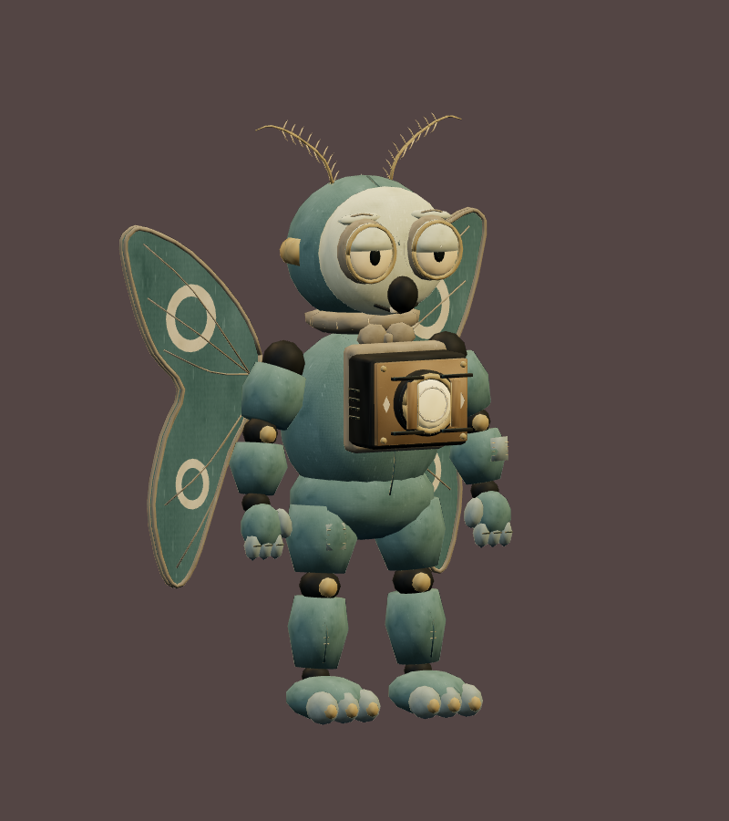
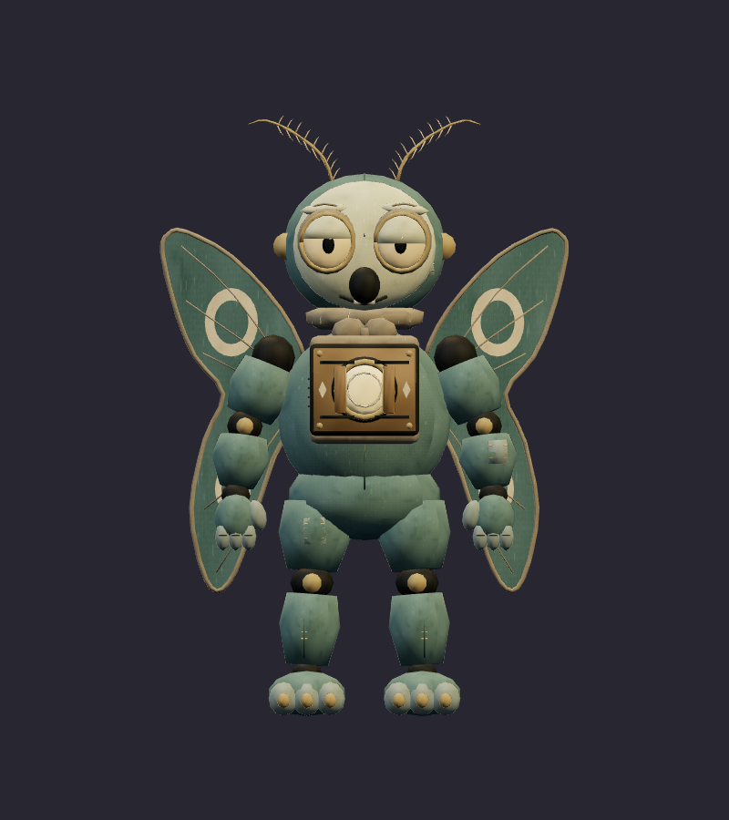
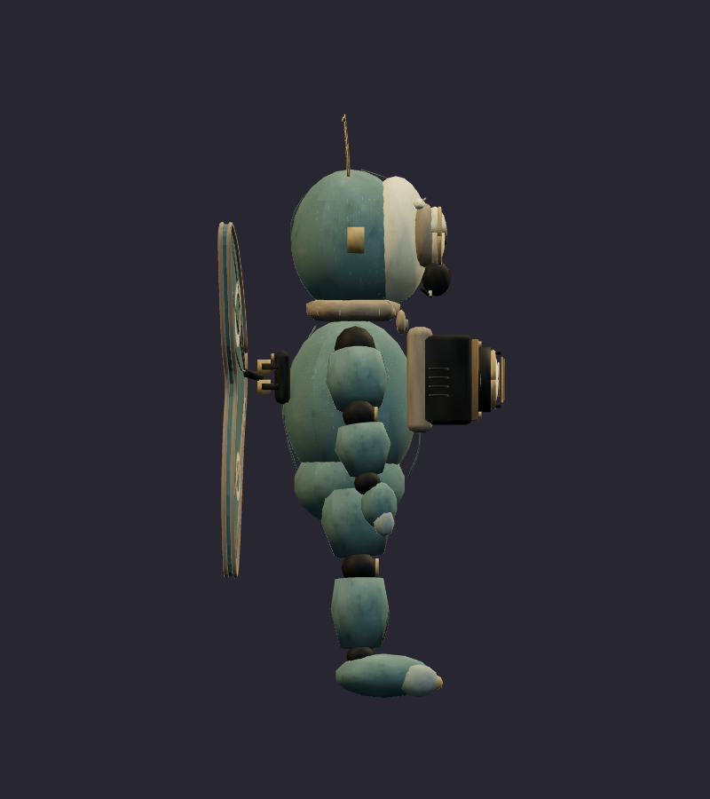
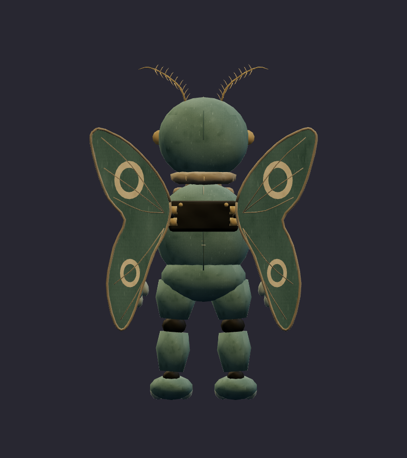
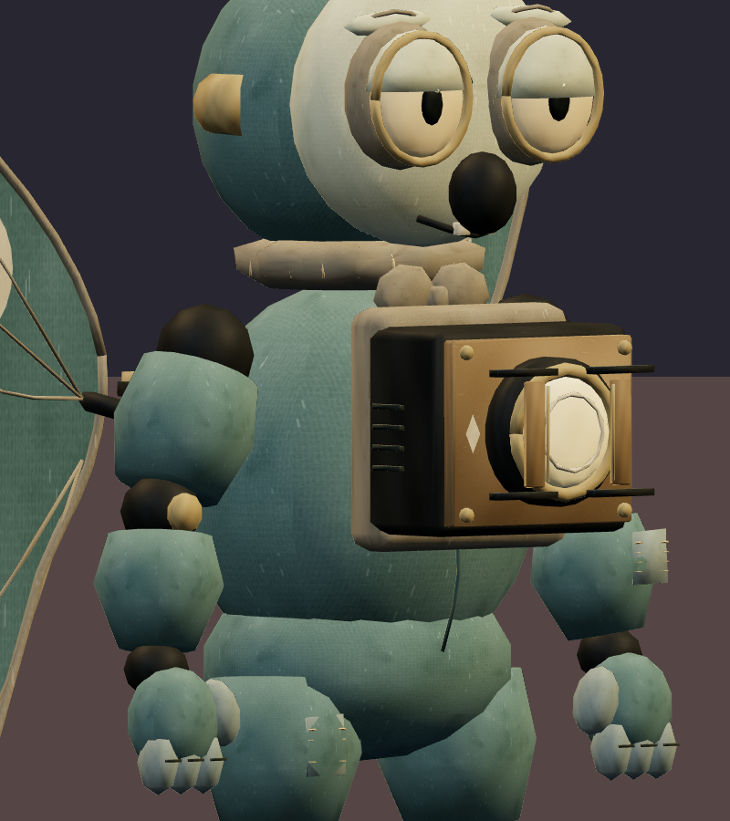
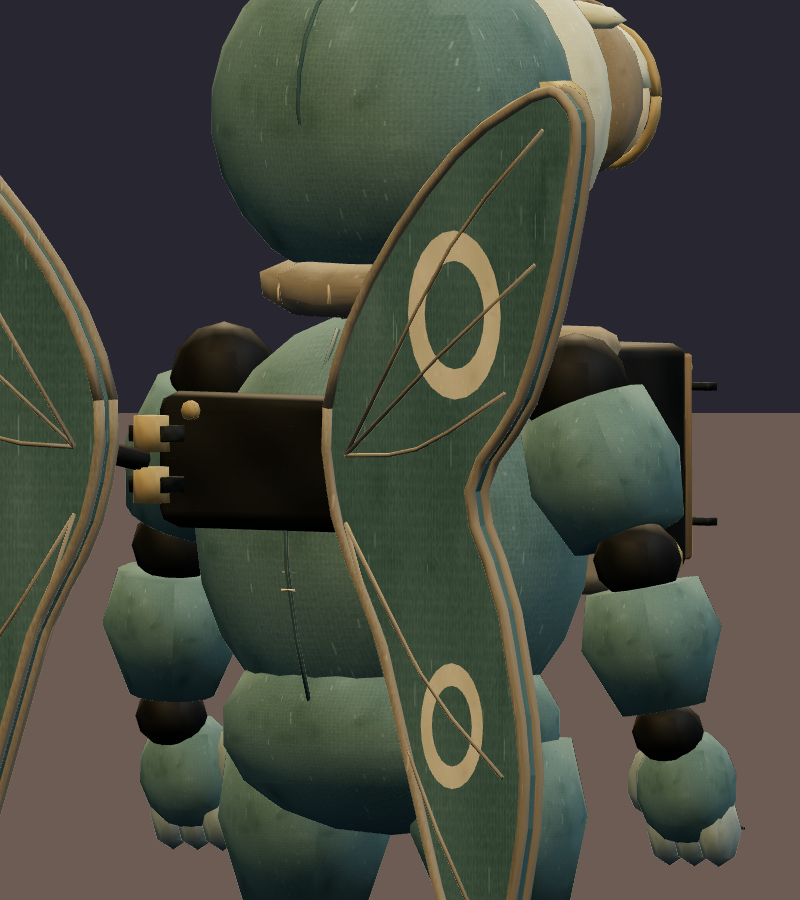
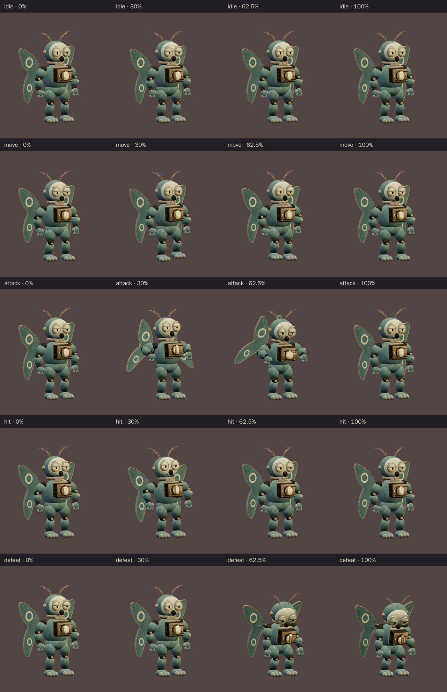
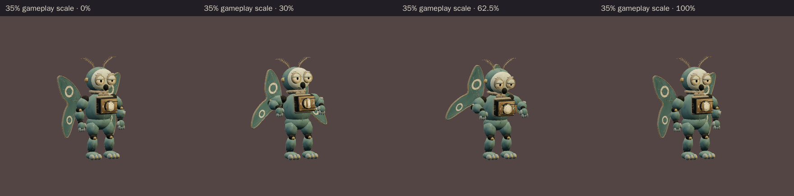

# Moth Projectionist · v001 worn mascot

**Validated Blender model candidate · Studio only · Exact art review pending.** The moth is a compact supporting performer in the proposed six-character Rat Casino cast, with an old chest projector and folding wings instead of a polished stage costume. This v001 model follows the [corrected ensemble](../rat-casino-ensemble/v003.md) and [teal front/side/back construction sheet](../../media/rat-casino-ensemble/v003/construction/moth-projectionist.png). The earlier glossy study remains in the ensemble's superseded history.

[Construction image prompt](../../media/rat-casino-ensemble/v003/construction/moth-projectionist-prompt.txt) · [Image source and checksums](../../media/rat-casino-ensemble/v003/source.json) · [Model provenance](../../media/moth-projectionist/v001/provenance.json)

<figure><figcaption>Selected v003 construction reference</figcaption></figure>
<figure><figcaption>Exact exported v001 model · studio candidate</figcaption></figure>

<model-viewer src="../../media/moth-projectionist/v001/moth-projectionist.glb" poster="../../media/moth-projectionist/v001/beauty.png" alt="Orbit the worn Moth Projectionist and inspect its five animations" camera-controls touch-action="pan-y" data-quest-clips shadow-intensity="0.7" camera-orbit="155deg 75deg auto"></model-viewer>

[Download exact GLB](../../media/moth-projectionist/v001/moth-projectionist.glb) · [Editable Blender master](../../media/moth-projectionist/v001/moth-projectionist.blend) · [Artifact manifest](../../media/moth-projectionist/v001/sha256-manifest.json) · [Tool settings](../../media/moth-projectionist/v001/tool-settings.json)

<figure><figcaption>Front</figcaption></figure>
<figure><figcaption>Side</figcaption></figure>
<figure><figcaption>Back</figcaption></figure>

<figure><figcaption>Face, collar and projector</figcaption></figure>
<figure><figcaption>Wing hinge</figcaption></figure>

The muted felt shell, pale faceplate, uneven lowered lids, short worn collar and restrained wing markings make this a tired after-hours mascot. The lead asked the Blender author to replace startled wide eyes and pointed collar beads, soften spotted wear, round the wing lobes, and make the attack unfold beyond the resting silhouette. The final GLB includes those changes. Tom has not reviewed this exported version as final art.

| Exact exported model | Result |
| --- | --- |
| Size and placement | 1.650 m tall including antennae; about 1.121 m wide and 0.808 m deep at rest; metre scale, Y-up, forward −Z, floor-centered |
| Geometry | 14,698 triangles; two opaque material primitives; one skin with named wing, antenna and projector pivots; at most four influences per vertex |
| Texture | One original embedded 1024 × 1024 atlas; no external resource or required decoder |
| Download | 1,420,724 bytes; below the 2 MiB candidate budget |
| GLB SHA-256 | `3ac425ac69c8ebac34f32b51377a5bca3c794ee43b893102169ae84e161cddf1` |
| Blender master SHA-256 | `ba4eb25f1c4f14745b1132bc8a63cddde0c5a4de44ecc6f40b2cc189d26923fc` |

## Motion and technical review

The viewer above exposes all five exact clips. `idle` lasts 2.8 seconds and `move` 1.4 seconds; both loop. `attack` lasts 2.0 seconds: the wing panels lift and unfold into a held warning from 0.84 to 1.10 seconds, and the physical shutters open into an aimed projector pose at 1.25 seconds. `hit` lasts 0.7 seconds. `defeat` lasts 2.4 seconds and holds a comic power-loss slump with the lens aimed down. The GLB supplies the gesture; later gameplay owns any beam, collision or damage.

[Khronos validation](../../media/moth-projectionist/v001/validation.json) reports zero errors and warnings. [Three.js inspection](../../media/moth-projectionist/v001/three-inspection.json) reimported the exact GLB, exercised the actual enemy animation adapter and sampled deformed vertices through all five clips at 60 Hz. It reports a stationary root, fixed projector and wing hinges, a minimum 20.6 mm wing/body clearance and 6.3 mm distal antenna/head clearance across the sampled poses, with no floor penetration beyond floating-point tolerance. [Chromium WebGL playback](../../media/moth-projectionist/v001/browser-inspection.json) rendered changing frames for every clip at normal and 35% scale with no page, console, HTTP or WebGL error and no external request. [Author's visual notes](../../media/moth-projectionist/v001/visual-review.json) and [scene release](../../media/moth-projectionist/v001/scene-release.json) record the art corrections and safe handoff.

An adversarial review caught a stale WO102 status string embedded in the first Moth GLB. [WO105's exact-export comparison](../../media/moth-projectionist/v001/metadata-correction.json) documents the Blender re-export: its binary geometry/animation payload, all JSON outside three scene metadata fields, every measured bound and all 56 prior preview images are unchanged. The status now identifies WO103 Moth. Khronos, the enemy adapter and Chromium checks were rerun against the corrected SHA above. The original draft export is preserved only in the authoring artifact backup, not offered as this review version.

The browser check used software Chromium. Physical iPad/iPhone Safari, device frame time and combat feel remain untested. This is a studio candidate for Tom to review, **not mapped into a level or approved for gameplay**. Final use still depends on his exact-version art review and the later level and encounter gates.

A fresh Astra Blender author built the candidate under [WO103](../../../../.agents/work-orders/103-moth-projectionist-classic.md) using the selected original ensemble and construction sheet; a separate fresh Astra author corrected only export metadata under [WO105](../../../../.agents/work-orders/105-moth-projectionist-export-metadata-correction.md). [Model provenance](../../media/moth-projectionist/v001/provenance.json) records the inputs and original procedural atlas. Source scripts live in `scripts/assets/moth-projectionist/v001/`; the manifest records matching local and Blender-service artifact hashes. No downloaded franchise model, texture, family photograph or personal likeness was used.
