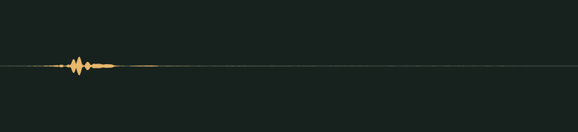

# Back on the path · v001

**Audio candidate · in the private playtest · final listening review pending.** A small landing cue. The prompt asks for muted earth contact and soft cloth, with a quick, unobtrusive finish.

PLAN008 keeps this WAV and its mix unchanged. Playback now has a bounded retry path after interruption or a stalled startup, and Help visibly acknowledges the test-sound button. This is a runtime correction; actual iPhone speaker listening remains open.

## Audition

<audio controls preload="none" aria-label="Audition movement-landed version one">
  <source src="../../media/movement-landed/v001/cue.wav" type="audio/wav">
  <a href="../../media/movement-landed/v001/cue.wav">Download the processed cue</a>
</audio>

[Processed cue](../../media/movement-landed/v001/cue.wav) · [Original five-second take](../../media/movement-landed/v001/source.wav)

## Exact version

| Property | Measured result |
| --- | --- |
| Stable cue / version | `movement-landed` / `v001` |
| Duration | 0.25 seconds |
| Format | PCM signed 16-bit WAV, stereo, 44.1 kHz |
| Download size | 44,144 bytes |
| Peak / RMS | -16.001 / -37.184 dBFS |
| Clipped samples | 0 |
| Processed SHA-256 | `2c869c641b29e5df0ede83ad5dfab63f26a4d41c9b7258b56d3acb4dd71bf127` |
| Source SHA-256 | `59661a9bf7f48019d114ce39ba344b5ecf7d69bc4bceb09493ef056cf8aee995` |

Processing selects the segment beginning at 0.120 seconds, trims it to the stated duration, applies a 0.005-second entrance and 0.035-second exit fade, then normalizes its peak. It is a one-shot cue, not a loop. The source is preserved separately. [Exact recipe](../../media/movement-landed/v001/processing.json), [measurements](../../media/movement-landed/v001/verification.json), and [reproducible processing script](../../../../scripts/assets/audio/process_cues.py).

## Source and checks

Generated on 2026-09-11 by native GPT-5.6 Sol at xhigh, following the Astra lead’s audio direction, using the separate Stable Audio 3 Small-SFX CPU service. This take used seed 103, eight steps and five seconds. It contains no supplied recording or personal reference. The [provenance record](../../media/movement-landed/v001/provenance.json) retains the complete prompt, service/model revisions and source terms recorded in [DESIGN-008](../../../designs/008-audio-pipeline.md). The source code, model and redistributed text component have separate terms; no broader license is asserted here.

Service/download SHA-256 checks, WAV decoding, exact duration, non-silence and zero-clipping checks passed. Re-running the processing script reproduced the same output. These measurements do not establish timbre, note count or musical quality.

## Coordinator and owner review

The coordinator inspected the records and numerical results. Both the execution agent and lead attempted the available audio-content helper; it returned **“audio content omitted because you do not support audio input.”** No listening review has occurred. The playable audition above is provided for review; sound quality and prompt fidelity remain unverified.

Review focus: Whether the contact is gentle enough for repeated jumping and still feels connected to the ground.

- **Coordinator technical intake:** Passed; listening/creative selection pending.
- **Tom’s decision:** Pending, against the exact hash above.
- **Gameplay integration:** None. The preview’s approved cue mapping remains empty.

## Fresh playtest mix

PLAN007 keeps this WAV unchanged and raises its in-game level within a limited master mix. Existing cues also provide clearer jump, attack, pickup and impact feedback. Help includes a repeatable sound audition; the header labels the mute state. These changes still need listening on the physical iPad and iPhone.
