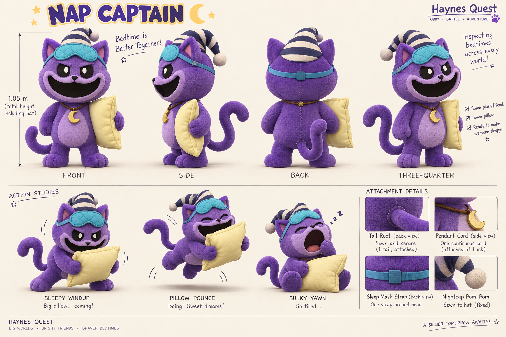

# Nap Captain

**Recognizable CatNap parody · v001 concept and early model checkpoint · Production paused**

The purple bedtime inspector wants the entire party asleep. His solemn crescent badge and oversized pillow cannot hide an impending prank.

[Exact prompt](../../media/nap-captain/v001/prompt.txt) · [Concept provenance and checksum](../../media/nap-captain/v001/concept-provenance.json)

## Intended encounter

A low crouch and lifted pillow announce the pounce. Dodge the pillow, then answer the sleepy wobble with your own equipment. He ends the encounter in a seated sulk and a very large yawn.

## Construction review

Use the original plush mascot form: purple cat face, crescent pendant, two arms, two legs and one long attached tail. Keep one pillow under the character’s left arm; the sheet’s rear view places it inconsistently. Model a continuous mask strap and pendant cord. Final total height is 1.05 m including the nightcap.

CatNap’s public character reveal occurred in November 2023. This January 2024 selection uses that revealed toy form, rather than claiming the later game chapter was already playable. The [period evidence](../../../../.agents/work-orders/022-parody-period-evidence.md) records primary sources and distinguishes availability from popularity.

The lead generated and inspected this concept using the built-in image tool. No family images were submitted. This is a selected direction for modeling, not an exported model or deployed enemy. Tom’s exact-version review remains pending.

## Paused checkpoint

An initial model exists on the authoring worktree/PVC. Its nightcap stripe mapping, raised-arm weights and final seated height need correction. Proposed source fixes were saved but have not been built or verified. No final five-clip review media or completed candidate is claimed. Production paused when Tom requested collaborative, child-specific roster selection; [the production record](../../../../.agents/work-orders/032-blender-remix-trio-evidence.md) preserves the exact restart point.
