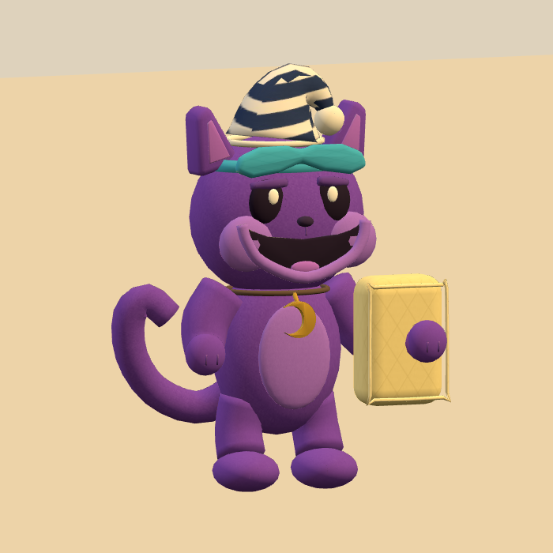

# Nap Captain

**Recognizable CatNap parody · v001 concept and early model checkpoint · Production paused**

The purple bedtime inspector wants the entire party asleep. His solemn crescent badge and oversized pillow cannot hide an impending prank.

[Exact prompt](../../media/nap-captain/v001/prompt.txt) · [Concept provenance and checksum](../../media/nap-captain/v001/concept-provenance.json)

## Intended encounter

A low crouch and lifted pillow announce the pounce. Dodge the pillow, then answer the sleepy wobble with your own equipment. He ends the encounter in a seated sulk and a very large yawn.

## Construction review

Use the original plush mascot form: purple cat face, crescent pendant, two arms, two legs and one long attached tail. Keep one pillow under the character’s left arm; the sheet’s rear view places it inconsistently. Model a continuous mask strap and pendant cord. Final total height is 1.05 m including the nightcap.

CatNap’s public character reveal occurred in November 2023. This January 2024 selection uses that revealed toy form, rather than claiming the later game chapter was already playable. The [period evidence](../../../../.agents/work-orders/022-parody-period-evidence.md) records primary sources and distinguishes availability from popularity.

The lead generated and inspected this concept using the built-in image tool. No family images were submitted. The first model below follows this direction, with visible issues still to correct. Tom’s exact-version review remains pending.

## Paused checkpoint

This is the existing first export, preserved before production paused. The nightcap bands need correction, a raised paw separates visibly from its arm, and the seated defeat pose floats above the ground. Proposed fixes were saved but have not been built or verified. Production paused when Tom requested collaborative, child-specific roster selection; [the production record](../../../../.agents/work-orders/032-blender-remix-trio-evidence.md) preserves the exact restart point.

<figure><figcaption>Original inspiration.</figcaption></figure>
<figure><figcaption>Partial model · corrections pending.</figcaption></figure>

<model-viewer src="../../media/nap-captain/v001/nap-captain.glb" poster="../../media/nap-captain/v001/browser-beauty.png" alt="Orbit the unfinished Nap Captain model" camera-controls touch-action="pan-y" data-quest-clips shadow-intensity="0.7" camera-orbit="155deg 75deg auto"></model-viewer>

The five existing clips can be inspected below the viewer. They retain the defects described above; there is no finished animation reel or accepted final model.

[Download partial model](../../media/nap-captain/v001/nap-captain.glb) · [Front](../../media/nap-captain/v001/checkpoint-front.png) · [Back](../../media/nap-captain/v001/checkpoint-back.png) · [Attack pose](../../media/nap-captain/v001/contact-pose.png) · [Seated pose](../../media/nap-captain/v001/defeat-side.png)

Exact first export: **v001 checkpoint**, 789,036 bytes, SHA-256 `e1cf47bf78e5edb53287e20e0b27ccb7886872bcefe2782a9e1fb31a91a8c7c7`. [Preserved source record](../../media/nap-captain/v001/authoring-source.json) · [Format checks](../../media/nap-captain/v001/validation.json).

**Review state:** Paused, needs corrections. No owner approval or gameplay use.
