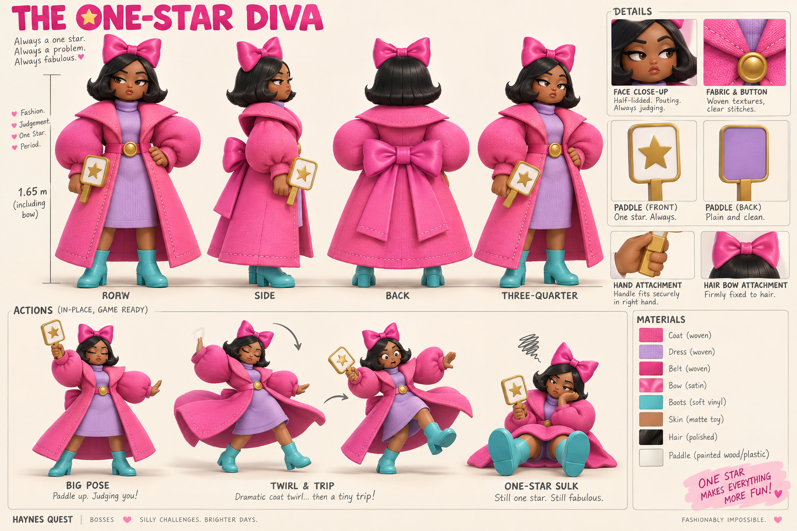

# The One-Star Diva

**Dress to Impress fashion-game parody · v001 concept · Model pending**

A fussy runway judge gives everyone one star while struggling with her own enormous outfit. The fashion-avatar styling and voting paddle make the joke recognizable.

[Exact prompt](../../media/one-star-diva/v001/prompt.txt) · [Concept provenance and checksum](../../media/one-star-diva/v001/concept-provenance.json)

## Intended encounter

She lifts the paddle for a big judging pose, then twirls into an awkward trip and stomp. Her recovery gives the player a turn. Winning releases the final memory bundle and completes this bounded journey after consumption.

## Construction review

The right hand must physically grip one paddle throughout every clip, including the twirl where the concept omits it. Its front has one star and its back is plain. Keep both feet, the connected rear belt and bow, and the firmly attached hair bow. Final total height is 1.65 m including that bow.

Roblox documented Dress to Impress as a breakout experience in December 2023, before the second fixture’s January 2024 photo. The [period evidence](../../../../.agents/work-orders/022-parody-period-evidence.md) records primary sources and distinguishes availability from popularity.

The lead generated and inspected this concept using the built-in image tool. No family images were submitted. This is a selected direction for modeling, not an exported model or deployed enemy. Tom’s exact-version review remains pending.

