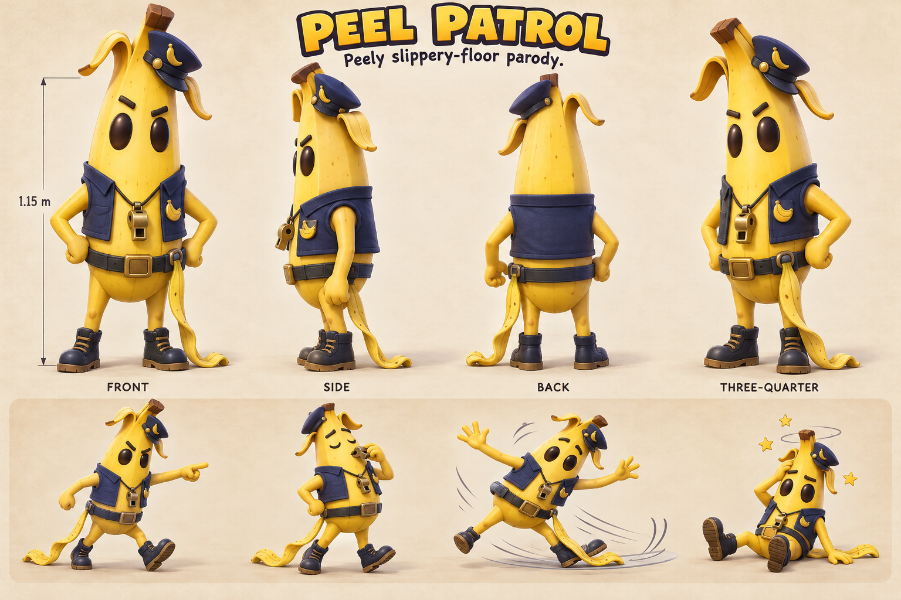
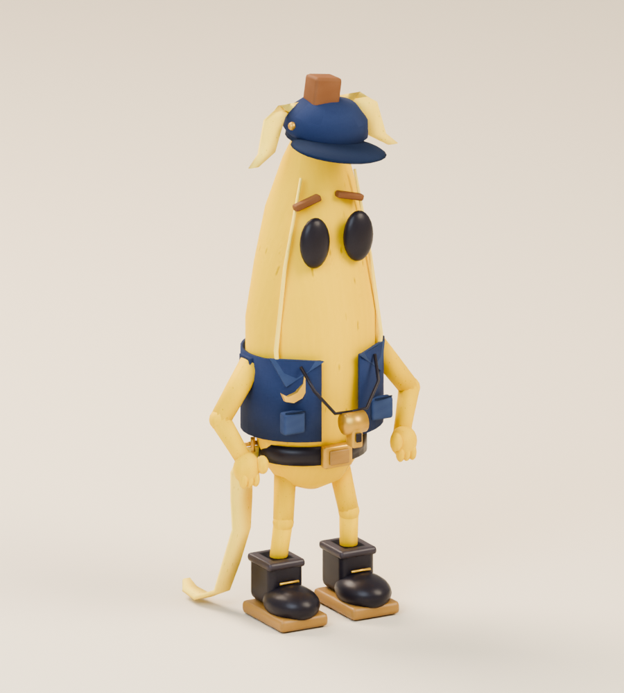
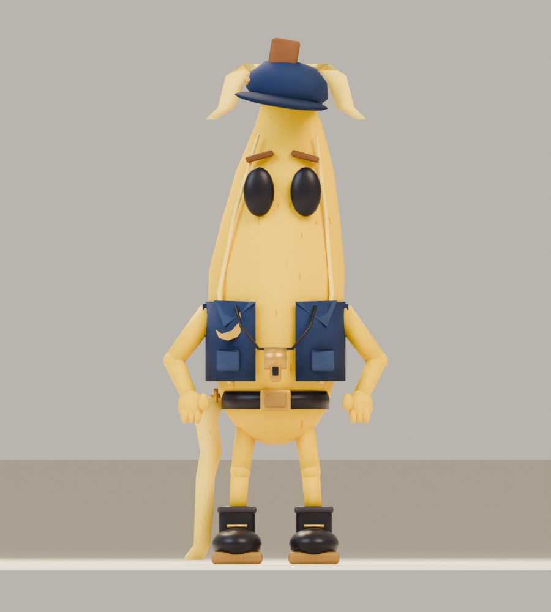
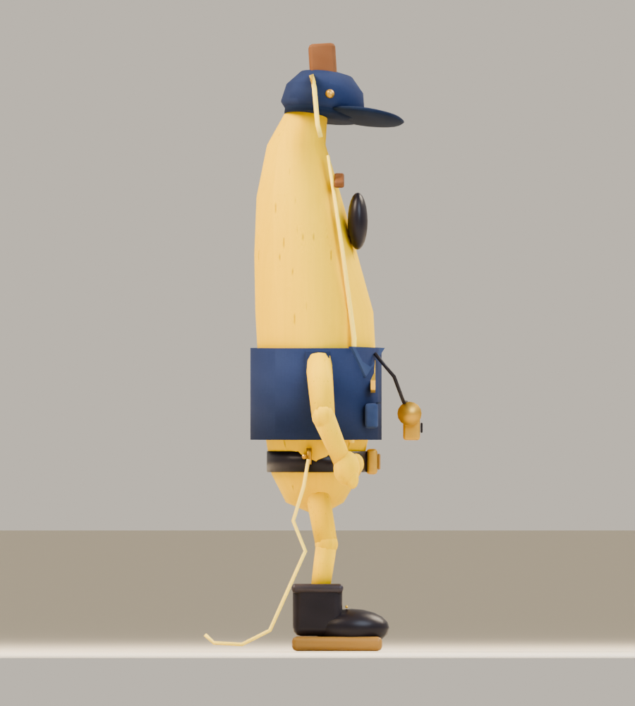
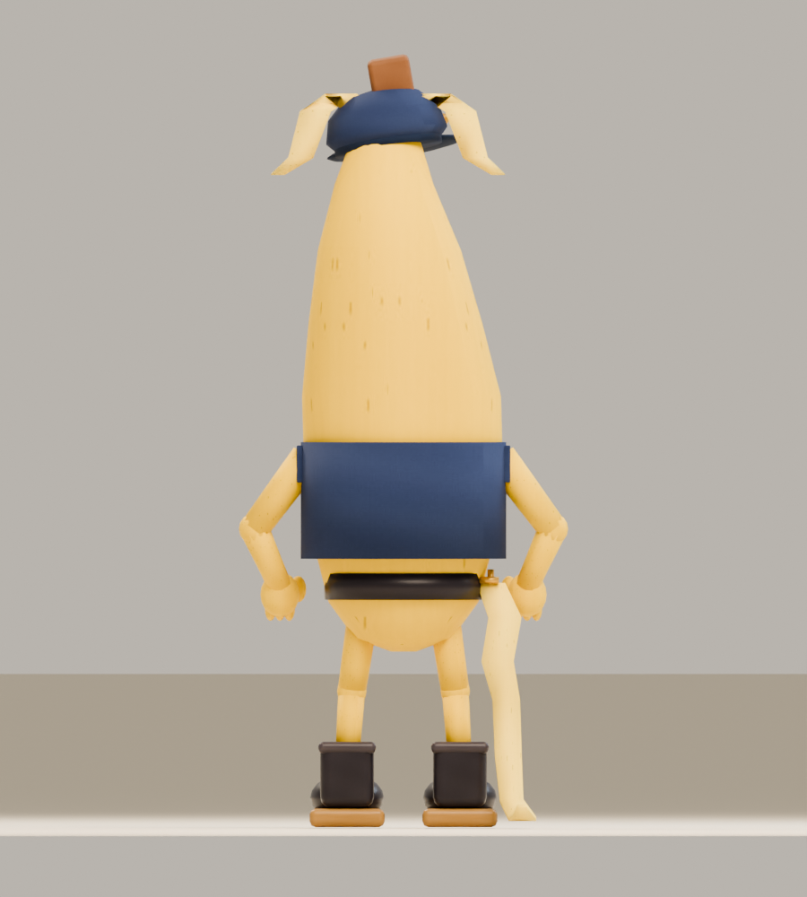

# Peel Patrol

**Recognizable Peely parody · v001 model candidate · Tom’s review pending**

The banana safety marshal takes his job very seriously. His own trailing peel makes every stern warning end in a slip.

## Concept and exported model

<figure><figcaption>Selected construction reference.</figcaption></figure>
<figure><figcaption>Exact v001 GLB, re-imported for this render.</figcaption></figure>

The tall banana silhouette, navy cap and vest make the reference readable. The exported model has two arms, two booted legs, one secured whistle and one left-belt peel. It corrects the duplicated whistle in the action concept. The cap, stem, vest, belt and whistle cord have measured physical attachments.

<model-viewer src="../../media/peel-patrol/v001/peel-patrol.glb" poster="../../media/peel-patrol/v001/front.png" alt="Orbit Peel Patrol" camera-controls touch-action="pan-y" data-quest-clips shadow-intensity="0.7" camera-orbit="155deg 75deg auto"></model-viewer>

[Download model](../../media/peel-patrol/v001/peel-patrol.glb) · [Exact manifest and editable sources](../../media/peel-patrol/v001/manifest.json) · [Concept prompt](../../media/peel-patrol/v001/prompt.txt) · [Concept provenance](../../media/peel-patrol/v001/concept-provenance.json)

<figure><figcaption>Front</figcaption></figure>
<figure><figcaption>Side</figcaption></figure>
<figure><figcaption>Back</figcaption></figure>

## Motion and encounter

<video controls playsinline preload="metadata" poster="../../media/peel-patrol/v001/motion-grid.png" aria-label="Peel Patrol five-clip reel"><source src="../../media/peel-patrol/v001/animations.mp4" type="video/mp4"><a href="../../media/peel-patrol/v001/animations.mp4">Download motion reel</a></video>

Wait through his whistle-and-point warning, step away from the sliding lunge, then hit while he wobbles. This first-period encounter can be avoided without jumping. His defeat ends in an intact seated slip.

The viewer offers **idle, move, attack, hit and defeat**. The attack lasts 1.6 seconds, with contact at 1.0 seconds. The game controls movement and the world root stays fixed; one-shot clips hold their final pose. No sound is embedded.

[Idle](../../media/peel-patrol/v001/idle.mp4) · [Move](../../media/peel-patrol/v001/move.mp4) · [Attack](../../media/peel-patrol/v001/attack.mp4) · [Hit](../../media/peel-patrol/v001/hit.mp4) · [Defeat](../../media/peel-patrol/v001/defeat.mp4) · [Turntable](../../media/peel-patrol/v001/turntable.mp4)

## Exact candidate

| Check | Result |
| --- | --- |
| Dimensions | 1.15 m high; 0.49 m wide, about 0.414 m deep |
| Coordinates | Meters, Y-up, forward −Z, feet at ground level |
| Geometry | 9,084 triangles; 4 opaque material primitives; 21 joints |
| Download | 652,424 bytes; embedded textures, no external resources |
| SHA-256 | `72962eb3a1cb2a08e13d9082dd506fbe7186798f48d0dee7af3cdd72b7891ed5` |

[Format validation](../../media/peel-patrol/v001/validation.json) · [Construction](../../media/peel-patrol/v001/construction.json) · [Rig and ground checks](../../media/peel-patrol/v001/rig-ground-inspection.json) · [Three.js checks](../../media/peel-patrol/v001/three-inspection.json) · [Browser evidence](../../media/peel-patrol/v001/browser-inspection.json)

All 71 named construction parts survive the actual export and re-import with their bone assignments. The author checked physical attachment intersections, articulated seams, floor contact and clip playback. Format and isolated browser checks passed. The review videos are 20 fps H.264 captures; these are not physical-device performance measurements.

## Source and review

A fresh native GPT-6 Astra at max authored this original model from the lead’s serially generated concept. No family references or downloaded models/textures were used. Editable masters remain on the authoring PVC, with exact source paths and hashes in the manifest. [Production evidence](../../../../.agents/work-orders/028-blender-block-party-pair-evidence.md).

[Primary-source period research](../../../../.agents/work-orders/022-parody-period-evidence.md) places this reference before the opening 2020 period and distinguishes availability from popularity. The lead inspected and selected the actual construction and motion poses. Owner approval, combined gameplay delivery and physical iPhone/iPad testing are separate checks. This model has not entered the private live game.

**Tom’s decision:** Pending.
