# Playroom kit · v001

**Awaiting Tom's review · used in the family release.** Four static scenery props for the World B chapter 1 `playroom` theme: stacking blocks, a toy bus garage, a crib rail and a plush ball. These replace the four existing scenery stand-ins. Their registry planning boxes and the published level placements stay unchanged.

Tom permits family-release candidates before exact-version review under [PRD-004 Q-03](../../../prds/004-family-release.md). The coordinator approved the reference sheet and then the exact v001 browser previews on September 29. Tom's decision on these four files remains **pending**.

## Approved reference and exact models

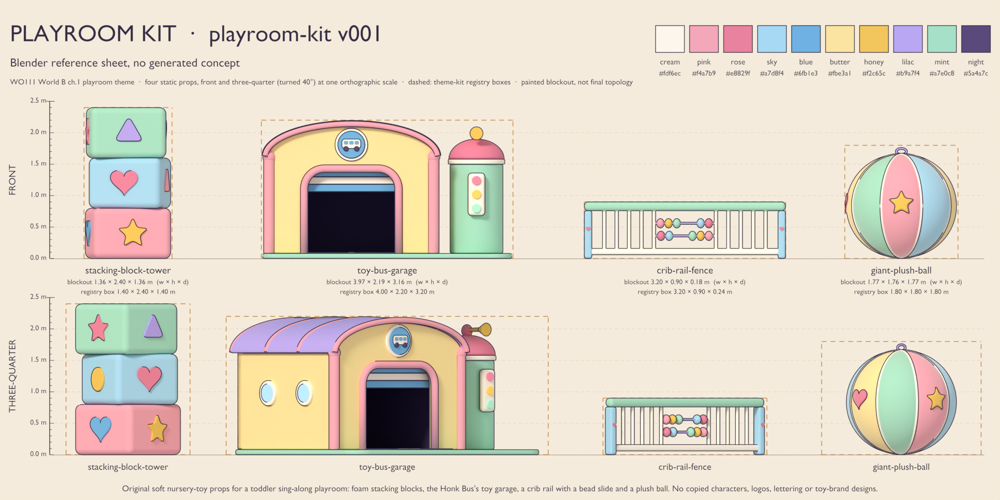

This is a **Blender reference sheet, with no generated concept**. The production models preserve its silhouette, palette, open garage doorway, level stacking faces, tileable rail and sewn ball panels. Rounded outlines use fewer segments for the game exports. None contains lettering, a logo, a copied toy design or a face.

[Reference source record](../../media/playroom-kit/v001/source.json) · [Authoring brief](../../media/playroom-kit/v001/prompt.txt) · [Provenance](../../media/playroom-kit/v001/provenance.json) · [Model notes](../../media/playroom-kit/v001/model-notes.md)

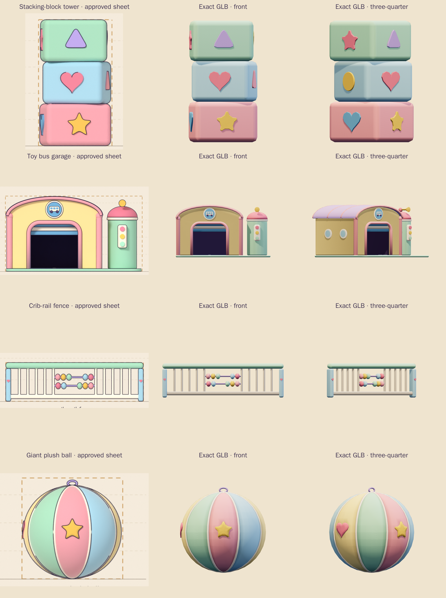{ loading=lazy }

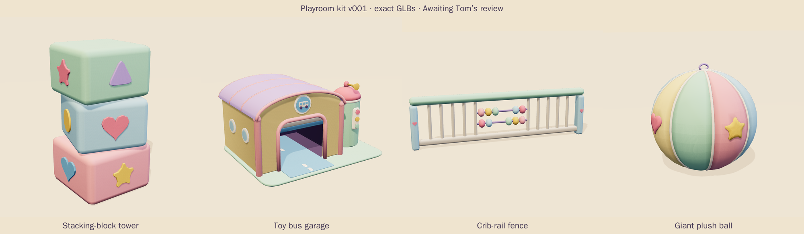{ loading=lazy }

## Four exact models

### Stacking-block tower {#stacking-block-tower}

Three soft foam blocks carry raised stars, hearts, circles and rounded triangles. The pink, blue and mint blocks turn gently in alternating directions while their top and bottom remain flat, exactly 2.40 m apart. Those level faces preserve the existing stacked landmarks and platform stilts.

<model-viewer src="../../media/playroom-kit/v001/stacking-block-tower.glb" poster="../../media/playroom-kit/v001/stills/stacking-block-tower-beauty.png" alt="Orbit the exact Playroom stacking-block tower v001 model" camera-controls touch-action="pan-y" shadow-intensity="0.7"></model-viewer>

<figure><figcaption>Front</figcaption></figure>
<figure><figcaption>Side</figcaption></figure>
<figure>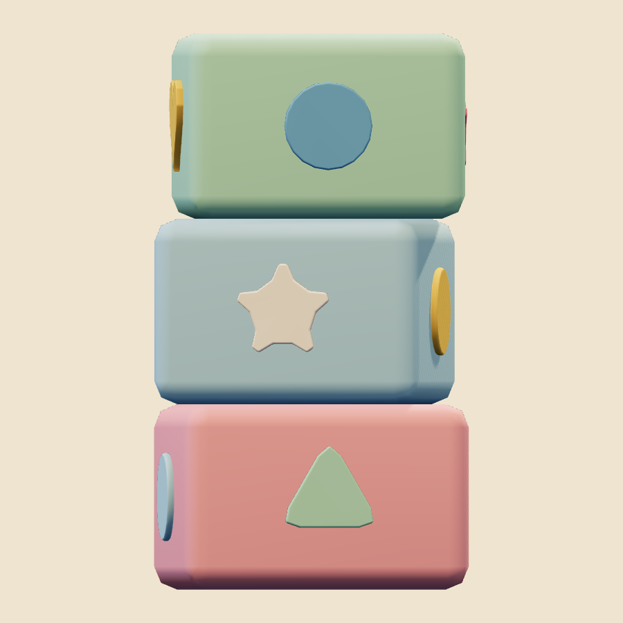<figcaption>Back</figcaption></figure>
<figure><figcaption>Three-quarter</figcaption></figure>

[Download stacking-block tower GLB](../../media/playroom-kit/v001/stacking-block-tower.glb) · [Beauty preview](../../media/playroom-kit/v001/stills/stacking-block-tower-beauty.png)

### Toy bus garage {#toy-bus-garage}

A butter-yellow garage has an open doorway, a recessed dark interior, a lilac barrel roof and pink trim. The blue road leads inside beneath three raised-door slats. A generic bus pictogram, round side windows and a mint traffic-light tower with a squeeze-bulb horn connect it to the Honk Bus without adding a second face or any lettering. The existing chapter places it at 1.9× scale.

<model-viewer src="../../media/playroom-kit/v001/toy-bus-garage.glb" poster="../../media/playroom-kit/v001/stills/toy-bus-garage-beauty.png" alt="Orbit the exact Playroom toy bus garage v001 model" camera-controls touch-action="pan-y" shadow-intensity="0.7"></model-viewer>

<figure>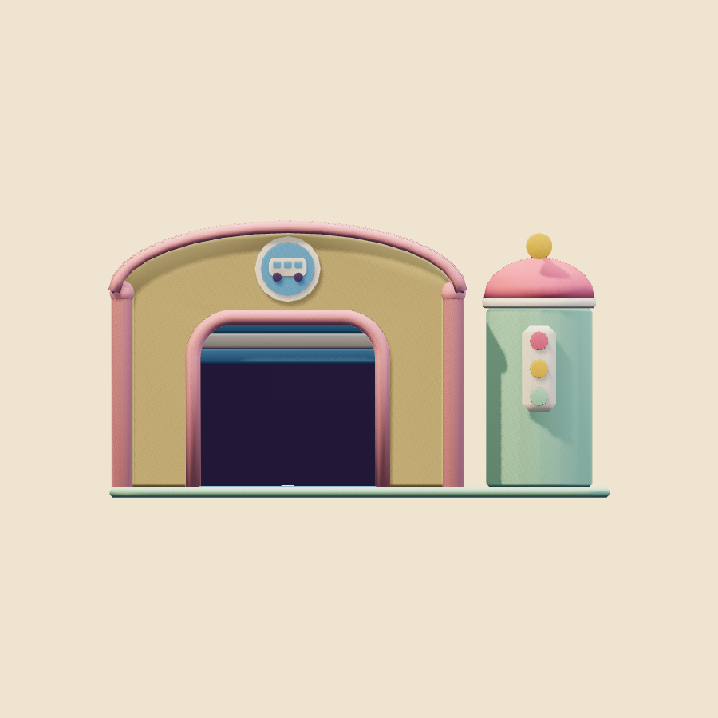<figcaption>Front</figcaption></figure>
<figure>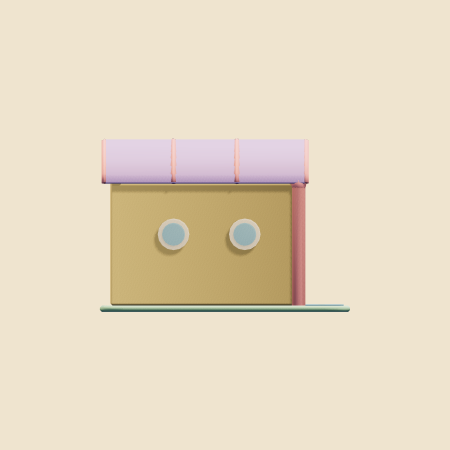<figcaption>Side</figcaption></figure>
<figure>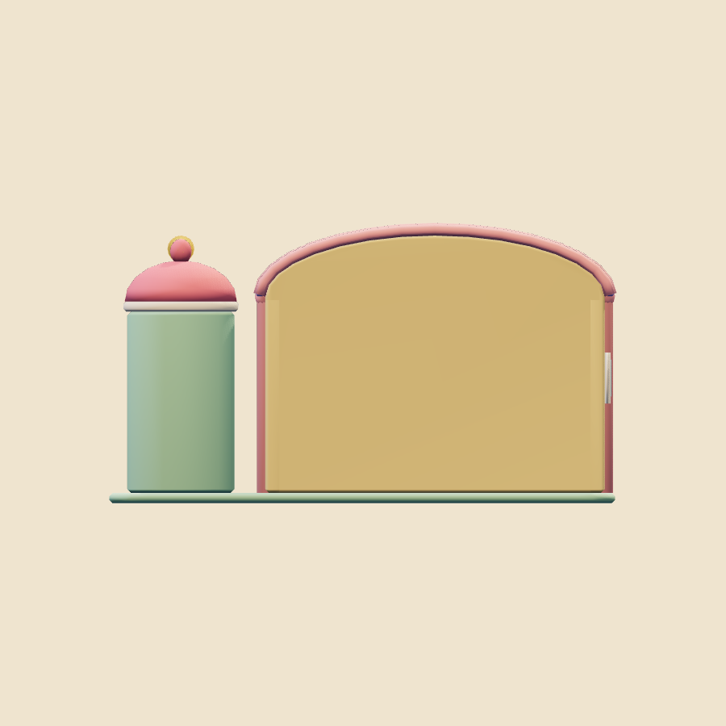<figcaption>Back</figcaption></figure>
<figure>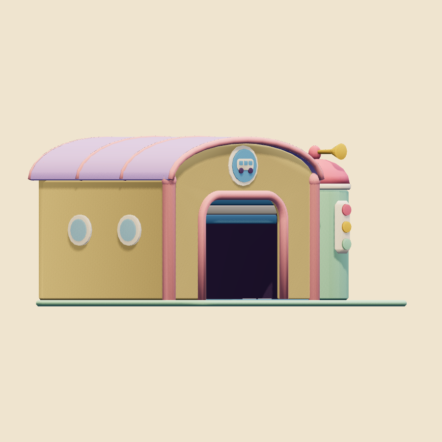<figcaption>Three-quarter</figcaption></figure>

[Download toy bus garage GLB](../../media/playroom-kit/v001/toy-bus-garage.glb) · [Beauty preview](../../media/playroom-kit/v001/stills/toy-bus-garage-beauty.png)

### Crib-rail fence {#crib-rail-fence}

A 3.20 m nursery rail tiles end to end. Mint and cream rails, blue posts and thin cream spindles surround a two-row bead-slide toy. The open spaces retain a camera sightline. It decorates the sides of the crib deck; it adds no collision barrier or new walkable surface.

<model-viewer src="../../media/playroom-kit/v001/crib-rail-fence.glb" poster="../../media/playroom-kit/v001/stills/crib-rail-fence-beauty.png" alt="Orbit the exact Playroom crib-rail fence v001 model" camera-controls touch-action="pan-y" shadow-intensity="0.7"></model-viewer>

<figure>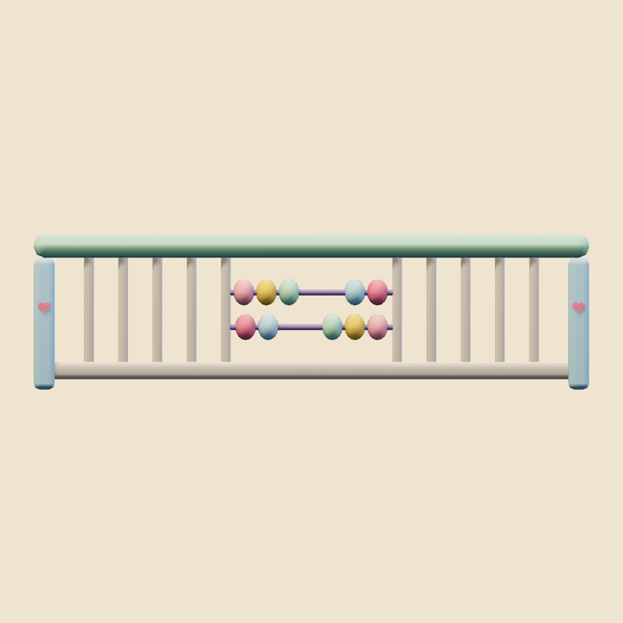<figcaption>Front</figcaption></figure>
<figure>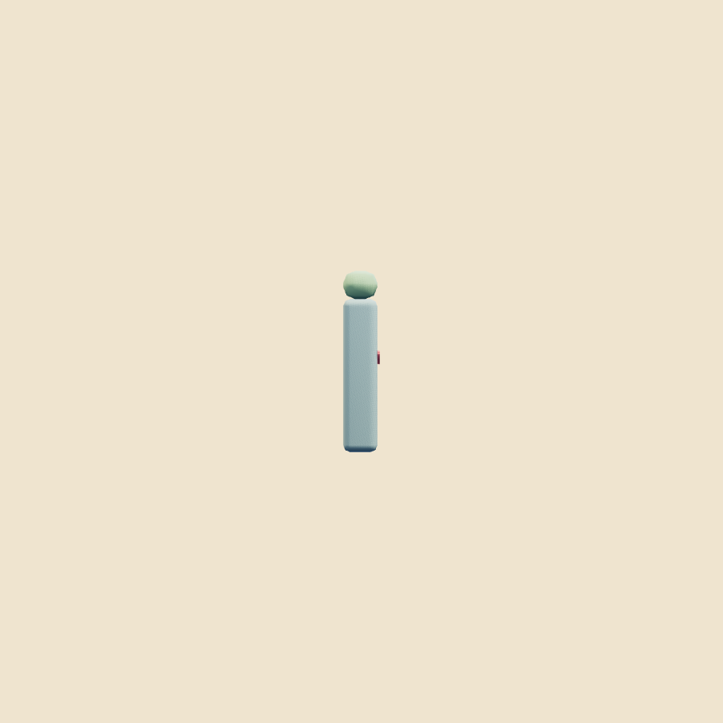<figcaption>Side</figcaption></figure>
<figure>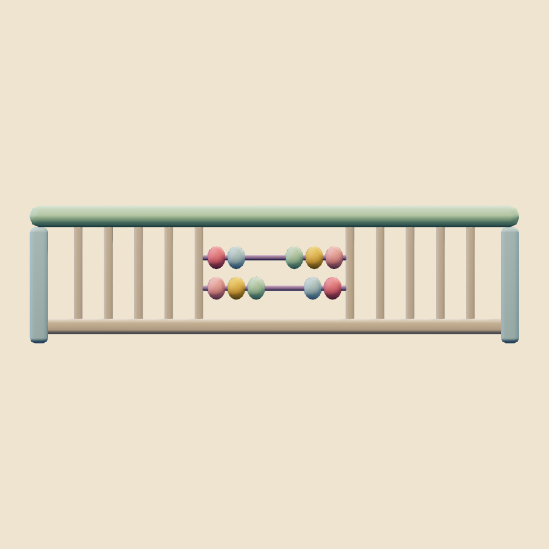<figcaption>Back</figcaption></figure>
<figure>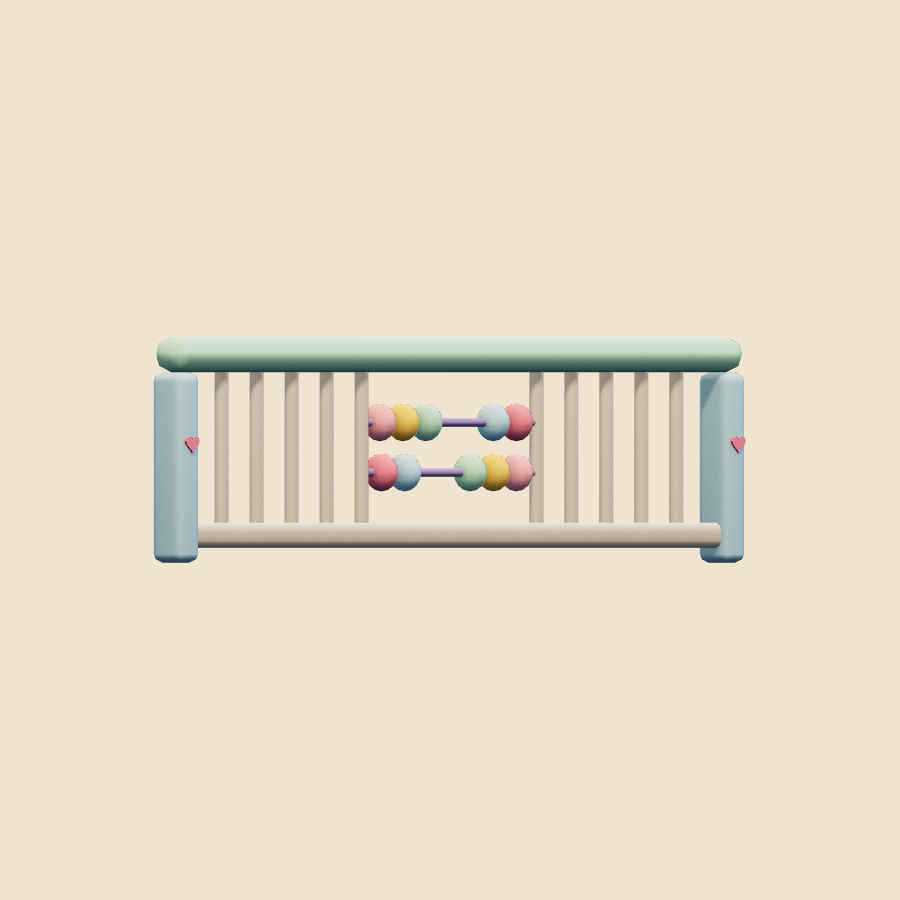<figcaption>Three-quarter</figcaption></figure>

[Download crib-rail fence GLB](../../media/playroom-kit/v001/crib-rail-fence.glb) · [Beauty preview](../../media/playroom-kit/v001/stills/crib-rail-fence-beauty.png)

### Giant plush ball {#giant-plush-ball}

Eight puffy pastel panels meet at cream seam piping. A honey star, rose heart, button caps and a lilac hanging loop give it the sewn-toy read of the sheet. The same static model serves the large floor toys and the smaller crib mobile. It has no physics or animation.

<model-viewer src="../../media/playroom-kit/v001/giant-plush-ball.glb" poster="../../media/playroom-kit/v001/stills/giant-plush-ball-beauty.png" alt="Orbit the exact Playroom giant plush ball v001 model" camera-controls touch-action="pan-y" shadow-intensity="0.7"></model-viewer>

<figure><figcaption>Front</figcaption></figure>
<figure>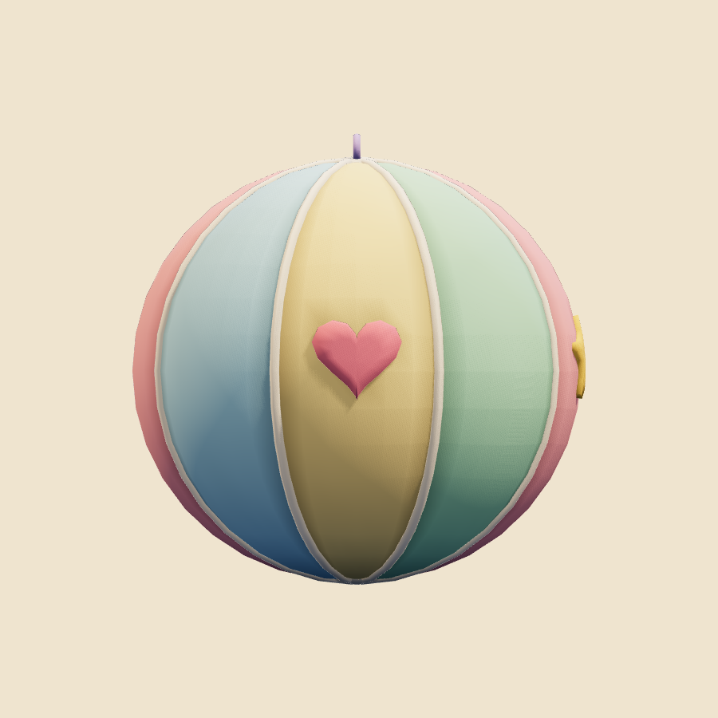<figcaption>Side</figcaption></figure>
<figure>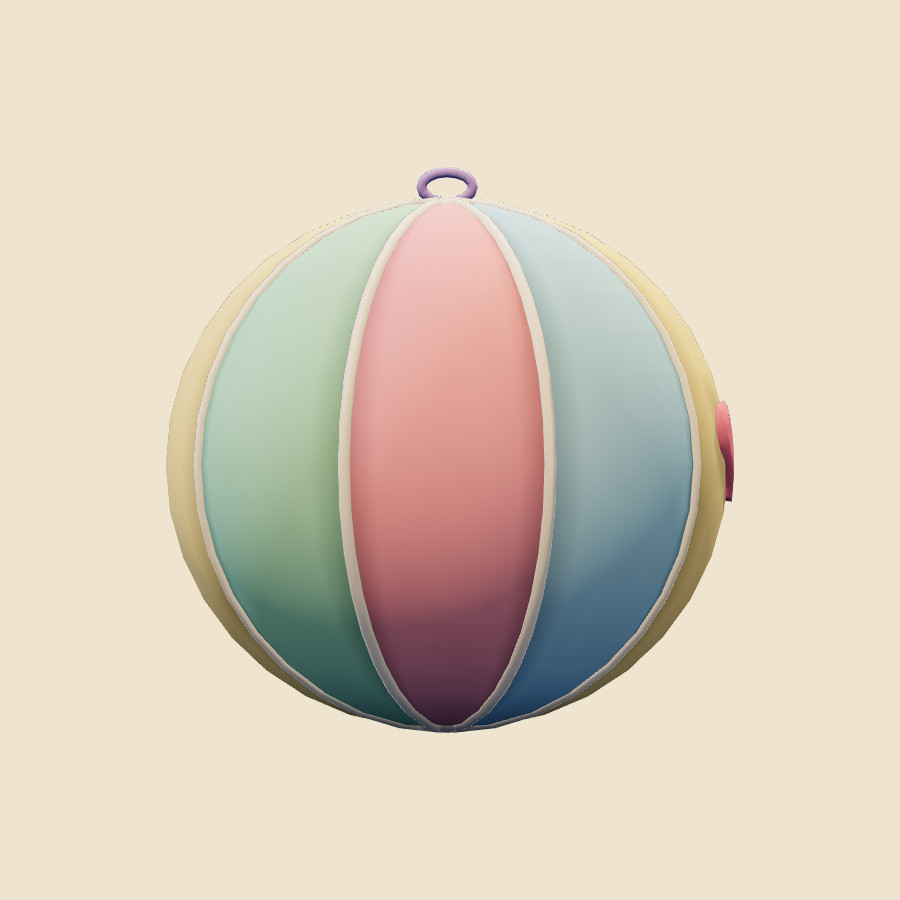<figcaption>Back</figcaption></figure>
<figure><figcaption>Three-quarter</figcaption></figure>

[Download giant plush ball GLB](../../media/playroom-kit/v001/giant-plush-ball.glb) · [Beauty preview](../../media/playroom-kit/v001/stills/giant-plush-ball-beauty.png)

## Sizes and budgets

All roots are on the floor and centred on their footprint, with glTF +Y up and the visible front toward +Z at rotation 0. The measured boxes fit inside the existing registry boxes. The tower stays 2.40 m tall and the fence stays 3.20 m wide, preserving stacking and repeated panels.

| Prop | Exact width × height × depth (m) | Planning box (m) | Triangles | Materials | GLB bytes |
| --- | --- | --- | ---: | ---: | ---: |
| Stacking-block tower | 1.3575 × 2.4000 × 1.3575 | 1.40 × 2.40 × 1.40 | 4,344 | 1 | 106,928 |
| Toy bus garage | 3.9723 × 2.1950 × 3.1600 | 4.00 × 2.20 × 3.20 | 4,796 | 2 | 121,300 |
| Crib-rail fence | 3.2000 × 0.9000 × 0.1820 | 3.20 × 0.90 × 0.24 | 4,904 | 1 | 121,288 |
| Giant plush ball | 1.7711 × 1.7640 × 1.7708 | 1.80 × 1.80 × 1.80 | 4,368 | 2 | 115,332 |

Each file is below 5,000 triangles, four materials and 1.5 MiB. White opaque, nonmetallic PBR materials use vertex colours with gentle baked contact shading; the ball's fabric finish is matte. There are no textures, external resources, skins, animation clips, morphs or decoder extensions. The five-view contact sheet is the static equivalent of a motion sheet.

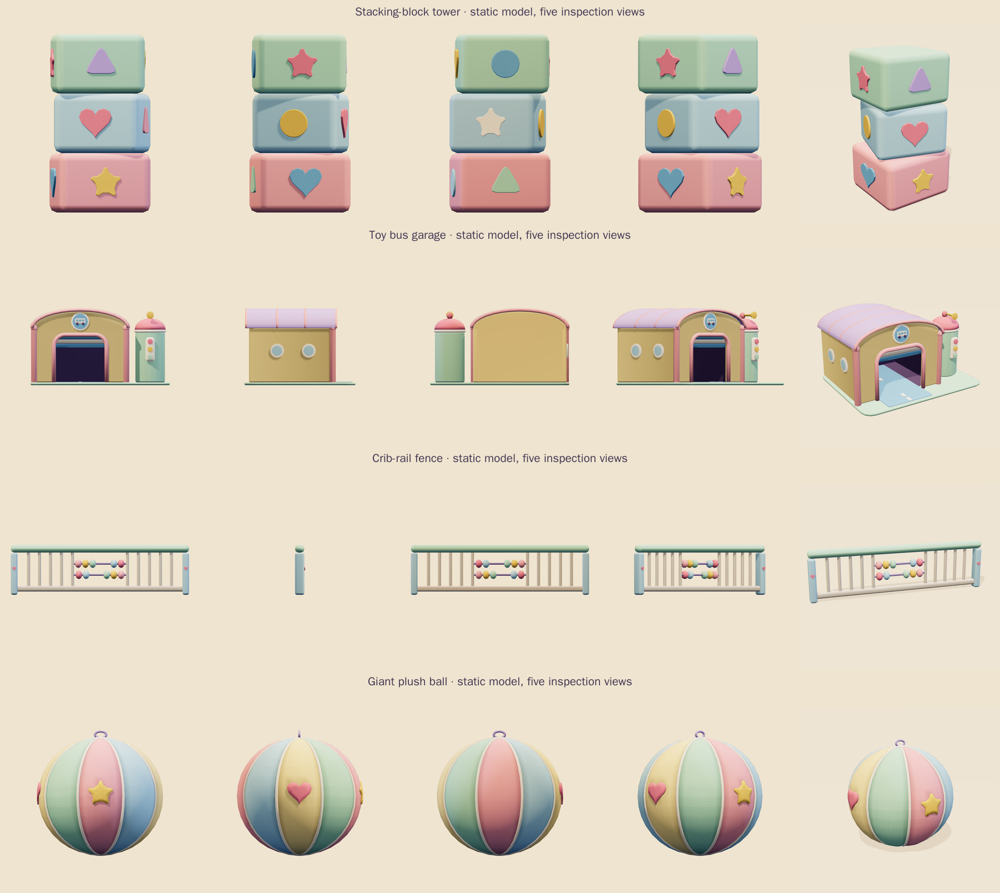{ loading=lazy }

## Validation and review

- **Khronos glTF Validator:** all four exact GLBs have zero errors, warnings, infos and hints. [Full report](../../media/playroom-kit/v001/validation.json).
- **Blender reimport:** all four files retain their measured bounds, floor roots and topology budgets. [Round-trip report](../../media/playroom-kit/v001/reimport.json).
- **Three.js and the game adapter:** exact-byte GLTFLoader inspection and `SceneAssets.attachInstances` pass at four rotations and two scales per prop: 32 placements remain inside `decorWorldBounds`. [Adapter report](../../media/playroom-kit/v001/three-inspection.json) · [Measured bounds](../../media/playroom-kit/v001/bounds.json).
- **Chromium:** 20 exact-GLB inspection views rendered through WebGL with no page, HTTP or GL errors. [Browser report](../../media/playroom-kit/v001/stills/browser-inspection.json). These are headless Chromium captures, not physical Safari or frame-time acceptance.
- **Desktop and phone studio:** all four cards display correctly, and all eight embedded model-viewer checks load the exact static file and respond to orbit controls, without horizontal overflow or browser errors. [Focused studio report](../../media/playroom-kit/v001/review-audit/report.json).
- **Placement regression checks:** the exact models keep flat 2.40 m stacking faces, a 3.20 m fence width, an open garage portal and gaps between fence spindles. The runtime keeps a stand-in visible if a model fails to load.
- **Coordinator visual review:** passed September 29. The four silhouettes and pastel language match the approved sheet; the garage portal is clear and the block and fence details read at scale. [Decision record](../../media/playroom-kit/v001/visual-review.json).

## Files, history and exact versions

[Editable production master](../../media/playroom-kit/v001/playroom-kit.blend) · [Production construction record](../../media/playroom-kit/v001/construction.json) · [Authoring source](../../media/playroom-kit/v001/source/build_model.py) · [SHA-256 manifest](../../media/playroom-kit/v001/sha256-manifest.json) · [Scene release](../../media/playroom-kit/v001/scene-release.json)

The production master preserves the separate coloured parts and four joined export meshes. The props overlap at the origin; toggle their collections to inspect one at a time. Blender instance 1 was released after validation, and its previous Web-slinger Helper master remained unchanged. The production author did not use instance 2.

The earlier sheet stage remains available separately: [history notes](../../media/playroom-kit/v001/sheet-stage/README.md), [blockout master](../../media/playroom-kit/v001/sheet-stage/playroom-kit-blockout.blend), [reference-sheet master](../../media/playroom-kit/v001/sheet-stage/playroom-kit-reference-sheet.blend), and [original sheet authoring source](../../media/playroom-kit/v001/sheet-stage/source/build_blockout.py). Its older review and lease statements describe that historical stage. No private photographs or likenesses were used.

| Exact file | SHA-256 |
| --- | --- |
| `stacking-block-tower.glb` | `52c952ead6190deb1b0f483fbb8c69b68d91b242096dd83cfc663a8b7d79742b` |
| `toy-bus-garage.glb` | `a227201805d5af12ce7e671471a1a59a1ddc57b0fd75913d4184d22e6c7233ec` |
| `crib-rail-fence.glb` | `cfbef726a59bda3ffb08f680a5e3d0854e9ee1395537014ab9253a383dca0799` |
| `giant-plush-ball.glb` | `d777c5c5fed749978974ae1b2750f45d9306e3a10234d63f35026dc040fd6a49` |
| `playroom-kit.blend` | `e187a58013120e93268895951bac1ec252e1e38d6c72ff7ad1aa867a9928f7ce` |

## Owner decision and integration

**Tom's exact-version decision: pending.** The selected reference sheet and coordinator review do not fill in owner approval. Review the toy proportions, garage interior, crib-rail openness and soft ball finish against the exact files above.

The `playroom` theme registry pins these GLB URLs and hashes. Existing World B chapter 1 placements load them automatically: template v4 places 30 stacking towers, one garage, four crib rails and 15 plush balls. Earlier B1 templates use the same ids. No level document, platform collision, collectible, encounter, ability or private media changes with this kit. This page records a reviewable family-release candidate; deployment is tracked by the coordinator's release receipt.
