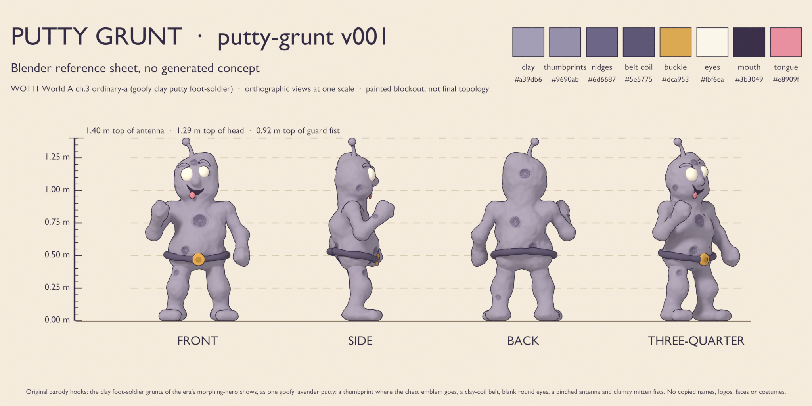
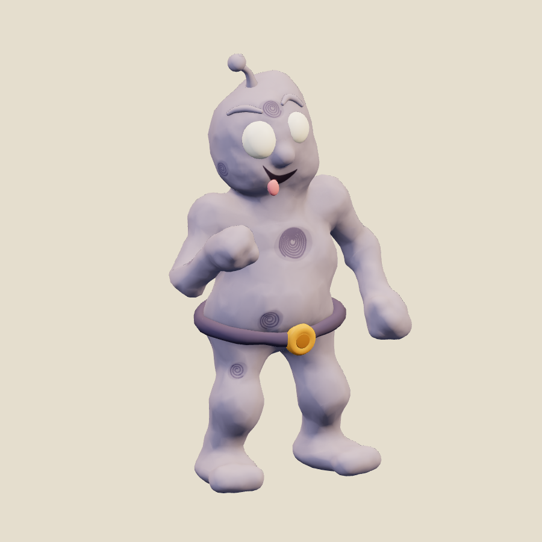
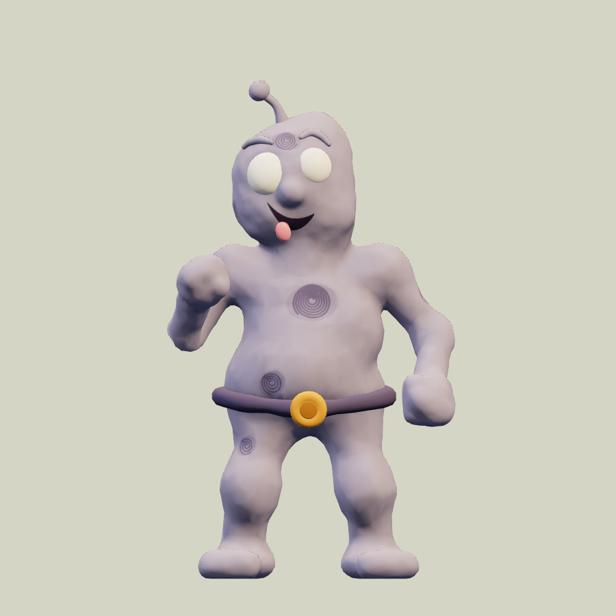
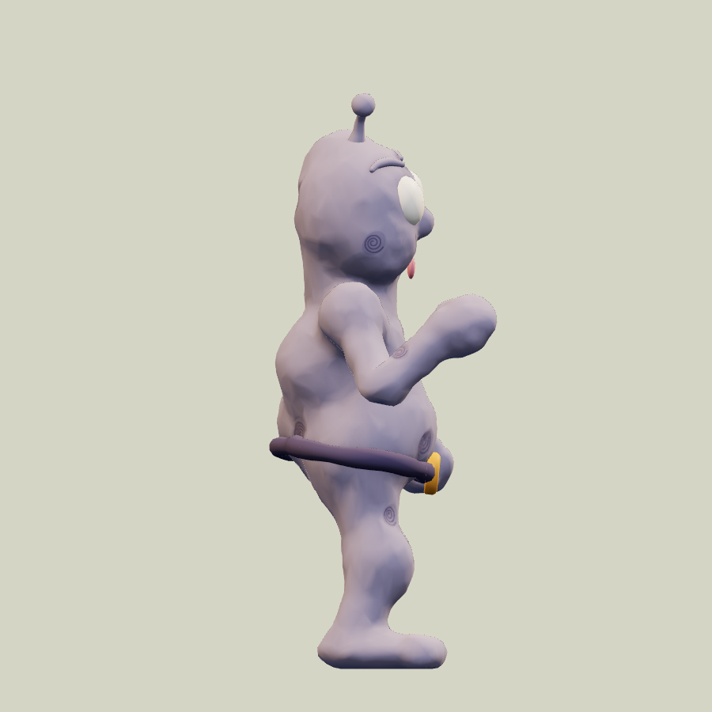
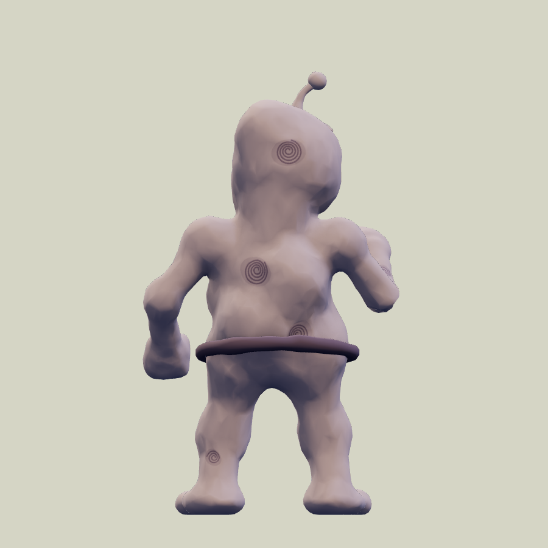
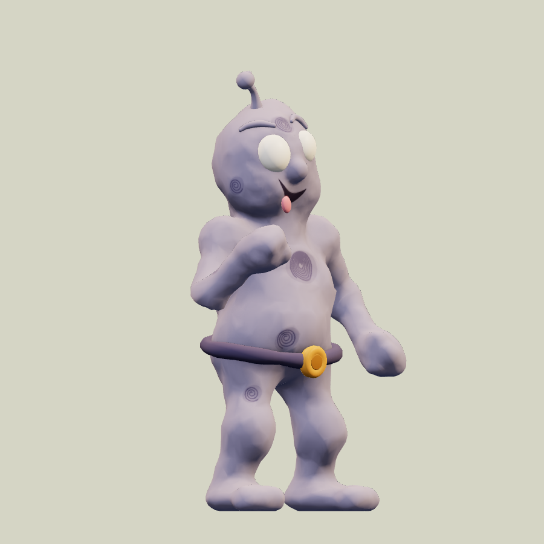
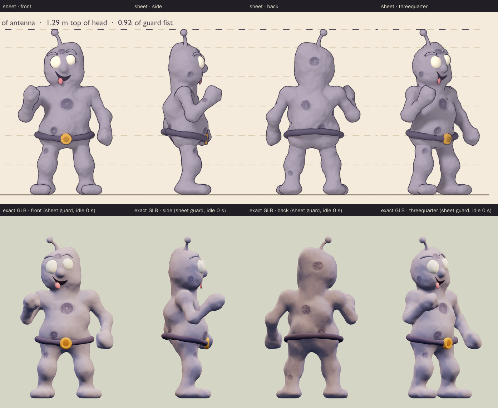
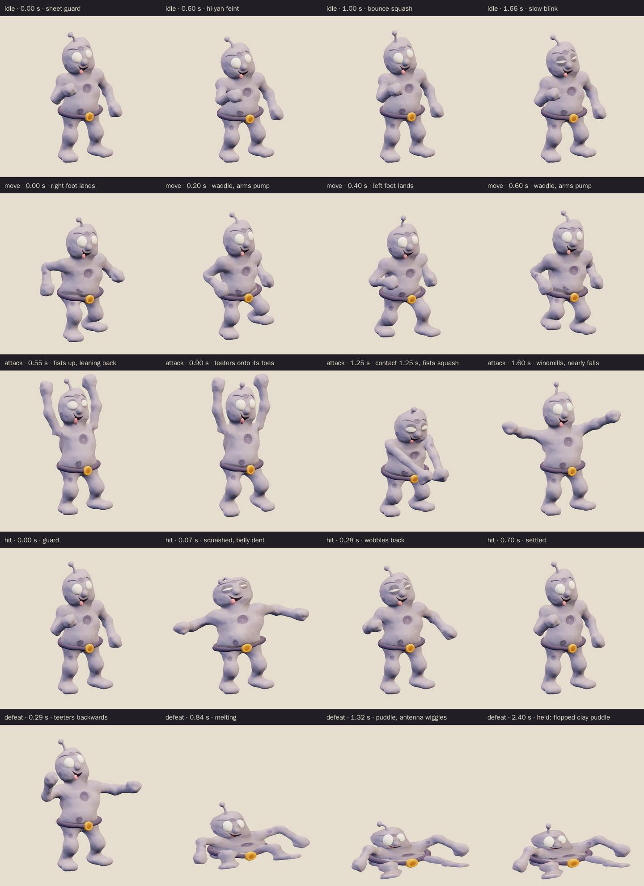
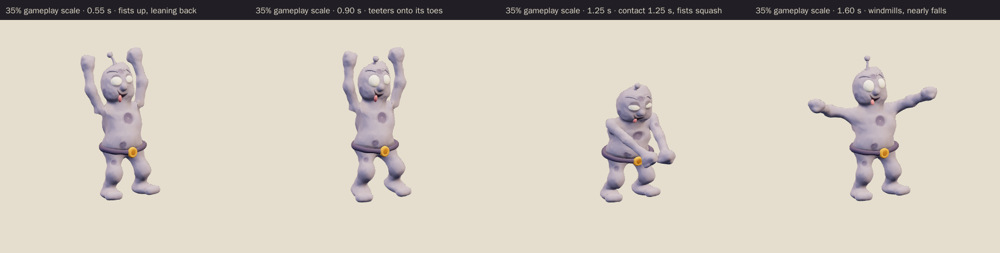

# Putty Grunt · v001

**Awaiting Tom's review · used in the family release.** This goofy clay foot-soldier is the World A chapter 3 ordinary-a enemy candidate from [the locked era roster](../../../designs/026-personal-era-casts.md), for the rooftop Hero City chapter for ages 5 to 9, where the Inator Monster is the boss and the lab robot is the other ordinary. He is one lumpy lump of grey-lavender modelling clay, squished into shape in a hurry, and he is ready to fight in the least convincing way possible. He stands in a wobbly "hi-yah!" guard with his right mitten fist up in front of his chest, his left fist low and out, and his knees bent on big flat pancake feet. His big round blank eyes don't match in size, one brow arches up ("huh?"), and a lopsided grin hangs open with the tongue poking out. Thumbprint dents are pressed all over the clay, with the biggest in the middle of his chest, where a hero-show grunt would wear its emblem. A rolled plum clay-coil belt with a round warm-gold buckle dips under his pot belly, and a pinched clay antenna wobbles on top. His attack is a clumsy double-fist swing, and he melts into a clay puddle when defeated. The family world template calls him Putty Grunt.

**Source: Blender reference sheet, no generated concept.** No image-generation model was used for this asset. Following [PRD-004 Q-07](../../../prds/004-family-release.md#owner-decisions), the author first rendered a painted Blender reference sheet from the written brief, and the coordinator approved it on September 26 before any detailing.

[Reference sheet notes](../../media/putty-grunt/v001/reference-notes.md) · [Reference source record](../../media/putty-grunt/v001/source.json) · [Model provenance](../../media/putty-grunt/v001/provenance.json)

<figure><figcaption>Blender reference sheet, no generated concept</figcaption></figure>
<figure><figcaption>Exact v001 model</figcaption></figure>

<model-viewer src="../../media/putty-grunt/v001/putty-grunt.glb" poster="../../media/putty-grunt/v001/beauty.png" alt="Orbit the Putty Grunt and inspect its five animations" camera-controls touch-action="pan-y" data-quest-clips shadow-intensity="0.7" camera-orbit="155deg 75deg auto"></model-viewer>

[Download exact GLB](../../media/putty-grunt/v001/putty-grunt.glb) · [Editable Blender master](../../media/putty-grunt/v001/putty-grunt.blend) · [Construction master](../../media/putty-grunt/v001/putty-grunt-construction.blend) · [Reference blockout master](../../media/putty-grunt/v001/putty-grunt-blockout.blend) · [Artifact manifest](../../media/putty-grunt/v001/sha256-manifest.json)

<figure><figcaption>Front</figcaption></figure>
<figure><figcaption>Side</figcaption></figure>
<figure><figcaption>Back</figcaption></figure>
<figure><figcaption>Three-quarter</figcaption></figure>

The comparison above shows the sheet and the exact export at matching angles and one metric scale. The export stills use the first frame of `idle`, which recreates the sheet guard: the right fist raised in front of the chest, the left fist low and out, the head tilted about 8° to his right with the antenna leaning with it, and the bow-legged stance. In the guard the model measures 0.796 m wide, 1.376 m tall and 0.543 m deep; the sheet shows 0.80 × 1.40 × 0.52 m. The model follows the coordinator's sheet notes:

- It keeps the goofy lavender clay grunt with thumbprint dents, the clay-coil belt, blank round eyes, the pinched antenna and mitten fists.
- For play-distance read, the eyes are 12% larger than on the sheet, and his right eye is still 17% bigger than his left.
- The buckle is a warmer gold: a `#e9a23a` rim around a darker `#b97a22` pressed centre, instead of the sheet's `#dca953` and `#b98a35`.
- The attack is a clumsy double-fist swing.
- The defeat melts him into a flopped clay puddle with the antenna still wiggling, held.
- The atlas uses the sheet's colour values. The browser preview renders them slightly bluer in shadow than the sheet because it uses different tone mapping and lighting.

The author departed from the sheet and its notes in four deliberate ways:

- The bind pose stands neutral, with the head straight and the arms in an A-pose, as the sheet notes suggested. The guard is recreated at the start of `idle`, and every clip except `move` starts from it. [Bind-pose stills](../../media/putty-grunt/v001/final-preview/bind-beauty.png) show the bind pose, which is 1.181 m wide.
- The attack swings both fists, as the coordinator asked, instead of the notes' single overhead bonk. It keeps the notes' elastic snap-back, windmilling arm and near fall.
- He melts forward and down rather than tipping onto his back, so his eyes face the player's follow camera. The brows, grin and tongue stay readable on the head blob.
- The antenna ball sits at 1.379 m in the guard instead of the sheet's 1.40 m, because the stalk is 10% shorter than on the blockout to keep the bind-pose ball inside 1.40 m.

The author also fixed these problems along the way:

- A first simplification spent the triangle budget on the hand-worked lumps and left 6 cm facets on the head and belly silhouettes. The body was rebuilt from an even starting mesh wrapped back onto the clay. The face became one flat UV island, so the painted grin never crosses a seam, and the smaller thumbprints got fewer, wider whorl turns so they survive at play distance.
- The legs now hang from the root, so the hip squash never rescales them.
- The first buckle, an open ring around a recessed plug, read as a donut with a slot. It is now a solid disc with a raised rim and a darker pressed centre.
- The attack contact first landed the fists at knee height. They now meet at about hip height.
- The first puddle spread the arms past 1.6 m, and lowering them pushed the fists through the floor and lifted the whole puddle 10.7 cm. The arms now lie level and closer.
- The jog fists clipped the thighs in 13 right and 11 left of 25 frames. The back swing is now wider, and no frame overlaps.
- The arm stretch at contact first measured 53%, because the forearm inherits the upper-arm scale. It is now about 25%, close to the notes' "about 30% longer".
- The eyes never rotate under a flattened parent, because that would shear them; in the puddle they stay round and pop 8% wider. The antenna droop was reduced so it still sticks up out of the puddle.

He has no teeth, claws, weapons or angry face, and the mitten fists are round and soft. The chest carries a thumbprint instead of any emblem, and nothing on the model carries lettering or a logo.

| Exact exported model | Result |
| --- | --- |
| Size and placement | In the guard at the start of `idle`: 0.796 m wide and 0.543 m deep, with the top of the antenna ball at 1.379 m. The A-pose bind pose is 1.181 m wide, 1.4005 m tall and 0.425 m deep; the soles sit 3 mm above the floor. Across all clips the highest point is 1.464 m and the lowest 1.5 mm. At attack contact the fists meet 0.61 m in front at 0.54 m high. Metre scale, Y-up, forward −Z, floor-centered |
| Geometry | 14,528 triangles, 10,600 of them the continuous clay body; 7,306 Blender vertices, 9,917 after export; one skin with 27 joints and at most four influences per vertex |
| Materials | Two opaque materials: matte hand-worked clay, and satin for the eyes, tongue and buckle. Both sample the same atlas, one draw primitive each |
| Texture | One original embedded 1024 × 1024 RGB atlas (341,402 bytes), baked in Blender from the high-resolution clay and its painted decals with soft occlusion; no external resource or required decoder |
| Download | 1,148,172 bytes; below the 2 MiB candidate budget |
| GLB SHA-256 | `e54116896e0ab27f8cbbff8cab9edfe8b566dac7f2216f5dcd3d3a2782d82522` |
| Blender master SHA-256 | `2cbe214c654a8c05e57ef25f6c72f5eb6a5a032c7f85c3d8992a330a7a80e273` |
| Reference sheet SHA-256 | `b6443f0e81b98362ab4e559ab8f44b6a4b3d0cba33f3308c723ee6e577159c28` |

## Motion and checks

The viewer exposes `idle` (2.0 s), `move` (0.8 s), `attack` (2.0 s), `hit` (0.7 s) and `defeat` (2.4 s):

- **Idle:** a wobbly double bounce in the guard with a clay squash on each dip and two quick "hi-yah" feints of the right fist. The antenna jiggles a beat behind, and he blinks once.
- **Move:** a bouncy bow-legged waddle-jog. The pancake feet squash on each landing and lift 0.118 m, the arms pump, the body rocks and the antenna flops.
- **Attack:** he heaves both fists over his head and leans back on his heels (0.55 seconds), then teeters onto his toes. He swings both fists down together, with contact at **1.25 seconds**: the fists meet 0.61 m in front at 0.54 m high, the clay arms stretch about 25% longer and the mitten fists squash. The arms snap back like elastic, he windmills his left arm, nearly falls and settles back into the guard.
- **Hit:** his body squashes sideways like poked clay, up to 1.72 m wide. The belly dents to 15% of its depth, the eyes squeeze shut and the antenna springs, then he wobbles back into the guard.
- **Defeat:** he jolts, teeters back with his arms flying up and melts into a flopped clay puddle 1.40 m wide and 1.01 m deep. The round blank eyes (up to 0.292 m), the belt ring and the antenna (0.409 m) stick up out of it, and the antenna wiggles before the pose is held from 2.0 seconds.

The clips leave the root stationary; gameplay controls travel and damage. Squash, stretch and the melt use non-uniform bone scale, which the GLB exports as glTF scale channels; three.js plays them, but a runtime that ignored node scale would lose them. In the game, the wind-up plays the attack from its start to the 1.25 second contact at the enemy's wind-up speed.

[Khronos validation](../../media/putty-grunt/v001/validation.json) reports zero errors, warnings, infos and hints, and all 22 contract checks pass. [Three.js inspection](../../media/putty-grunt/v001/three-inspection.json) reimported the exact GLB and exercised the real enemy animation adapter. It sampled all 9,917 exported vertices at 60 Hz across every clip and passed all 39 checks:

- The root stays still, every track resolves below the scene root, and the skin weights are normalized with at most four influences.
- The idle and move loops are seamless, and the defeat pose holds.
- No clip goes below the floor, and the culling envelope stored in the model covers every pose.
- Blender's evaluated skin matches three.js skinning to within 1.05 micrometres over 20,300 vertex samples, five frames per clip. This confirms that the non-uniform scale exports exactly.
- The start of `idle` is the sheet guard. The windup lifts both fists overhead, and at contact they meet in front, stretched and squashed.
- The hit dents the belly, squeezes the eyes and widens the body; the jog lifts both feet.
- The held defeat is a flat puddle with the round eyes, antenna and belt ring above it.

The [attachment audit](../../media/putty-grunt/v001/attachment-inspection.json) ran on the live Blender scene that exported the GLB and passed all 9 checks. It tested 11 part pairs on every frame of every clip: the two legs against each other, each fist against the head, eyes and both legs, and each arm against the antenna. It found no overlaps, and the limb and antenna joints stayed connected. The continuous clay body is not tested against itself, the fists touching at contact are intended, and the melt merges the clay by design, so defeat is tested only up to 0.55 seconds. [Chromium playback](../../media/putty-grunt/v001/browser-inspection.json) rendered changing frames for all five clips at normal and 35% scale with no console, HTTP or WebGL errors and no external requests. [Author's visual notes](../../media/putty-grunt/v001/visual-review.json) and the [scene release](../../media/putty-grunt/v001/scene-release.json) record the corrections and the released Blender scene.

The catalog intake checked all 157 local artifact hashes against the manifest; every manifested file is published. It reran the Three.js inspection against the current enemy animation adapter and got byte-identical results. The intake added this page's [source record](../../media/putty-grunt/v001/source.json), which is not in the author's manifest. The author's directory also holds an unmanifested copy of the sheet stage's claim script, byte-identical to the published [sheet-stage copy](../../media/putty-grunt/v001/sheet-stage/source/claim.py), so it is not published twice.

The flattened puddle stretches the baked clay texture, so a few pale streaks show inside the belt ring in the held defeat close-up; at gameplay scale the puddle reads as clay.

One runtime limitation affects this model in the game. The game draws enemy skinned meshes with a bounding sphere that three.js computes once, at the first rendered pose, and it does not yet apply the culling envelope the model exports. The intake measured this model against its first idle pose. The satin part (eyes, tongue and buckle) moves up to 0.401 m outside its sphere as he melts, and stays about 0.40 m outside it for the held puddle. The matte clay moves up to 0.252 m outside its own sphere when the hit squashes him sideways. Near a screen edge, the eyes could therefore drop out of the defeat puddle. The fix belongs in the runtime code and is tracked in [issue 103](https://github.com/thaynes43/haynes-quest/issues/103); the model needs no change.

The browser evidence uses software Chromium. Physical iPad/iPhone Safari, device frame time and combat feel remain owner checks. This package contains visual animations only; there is no new audio file.

## Provenance and release

Claude Opus 5.5 (`claude-opus-5-5`, effort `xhigh`) authored both stages through Blender 4.5.13 under [WO111](../../../../.agents/work-orders/111-era-cast-art-lead.md), under Tom's September 26 ruling. It built the metaball clay blockout and rendered the reference sheet on the first Blender authoring service, holding its scene lease from 17:19 to 17:42 UTC. After the coordinator approved the sheet, it built the final clay topology, the baked atlas and the 27-bone rig on the second service, from an exclusive scene lease claimed at 19:49 UTC. That first model session stopped at its usage limit after a geometry checkpoint without releasing the lease. A second session of the same task continued under the same lease at 20:51 UTC and recorded the takeover in the [scene lease](../../media/putty-grunt/v001/scene-lease.json). It finished the rig, the five clips, the export and the evidence, and released the scene at 21:23 UTC after confirming that none of the other 119 files on that service had changed. The geometry checkpoint and the static review export are preserved with the package.

No family photograph, personal likeness, downloaded franchise model, character design, logo, lettering, catchphrase or audio was used. The villain's clay foot-soldier who arrives in squads comes from the era's morphing-hero shows; the premise is the only borrowing. The lumpy bean head, mismatched blank eyes, worm brows, tongue-out grin, chest thumbprint, coil belt with its gold buckle, pinched antenna, mitten fists and pancake feet are original choices. The [sheet-stage records](../../media/putty-grunt/v001/sheet-stage/README.md) keep the sheet's own lease, release and manifest. The source scripts live in `scripts/assets/putty-grunt/v001/`; the baked occlusion array and skinning samples they read are published in this package's `source/` folder.

[PRD-004 Q-03](../../../prds/004-family-release.md#owner-decisions) permits this candidate in the family release before Tom's review. For now, the current World A template `family-world-a@v4`, like the frozen v1 to v3, fills two of the four chapter 3 ordinary slots with the Putty Grunt as a project candidate with neutral placeholder art. The coordinator will register this exact version in a later parody catalog before it appears in levels. Tom's exact-version decision is **pending**. A rejection returns those slots to a placeholder or prior version; catalog inclusion and technical checks do not constitute approval.
