# Radio Host Showman · v001

**Awaiting Tom's review · used in the family release.** This vintage radio showman is the World A chapter 4 optional bonus encounter candidate from [the locked era roster](../../../designs/026-personal-era-casts.md), an ordinary enemy for Rat Casino After Hours for ages 9 to 11, where the Rat Pit Boss and the Rat Casino cast fill the other slots. He is a tall, lanky old-time radio host who treats every fight as his big broadcast, and under Tom's September 26 ruling in [DESIGN-027](../../../designs/027-scare-pass.md) he is genuinely creepy. He plants a tall black cane topped by a silver broadcast microphone in his right hand and waves at you with his left. He has slicked auburn hair with two wispy tufts, a big black bow tie, a red-and-cream candy-stripe jacket with a black shawl collar and brass buttons, long black trousers with a red side stripe and spectator shoes. His grin is far too wide and full of sharp teeth, his eye sockets are hollow under heavy lids, and his red irises with pinprick pupils glow in the dark. A faint broken zigzag of radio static hangs behind his head like a halo. He attacks with an overhead mic-cane swing that bursts into static, and when defeated he makes a jerky, glitching bow and freezes mid-grin. The family world template calls him The Radio Showman.

**Source: Blender reference sheet, no generated concept.** No image-generation model was used for this asset. Following [PRD-004 Q-07](../../../prds/004-family-release.md#owner-decisions), the author first rendered a painted Blender reference sheet from the written brief, and the coordinator approved it on September 26 before any detailing. The sheet was painted before Tom's DESIGN-027 ruling, so it shows the clean, friendly showman its notes describe. The coordinator then revised the model notes to ask for the sharp grin, glowing eyes and static on this page. The silhouette, costume, colours, proportions and pose carry over from the sheet.

[Reference sheet notes](../../media/radio-host-showman/v001/reference-notes.md) · [Reference source record](../../media/radio-host-showman/v001/source.json) · [Model provenance](../../media/radio-host-showman/v001/provenance.json)

<figure>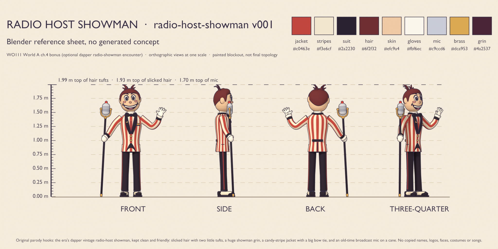<figcaption>Blender reference sheet, no generated concept</figcaption></figure>
<figure>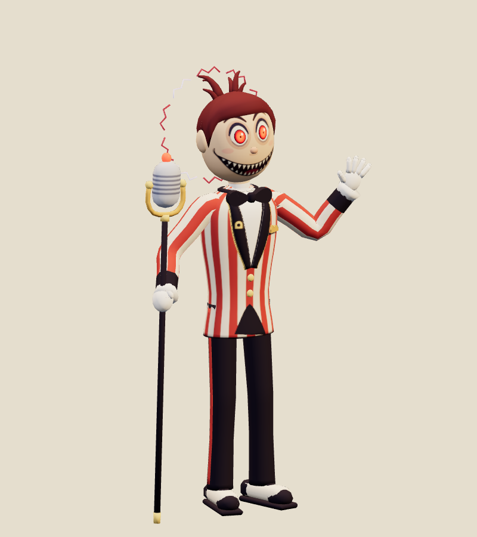<figcaption>Exact v001 model</figcaption></figure>

<model-viewer src="../../media/radio-host-showman/v001/radio-host-showman.glb" poster="../../media/radio-host-showman/v001/beauty.png" alt="Orbit the Radio Host Showman and inspect its five animations" camera-controls touch-action="pan-y" data-quest-clips shadow-intensity="0.7" camera-orbit="155deg 78deg auto"></model-viewer>

[Download exact GLB](../../media/radio-host-showman/v001/radio-host-showman.glb) · [Editable Blender master](../../media/radio-host-showman/v001/radio-host-showman.blend) · [Construction master](../../media/radio-host-showman/v001/radio-host-showman-construction.blend) · [Reference blockout master](../../media/radio-host-showman/v001/radio-host-showman-blockout.blend) · [Artifact manifest](../../media/radio-host-showman/v001/sha256-manifest.json)

<figure>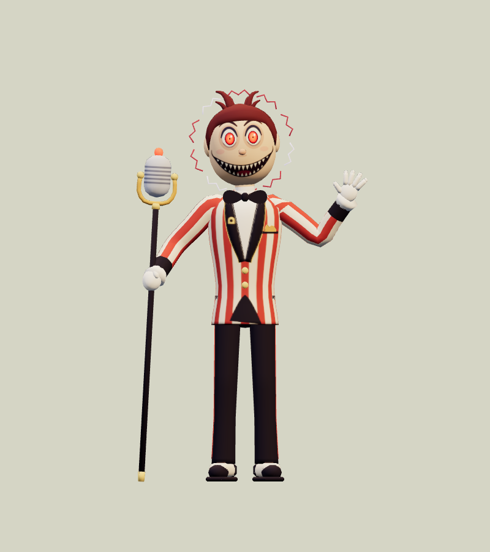<figcaption>Front</figcaption></figure>
<figure>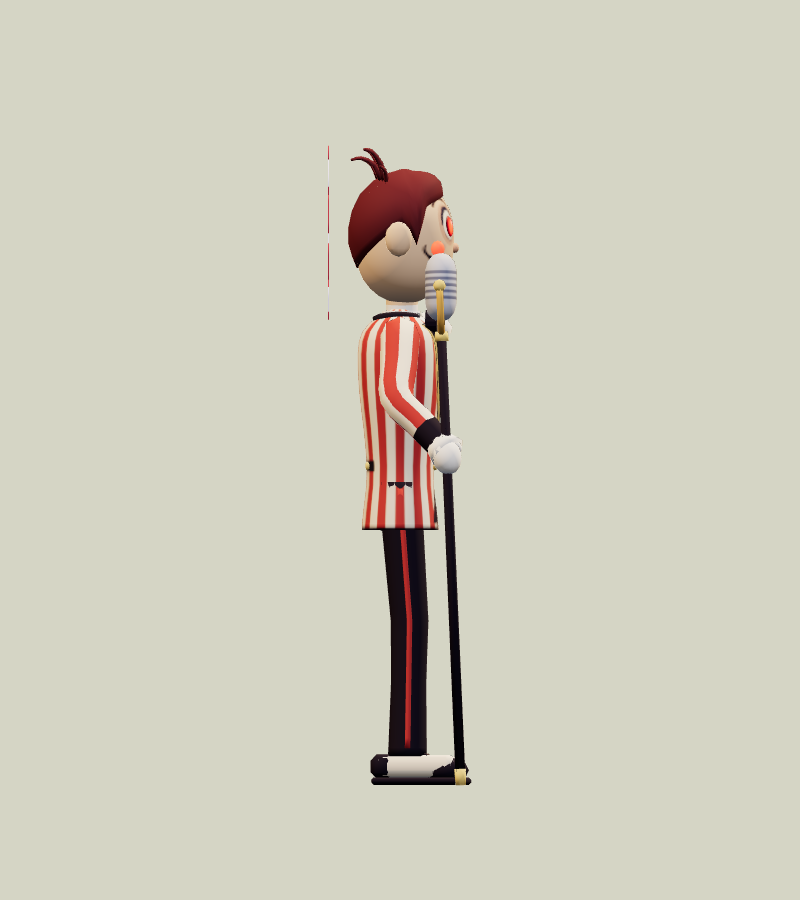<figcaption>Side</figcaption></figure>
<figure>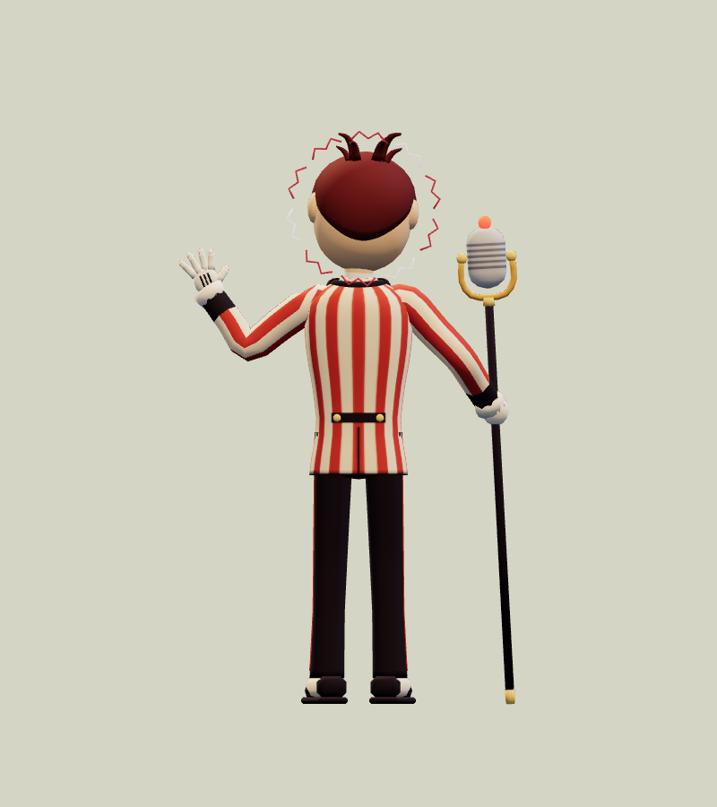<figcaption>Back</figcaption></figure>
<figure>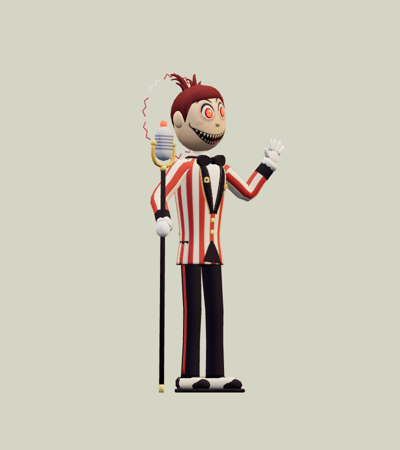<figcaption>Three-quarter</figcaption></figure>

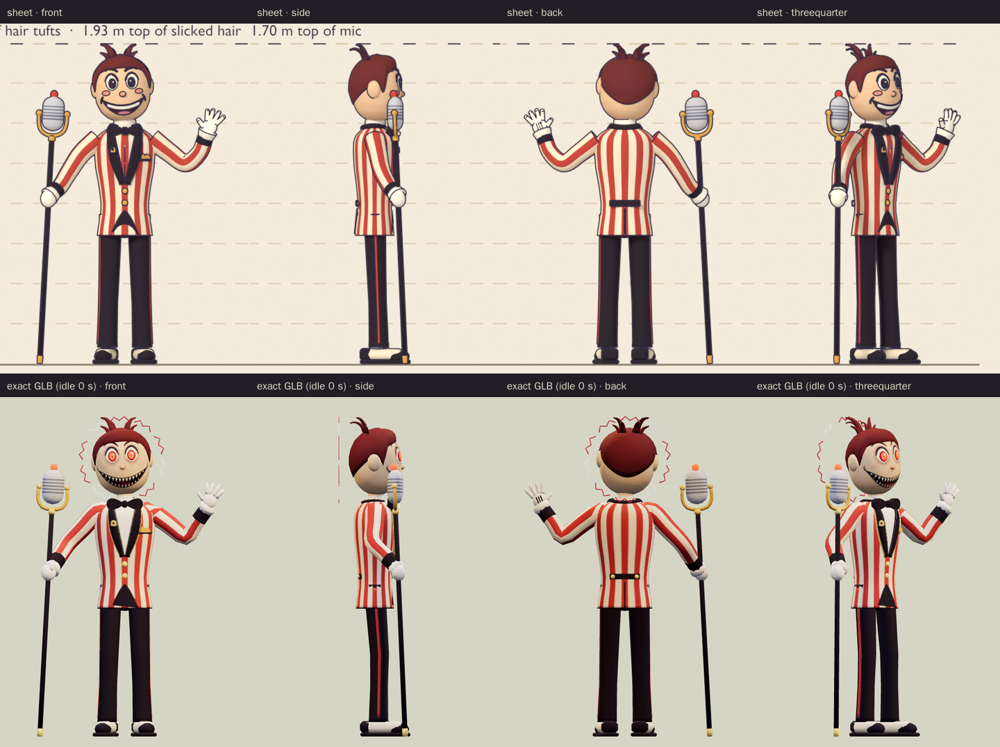

The comparison above shows the sheet and the exact export at matching angles and one metric scale. The export stills use the first frame of `idle`, which recreates the sheet pose. The cane tip, the cane grip, the mic centre, the waving wrist and both ankles are all within a micrometre of the blockout. In that pose the model measures 1.181 m wide, 2.001 m tall and 0.447 m deep; the sheet shows 1.18 × 1.99 × 0.39 m, and the extra depth is the static halo behind his head. The model follows the coordinator's sheet notes:

- It keeps the slicked hair with two tufts, the candy-stripe jacket, the bow tie and the vintage broadcast mic on a cane. The tufts are still several wisps of hair, never horns.
- For the Rat Casino's dim light, brass piping edges the lapels, and the buttons, mic yoke and cane fittings are brass too.
- The atlas uses the sheet's colour values. The preview renders them slightly deeper than the sheet because it uses different tone mapping.

Following the revised model notes, he is creepier than the sheet:

- His grin is 17% wider than on the sheet, with a row of sharp upper and lower teeth.
- His eye sockets are hollow and shadowed under heavy lids.
- His red irises with pinprick pupils are separate shells of the glowing material, so they glow in a dark room. The on-air bulb on the mic glows too.
- A faint broken zigzag of static, dim red with three pale arcs, floats behind his head.
- A radio-static starburst opens round the mic at the moment the attack connects.

He has no blood, gore, horns, sigils or dial-shaped pupils, and nothing on the model carries lettering or a logo.

<figure>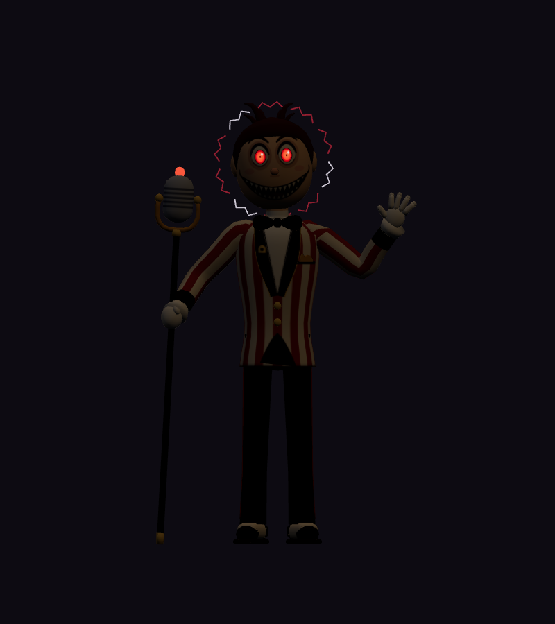<figcaption>Dark room, front</figcaption></figure>
<figure>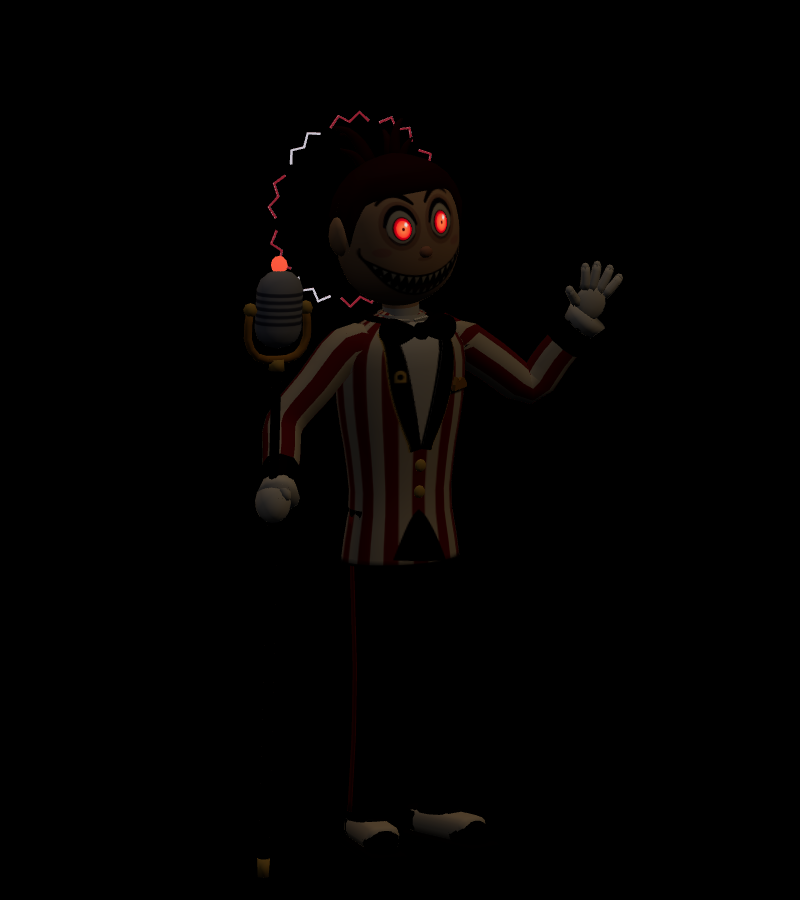<figcaption>Dark room, three-quarter</figcaption></figure>
<figure>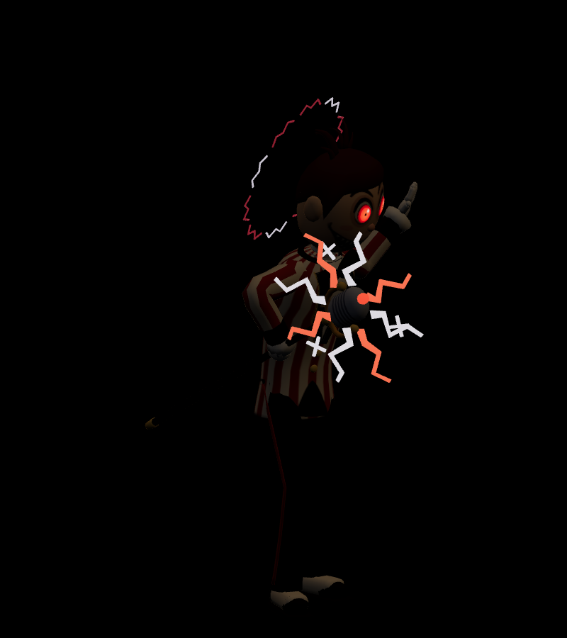<figcaption>Dark room, attack contact</figcaption></figure>
<figure>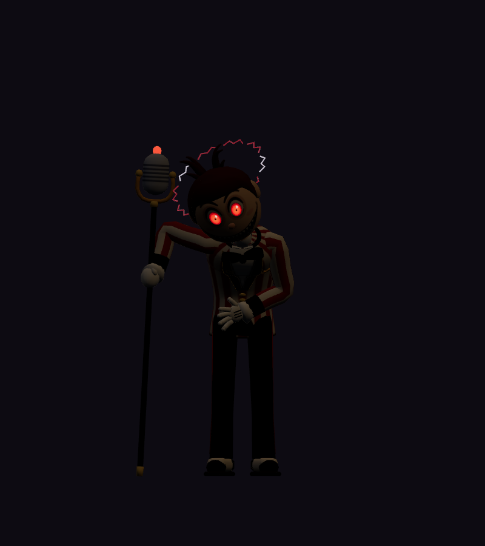<figcaption>Dark room, held defeat</figcaption></figure>

The dark-room renders show what glows: the eyes, the on-air bulb, the halo and the attack's static burst. Because the glow is the atlas colour at full strength, those parts also read bright red in ordinary light, and they always glow.

The author departed from the sheet and its notes in these deliberate ways:

- **Attack.** The sweep is overhead, not flat. His fist grips the 1.7 m cane about a metre up the shaft, so a flat sweep would drive the long lower end through his body.
- **Defeat.** It follows the revised notes' jerky, glitching bow held mid-grin, instead of the sheet notes' bow that ends sitting on the floor.
- **Collar.** The blockout's white shirt collar sat inside his jaw in every frame. It is now an open ring whose rim sits at 1.485 m, and a white collar band is painted on the neck so the white collar still reads under his chin.
- **Bow tie.** It wobbles instead of spinning all the way round, because a full spin hits his chin.
- **Held head angle.** Raising the head further in the held bow would push the jaw into the collar. The author measured the clearance and stopped there, so his face ends 32° below level.
- **Bind pose.** The sheet's right arm already hangs in an A-pose with the fist on the planted cane, so the right arm binds in the sheet pose. The left arm binds as its mirror, and `idle` recreates the wave. [Bind-pose stills](../../media/radio-host-showman/v001/rest-beauty.png) show the bind pose.

The author also fixed these problems along the way:

- The idle head tick first rolled his head into the mic; it now snaps away from the mic, toward the audience.
- At the first attack contact the mic covered his face from the player's view. It now comes in at chest height on his right, so the grin stays visible.
- The static burst first fanned out edge-on to the player and was invisible from the front. It now opens as a starburst facing the player, with bolder bolts.
- The opening cane twirl was invisible at play distance. The cane now lifts 18 cm and tips out as it twirls.
- On the downswing the cane clipped his right upper arm; his elbow now swings out to the side.
- In the bow his left hand first hit his thigh; it now settles in front of his belly.
- When his head snapped up in the held bow, the halo dropped into his shoulders. It now counter-tilts, and his left tuft flops forward instead of back into the halo.
- The defeat shudder could dip the cane tip 1.8 mm below the floor; its jolts now only lift.
- The raised lapel edges picked up the jacket stripes and looked like a zipper. They are now flat black with a brass outer rim.

| Exact exported model | Result |
| --- | --- |
| Size and placement | 2.003 m tall in the bind pose, to the tops of the tufts and the halo. In the sheet pose at the start of `idle` he is 1.181 m wide, 2.001 m tall and 0.447 m deep. The bind-pose box is 1.108 m wide and 0.519 m deep. The shoe soles and the cane tip sit 1.9 mm above the floor. Across all clips the highest point is 2.234 m (the mic in the attack wind-up) and the lowest 1.8 mm. Metre scale, Y-up, forward −Z, floor-centered |
| Geometry | 10,900 triangles: 9,884 matte and 1,016 glowing (both irises, the on-air bulb, ten halo arcs and the eight bolts and six sparks of the burst); 5,723 Blender vertices, 9,803 after export; one skin with 28 joints and at most two influences per vertex |
| Materials | Two opaque materials: matte painted skin, hair and cloth, and a glow material for the eyes, the bulb and the static. The glow material samples the same atlas for its colour and its emission, with an emissive factor of 1 and no extension; one draw primitive each |
| Texture | One original embedded 1024 × 1024 atlas (47,504 bytes), painted procedurally in Blender Python; no external resource or required decoder |
| Download | 1,034,532 bytes; below the 2 MiB candidate budget |
| GLB SHA-256 | `f4eb039b0d97ba97f093e6b69f2d3f4720d984cae4327ccc9f65861c363564a4` |
| Blender master SHA-256 | `42a329e9fbcf3801048c79c96bfce337ab0d6b2953bb2b5f37ba77ed1a06ff55` |
| Reference sheet SHA-256 | `07b06d16b5db373f2b5d7a2fa4c79b2c05503ca3d867546dbda2df700ca5e3ac` |

## Motion and checks

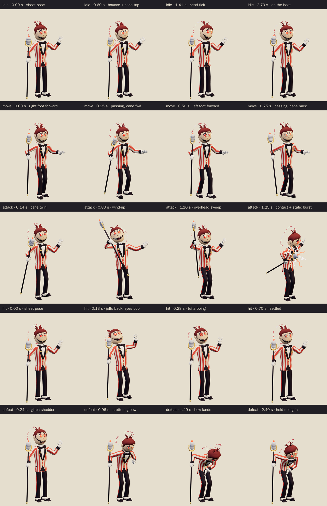

The viewer exposes `idle` (3.0 s), `move` (1.0 s), `attack` (2.0 s), `hit` (0.7 s) and `defeat` (2.4 s):

- **Idle:** a heel-toe bounce from the sheet pose, tapping the cane on every beat. He waves slowly, his head snaps once away from the mic, his eyes pulse, his tufts bob and the halo wobbles.
- **Move:** a jaunty strut. The cane swings forward and back off the floor and his free hand pumps.
- **Attack:** a quick cane twirl and heel click (to 0.28 s). He winds up by leaning back and twisting, with the mic raised high over his right shoulder and his free hand flared (0.28–0.94 s); the mic reaches 2.01 m at 0.9 s. Then he sweeps it overhead and lunges, with contact at **1.25 seconds**: the mic arrives 0.86 m in front of him at 1.32 m high, level with his chest. The static starburst opens round the mic from 1.18 seconds, is 0.90 m across at contact and has closed by 1.60 seconds. He holds the note with a vibrato wobble, takes a quick bow and plants the cane again.
- **Hit:** he jolts back a step. His eyes pop to 1.45 times their size, his tufts squash flat and spring back, and the cane, bow tie and free hand wobble while the halo glitches.
- **Defeat:** a stepped, glitching shudder, then a bow that lands in eight visible stutter jumps while he leans on the planted cane with his free arm across his waist. His head then snaps up and cocks toward the player, with his eyes stuck wide and his halo askew, frozen mid-grin. His chest ends pitched 61° forward and his face 32° below level. The pose is held from 1.752 seconds.

The clips leave the root stationary; gameplay controls travel and damage. In the game, the wind-up plays the attack from its start to the 1.25 second contact at the enemy's wind-up speed, so the twirl, wind-up and sweep all play then and the burst opens just before contact.

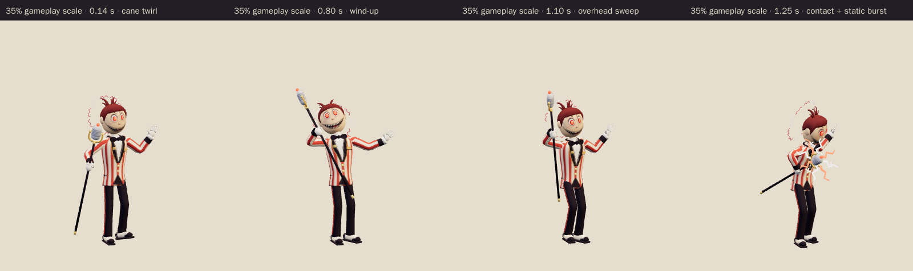

[Khronos validation](../../media/radio-host-showman/v001/validation.json) reports zero errors, warnings, infos and hints, and all 21 contract checks pass. [Three.js inspection](../../media/radio-host-showman/v001/three-inspection.json) reimported the exact GLB and exercised the real enemy animation adapter. It sampled all 9,803 exported vertices at 60 Hz across every clip and passed all 32 checks:

- The root stays still, every track resolves below the scene root, and the skin weights are normalized with at most two influences.
- The idle and move loops are seamless, and the defeat pose holds.
- No clip goes below the floor, and the culling envelope stored in the model covers every pose.
- He stands 1.9–2.1 m tall on the floor, and the start of `idle` is the sheet pose.
- The adapter's wind-up contact pose matches the clip's 1.25 second pose, the defeat vanishes, and each clone animates independently.
- The glow material emits from the atlas. The burst stays hidden inside the mic capsule except round the attack contact.
- The mic rises above his head in the wind-up and swings at the player at contact, his eyes pop in the hit, and the bow is stepped and deep with his head up.

The [attachment audit](../../media/radio-host-showman/v001/attachment-inspection.json) ran on the live Blender scene that exported the GLB and passed all 7 checks. It tested 27 part pairs on every frame of every clip, including the cane against the head, body, legs and upper arms; the burst against the head and arms; the halo against the head, body and tufts; the bow tie and collar against the face; and the two legs against each other. It found no overlaps, the limb joints stayed connected, and nothing went below the floor. Intended contacts, such as the fist round the cane and the neck inside the collar, are not tested. [Chromium playback](../../media/radio-host-showman/v001/browser-inspection.json) rendered changing frames for all five clips at normal and 35% scale, and rendered the dark-room views, with no console, HTTP or WebGL errors and no external requests. [Author's visual notes](../../media/radio-host-showman/v001/visual-review.json) and the [scene release](../../media/radio-host-showman/v001/scene-release.json) record the corrections and the released Blender scene.

The catalog intake checked all 180 local artifact hashes against the manifest; every manifested file is published. It reran the Three.js inspection against the current enemy animation adapter and got byte-identical results. The intake added this page's [source record](../../media/radio-host-showman/v001/source.json) and the [sheet-stage note](../../media/radio-host-showman/v001/sheet-stage/README.md), which are not in the author's manifest.

**Size.** At 2.0 m he follows his own brief of about 2 m. That is above the 0.8–1.4 m band WO111 sets for ordinary enemies, as the sheet notes flagged. Every proportion scales together, so the coordinator can scale him uniformly when integrating him if the bonus slot needs ordinary sizing.

The asset intake found a runtime culling risk for this model: three.js computed each skinned primitive's culling sphere from its first rendered pose, before the runtime used the model's exported animation envelope. The intake measured this model against its first idle pose. The glowing part is small at rest (a 0.44 m sphere round the head and mic), so it leaves its sphere by 0.86 m at the attack contact as the burst opens in front of him, and by up to 0.95 m just after. It also stays 0.33 m outside the sphere in the held defeat, where the bowed head carries the eyes and halo down. The matte part moves at most 0.16 m outside its own sphere, during the overhead sweep. Near a screen edge, the burst, or the glowing eyes and halo of the held bow, could previously drop out of view. The runtime now applies the exported envelope to every skinned primitive; the model itself is unchanged.

The browser evidence uses software Chromium. Physical iPad/iPhone Safari, device frame time and combat feel remain owner checks. This package contains visual animations only; his static sound is the separate [`radio-static` audition](../radio-static/v001.md).

## Provenance and release

Claude Opus 5.5 (`claude-opus-5-5`, effort `xhigh`) authored both stages through Blender 4.5.13 on the first Blender authoring service, under [WO111](../../../../.agents/work-orders/111-era-cast-art-lead.md) and Tom's September 26 rulings. It built the blockout and rendered the reference sheet from 17:45 to 18:08 UTC. After the coordinator approved the sheet and revised the model notes, it built the final topology, the painted atlas and the 28-bone rig from an exclusive scene lease claimed at 21:59 UTC. It released that scene at 22:43 UTC after confirming that none of the 71 earlier family-era files on the service had changed. The second authoring service was not used. Both stages' claim checkpoints are preserved with the package.

No family photograph, personal likeness, downloaded franchise model, character design, logo, lettering, catchphrase, song or audio was used. The premise of a grinning, too-theatrical vintage radio host who broadcasts every fight comes from the era's animated shows; the premise is the only borrowing. The candy-stripe jacket with its shawl collar, the spectator shoes, the pill microphone in its brass yoke, the two wispy tufts, the painted grin, the static halo and burst, and his pose and acting are original choices. The [sheet-stage records](../../media/radio-host-showman/v001/sheet-stage/README.md) keep the sheet's own lease, release and manifest. The source scripts live in `scripts/assets/radio-host-showman/v001/`.

[PRD-004 Q-03](../../../prds/004-family-release.md#owner-decisions) permits this candidate in the family release before Tom's review. For now, the current World A template `family-world-a@v4`, like the frozen v1 to v3, fills chapter 4's optional bonus slot with the Radio Showman as a project candidate with neutral placeholder art. v4 sets Rat Casino After Hours to scare level 2, so his static cue already plays when that placeholder starts an attack. The coordinator will register this exact version in a later parody catalog before it appears in levels. Tom's exact-version decision is **pending**. A rejection returns that slot to a placeholder or prior version; catalog inclusion and technical checks do not constitute approval.
