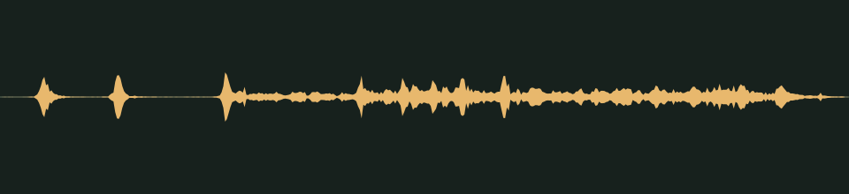

# Between stations · v001

**Audio candidate · scary moments · not yet in the game · listening review pending.** A crackling burst of old-radio static with a warbling tuning whine, for the Radio Showman's attack.

## Audition

<audio controls preload="none" aria-label="Audition radio-static version one">
  <source src="../../media/radio-static/v001/cue.wav" type="audio/wav">
  <a href="../../media/radio-static/v001/cue.wav">Download the processed cue</a>
</audio>

[Processed cue](../../media/radio-static/v001/cue.wav) · [Original five-second take](../../media/radio-static/v001/source.wav)

## Exact version

| Property | Measured result |
| --- | --- |
| Stable cue / version | `radio-static` / `v001` |
| Duration | 0.80 seconds |
| Format | PCM signed 16-bit WAV, stereo, 44.1 kHz |
| Download size | 141,164 bytes |
| Peak / RMS | -11.0 / -28.965 dBFS |
| Clipped samples | 0 |
| Processed SHA-256 | `ed441796c364cb590401ebde30793f6764ce9a43469c6ec05baf9cb03f7c61a3` |
| Source SHA-256 | `e37a22a4314eb3b1d51e27600f4cb8a394f2b51415775c5cb838508d4b434e59` |

Processing selects the segment beginning at 0.140 seconds, trims it to the stated duration, applies a 0.005-second entrance and 0.120-second exit fade, then normalizes its peak. It is a one-shot cue, not a loop. The source is preserved separately. [Exact recipe](../../media/radio-static/v001/processing.json), [measurements](../../media/radio-static/v001/verification.json), and [reproducible processing script](../../../../scripts/assets/audio/process_cues.py).

## Source and checks

Generated on 2026-09-26 by a Claude Code subagent (Opus 5.5) from the workflow coordinator's cue brief, using the separate Stable Audio 3 Small-SFX CPU service (service version 0.2.0). This take used seed 305, eight steps and five seconds. It contains no supplied recording or personal reference. The [provenance record](../../media/radio-static/v001/provenance.json) retains the complete prompt and service/model revisions, as well as the source terms recorded in [DESIGN-008](../../../designs/008-audio-pipeline.md). The source code, model and redistributed text component have separate terms; no broader license is asserted here.

The service and download SHA-256 checks passed, as did WAV decoding and the exact-duration, non-silence and zero-clipping checks. Re-running the processing script reproduced the same output. These measurements do not establish timbre or musical quality.

## Listen-proxy check

Nobody has listened to this take; the agent cannot hear audio. Instead, it measured the source's level in 20 ms windows, a rough autocorrelation pitch track, the zero-crossing rate and a four-band energy split, and chose the segment from those numbers. Two crackling pops arrive in the first tenth of a second, at about 0.03 and 0.10 seconds. After a short gap, continuous static starts at 0.2 seconds and holds into the exit fade. Inside it, a strong tone wanders between about 1.2 and 1.8 kHz: the tuning whine. The static is band-limited like an AM radio, with 88% of the energy at 1–4 kHz and almost none above 4 kHz.

Energy split of the processed cue: 0.8% below 300 Hz, 11.0% at 300 Hz–1 kHz, 88.0% at 1–4 kHz and 0.3% above 4 kHz. These numbers hint at shape and brightness; they cannot say how the cue sounds.

## Coordinator and owner review

Review focus: Whether it sounds like an old radio being tuned, and whether it is sharp enough to warn of the attack.

- **Coordinator technical intake:** Passed numerically; listening/creative selection pending.
- **Tom’s decision:** Pending, against the exact hash above.
- **Gameplay integration:** Registered in the game's scare cue manifest for the Radio Showman's attack in [DESIGN-027](../../../designs/027-scare-pass.md). No game event plays it yet. At gain 1.1 it peaks near -12.1 dBFS at the default master, in the range of the other one-shots, with one instance at a time. [DESIGN-008](../../../designs/008-audio-pipeline.md#scary-moments-cues) records the manifest; the inventory records it as a private candidate.

## Retained attempts

The first take was usable, and no other attempt was generated. The prompt and job ID are in the provenance record. This decision rests on measurements, not on listening.
