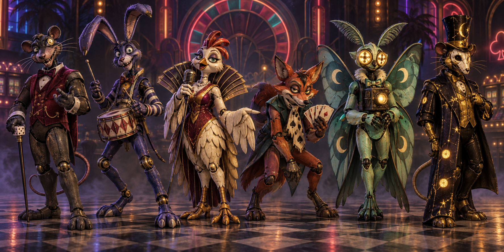

# Rat Casino ensemble · v001 concept

**Six-character first pitch · Retained history · Studio only.** Tom asked for a full spooky animatronic parody lineup, a retro rat casino and a Haynesnightmares Halloween mood. This first image supplied the previously missing enemy picture. He liked the direction and asked for the rat to become the central lead and Chick-flia to move to a side role. The [revised v002 construction image](v002.md) now carries that composition. No model or gameplay mapping was approved by this v001 image.

[Full-resolution concept](../../media/rat-casino-ensemble/v001/concept.png) · [Exact generation prompt](../../media/rat-casino-ensemble/v001/prompt.txt) · [Source record](../../media/rat-casino-ensemble/v001/source.json) · [Art direction](../../art-direction.md)

## Proposed cast and encounter sketches

| Role in sheet | Visual joke and possible encounter | Candidate role |
| --- | --- | --- |
| Rat pit boss | Casino host counts down a huge token drop; the player's route stays open around the marked landing spot. | Lead boss |
| Jackrabbit drummer | A rhythm showoff overplays a snare roll, revealing safe beats and a long reset. | Ordinary encounter |
| Hen lounge singer | A dramatic note sends visible sound rings across the floor, with generous gaps to step through. | Ordinary encounter |
| Fox card shark | Throws oversized harmless cards in a clearly telegraphed fan, then fumbles the deck. | Ordinary encounter |
| Moth projectionist | Projects moving shadows that can be read and walked around before the light sweeps by. | Ordinary encounter |
| Golden after-hours rat | A hidden high-roller changes the floor lights before a slow jackpot pose. | Optional boss or rare encounter |

These are pitches, not finalized combat or period assignments. The retro casino styling does not date the cultural reference; eligibility and age-compatible routes must be verified before any later level uses the cast. The lineup should feel spooky to an older child and playful enough for a younger child, without gore or forced scares.

## Source and construction limits

The driving GPT-6 Astra generated and inspected this original public-safe image on September 23, 2026 with the built-in image tool. SHA-256: `c99f7a747ffe3e8369291a0a288a98c06c929d9bc8608ab7f19f0612e54591c1`. No family photos, personal likeness references, outside character art or downloaded models were used. The tool supplied no seed.

The six full-body front three-quarter silhouettes are individually readable. The image does not define matching side/back geometry, joint clearance, rig topology, animation, mobile-scale readability or actual 3D materials. Tom confirmed the broad direction and gave the composition change recorded in v002. Separate editable Blender masters and GLBs, renders, technical checks and exact-version reviews are the next step. This v001 image remains the historical starting point.

## Review decision

- **Coordinator:** Selected as the first concrete pitch; v002 supersedes its main-character composition.
- **Tom:** Liked the direction and requested a central lead rat, Chick-flia as a side character and a stronger haunted animatronic mood.
- **Approved model/artifact versions:** None.
- **Gameplay use:** None. The current editor uses neutral candidate labels and procedural scenery; this concept is not in the game manifest.
