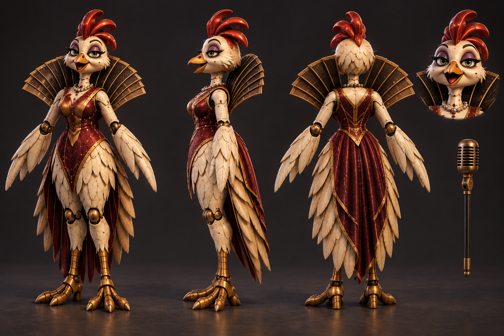

# Rat Casino ensemble · v002 concept

**Superseded six-character concept · Retained studio history.** Tom liked the first ensemble and asked for the rat to take center stage as the main character, with Chick-flia as a side character. This image fixed that hierarchy, but Tom subsequently said the cast and its turnarounds read as glam rock. The [v003 classic mascot concept](v003.md) is the current construction reference. No level or gameplay mapping uses this v002 image.

[Full-resolution v002 image](../../media/rat-casino-ensemble/v002/concept.png) · [Exact edit prompt](../../media/rat-casino-ensemble/v002/prompt.txt) · [Source and checksum](../../media/rat-casino-ensemble/v002/source.json) · [Original v001 proposal](v001.md)

## Cast hierarchy for Blender

| Performer | Construction emphasis | Candidate encounter role |
| --- | --- | --- |
| Rat Pit Boss | Largest central silhouette: long expressive muzzle, round ears, dark top hat, burgundy dealer jacket, dice cane, exposed joints and one strong showman gesture. This is the face of Rat Casino. | Main boss |
| Chick-flia | Cream-and-gold hen lounge singer, smaller side-stage silhouette, feather fan collar and handheld microphone. | Supporting encounter |
| Jackrabbit drummer | Tall bent ears, narrow limbs and a snare harness; rhythm cues should read from a distance. | Supporting encounter |
| Fox card shark | Crouched russet silhouette, oversized cards and asymmetrical coat tails. | Supporting encounter |
| Moth projectionist | Teal crescent wings, film-reel eyes and chest projector; broad silhouette must stay readable on mobile. | Supporting encounter |
| Golden after-hours rat | Distinctly slimmer and more mysterious than the lead: cracked mask, long dark coat and dim token lights. | Optional boss or rare encounter |

The table is a modeling and pitch reference, not a final enemy assignment. Keep separate editable masters and exports for the performers. Their rigs, motion, reach, period eligibility and encounter rules require actual model and gameplay checks. The casino and Halloween mood should be spooky and playful for ages six and eleven, without gore or forced scares. Existing friendly creatures remain outside enemy targeting.

## Source and limits

The driving GPT-6 Astra edited the original v001 image on September 23, 2026 from Tom's composition and role feedback. SHA-256: `3f0b6894d8136cdd40b61701ac1b32378e2e182dce842ae4a191641e266897d6`. The only image reference was the public-safe [v001 concept](v001.md), SHA-256 `c99f7a747ffe3e8369291a0a288a98c06c929d9bc8608ab7f19f0612e54591c1`. No family media, franchise art, downloaded models or personal likeness was supplied. The tool returned no seed.

The three-quarter illustration settles composition, palette and broad silhouettes. It does not provide side/back anatomy, true proportions, joint clearance, rig topology or a validated 3D material. Those are Blender construction decisions checked against the exported GLBs. Preserve this v002 concept while model versions evolve; a still image is not an approved runtime model.

## Supporting construction studies

The driving Astra generated five additional, public-safe turnaround sheets from the v002 ensemble on September 23, 2026. They are retained here as **superseded studies**, not instructions for the corrected models. Each shows front, side and back interpretations with detachable props where relevant. The glossy costume treatment does not meet Tom's later classic-mascot direction; new supporting views will be drawn from v003 as their Blender work begins.

| Performer | Turnaround | Exact prompt |
| --- | --- | --- |
| Chick-flia | [View the hen singer](../../media/rat-casino-ensemble/v002/construction/chick-flia.png) | [Prompt](../../media/rat-casino-ensemble/v002/construction/chick-flia-prompt.txt) |
| Jackrabbit drummer | [View the drummer](../../media/rat-casino-ensemble/v002/construction/jackrabbit-drummer.png) | [Prompt](../../media/rat-casino-ensemble/v002/construction/jackrabbit-drummer-prompt.txt) |
| Fox card shark | [View the fox](../../media/rat-casino-ensemble/v002/construction/fox-card-shark.png) | [Prompt](../../media/rat-casino-ensemble/v002/construction/fox-card-shark-prompt.txt) |
| Moth projectionist | [View the moth](../../media/rat-casino-ensemble/v002/construction/moth-projectionist.png) | [Prompt](../../media/rat-casino-ensemble/v002/construction/moth-projectionist-prompt.txt) |
| Golden after-hours rat | [View the masked rat](../../media/rat-casino-ensemble/v002/construction/golden-after-hours-rat.png) | [Prompt](../../media/rat-casino-ensemble/v002/construction/golden-after-hours-rat-prompt.txt) |

[Generation sources and exact image checksums](../../media/rat-casino-ensemble/v002/construction/source.json) identify all five sheets. None is an exact 3D asset, animation or owner-approved gameplay character.

## Review decision

- **Tom:** Liked v001 overall and directed the central rat and side-stage Chick-flia, then identified v002 and its turnarounds as too glam rock for his children's preferred classic original FNAF-era feel.
- **Coordinator:** Superseded v002 with the [v003 construction reference](v003.md).
- **Blender models:** The first Rat Pit Boss export based on this image was paused before final validation. Corrected models will have separate exact-version reviews.
- **Gameplay use:** None. New levels follow the requested model-first pass and the separate owner art gate.
