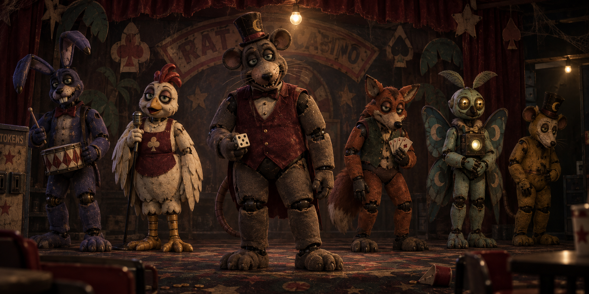
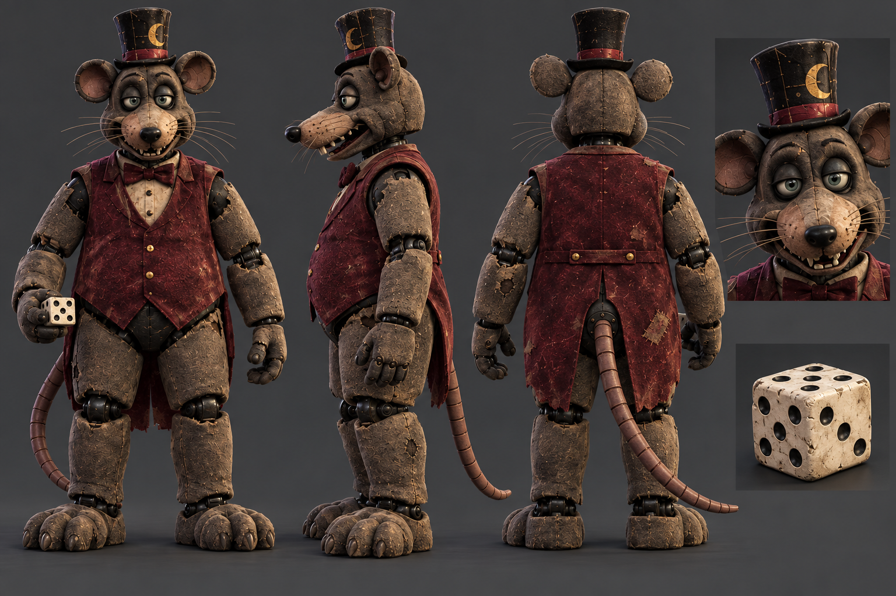
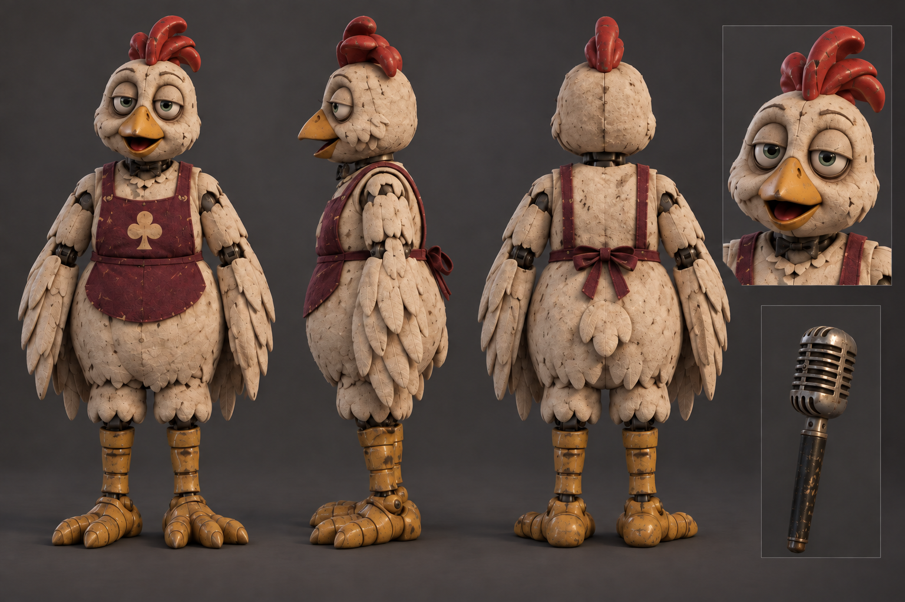
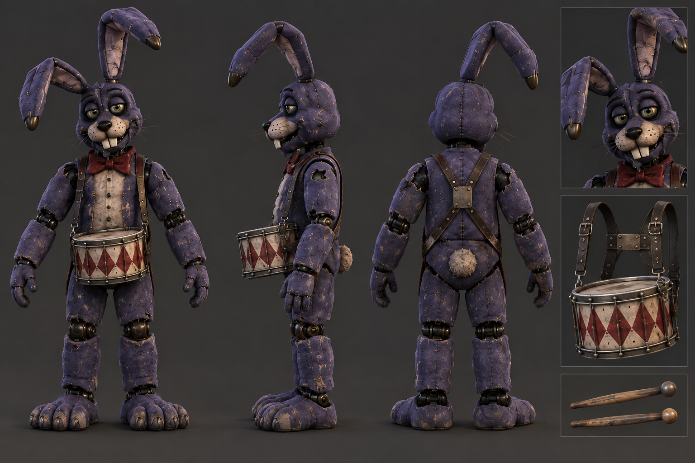
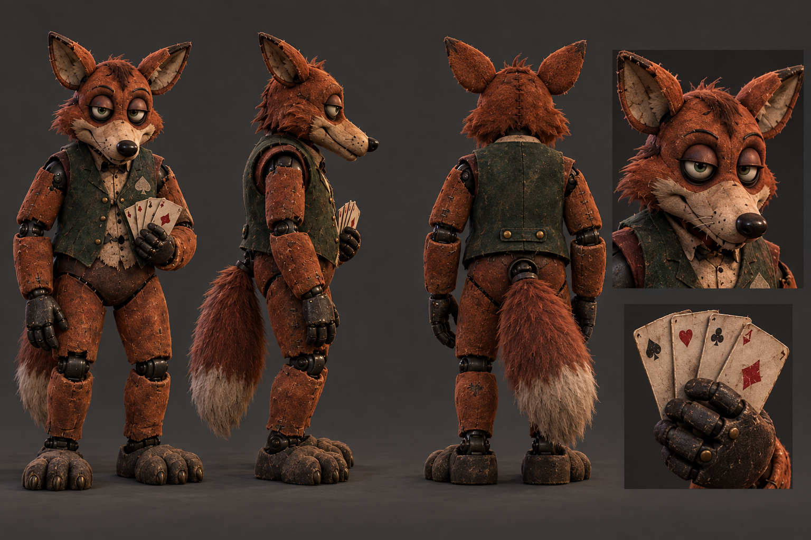
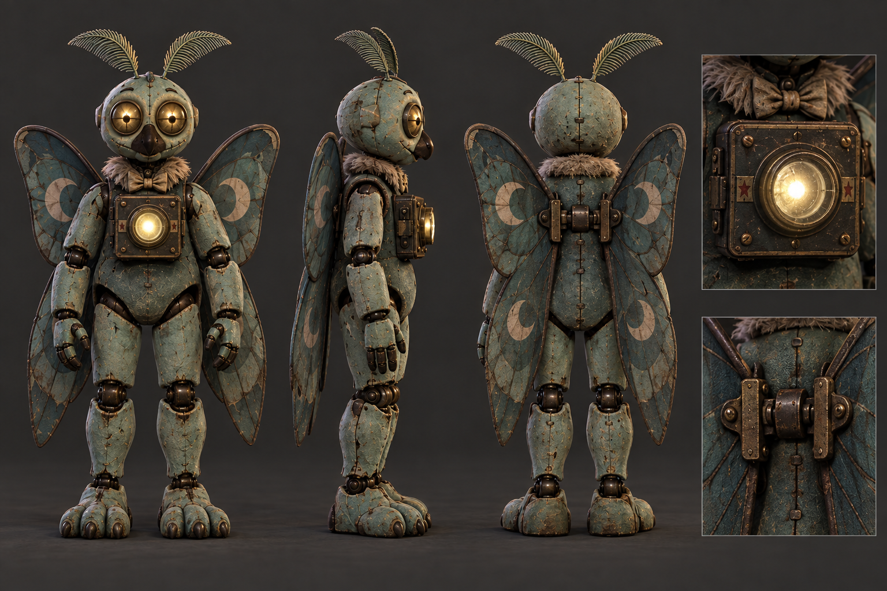

# Rat Casino ensemble · v003 classic mascot concept

**Current construction reference · Concept only · Studio candidate.** Tom said the [earlier lineup and turnarounds](v002.md) read as glam rock and clarified that his children want the classic original FNAF-era mood. The rat stays the center-stage main character and Chick-flia supports from the side. This version replaces glossy fashion-robot surfaces with worn, bulky venue mascots and a quiet, low-ceiling token arcade after closing. The corrected [Rat Pit Boss v002](../rat-pit-boss/v002.md), [Chick-flia v001](../chick-flia/v001.md), [Jackrabbit Drummer v001](../jackrabbit-drummer/v001.md), [Fox Card Shark v001](../fox-card-shark/v001.md) and [Moth Projectionist v001](../moth-projectionist/v001.md) Blender models are ready for exact-version art review; the concept itself has not approved those models or gameplay use.

[Full-resolution ensemble](../../media/rat-casino-ensemble/v003/concept.png) · [Exact generation prompt](../../media/rat-casino-ensemble/v003/prompt.txt) · [Source and checksums](../../media/rat-casino-ensemble/v003/source.json) · [v002 history](v002.md) · [v001 first pitch](v001.md)

## Construction decision

The contrast was checked against the [original 2014 game listing](https://store.steampowered.com/app/319510/Five_Nights_at_Freddys/) and [Security Breach's 2021 listing](https://store.steampowered.com/app/747660/Five_Nights_at_Freddys_Security_Breach/). The original places a small animatronic cast in an after-hours children's restaurant seen through security cameras. The later game explicitly describes a Mega Pizzaplex and Glamrock performers. The difference informs this original Rat Casino brief; no franchise image was supplied to the generator or copied into this asset.

The cast now uses round padded bodies, thick limbs, matte worn shells, cheap glass eyes, simple face plates and repaired seams. One weak bulb and stray flashlight spill reveal the mascots without the neon, polished metal, glitter and tailored costumes of v002. The old token stage, faded curtain and dice joke retain Rat Casino's own setting. Character stillness and distance carry the unease. Keep later attacks readable and funny for the younger player; this image does not define combat.

| Performer | Modeling priority | Candidate role |
| --- | --- | --- |
| Rat Pit Boss | Large central, broad gray-brown rat with blunt muzzle, round ears, tail, cheap red vest, battered hat and dice token. Preserve a clearly rat-shaped face and padded silhouette. | Main boss |
| Chick-flia | Smaller shabby cream hen with a simple casino apron and old microphone. Avoid the former glamour dress and human pose. | Supporting encounter |
| Jackrabbit drummer | Patched indigo shell, chunky limbs, one bent ear and crude snare. | Supporting encounter |
| Fox card shark | Worn russet shell, loose dealer vest and small card fan. | Supporting encounter |
| Moth projectionist | Compact muted-teal shell, small separate wings and old chest lens. | Supporting encounter |
| Golden after-hours rat | Slumped dim mustard-gold spare shell with a distinct pale face plate; visibly separate from the lead. | Optional boss or rare encounter |

The matching [Rat Pit Boss front, side and back construction sheet](../../media/rat-casino-ensemble/v003/construction/rat-pit-boss.png) establishes the lead's broad shape, tail base, vest, face and simple material layers for Blender. Its [exact prompt](../../media/rat-casino-ensemble/v003/construction/rat-pit-boss-prompt.txt) and hash are in the source record. It is an interpretation of the ensemble, not validated 3D anatomy; the modeller must resolve any side/back inconsistency and record actual dimensions and materials.

The first corrected supporting construction sheet is [Chick-flia front, side and back](../../media/rat-casino-ensemble/v003/construction/chick-flia.png). A first [draft](../../media/rat-casino-ensemble/v003/construction/chick-flia-draft.png) still carried eyelashes and purple eye makeup; a focused [edit](../../media/rat-casino-ensemble/v003/construction/chick-flia-edit-prompt.txt) removed them while keeping the padded body, worn apron and simple microphone. The [initial generation prompt](../../media/rat-casino-ensemble/v003/construction/chick-flia-draft-prompt.txt) and both exact image hashes remain in the source record. Use the edited sheet for her Blender model.

The next [jackrabbit drummer construction sheet](../../media/rat-casino-ensemble/v003/construction/jackrabbit-drummer.png) keeps one bent ear, a patched indigo padded shell, plain bow tie and detachable snare harness. Its [exact prompt](../../media/rat-casino-ensemble/v003/construction/jackrabbit-drummer-prompt.txt) and hash are in the source record. The original v002 drummer had thin limbs and glossy stagewear; use this heavier v003 sheet when the rabbit's model pass begins.

The [fox card shark construction sheet](../../media/rat-casino-ensemble/v003/construction/fox-card-shark.png) replaces its earlier narrow, tailored pose with a sturdier patched russet shell, a plain old dealer vest and a separate small card fan. The [exact prompt](../../media/rat-casino-ensemble/v003/construction/fox-card-shark-prompt.txt) and hash are retained for its later model pass.

The [moth projectionist construction sheet](../../media/rat-casino-ensemble/v003/construction/moth-projectionist.png) resolves the muted-teal performer as a compact padded mascot with separate hinged wings, feathered antennae and a small warm chest projector. The back and hinge inset give the Blender author a clear attachment point; the lens close-up records its restrained light. Its [exact prompt](../../media/rat-casino-ensemble/v003/construction/moth-projectionist-prompt.txt) and hash are retained in the source record. The ensemble and the corrected fox sheet were its visual references, not franchise images.

The [golden after-hours rat sheet](../../media/rat-casino-ensemble/v003/construction/golden-after-hours-rat.png) gives the optional spare shell a smaller mustard-gold padded body, pale faceplate, uneven repair, token-slot badge and a thin separate tail. The low hat and red vest belong only to the lead Rat Pit Boss; the golden rat carries neither. Its [exact prompt](../../media/rat-casino-ensemble/v003/construction/golden-after-hours-rat-prompt.txt) and hash are retained in the source record. The ensemble and lead-rat sheet guided the consistent Rat Casino construction language; this is a separate original character.

The inventory retains direct access to the rejected visual history: [v002 ensemble](../../media/rat-casino-ensemble/v002/concept.png), [glossy Chick-flia study](../../media/rat-casino-ensemble/v002/construction/chick-flia.png), [glossy jackrabbit study](../../media/rat-casino-ensemble/v002/construction/jackrabbit-drummer.png), [glossy fox study](../../media/rat-casino-ensemble/v002/construction/fox-card-shark.png), [glossy moth study](../../media/rat-casino-ensemble/v002/construction/moth-projectionist.png), [glossy golden-rat study](../../media/rat-casino-ensemble/v002/construction/golden-after-hours-rat.png) and [v001 first pitch](../../media/rat-casino-ensemble/v001/concept.png). These files are comparison evidence only; none should guide the corrected model finish.

## Source and review state

The driving GPT-6 Astra generated and inspected the ensemble and matching character turnarounds on September 23, 2026. Their selected exact SHA-256 hashes are in the [source record](../../media/rat-casino-ensemble/v003/source.json). The sole image-generation reference for the ensemble was the public-safe v002 image, used to preserve the original cast and hierarchy. The v003 ensemble guided the turnarounds; the corrected fox and lead-rat sheets provided construction consistency for the final two, and Chick-flia's first draft was the input to its face correction. The two official store pages informed the written art-direction comparison, not the image input. No family media, personal likeness, downloaded mesh or franchise image was supplied. The tool returned no seed.

- **Tom:** Corrected the prior glam-rock feel toward the classic original FNAF-era mood. Exact v003 image and future model versions have not received final-art approval.
- **Coordinator:** Selected v003 as the current modeling reference. The rat, Chick-flia, jackrabbit, fox and moth sheets guided separate Blender candidates; the golden spare-rat sheet remains selected for the last.
- **Blender models:** The v001 Rat Pit Boss first rigged export was paused before final validation when the look changed. Separately authored [corrected Rat Pit Boss v002](../rat-pit-boss/v002.md), [Chick-flia v001](../chick-flia/v001.md), [Jackrabbit Drummer v001](../jackrabbit-drummer/v001.md), [Fox Card Shark v001](../fox-card-shark/v001.md) and [Moth Projectionist v001](../moth-projectionist/v001.md) models passed technical checks and await Tom's exact-version art review. The remaining golden model needs its own versioned review and technical evidence.
- **Gameplay use:** None. Models precede new levels, and exact final art remains subject to Tom's review.
