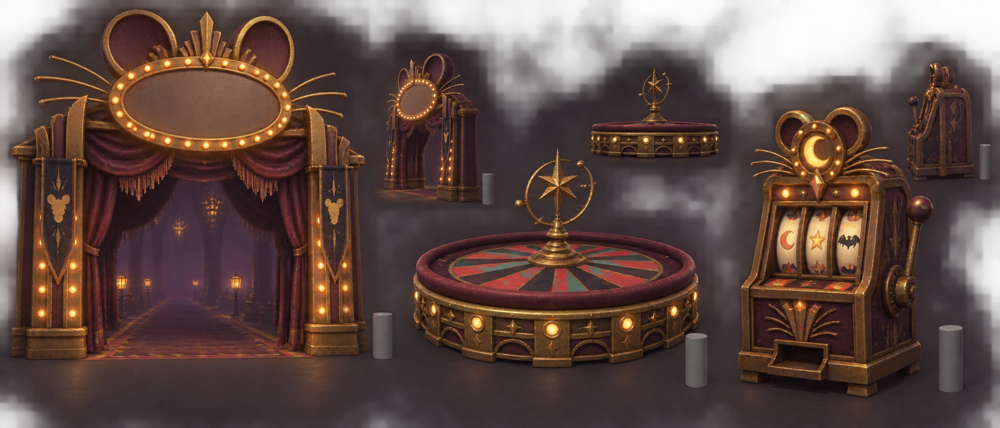
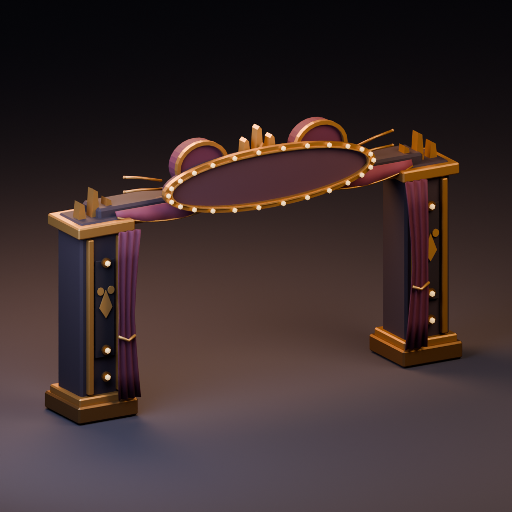
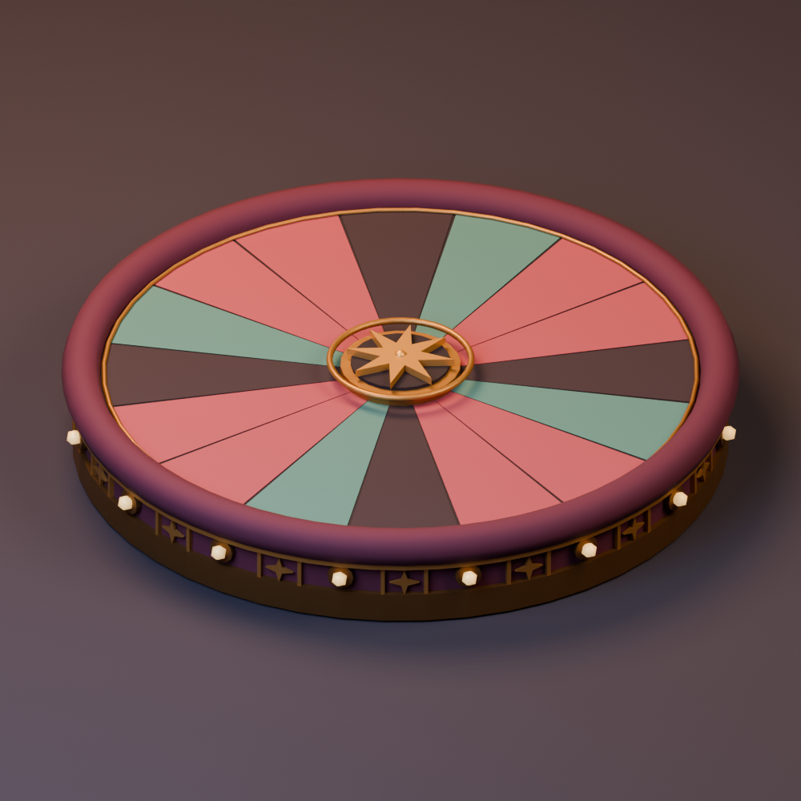
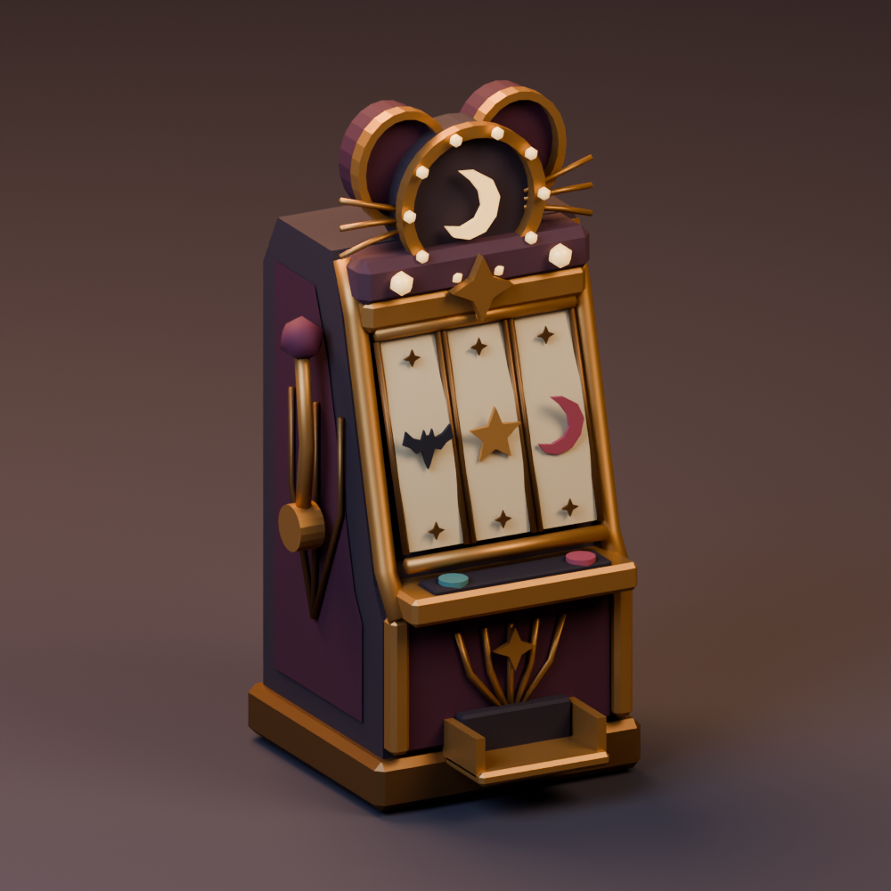
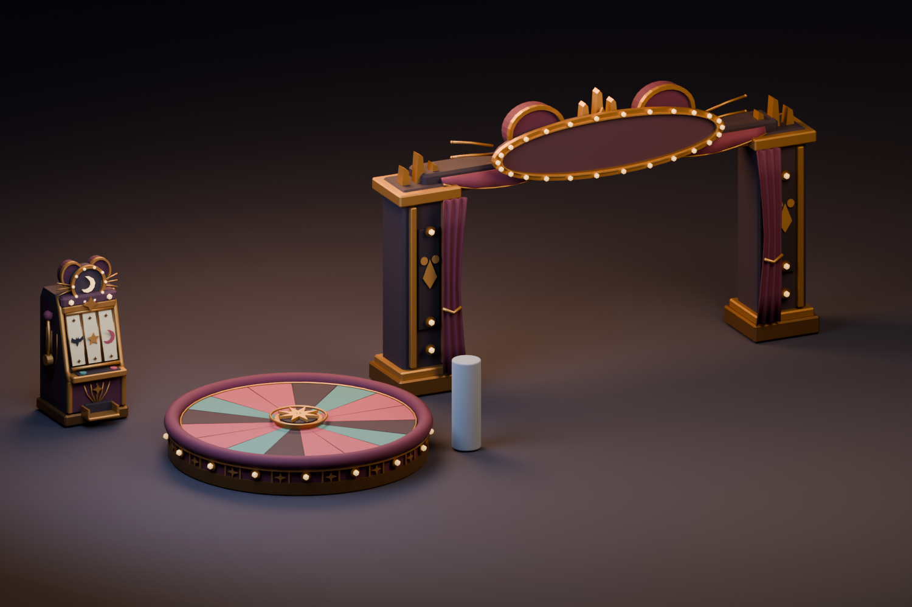

# Rat Casino environment kit · v001

**Three completed static model candidates · Ready for Tom · Studio only.** Tom chose a spooky retro Rat Casino and Halloween Haynesnightmares direction, and put models ahead of new levels. The image below is the coordinator's construction reference. The exported models are original stage scenery; no prop has entered gameplay.

[Full-resolution concept](../../media/rat-casino-kit/v001/concept.png) · [Exact prompt](../../media/rat-casino-kit/v001/prompt.txt) · [Source and checksum](../../media/rat-casino-kit/v001/source.json) · [Blender work order](../../../../.agents/work-orders/097-rat-casino-kit.md)

The arch is a broad entrance with a blank plaque and clear path. The low dais provides a readable circular landmark, without betting controls. The cabinet carries invented moon, star and bat reel marks. Plum fabric, aged brass and amber bulbs give the first arcade kit a darker stage mood. The image includes tiny scale cylinders; those are reference marks, not game assets. The old Midnight Arcade kit remains available as a historical candidate.

The driving GPT-6 Astra generated and inspected this original public-safe concept on September 23, 2026. SHA-256: `eb10826504b05d8e2cfaee9f7881a994640c29a9f22401a00c32bce56fe4fee4`. No family photos, outside franchise art or downloaded mesh were supplied. The image tool returned no seed. The side views are small and do not settle hidden geometry or actual dimensions; those require Blender inspection.

## Three exact models

### Marquee arch {#marquee-arch}

The blank oval sign, abstract rat-ear crown and gathered plum curtains preserve the concept's entrance silhouette. The measured 6.04 × 3.69 × 0.98 m arch has a conservative clear passage at least 4.10 m wide and 2.60 m high through its full depth. Its curtains stay beside the pillars rather than over the route.

<model-viewer src="../../media/rat-casino-kit/v001/marquee-arch.glb" poster="../../media/rat-casino-kit/v001/marquee-arch-beauty.png" alt="Orbit the Rat Casino marquee arch model" camera-controls touch-action="pan-y" shadow-intensity="0.7"></model-viewer>

[Download arch GLB](../../media/rat-casino-kit/v001/marquee-arch.glb) · [Side view](../../media/rat-casino-kit/v001/marquee-arch-side.png) · [Actual browser view](../../media/rat-casino-kit/v001/marquee-arch-browser.png)

### Roulette dais {#roulette-dais}

The low 3.51 m wide, 0.562 m high dais retains the radial pattern and brass-lit rim. The tall concept mechanism became a shallow static star inset so the full top remains low and readable. The wheel does not rotate in this v001 export.

<model-viewer src="../../media/rat-casino-kit/v001/roulette-dais.glb" poster="../../media/rat-casino-kit/v001/roulette-dais-beauty.png" alt="Orbit the Rat Casino roulette dais model" camera-controls touch-action="pan-y" shadow-intensity="0.7"></model-viewer>

[Download dais GLB](../../media/rat-casino-kit/v001/roulette-dais.glb) · [Side view](../../media/rat-casino-kit/v001/roulette-dais-side.png) · [Actual browser view](../../media/rat-casino-kit/v001/roulette-dais-browser.png)

### Slot cabinet {#slot-cabinet}

The 1.03 × 2.13 × 1.10 m cabinet uses invented bat, star and moon reel marks, a short lever and a crescent lit by amber bulbs. A deeper plum case and aged parchment reels keep it in the darker Rat Casino palette.

<model-viewer src="../../media/rat-casino-kit/v001/slot-cabinet.glb" poster="../../media/rat-casino-kit/v001/slot-cabinet-beauty.png" alt="Orbit the Rat Casino slot cabinet model" camera-controls touch-action="pan-y" shadow-intensity="0.7"></model-viewer>

[Download cabinet GLB](../../media/rat-casino-kit/v001/slot-cabinet.glb) · [Side view](../../media/rat-casino-kit/v001/slot-cabinet-side.png) · [Actual browser view](../../media/rat-casino-kit/v001/slot-cabinet-browser.png)

## Technical record

| Exact export | Triangles | Materials | Bytes | SHA-256 |
| --- | ---: | ---: | ---: | --- |
| Marquee arch | 4,876 | 3 | 247,248 | `1f939c9e11004397f2a7046390d788dd8ab54a0c26450eaa88b1dc983dcd6e8b` |
| Roulette dais | 4,872 | 3 | 234,276 | `574644bcccf8038cb929aebd1d63eebbfbce976e732ec314e388cdef8cd52df6` |
| Slot cabinet | 3,302 | 3 | 194,096 | `06f1460afc516a4dd56c8ab33cc4ba84c2bcdb5a33f954cf6060af06fd9aabe3` |

All three are static, self-contained Y-up GLBs with floor-centered origins, no animations, skins, textures or external decoder dependencies. Khronos glTF Validator returned zero errors, warnings, infos and hints for each exact export. Chromium 153 with the bundled model viewer loaded every GLB, confirmed bounds, materials and hashes, and reported no page, console, failed or external requests. This is an isolated desktop/software-WebGL inspection, not physical Safari or gameplay performance evidence. Route collision and placement are not validated for these studio candidates.

[Construction measurements](../../media/rat-casino-kit/v001/construction-measurements.json) · [Exact GLB measurements and validation](../../media/rat-casino-kit/v001/glb-measurements.json) · [Arch validator](../../media/rat-casino-kit/v001/marquee-arch-validator.json) · [Dais validator](../../media/rat-casino-kit/v001/roulette-dais-validator.json) · [Cabinet validator](../../media/rat-casino-kit/v001/slot-cabinet-validator.json) · [Browser report](../../media/rat-casino-kit/v001/browser-report.json) · [Render settings](../../media/rat-casino-kit/v001/render-settings.json)

The driving GPT-6 Astra selected the concept and inspected matching renders after scoped curtain and palette corrections. A fresh native GPT-6 Astra at max authored the models in Blender 4.5.13 LTS through the dedicated service. The [construction script](../../media/rat-casino-kit/v001/build-kit.py), [render script](../../media/rat-casino-kit/v001/render-kit.py), [validator harness](../../media/rat-casino-kit/v001/validate-glbs.mjs) and [browser harness](../../media/rat-casino-kit/v001/browser-intake.mjs) are retained for repeatable revisions.

Editable master: `haynes-quest/rat-casino-kit/v001/rat-casino-kit.blend` on the dedicated Blender authoring PVC, 494,421 bytes, SHA-256 `99791504d602bf3f3abd06182f4c00e3b68dd954a14b5a05843c8208752c609e`. Retrieve it from the service's `/artifacts/haynes-quest/rat-casino-kit/v001/rat-casino-kit.blend` route and verify the checksum. The prior Toybox master was preserved; this scene is released with no pending authoring jobs.

[Catalog intake](../../media/rat-casino-kit/v001/catalog-intake.json) · [Remote artifact manifest](../../media/rat-casino-kit/v001/remote-artifacts.json) · [Transfer checksum verification](../../media/rat-casino-kit/v001/transfer-verification.json) · [Scene release marker](../../media/rat-casino-kit/v001/scene-release.json)

## Tom's review

Please inspect the arch's clear entrance and curtains, the dais colors and height, and the cabinet's darker face and symbols.

- **Coordinator decision:** Selected the three corrected v001 static model candidates for exact-version review.
- **Tom's decision / date:** Pending.
- **Approved model checksums:** None.
- **Gameplay use:** None. Current routes use separate procedural scenery. Changes to these files require a new candidate version before approval or integration.
