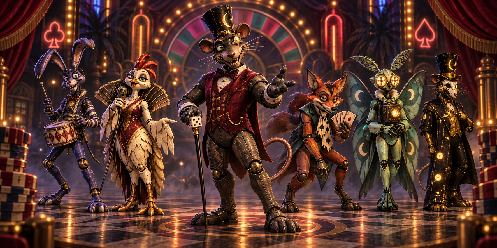
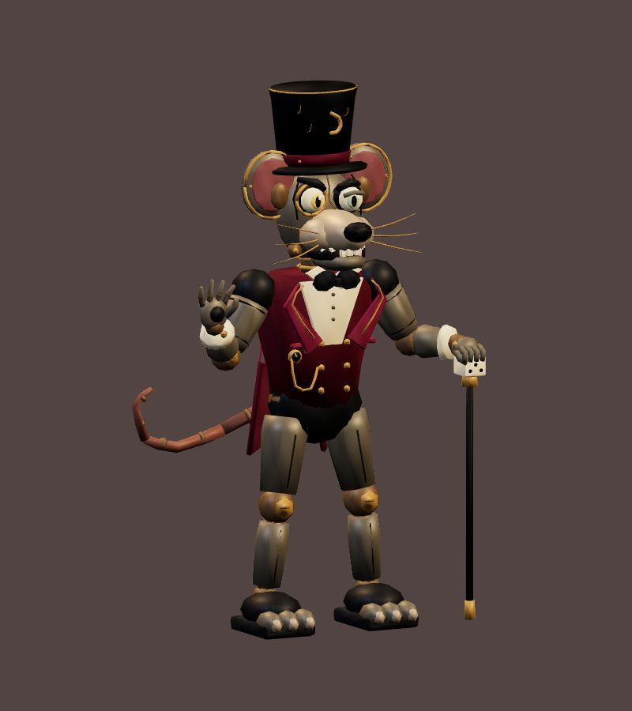

# Rat Pit Boss · v001 first rigged export

**Paused partial model · Superseded appearance · Studio history only.** This is the first Rat Pit Boss GLB built from the [v002 glossy ensemble](../rat-casino-ensemble/v002.md). Tom said that cast looked too glam rock and asked for the classic original FNAF-era mascot mood. Construction stopped before final technical validation, animation review or owner art approval. The [v003 worn-mascot ensemble and lead turnaround](../rat-casino-ensemble/v003.md) now guide a separate v002 model; this historical file will not enter gameplay.

<figure><figcaption>v002 inspiration · superseded glam-rock finish</figcaption></figure>
<figure><figcaption>Exact rigged v001 export · paused before validation</figcaption></figure>

<model-viewer src="../../media/rat-pit-boss/v001/rat-pit-boss.glb" poster="../../media/rat-pit-boss/v001/three-quarter.png" alt="Orbit the superseded, unvalidated first Rat Pit Boss model" camera-controls touch-action="pan-y" shadow-intensity="0.7" camera-orbit="155deg 75deg auto"></model-viewer>

[Download paused GLB](../../media/rat-pit-boss/v001/rat-pit-boss.glb) · [Editable paused Blender scene](../../media/rat-pit-boss/v001/paused-art-direction.blend) · [Front view](../../media/rat-pit-boss/v001/front.png) · [Three-quarter view](../../media/rat-pit-boss/v001/three-quarter.png) · [Authoring pause manifest](../../media/rat-pit-boss/v001/pause-art-direction.json) · [Exact still-render method](../../media/rat-pit-boss/v001/preview-method.md)

The original Astra Blender author saved a 1,916,492-byte GLB, SHA-256 `09a4dadbb4f9eabdddf32b05e7f6ee574e23580127ac9c4a94f991b95bcabc4a`, and the released master, SHA-256 `5abb3196c1168000cfbc9b3328520a722cbeba12a4e4c682da3ec60962b1e54a`. The first export is approximately 2.15 m including the hat, with two materials and an original embedded atlas. Five clip headers are present: `idle`, `move`, `attack`, `hit`, `defeat`. The creator authored attack contact at 1.25 seconds of a 2-second clip, but exported motion/contact and held defeat were **not validated**.

A separate read-only Three.js/Chromium pass rendered the **exact paused GLB**, not the earlier unoptimized checkpoint: [front](../../media/rat-pit-boss/v001/front.png), SHA-256 `c6b4b5a3ec096a99bb0953d95d3a805201f5407c19c918da2730571effa41b95`, and [three-quarter](../../media/rat-pit-boss/v001/three-quarter.png), SHA-256 `3ca8fee0d3ab2ba8c759f863870fc952386abd26ce1a63cf7c43a8d11ced0cae`. It logged no page, console or WebGL errors in those two still views. [Raw browser observation](../../media/rat-pit-boss/v001/preview-browser.json) records the software browser and clip headers. This does not establish glTF validator conformance, animation playback, skin behavior, mobile performance or the final art look.

**Coordinator finding:** The first export retains the v002 slim metal limbs, tailored jacket, upright stage gesture and dice cane. Those details explain Tom's glam-rock objection. The corrected version needs the v003 padded body, plain worn surfaces, heavy face and stiff after-hours presence. Preserve this v001 master and GLB for comparison; do not use it as a technical or artistic acceptance sample.

- **Tom:** Requested a classic original FNAF-era mood after seeing the preceding enemy images. He has not reviewed this exact GLB as final art.
- **Technical status:** Paused before Khronos validation, Three.js enemy-adapter check, final animation/browser playback, motion reel and full bounds review. The exclusive Blender scene was saved and released at 2026-09-23 19:54:59 UTC.
- **Approval/gameplay:** None. [WO098](../../../../.agents/work-orders/098-rat-pit-boss.md) contains the checkpoint; [WO099](../../../../.agents/work-orders/099-rat-pit-boss-classic.md) starts a separate corrected v002 model.
