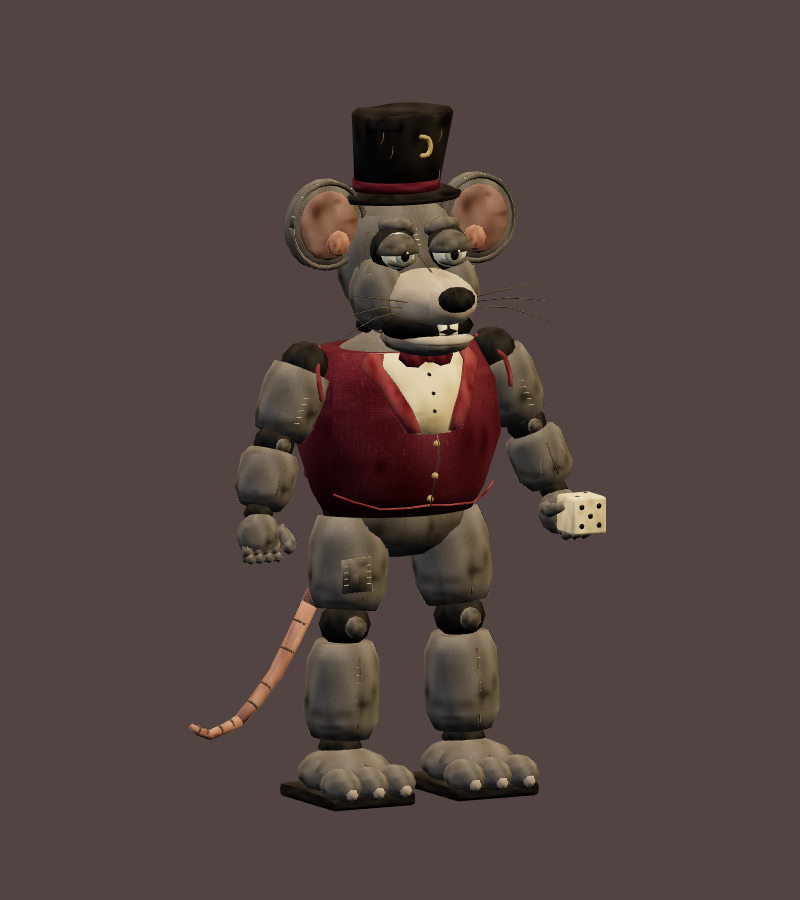
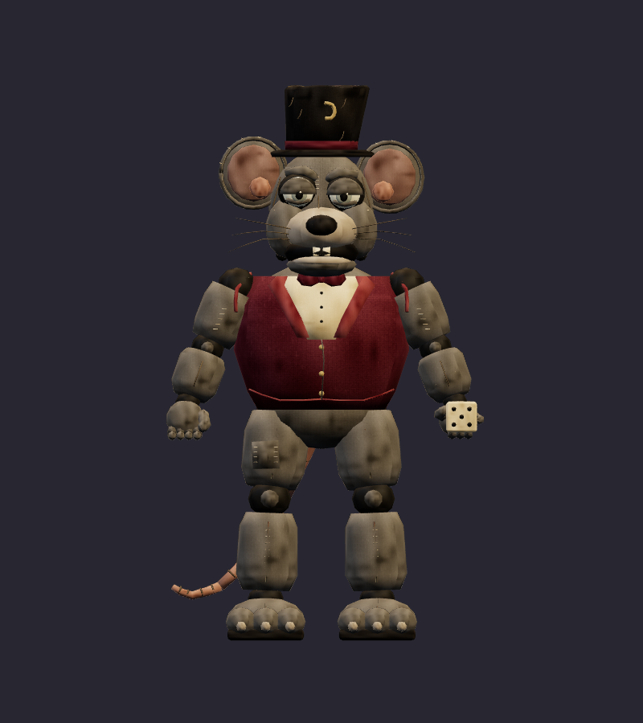
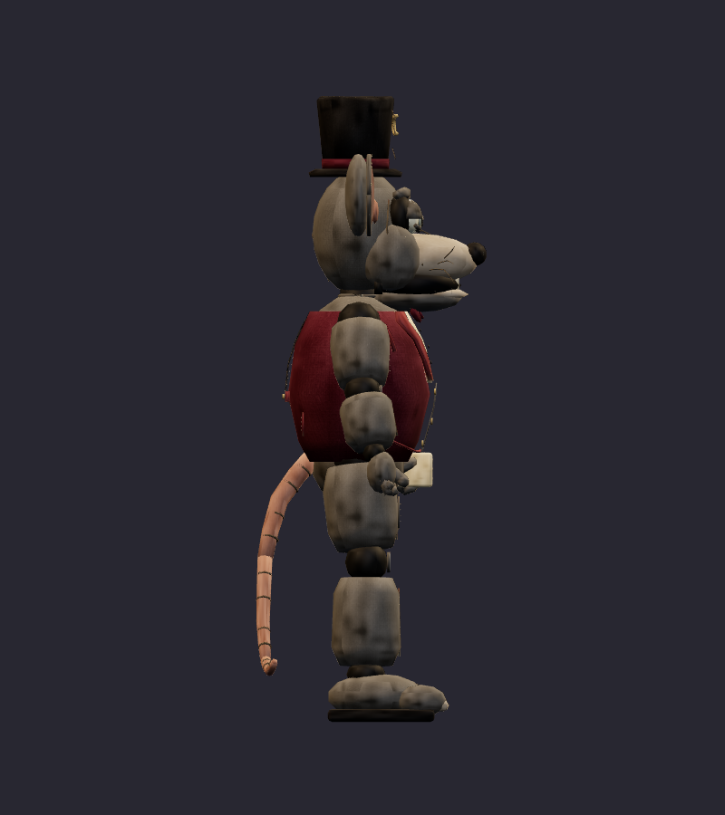
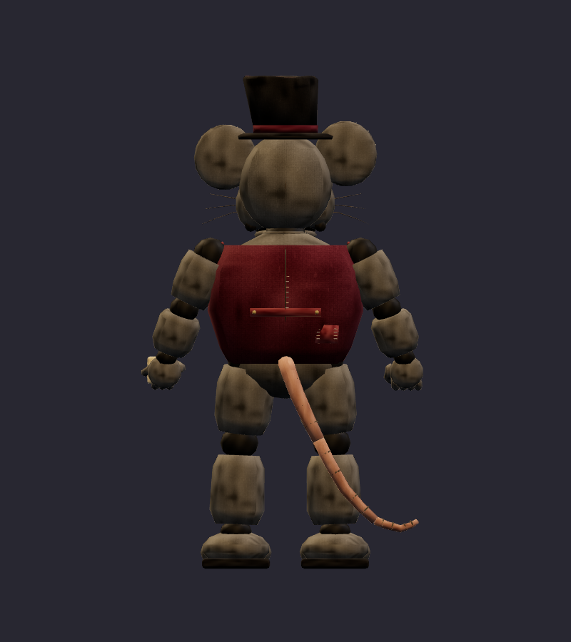
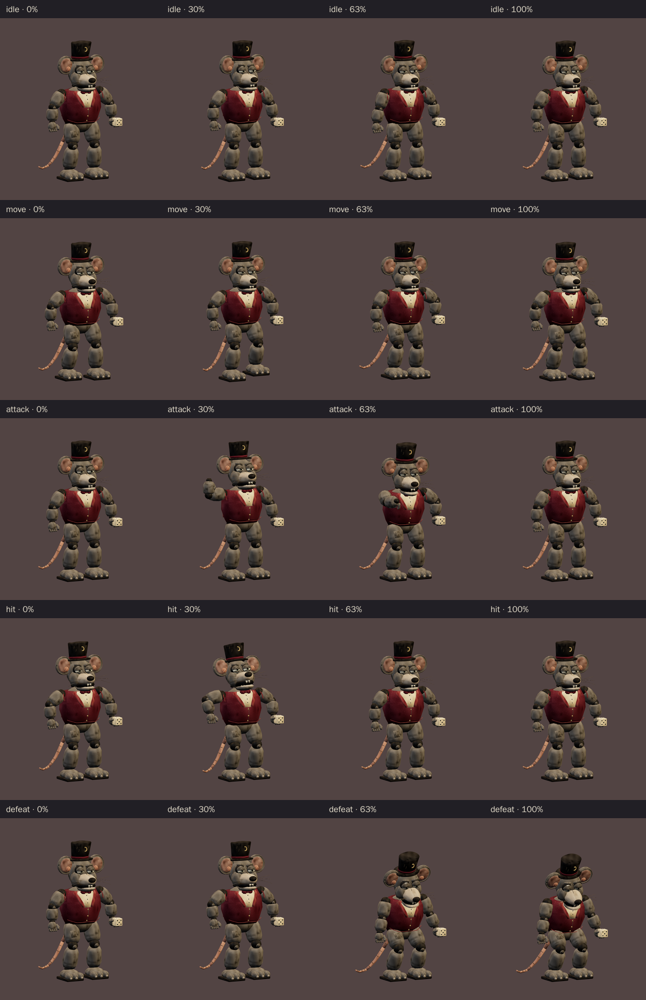
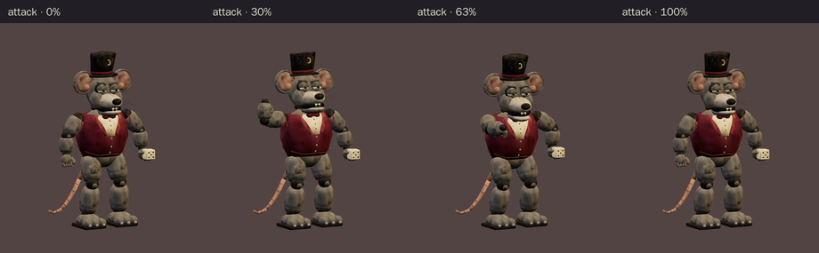

# Rat Pit Boss · v002 worn mascot

**Validated Blender model candidate · Studio only · Exact art review pending.** Rat Pit Boss is the central performer in the proposed six-character Rat Casino cast. Tom asked for the quieter, worn feel of the original 2014 FNAF setting after the earlier images looked too glam rock. This separate v002 model follows the [corrected ensemble](../rat-casino-ensemble/v003.md) and [rat construction sheet](../../media/rat-casino-ensemble/v003/construction/rat-pit-boss.png). The [first glossy rigged export](v001.md) remains a paused, unvalidated checkpoint.

<figure><figcaption>Current construction reference · v003 image</figcaption></figure>
<figure><figcaption>Exact exported v002 model · review candidate</figcaption></figure>

<model-viewer src="../../media/rat-pit-boss/v002/rat-pit-boss.glb" poster="../../media/rat-pit-boss/v002/beauty.png" alt="Orbit the worn Rat Pit Boss and inspect its five animations" camera-controls touch-action="pan-y" data-quest-clips shadow-intensity="0.7" camera-orbit="155deg 75deg auto"></model-viewer>

[Download exact GLB](../../media/rat-pit-boss/v002/rat-pit-boss.glb) · [Editable Blender master](../../media/rat-pit-boss/v002/rat-pit-boss.blend) · [Artifact manifest](../../media/rat-pit-boss/v002/sha256-manifest.json)

<figure><figcaption>Front</figcaption></figure>
<figure><figcaption>Side</figcaption></figure>
<figure><figcaption>Back</figcaption></figure>

The broad muzzle, round ears, padded limbs, heavy lids and segmented tail keep him recognizably rat shaped. Matte gray-brown fabric, repairs and a plain burgundy vest replace the first export's narrow metal limbs and tailored stage costume. The hat and small die preserve his original casino joke. The model simplifies the painted concept into game geometry; Tom has not yet decided whether this exact interpretation is the final look.

| Exact exported model | Result |
| --- | --- |
| Height and placement | 2.15 m; metre scale, Y-up, forward −Z, floor-centered |
| Geometry | 14,698 triangles; two opaque material primitives; one skin, 24 joints, up to four influences per vertex |
| Texture | One original embedded 1024 × 1024 atlas; no external resource or required glTF extension |
| Download | 1,363,724 bytes; below the 2 MiB candidate budget |
| GLB SHA-256 | `2f41912e67ba27f7f1d5a6c8ac7bc60fbe8d3dba6e4a775f7186750f608b620d` |
| Blender master SHA-256 | `498afc3120eb223164baa7d7da05e29846d2f99f89389cfb7364fa62a4aa1761` |

## Motion and technical review

The interactive viewer above exposes all five exact GLB clips. `idle` lasts 2.4 seconds and `move` 1.2 seconds; both loop. `attack` lasts 2.0 seconds, with a raised-fist warning before contact at 1.25 seconds. `hit` lasts 0.7 seconds. `defeat` lasts 2.4 seconds and holds a slumped final pose. The model's root stays in place; encounter movement belongs to the game.

The lead requested a clearer attack at small play distance. The author raised the free fist and added a restrained body and head lean; the strip above is the revised **exact export**. The dice remains in the other hand. The exaggerated warning is intentional for a younger player, while the resting pose stays subdued.

[Khronos validation](../../media/rat-pit-boss/v002/validation.json) reports zero errors and warnings. [Three.js inspection](../../media/rat-pit-boss/v002/three-inspection.json) reimported the exact GLB, exercised the actual enemy animation adapter and sampled exported skin vertices at 60 Hz through all five clips. Every clip moved the visible model. Exported bounds covered the poses; the feet, tail and die stayed clear of the floor and suit. [Chromium WebGL playback](../../media/rat-pit-boss/v002/browser-inspection.json) rendered distinct frames for every clip with no page, console, HTTP or WebGL error and no external asset request. [Author's visual notes](../../media/rat-pit-boss/v002/visual-review.json) and the [scene release](../../media/rat-pit-boss/v002/scene-release.json) record the finished candidate and Blender handoff.

The browser check used software Chromium. Physical iPad/iPhone Safari, device frame time and combat feel remain untested. This model is available in the studio for Tom to review, **not mapped into a level or approved for gameplay**. Final use still depends on his exact-version art review and the later level and encounter gates.

The fresh Astra Blender author built v002 from the corrected original image references under [WO099](../../../../.agents/work-orders/099-rat-pit-boss-classic.md). Source scripts live in `scripts/assets/rat-pit-boss-v002/`; the manifest records matching local and Blender-service artifact hashes. No downloaded franchise model, texture, family photograph or personal likeness was used.
