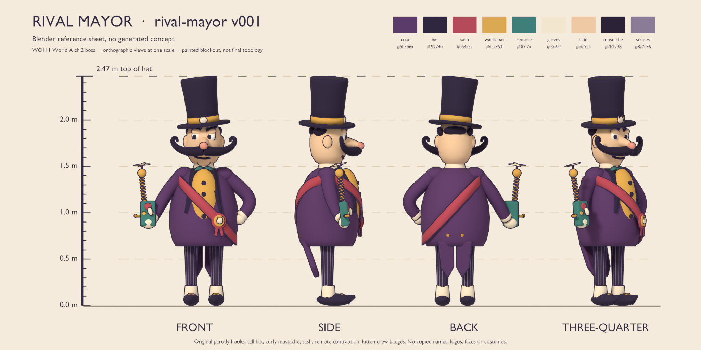
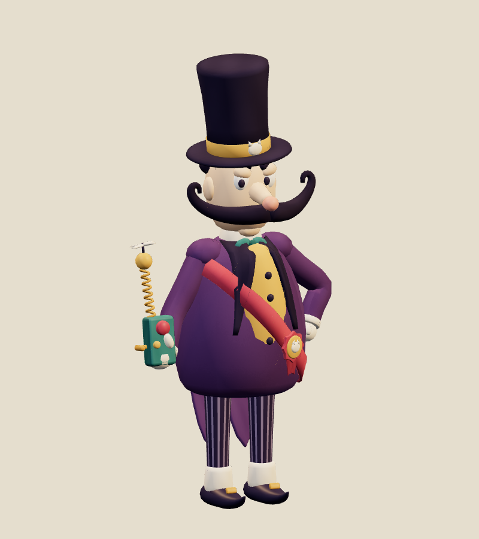
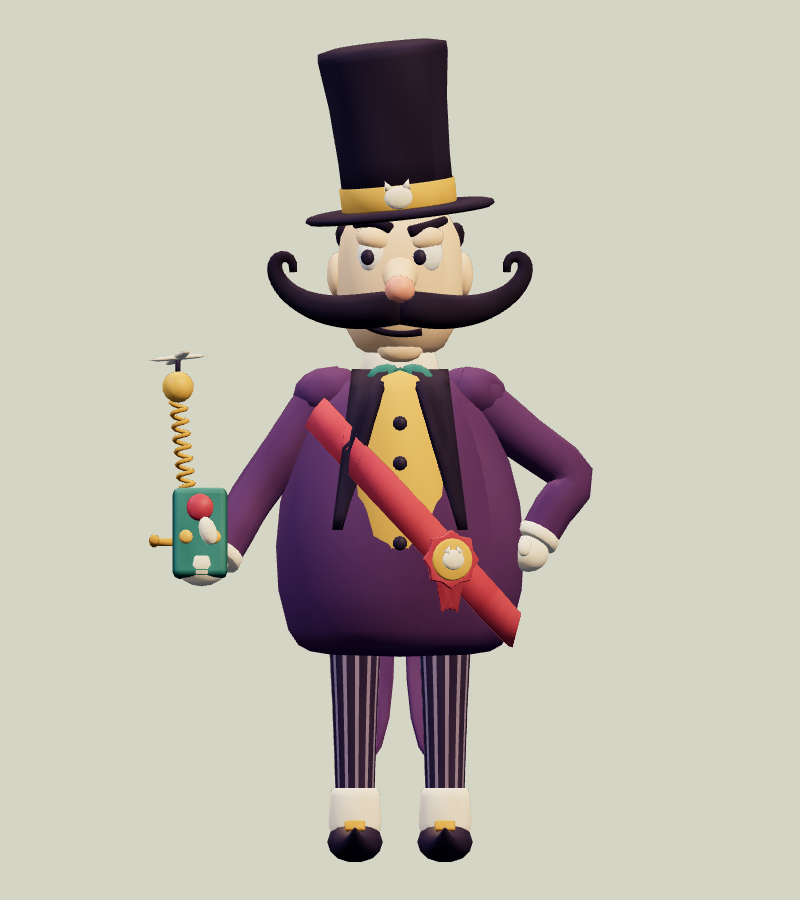
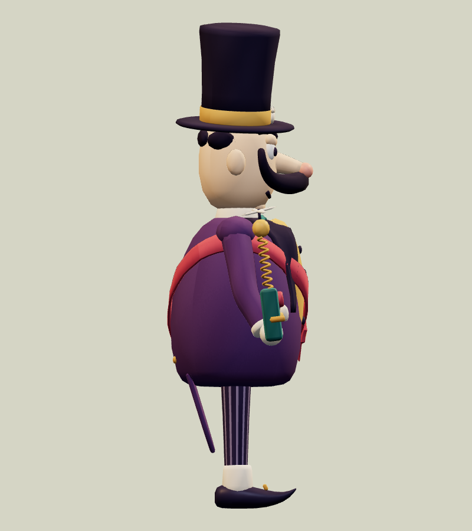
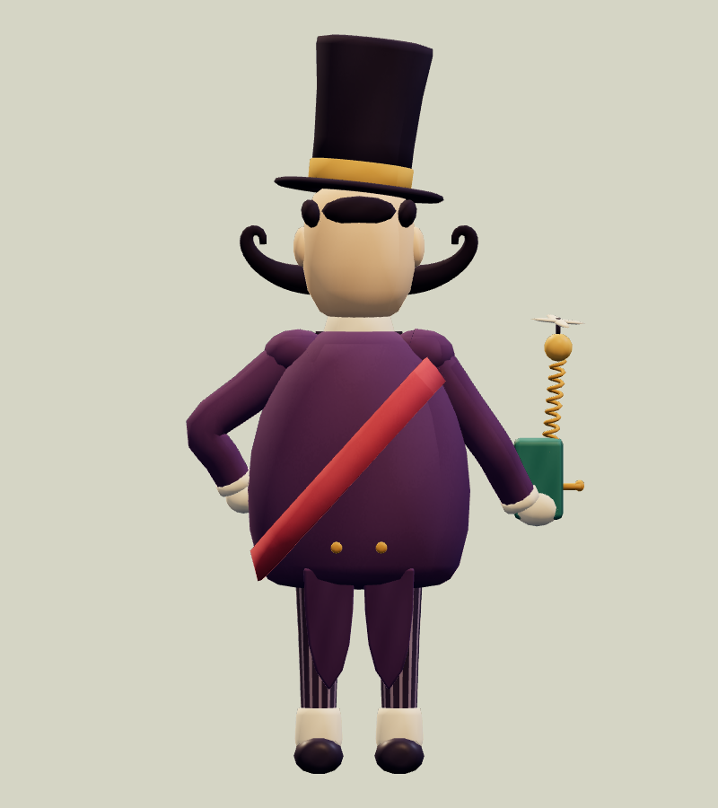
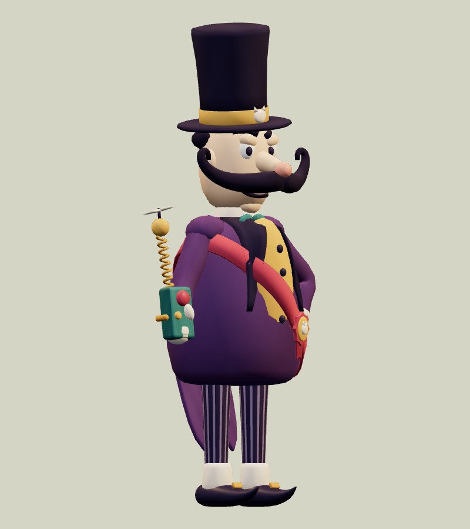
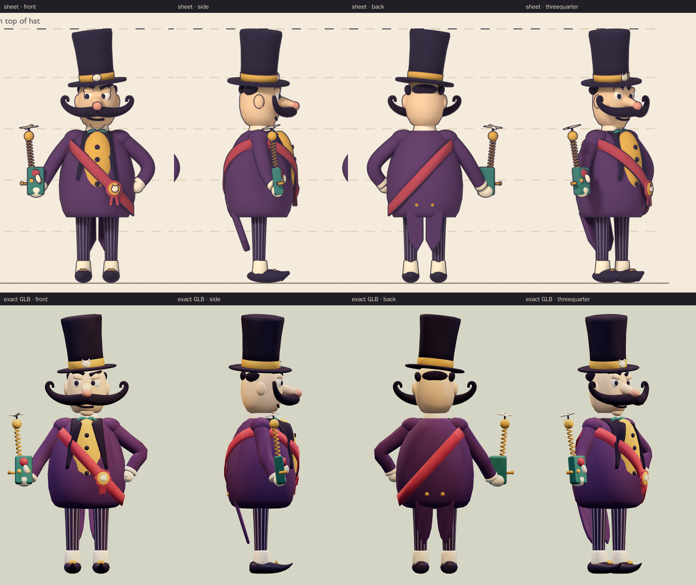
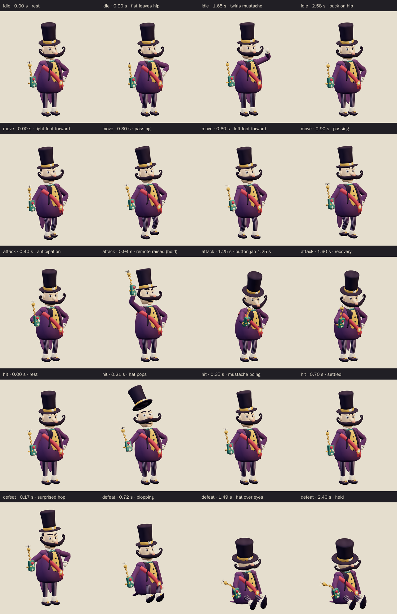
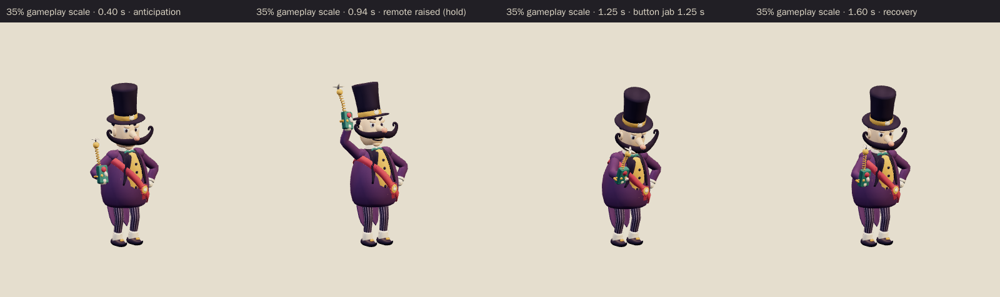

# Rival Mayor · v001

**Awaiting Tom's review · used in the family release.** This pompous schemer from the next town over is the World A chapter 2 boss candidate from [the locked era roster](../../../designs/026-personal-era-casts.md). His tall stovepipe hat, huge curly mustache, pear-shaped tailcoat and very skinny pinstripe legs make a big, round silhouette. The spring-antenna remote in his right hand is the joke: it never quite does what he wants. The World A chapter spec calls him Mayor Humdrum.

**Source: Blender reference sheet, no generated concept.** No image-generation model was used for this asset. Following [PRD-004 Q-07](../../../prds/004-family-release.md#owner-decisions), the author first rendered a painted Blender reference sheet from the written brief, and the coordinator approved it on September 26 before any detailing.

[Reference sheet notes](../../media/rival-mayor/v001/reference-notes.md) · [Reference source record](../../media/rival-mayor/v001/source.json) · [Model provenance](../../media/rival-mayor/v001/provenance.json)

<figure><figcaption>Blender reference sheet, no generated concept</figcaption></figure>
<figure><figcaption>Exact v001 model</figcaption></figure>

<model-viewer src="../../media/rival-mayor/v001/rival-mayor.glb" poster="../../media/rival-mayor/v001/beauty.png" alt="Orbit the Rival Mayor and inspect his five animations" camera-controls touch-action="pan-y" data-quest-clips shadow-intensity="0.7" camera-orbit="155deg 75deg auto"></model-viewer>

[Download exact GLB](../../media/rival-mayor/v001/rival-mayor.glb) · [Editable Blender master](../../media/rival-mayor/v001/rival-mayor.blend) · [Reference blockout master](../../media/rival-mayor/v001/rival-mayor-blockout.blend) · [Artifact manifest](../../media/rival-mayor/v001/sha256-manifest.json)

<figure><figcaption>Front</figcaption></figure>
<figure><figcaption>Side</figcaption></figure>
<figure><figcaption>Back</figcaption></figure>
<figure><figcaption>Three-quarter</figcaption></figure>

The comparison above shows the sheet and the exact export at matching angles and one metric scale. The model follows the coordinator's sheet notes:

- It keeps the tall stovepipe hat, the curly mustache, the raspberry sash with its kitten rosette, the spring-antenna remote in his right hand and the pinstripe legs.
- The mustache is 12% larger than on the sheet, about 0.80 m tip to tip, so it reads at play distance.
- Small kitten badges on the hat band and the rosette tie him to his kitten crew.

The author departed from the sheet in three deliberate ways:

- The bind pose is the sheet pose (fist on hip, remote held out), not the A-pose the sheet notes suggested, so the rest stills match the approved views.
- The swallow tails tilt toward the calves, as in the sheet's side view.
- The preview renders colours darker than the sheet because of its tone mapping. The atlas uses the sheet's colour values exactly.

The author also fixed these problems along the way:

- The first pass had 17,214 triangles; the author reduced it to 14,548.
- The coat tails and heels first went below the floor in defeat.
- The idle glove first overlapped the mustache curl.
- The defeat arm first passed through the belly.
- The attack's contact pose moved so his face and the remote stay readable.

Seen edge-on from the side, the swallow tails are thin cloth panels; in the held defeat they lie flat behind him like a stick. His expression is smug rather than menacing, and the remote is a gadget, not a weapon.

| Exact exported model | Result |
| --- | --- |
| Size and placement | 1.336 m wide × 2.475 m tall to the hat top × 0.742 m deep at rest; the soles sit 4 mm above the floor. The hat pop reaches 2.590 m, and the attack thrust reaches 1.109 m in front of him. Metre scale, Y-up, forward −Z, floor-centered |
| Geometry | 14,548 triangles; one skin with 28 joints and at most two influences per vertex; two opaque material primitives |
| Texture | One original embedded 1024 × 1024 palette atlas; no external resource or required decoder |
| Download | 1,161,872 bytes; below the 2 MiB candidate budget |
| GLB SHA-256 | `0fecdd723ec735caa5761d1966e51ad03aec8025a4416bf08a599fa1677d516e` |
| Blender master SHA-256 | `53dbb763aacb5f6c4272f165d543168c2129fbd592453fd6b53cdb466175799a` |
| Reference sheet SHA-256 | `966bfd26ae6bb5f567d32b5528050d63d7f2634ef7af3e6e9b2abc5e2238f568` |

## Motion and checks

The viewer exposes `idle` (3.0 s), `move` (1.2 s), `attack` (2.0 s), `hit` (0.7 s) and `defeat` (2.4 s):

- **Idle:** a smug bob. His left fist leaves his hip to twirl a mustache tip, then returns.
- **Move:** a pompous strut with his chin up and fist on hip, while the remote swings and the coat tails flap.
- **Attack:** he pulls in, then raises the remote above his head as the propeller spins up. He holds that warning from 0.84 to 1.10 seconds, then thrusts the remote forward and jabs the big button at **1.25 seconds** before recovering to rest.
- **Hit:** his hat pops 17 cm off his head and the mustache boings.
- **Defeat:** a surprised hop, then he plops down onto his coat tails with his toes up. The hat slides down over his eyes, the antenna droops and the remote rests in his lap. The pose is held from about 1.73 seconds.

The clips leave the root stationary; gameplay controls travel and damage.

[Khronos validation](../../media/rival-mayor/v001/validation.json) reports zero errors, warnings, infos and hints. [Three.js inspection](../../media/rival-mayor/v001/three-inspection.json) reimported the exact GLB and exercised the real enemy animation adapter. It sampled all 12,583 exported vertices at 565 animation steps and passed all 29 checks:

- The root stays still, and rotation-only joints keep their pivots.
- The idle and move loops are seamless, and the defeat pose holds.
- No clip goes below the floor.
- The remote rises above his head and holds, then the button presses in 1 cm at contact.
- The hat pops on hit, and in the held defeat the hat covers his eyes while he sits.

The [attachment audit](../../media/rival-mayor/v001/attachment-inspection.json) checked 12 part pairs on every frame of every clip, including the tails against the legs, the remote against the body, head and hat, and the left fist against the head. It found no overlaps, and the limb joints stayed connected. [Chromium playback](../../media/rival-mayor/v001/browser-inspection.json) rendered changing frames for all five clips at normal and 35% scale with no page, console, HTTP or WebGL errors. [Author's visual notes](../../media/rival-mayor/v001/visual-review.json) and the [scene release](../../media/rival-mayor/v001/scene-release.json) record the corrections and the released Blender scene.

The catalog intake checked all 125 local artifact hashes against the manifest. It reran the Three.js inspection against the current enemy animation adapter and got identical results. The attack clip's last frame differs from its first only in the propeller's spin angle.

The browser evidence uses software Chromium. Physical iPad/iPhone Safari, device frame time and combat feel remain owner checks. This package contains visual animations only; the remote has no new audio file.

## Provenance and release

Claude Opus 5.5 (`claude-opus-5-5`, effort `xhigh`) authored both stages through Blender 4.5.13 under [WO111](../../../../.agents/work-orders/111-era-cast-art-lead.md), under Tom's September 26 ruling. It built the procedural blockout and rendered the reference sheet on the first Blender authoring service. After the coordinator approved the sheet, it built the final topology, atlas, 28-bone rig and all five clips on the second service, holding an exclusive scene lease from 14:22 to 15:00 UTC. No family photograph, personal likeness, downloaded franchise model, logo or audio was used. The [sheet-stage records](../../media/rival-mayor/v001/sheet-stage/README.md) keep the sheet's own lease, release and manifest. The source scripts live in `scripts/assets/rival-mayor/v001/`.

[PRD-004 Q-03](../../../prds/004-family-release.md#owner-decisions) permits this candidate in the family release before Tom's review. For now, the World A template `family-world-a@v1` fills the chapter 2 boss slot with a neutral placeholder. The coordinator will register this exact version in a later parody catalog before it appears in levels. Tom's exact-version decision is **pending**. A rejection returns that slot to a placeholder or prior version; catalog inclusion and technical checks do not constitute approval.
