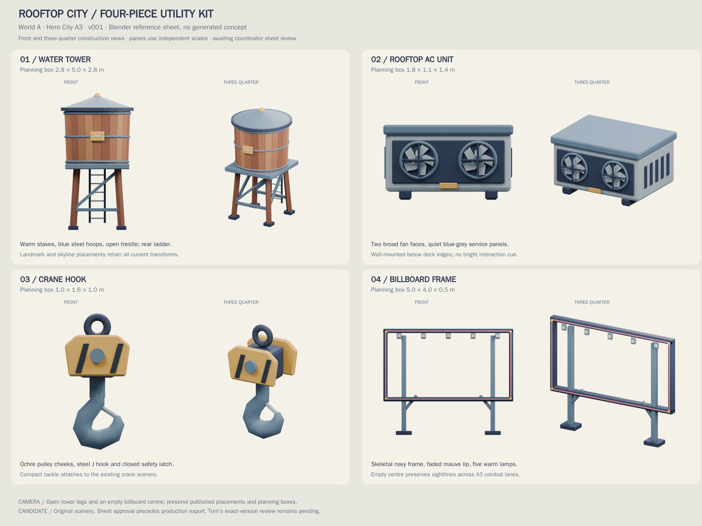
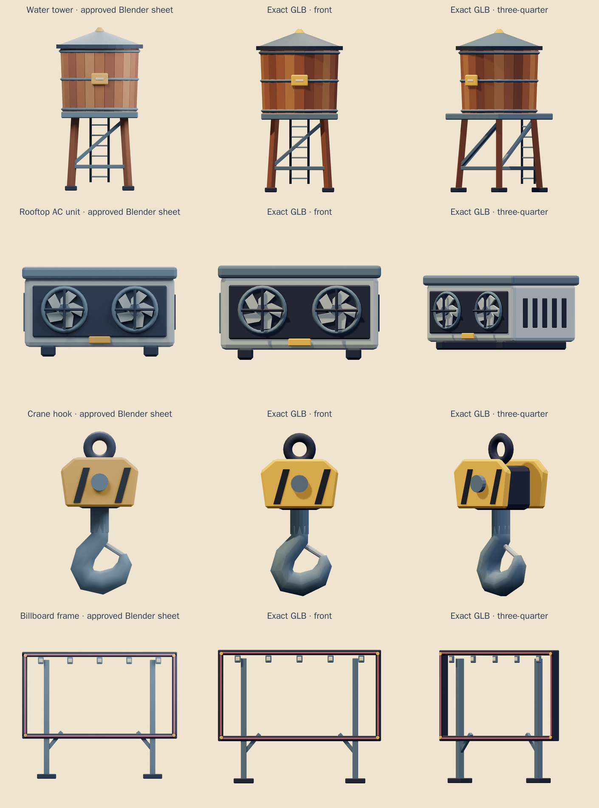
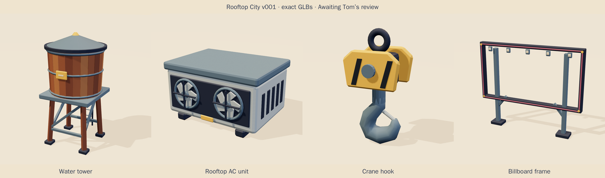
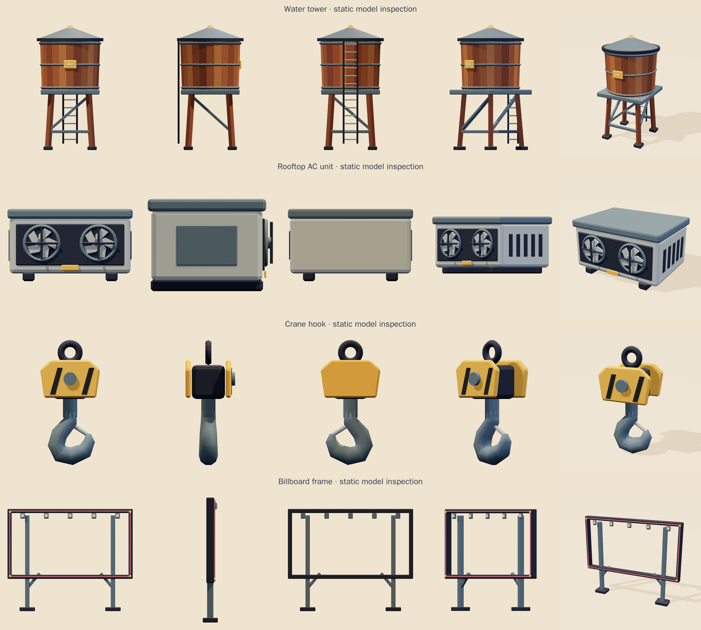
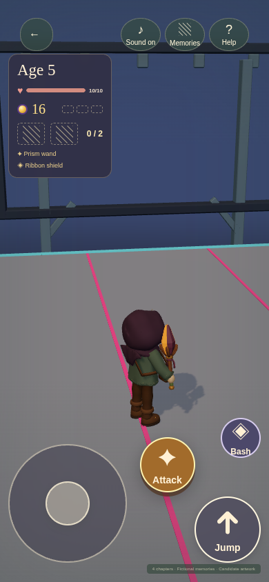
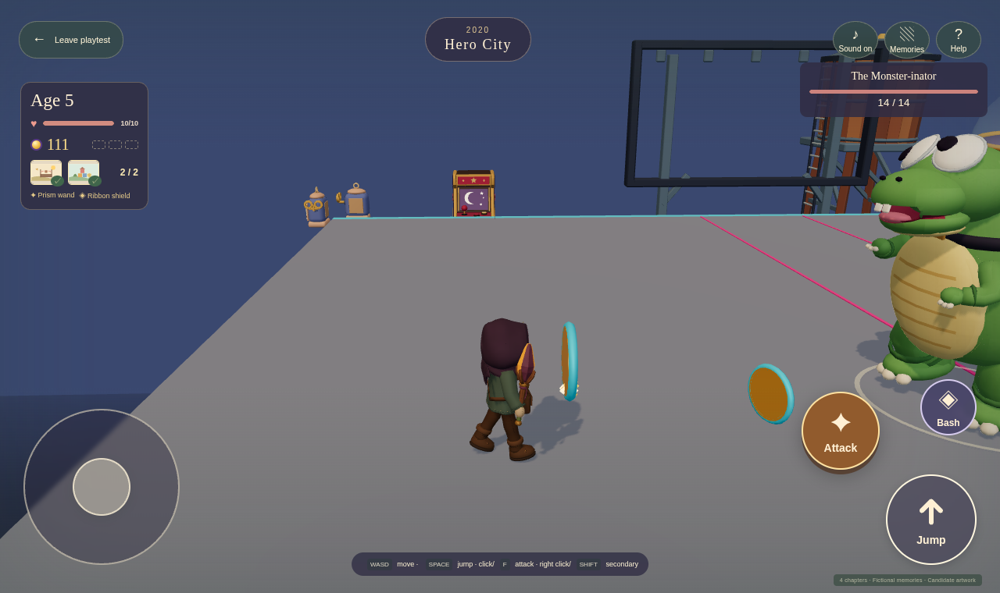

# Rooftop City kit · v001

**Awaiting Tom's review · used in the family release.** Four original static scenery props replace Hero City's water-tower, rooftop AC, crane-hook and billboard stand-ins. The `rooftop` theme pins these exact GLBs and hashes. All four planning boxes and all 50 published A3 placements stay unchanged.

[PRD-004 Q-03](../../../prds/004-family-release.md) permits labeled private candidates before Tom's exact-version review. The coordinator approved the Blender reference sheet before production and the exact exported models on September 29. Tom's decision remains **pending**.

## Reference and exact models

This is a **Blender reference sheet, with no generated concept**. Warm timber, faded blue-grey equipment and navy steel make one utility kit. Small honey and mauve accents stay quieter than the game's pickups. The water-tower trestle and billboard centre remain open. The hook is hanging tackle for the course's existing crane structure; it does not replace the moving crane obstacle.

[Reference record](../../media/rooftop-city-kit/v001/source.json) · [Authoring brief](../../media/rooftop-city-kit/v001/prompt.txt) · [Provenance](../../media/rooftop-city-kit/v001/provenance.json) · [Model notes](../../media/rooftop-city-kit/v001/model-notes.md)

{ loading=lazy }

{ loading=lazy }

## Four exact props

### Water tower {#water-tower}

Broad wooden staves, three blue steel hoops and a shallow roof give the tank a clear skyline silhouette. Four splayed timber legs, open braces and a rear ladder preserve the space below it. A small blank service plaque carries no borrowed identity. A3 uses 21 instances across landmarks and skyline blocks.

<model-viewer src="../../media/rooftop-city-kit/v001/water-tower.glb" poster="../../media/rooftop-city-kit/v001/stills/water-tower-beauty.png" alt="Orbit the exact water tower v001" camera-controls touch-action="pan-y" shadow-intensity="0.7"></model-viewer>

[Download water tower GLB](../../media/rooftop-city-kit/v001/water-tower.glb)

### Rooftop AC unit {#rooftop-ac-unit}

Two large fan faces, crossed guards, side vents and a blue service cap make this low utility box readable at gameplay distance. The 16 existing wall placements stay below deck edges. Its small caution plaque is decoration, not an interaction cue.

<model-viewer src="../../media/rooftop-city-kit/v001/rooftop-ac-unit.glb" poster="../../media/rooftop-city-kit/v001/stills/rooftop-ac-unit-beauty.png" alt="Orbit the exact rooftop AC unit v001" camera-controls touch-action="pan-y" shadow-intensity="0.7"></model-viewer>

[Download rooftop AC GLB](../../media/rooftop-city-kit/v001/rooftop-ac-unit.glb)

### Crane hook {#crane-hook}

Ochre pulley cheeks, two dark caution stripes and a rounded steel J hook form compact hanging tackle. A closed safety latch and broad top shackle finish the silhouette. Five fixed scenery instances attach to the existing crane mast and jib placements. This is static scenery; the course's moving hazard is unchanged.

<model-viewer src="../../media/rooftop-city-kit/v001/crane-hook.glb" poster="../../media/rooftop-city-kit/v001/stills/crane-hook-beauty.png" alt="Orbit the exact crane hook v001" camera-controls touch-action="pan-y" shadow-intensity="0.7"></model-viewer>

[Download crane hook GLB](../../media/rooftop-city-kit/v001/crane-hook.glb)

### Billboard frame {#billboard-frame}

A narrow navy frame, faded mauve edge and five warm lamp lenses surround an empty centre. The lamps use opaque colour with no glow effect. Two steel posts and short knee braces keep the silhouette light. All eight placements retain their 1.1× scale and original positions; the frame leaves chase-camera sightlines open across the arenas.

<model-viewer src="../../media/rooftop-city-kit/v001/billboard-frame.glb" poster="../../media/rooftop-city-kit/v001/stills/billboard-frame-beauty.png" alt="Orbit the exact billboard frame v001" camera-controls touch-action="pan-y" shadow-intensity="0.7"></model-viewer>

[Download billboard frame GLB](../../media/rooftop-city-kit/v001/billboard-frame.glb)

{ loading=lazy }

These props have no animation clips. The contact sheet supplies static inspection views in place of a motion sheet.

## Bounds and budgets

Roots are floor-centred, with glTF +Y up and front +Z. Tight measurements are separate from the unchanged registry planning boxes. No frozen world template, placement, collision geometry, save or friendly roster is edited by this kit.

| Prop | Tight width × height × depth, m | Planning box, m | Triangles | Materials | GLB bytes |
| --- | --- | --- | ---: | ---: | ---: |
| Water tower | 2.600 × 4.895 × 2.600 | 2.8 × 5 × 2.8 | 2,960 | 2 | 180,172 |
| Rooftop AC | 1.780 × 1.030 × 1.395 | 1.8 × 1.1 × 1.4 | 1,496 | 1 | 88,880 |
| Crane hook | 0.754 × 1.586 × 0.629 | 1 × 1.6 × 1 | 880 | 1 | 43,912 |
| Billboard frame | 4.880 × 3.990 × 0.480 | 5 × 4 × 0.5 | 1,552 | 1 | 122,480 |

Every model is below 5,000 triangles and 1.5 MiB, uses at most two opaque vertex-colour materials, and needs no texture, external buffer or decoder. [Exact bounds](../../media/rooftop-city-kit/v001/bounds.json) · [Construction record](../../media/rooftop-city-kit/v001/construction.json)

## A3 route and camera check

The synthetic A3 v5 run completed all 36 route legs, five fights and three memories with zero recoveries and no page, console or response errors. Twelve additional camera views used ordinary camera drags at reached route checkpoints, in 1280×760 and 390×844 viewports. The test preserved player state and every placement. The current v6 template retains the identical scenery placements; the registry test checks both frozen versions.

{ loading=lazy width=390 }

{ loading=lazy }

[Route report](../../media/rooftop-city-kit/v001/a3-camera/report.json) · [Camera probes](../../media/rooftop-city-kit/v001/a3-camera/camera-probes.json) · [Exact browser capture record](../../media/rooftop-city-kit/v001/stills/browser-inspection.json)

The route used a lockstep clock and suppressed software drawing between full screenshots while retaining simulation, inputs and combat. It establishes this route and asset integration, not real-time frame cost or physical Safari feel. Phone viewport emulation is not a physical-device playtest.

## Source and review evidence

The editable master keeps the original component meshes, evaluated coloured parts and four joined export meshes. The approved reference master is retained separately. Earlier unreviewed framing and stave trials remain in the authoring history; they were never production exports.

- [Editable production master](../../media/rooftop-city-kit/v001/rooftop-city-kit.blend)
- [Approved reference master](../../media/rooftop-city-kit/v001/sheet-stage/rooftop-city-kit-reference.blend)
- [Rebuild instructions](../../media/rooftop-city-kit/v001/source/README.md)
- [Khronos validation: zero errors and warnings](../../media/rooftop-city-kit/v001/validation.json)
- [Blender exact-byte reimport](../../media/rooftop-city-kit/v001/reimport.json)
- [Three.js loader and all 50 placements](../../media/rooftop-city-kit/v001/three-inspection.json)
- [Coordinator's exact-version record](../../media/rooftop-city-kit/v001/visual-review.json)
- [Scene release and predecessor preservation](../../media/rooftop-city-kit/v001/scene-release.json)
- [SHA-256 manifest](../../media/rooftop-city-kit/v001/sha256-manifest.json)
- [Final checks and limitations](../../media/rooftop-city-kit/v001/final-verification.json)

No external art, copied logo, family photograph, private identifier or likeness was used. Blender instance 2 was saved and released on September 29 with all 78 predecessor master/export hashes unchanged. **Tom's review of these exact v001 files remains pending.**
