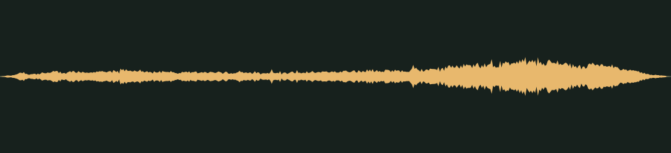

# Did it just move? · v001

**Audio candidate · scary moments · in the family worlds’ scary chapters · listening review pending.** An old servo whining and creaking, for an animatronic that moved while you weren't looking.

## Audition

<audio controls preload="none" aria-label="Audition servo-creak version one">
  <source src="../../media/servo-creak/v001/cue.wav" type="audio/wav">
  <a href="../../media/servo-creak/v001/cue.wav">Download the processed cue</a>
</audio>

[Processed cue](../../media/servo-creak/v001/cue.wav) · [Original five-second take](../../media/servo-creak/v001/source.wav)

## Exact version

| Property | Measured result |
| --- | --- |
| Stable cue / version | `servo-creak` / `v001` |
| Duration | 0.80 seconds |
| Format | PCM signed 16-bit WAV, stereo, 44.1 kHz |
| Download size | 141,164 bytes |
| Peak / RMS | -11.0 / -26.476 dBFS |
| Clipped samples | 0 |
| Processed SHA-256 | `57b4353d22a9cb5b0579c204b653f1223b1b1a0d5b57b1d218e5927a56b5232f` |
| Source SHA-256 | `f79377d703d1803d7257a9f43be441630cd1e1de09253620131c3cad7c3fc235` |

Processing selects the segment beginning at 0.160 seconds, trims it to the stated duration, applies a 0.030-second entrance and 0.050-second exit fade, then normalizes its peak. The take is quiet (its peak is -20.4 dBFS), so leveling raises it by 9.4 dB. It is a one-shot cue, not a loop. The source is preserved separately. [Exact recipe](../../media/servo-creak/v001/processing.json), [measurements](../../media/servo-creak/v001/verification.json), and [reproducible processing script](../../../../scripts/assets/audio/process_cues.py).

## Source and checks

Generated on 2026-09-26 by a Claude Code subagent (Opus 5.5) from the workflow coordinator's cue brief, using the separate Stable Audio 3 Small-SFX CPU service (service version 0.2.0). This take used seed 302, eight steps and five seconds. It contains no supplied recording or personal reference. The [provenance record](../../media/servo-creak/v001/provenance.json) retains the complete prompt, service/model revisions, every other attempt and the source terms recorded in [DESIGN-008](../../../designs/008-audio-pipeline.md). The source code, model and redistributed text component have separate terms; no broader license is asserted here.

The service and download SHA-256 checks passed, as did WAV decoding and the exact-duration, non-silence and zero-clipping checks. Re-running the processing script reproduced the same output. These measurements do not establish timbre or musical quality.

## Listen-proxy check

Nobody has listened to this take; the agent cannot hear audio. Instead, it measured the source's level in 20 ms windows, a rough autocorrelation pitch track, the zero-crossing rate and a four-band energy split, and chose the segment from those numbers. The take holds three separate movements with silence between them; the cue uses the first. It is a strained, periodic whine with a rough pitch between about 200 and 290 Hz and most of its energy in harmonics at 1–4 kHz. The level rises about 12 dB to a peak at 0.63 seconds, then falls away. In the source this movement stops abruptly at 0.96 seconds, where the segment ends.

Energy split of the processed cue: 8.6% below 300 Hz, 35.5% at 300 Hz–1 kHz, 49.8% at 1–4 kHz and 6.1% above 4 kHz. These numbers hint at shape and brightness; they cannot say how the cue sounds.

## Coordinator and owner review

Review focus: Whether it sounds like an old machine that moved on its own, creepy rather than comic.

- **Coordinator technical intake:** Passed numerically; listening/creative selection pending.
- **Tom’s decision:** Pending, against the exact hash above.
- **Gameplay integration:** Registered in the game's scare cue manifest for [DESIGN-027](../../../designs/027-scare-pass.md) watchers: it plays once when an animatronic that moved while unseen comes back into view, at scare level 1 and up. `family-world-a@v4` sets Hero City (A3) to level 1 and Rat Casino After Hours (A4) to level 2, and `family-world-b@v4` sets Besties’ Big Stage (B3) to level 1. Nobody has heard it in the game yet, and Tom’s exact-version review still decides final use. At gain 1.2 it peaks near -11.4 dBFS at the default master, in the range of the other one-shots, with one instance at a time. [DESIGN-008](../../../designs/008-audio-pipeline.md#scary-moments-cues) records the manifest; the inventory records it as a private candidate.

## Retained attempts

The first take was usable. A second was generated to look for a sharper creak and was not selected. It is dull, with almost no energy above 4 kHz (0.1%), and its first 0.4 seconds are a low whirr with about 80% of the energy below 300 Hz, likely to vanish on tablet and phone speakers.

- [Source attempt 2](../../media/servo-creak/v001/source-attempt-2.wav) (seed 312) with its [measurements](../../media/servo-creak/v001/source-attempt-2-verification.json)

The prompts, seeds and job IDs of every attempt are in the provenance record. These decisions rest on measurements, not on listening.
