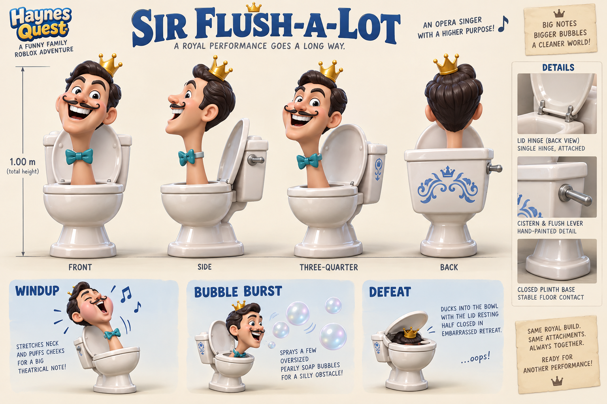

# Sir Flush-a-Lot

**Recognizable Skibidi Toilet parody · v001 concept · Model pending**

A toilet with a human head believes he is an opera superstar. The crown, bow tie and enormous soap-bubble notes make his performance more ridiculous than regal.

[Exact prompt](../../media/sir-flush-a-lot/v001/prompt.txt) · [Concept provenance and checksum](../../media/sir-flush-a-lot/v001/concept-provenance.json)

## Intended encounter

An exaggerated neck stretch and puffed cheeks announce a short bubble burst. Step clear of the warning, then strike while the singer catches his breath. Defeat sends him into an embarrassed retreat beneath his hinged lid.

## Construction review

One head, one bowl, a rear cistern, a connected lid hinge and a closed stable base. The crown and bow tie remain attached. Measure the full 1.00 m height including the crown, independently of the illustration’s approximate dimension line.

The original Skibidi Toilet reference and its 2023 popularity predate the second fixture’s January 2024 photo. The [period evidence](../../../../.agents/work-orders/022-parody-period-evidence.md) records primary sources and distinguishes availability from popularity.

The lead generated and inspected this concept using the built-in image tool. No family images were submitted. This is a selected direction for modeling, not an exported model or deployed enemy. Tom’s exact-version review remains pending.

