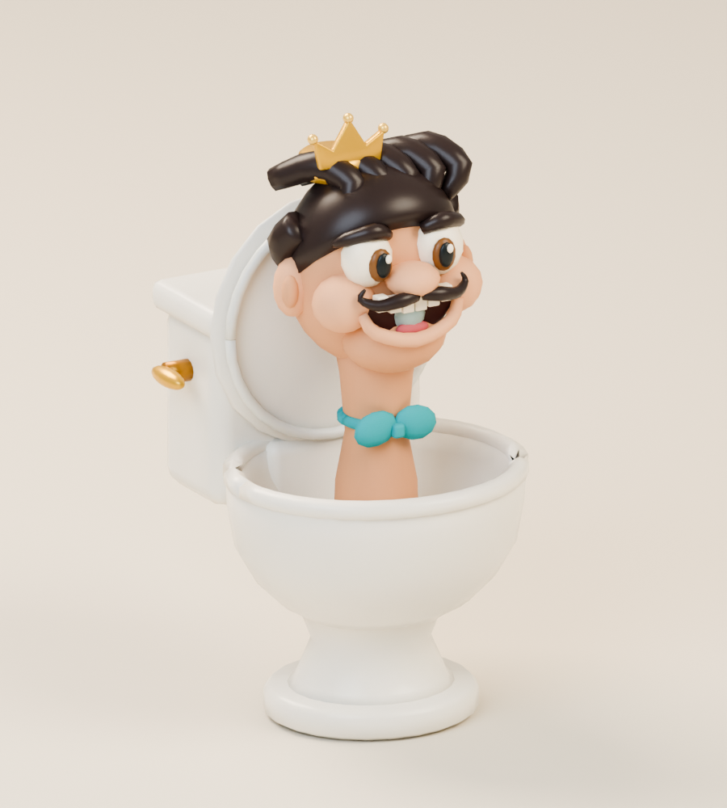
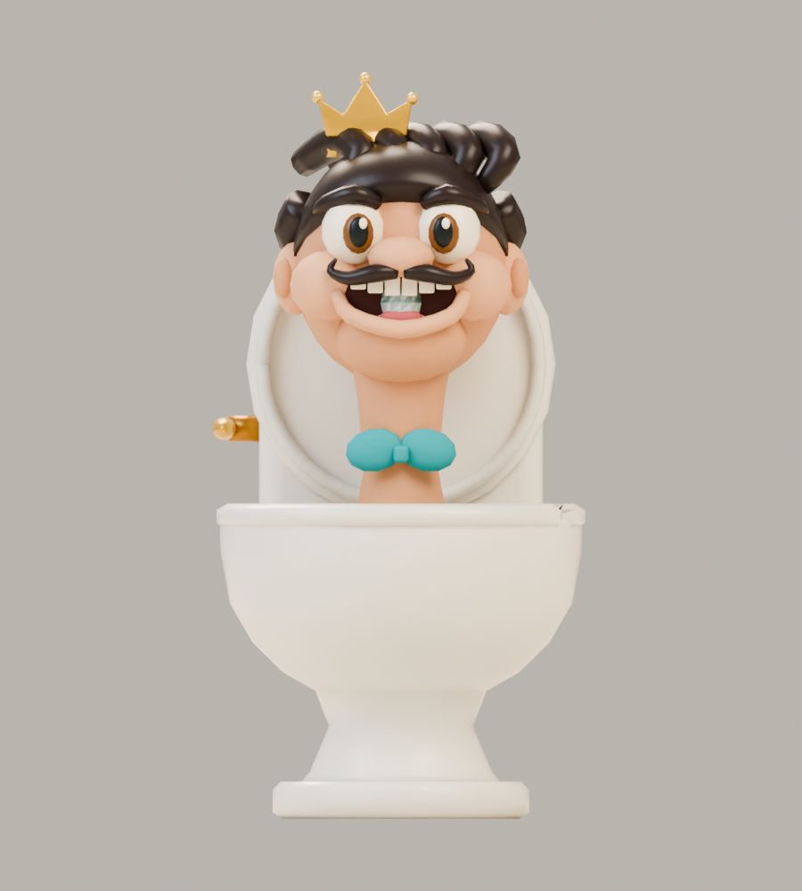
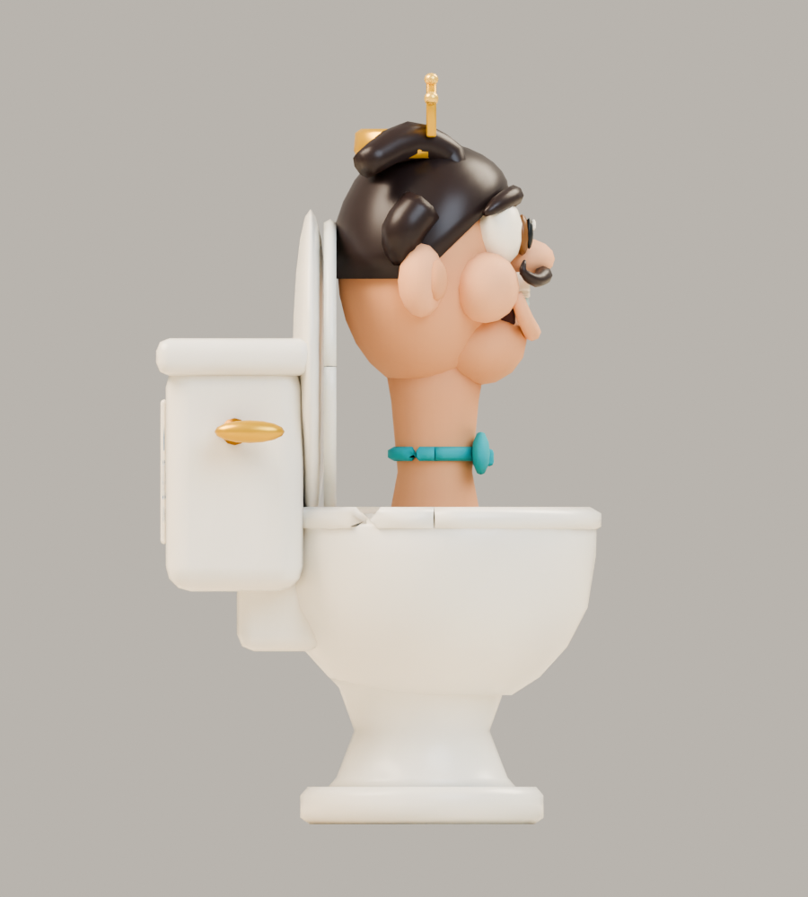
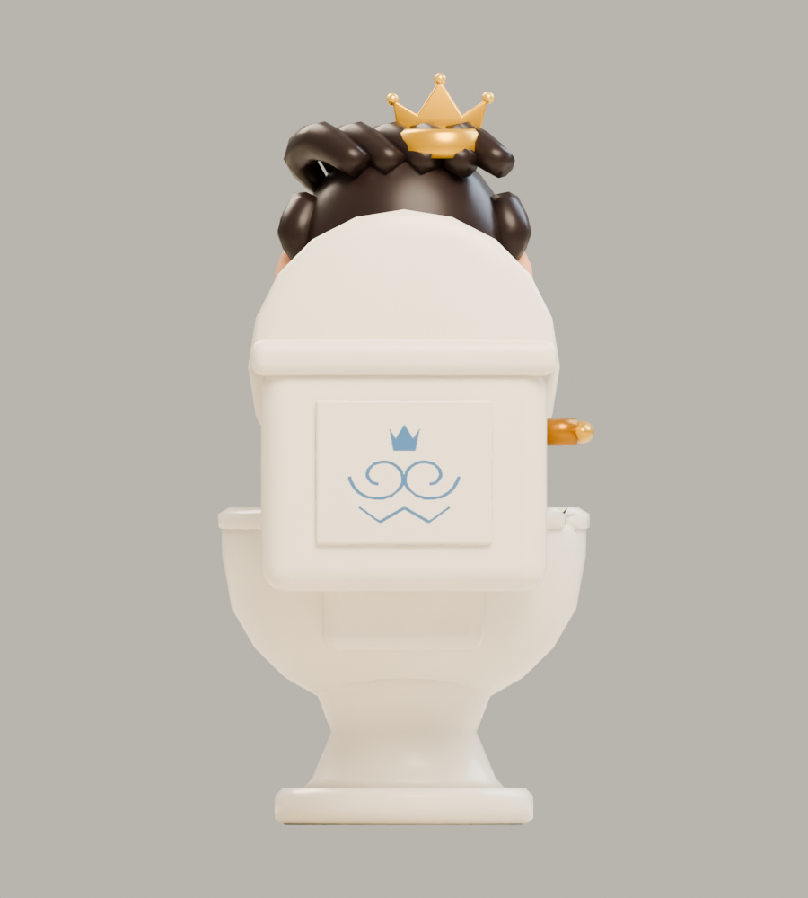

# Sir Flush-a-Lot

**Recognizable Skibidi Toilet parody · v001 model candidate · Tom’s review pending**

A toilet with a human head believes he is an opera superstar. His crown, turquoise bow tie and soap-bubble notes make his performance more ridiculous than regal. This completed candidate is an optional catalog choice; it is not a mandatory enemy for either child.

## Concept and exported model

<figure><figcaption>Selected construction reference.</figcaption></figure>
<figure><figcaption>Exact v001 GLB, re-imported for this render.</figcaption></figure>

The exported model has one cartoon head and neck, a clean ceramic bowl and cistern, a stable pedestal, and a connected hinged lid. The crown and bow tie remain attached. His final duck was corrected so the lid clears his head, hair and crown.

<model-viewer src="../../media/sir-flush-a-lot/v001/sir-flush-a-lot.glb" poster="../../media/sir-flush-a-lot/v001/front.png" alt="Orbit Sir Flush-a-Lot" camera-controls touch-action="pan-y" data-quest-clips shadow-intensity="0.7" camera-orbit="155deg 75deg auto"></model-viewer>

[Download model](../../media/sir-flush-a-lot/v001/sir-flush-a-lot.glb) · [Exact manifest and editable sources](../../media/sir-flush-a-lot/v001/manifest.json) · [Concept prompt](../../media/sir-flush-a-lot/v001/prompt.txt) · [Concept provenance](../../media/sir-flush-a-lot/v001/concept-provenance.json)

<figure><figcaption>Front</figcaption></figure>
<figure><figcaption>Side</figcaption></figure>
<figure><figcaption>Back</figcaption></figure>

## Motion and encounter

<video controls playsinline preload="metadata" poster="../../media/sir-flush-a-lot/v001/motion-grid.png" aria-label="Sir Flush-a-Lot five-clip reel"><source src="../../media/sir-flush-a-lot/v001/animations.mp4" type="video/mp4"><a href="../../media/sir-flush-a-lot/v001/animations.mp4">Download motion reel</a></video>

An exaggerated neck stretch announces a short bubble burst. Step clear of the warning, then strike while the singer catches his breath. Defeat sends him into an embarrassed retreat beneath his partly lowered lid.

The viewer offers **idle, move, attack, hit and defeat**. Attack lasts 1.6 seconds, with bubble contact at 1.0 seconds. The world root stays fixed; the game supplies movement. Idle and move repeat; other clips hold their final pose. No sound is embedded.

[Idle](../../media/sir-flush-a-lot/v001/idle.mp4) · [Move](../../media/sir-flush-a-lot/v001/move.mp4) · [Attack](../../media/sir-flush-a-lot/v001/attack.mp4) · [Hit](../../media/sir-flush-a-lot/v001/hit.mp4) · [Defeat](../../media/sir-flush-a-lot/v001/defeat.mp4) · [Turntable](../../media/sir-flush-a-lot/v001/turntable.mp4)

## Exact candidate

| Check | Result |
| --- | --- |
| Scale | 1.00 m including crown; base at ground level; meters, Y-up, forward −Z |
| Geometry | 14,676 triangles; 5 opaque material primitives; 13 joints |
| Download | 782,488 bytes; original embedded texture, no external resources |
| SHA-256 | `c4db8f231fcdb29d71ddc605df89b928ef0aeaa29b91af3b1e3041041f0cdf49` |

[Format validation](../../media/sir-flush-a-lot/v001/validation.json) · [Construction survival](../../media/sir-flush-a-lot/v001/construction-survival.json) · [Pose and clearance checks](../../media/sir-flush-a-lot/v001/pose-check.json) · [Three.js checks](../../media/sir-flush-a-lot/v001/three-inspection.json) · [Browser evidence](../../media/sir-flush-a-lot/v001/browser-inspection.json)

The author checked actual exported animation, physical attachments, the stable root and lid clearance. The selected model passed format, Three.js and isolated WebGL checks. All 39 artifact/master transfers and 15 source roundtrips matched their hashes. Review videos decoded successfully; their rendering rate is not a physical-device performance measurement.

## Source and review

A fresh native GPT-6 Astra at max authored the model from the lead’s serially generated concept. No family references or downloaded models/textures were used. Editable masters and their exact hashes are in the manifest; the immutable [source record](../../media/sir-flush-a-lot/v001/authoring-source.json) identifies the inputs used for this export. [Production evidence](../../../../.agents/work-orders/032-blender-remix-trio-evidence.md).

The original reference predates the January 2024 fixture photo; [period evidence](../../../../.agents/work-orders/022-parody-period-evidence.md) distinguishes availability from popularity. The lead inspected the front, back, quarter, contact, followthrough and corrected duck sequence and selected the candidate. Combined catalog/gameplay delivery, physical iPhone/iPad checks and owner approval remain separate. This model has not entered the private live game.

**Tom’s decision:** Pending.
