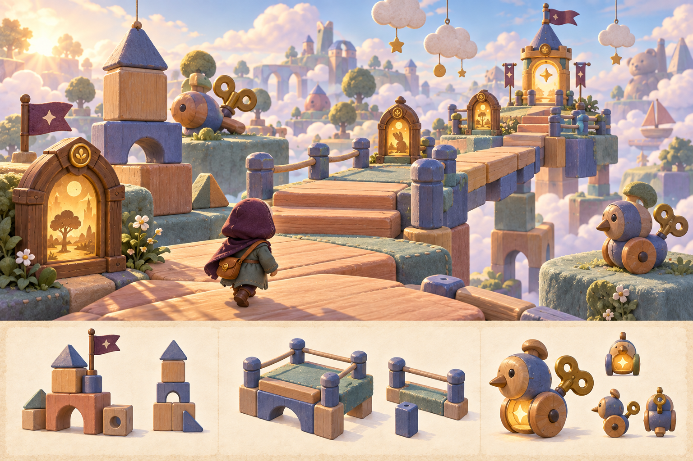
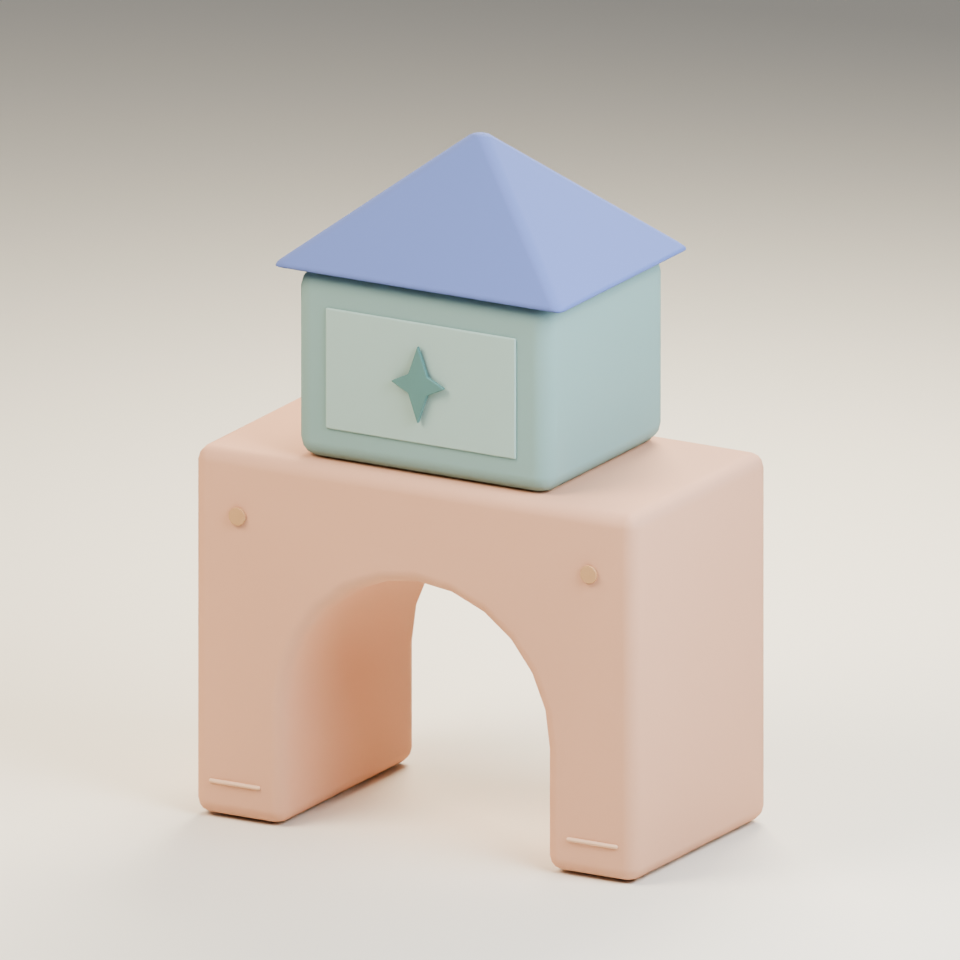
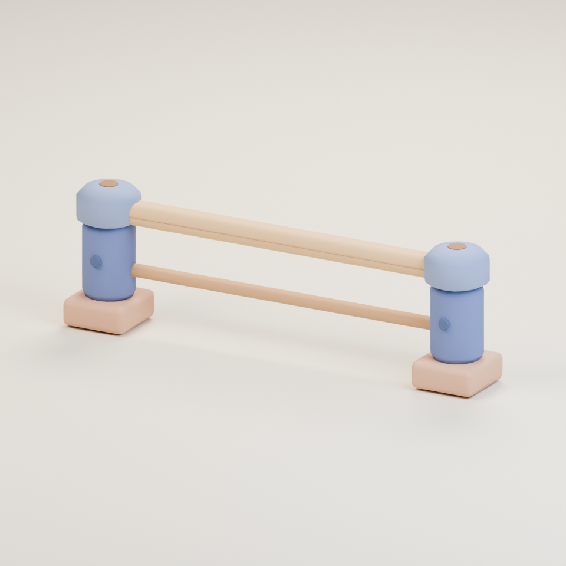
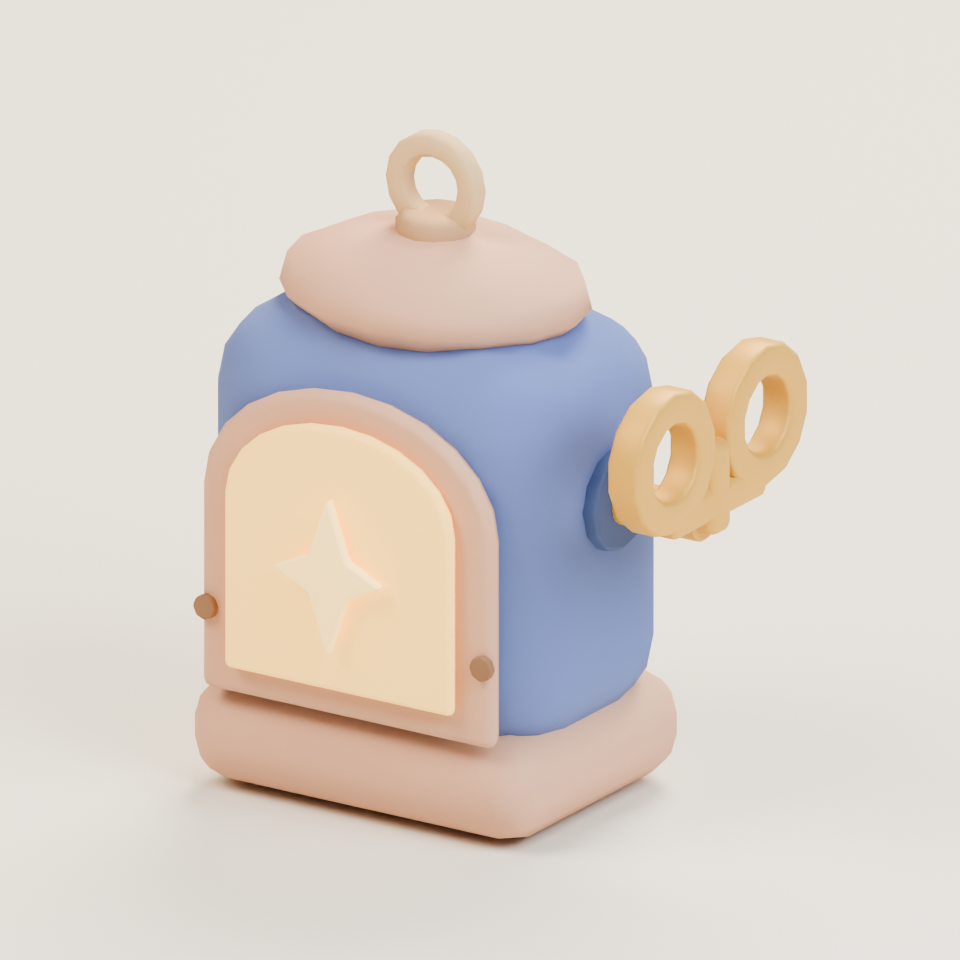
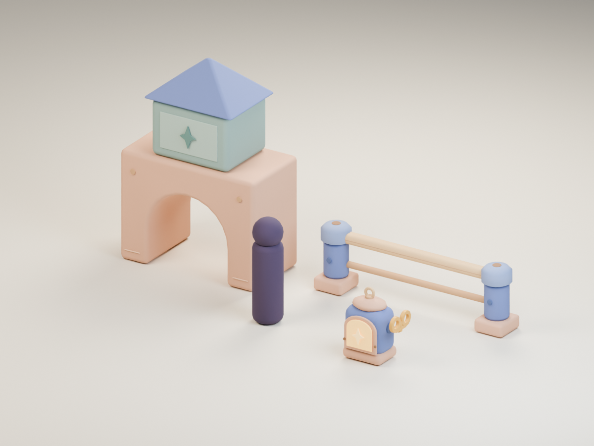

# Skyline toybox kit · v001

**Three completed environment model candidates · Ready for Tom · In the private family worlds as scenery.** The coordinator selected the source concept and inspected the exact exported assembly. Tom's versioned review remains open.

Broad landings, low early steps and visible catch areas set this world's forgiving obby direction. The block tower, cushioned rail and wind-up lantern give the toybox a different silhouette from the garden and arcade. These GLBs are separate studio candidates; the editor currently draws procedural toybox scenery. The wind-up lantern is scenery and a light, not an enemy or friendly creature.

[Exact concept prompt](../../media/skyline-toybox-kit/v001/prompt.txt) · [Concept source and checksum](../../media/skyline-toybox-kit/v001/source.json) · [Shared art direction](../../art-direction.md)

## The three models

### Block tower {#block-tower}

A peach play arch supports a mint block and soft blue roof. The open lower arch preserves the concept's stacked toy silhouette. It measures 1.700 × 2.377 × 0.912 m (width × height × depth).

<model-viewer src="../../media/skyline-toybox-kit/v001/block-tower.glb" poster="../../media/skyline-toybox-kit/v001/block-tower-beauty.png" alt="Orbit the Skyline toybox block tower candidate" camera-controls touch-action="pan-y" shadow-intensity="0.7"></model-viewer>

[Download block tower GLB](../../media/skyline-toybox-kit/v001/block-tower.glb) · [Side view](../../media/skyline-toybox-kit/v001/block-tower-side.png) · [Actual browser view](../../media/skyline-toybox-kit/v001/block-tower-browser.png)

### Safety rail {#safety-rail}

Two rounded blue posts and two honey wooden rails frame a 2.400 × 0.756 × 0.380 m segment. It is a visual rail candidate; safe platform-edge placement and collision remain to be designed.

<model-viewer src="../../media/skyline-toybox-kit/v001/safety-rail.glb" poster="../../media/skyline-toybox-kit/v001/safety-rail-beauty.png" alt="Orbit the Skyline toybox safety rail candidate" camera-controls touch-action="pan-y" shadow-intensity="0.7"></model-viewer>

[Download safety rail GLB](../../media/skyline-toybox-kit/v001/safety-rail.glb) · [Side view](../../media/skyline-toybox-kit/v001/safety-rail-side.png) · [Actual browser view](../../media/skyline-toybox-kit/v001/safety-rail-browser.png)

### Wind-up lantern {#windup-lantern}

The small blue-and-peach lantern has a warm star face, a top ring and a visible honey key. It measures 0.659 × 0.814 × 0.427 m. Its light does not require bloom.

<model-viewer src="../../media/skyline-toybox-kit/v001/windup-lantern.glb" poster="../../media/skyline-toybox-kit/v001/windup-lantern-beauty.png" alt="Orbit the Skyline toybox wind-up lantern candidate" camera-controls touch-action="pan-y" shadow-intensity="0.7"></model-viewer>

[Download wind-up lantern GLB](../../media/skyline-toybox-kit/v001/windup-lantern.glb) · [Side view](../../media/skyline-toybox-kit/v001/windup-lantern-side.png) · [Actual browser view](../../media/skyline-toybox-kit/v001/windup-lantern-browser.png)

**Gameplay use (private candidate).** The exact v001 lantern is registered as the shared theme-kit prop `toybox-windup-lantern` (DESIGN-025 D-05). Clubhouse to Casino (`family-world-a@v1` and `@v2`, same decor) places it in its first three chapters, and The Magic House, chapter 2 of Playroom to Big Stage (`family-world-b@v1`), places it 27 times as floating candle scenery beside the lanes. Decor has no collision. If the model fails to load, its procedural fallback draws instead. This records use in the private family release, not Tom's approval.

## Technical record

| Exact export | Triangles | Materials | Bytes | SHA-256 |
| --- | ---: | ---: | ---: | --- |
| Block tower | 1,324 | 1 | 33,728 | `f7d9109a3f39a52db248423b680344393d94471b3420838c5bf717de243531e4` |
| Safety rail | 1,532 | 1 | 38,988 | `fd5b45ac33852017c51a46877e85b7bbb2c25edff6f362b8e8451a32ab5d4f7d` |
| Wind-up lantern | 2,664 | 3 | 68,200 | `fc6bdef3e83df930abc7cdaf4d898a8e4bed0c1476f7496fb3ff3aa54ac33948` |

Each GLB is static, Y-up, floor-centered and self-contained, with vertex colors, no texture image and no required external decoder. Khronos glTF Validator reports zero errors or warnings for each. Chromium 153 loaded and visibly rendered each exact exported GLB with the bundled model viewer; observed bounds, materials and hashes matched the reports, with no page, console or request errors. This desktop check does not establish physical Safari quality or gameplay frame time.

[Export measurements and validator summary](../../media/skyline-toybox-kit/v001/glb-measurements.json) · [Browser report](../../media/skyline-toybox-kit/v001/browser-report.json) · [Block validator](../../media/skyline-toybox-kit/v001/block-tower-validator.json) · [Rail validator](../../media/skyline-toybox-kit/v001/safety-rail-validator.json) · [Lantern validator](../../media/skyline-toybox-kit/v001/windup-lantern-validator.json) · [Render settings](../../media/skyline-toybox-kit/v001/render-settings.json)

## Source and coordinator intake

The driving GPT-6 Astra generated and selected this public-safe concept on September 23, 2026 using the project's existing [storybook clearing and prop sheet](../storybook-reference/v001.md). A fresh native GPT-6 Astra at max built the model kit in Blender 4.5.13 LTS. No family photo, real person or outside franchise asset was used. The image tool supplied no seed.

Editable master: `haynes-quest/skyline-toybox-kit/v001/skyline-toybox-kit.blend` on the dedicated Blender authoring PVC, 1,848,058 bytes, SHA-256 `dcfcac4a9360529edd6d818827db7b0f3bd9d75534c0b49a5ac5b245358ae1f3`. Retrieve it from the service's `/artifacts/haynes-quest/skyline-toybox-kit/v001/skyline-toybox-kit.blend` route and verify the checksum.

[Source construction script](../../media/skyline-toybox-kit/v001/build-kit.py) · [Render script](../../media/skyline-toybox-kit/v001/render-kit.py) · [Construction measurements](../../media/skyline-toybox-kit/v001/construction-measurements.json) · [Remote artifact manifest](../../media/skyline-toybox-kit/v001/remote-artifacts.json) · [Scene release](../../media/skyline-toybox-kit/v001/scene-release.json) · [Authoring work order](../../../../.agents/work-orders/096-skyline-toybox-kit.md)

The block tower and rail use simpler painted surfaces than the illustrated world. The lantern's key and glow were corrected during technical intake. These candidates have no collision. The exact v001 files are placed as scenery in the private family world template Clubhouse to Casino (`family-world-a@v1` and `@v2`, same decor, PLAN-019): the block tower (58 placements) and the wind-up lantern (36) in its first three chapters, and the safety rail (23) in Hero City. Playroom to Big Stage (`family-world-b@v1`) places the wind-up lantern 27 times in The Magic House. The level validator keeps every placement out of walkable space, connection lanes and fight areas; a missing model draws its procedural stand-in.

## Tom's review

Please inspect the tower's scale and arch, the rail's rounded proportions and the lantern's star and key.

- **Decision / date:** Pending.
- **Approved version and checksums:** None.
- **Use:** Private family world scenery (`family-world-a@v1`/`@v2` and `family-world-b@v1` decor) since PLAN-019; this records use, not approval. Other private playtest courses still use procedural toybox scenery. Changed geometry or materials need a new candidate version before approval or integration.
