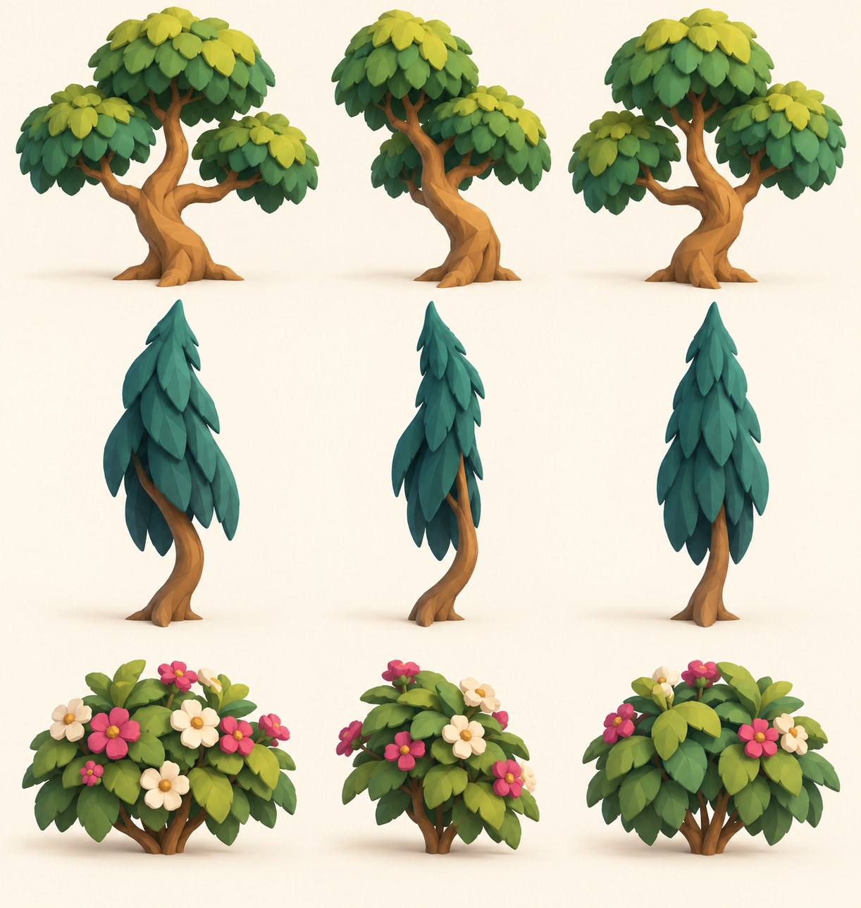

# Storybook planting kit · v001 construction concept

**Concept selected by the coordinator · Blender props in progress · Awaiting Tom's review.**

Three reusable silhouettes fill the empty sightlines beside the courses: a broad canopy tree with a crooked trunk, a slim layered cypress, and a low shrub with pink and cream flowers. The [world dressing direction](../../../designs/029-action-and-inhabited-worlds.md) groups them around garden pads or places them as theatrical and rooftop planting. Landing areas and enemy views stay clear.

The driving Codex session generated this original construction reference with OpenAI's built-in image tool on October 4, 2026. [The saved prompt](../../media/storybook-planting-kit/v001/prompt.txt) records the request. These are intended mesh shapes; this image is not a render of completed GLBs.

Claude Code Opus 5.5 (`claude-opus-5-5`, xhigh) authors the three props in Blender instance 2 after its enemy pack under [the work order](../../../../.agents/work-orders/20261004-opus-action-minions-b.md). Exact exports, budgets and engine evidence will be added on delivery. [PRD-004 Q-03](../../../prds/004-family-release.md#owner-decisions) permits checked candidates while Tom's studio review remains open.
