# Storybook planting kit · v001

**Draft for coordinator intake · awaiting Tom's exact-version review.** These
are three static, reusable vegetation props for DESIGN-029's planted spaces:

- a broad **canopy tree** about 4 m tall, with a crooked ochre trunk and three
  layered green and lime leaf crowns;
- a slim deep-teal **cypress** about 3 m tall, with a drooping, tapered crown;
- a low **flowering shrub** about 0.8 m tall, with broad leaves and raspberry and
  cream five-petal flowers.

They can be planted in groups beside safe route pads, with larger silhouettes
behind them ([DESIGN-029](../../../designs/029-action-and-inhabited-worlds.md)).
The family-release candidate permission in
[PRD-004 Q-03](../../../prds/004-family-release.md#owner-decisions) applies.

**Source: coordinator-generated construction reference.** The October 4 planting
sheet was the build guide ([concept](../../media/storybook-planting-kit/v001/concept.png),
[prompt](../../media/storybook-planting-kit/v001/prompt.txt)). Its pixels are not
applied to the props. Claude Code Opus 5.5 (`claude-opus-5-5`, xhigh) authored
the kit in Blender 4.5.13 LTS on the isolated second authoring service. Every
trunk, root flare, leaf, stem and flower is modelled geometry, sharing one flat
vertex-coloured material. No scanned plant, downloaded mesh or texture was used.

[Provenance](../../media/storybook-planting-kit/v001/provenance.json) ·
[Construction record](../../media/storybook-planting-kit/v001/construction.json) ·
[Artifact manifest](../../media/storybook-planting-kit/v001/sha256-manifest.json) ·
[Editable kit master](../../media/storybook-planting-kit/v001/storybook-planting-kit.blend)

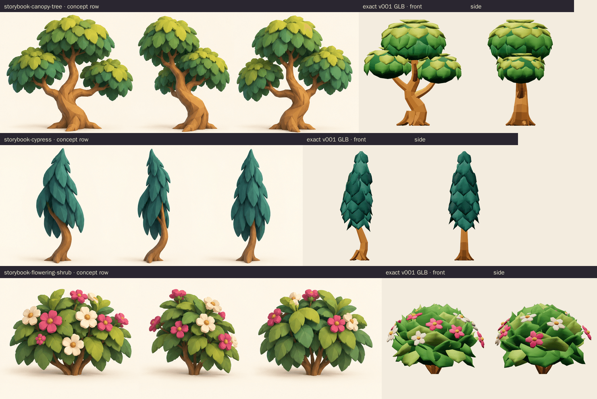

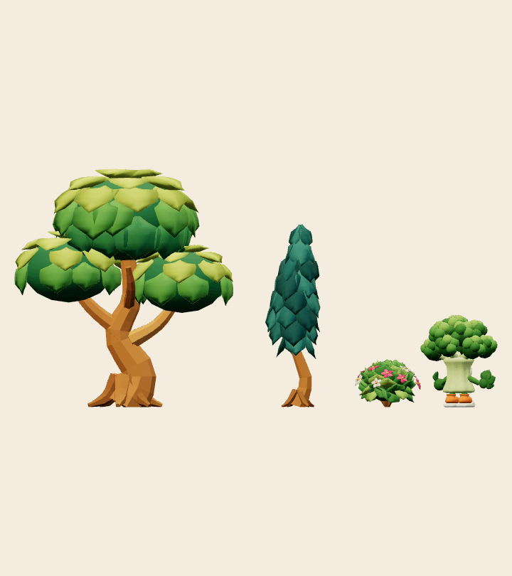

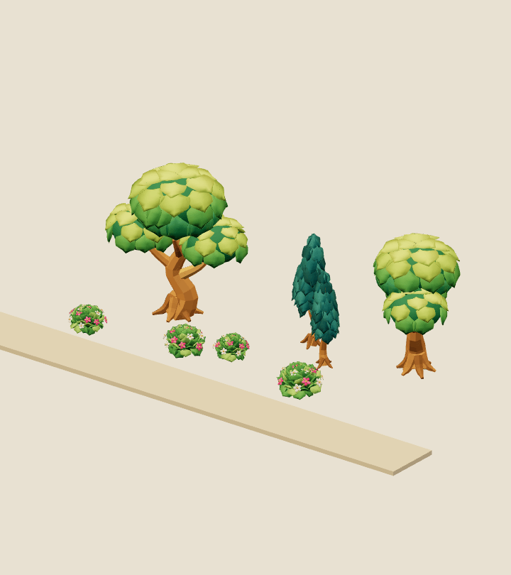

## Canopy tree {#storybook-canopy-tree}

<model-viewer src="../../media/storybook-planting-kit/v001/storybook-canopy-tree.glb" poster="../../media/storybook-planting-kit/v001/stills/storybook-canopy-tree-beauty.png" alt="Orbit the storybook canopy tree" camera-controls touch-action="pan-y" shadow-intensity="0.7"></model-viewer>

A faceted S-curved ochre trunk with six root flares splits into left, right and
back limbs. These carry three domes of shingled leaves that run from lime on top
to green and darker green below. The top crown reaches 4.00 m, and the crown
spread is about 3.7 m.
[Download GLB](../../media/storybook-planting-kit/v001/storybook-canopy-tree.glb).

<figure>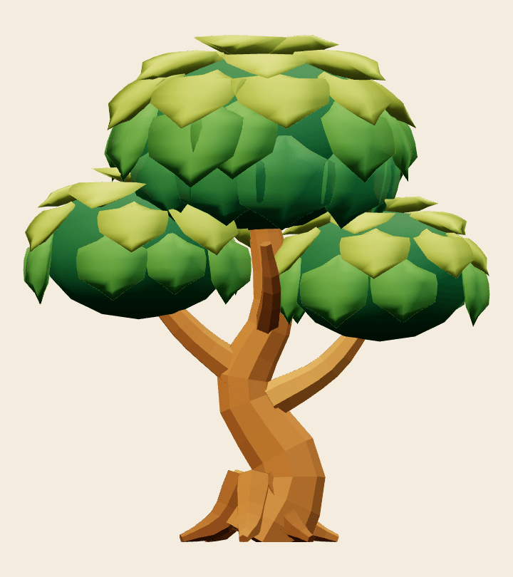<figcaption>Front</figcaption></figure>
<figure>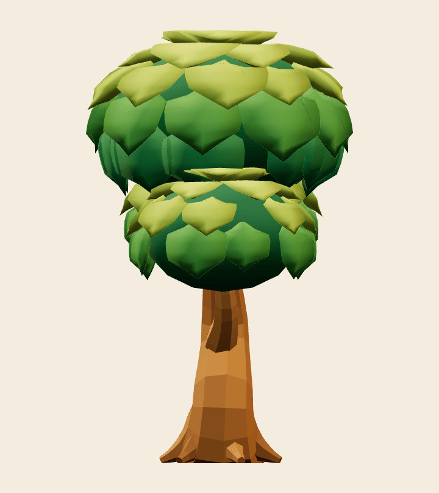<figcaption>Side</figcaption></figure>
<figure>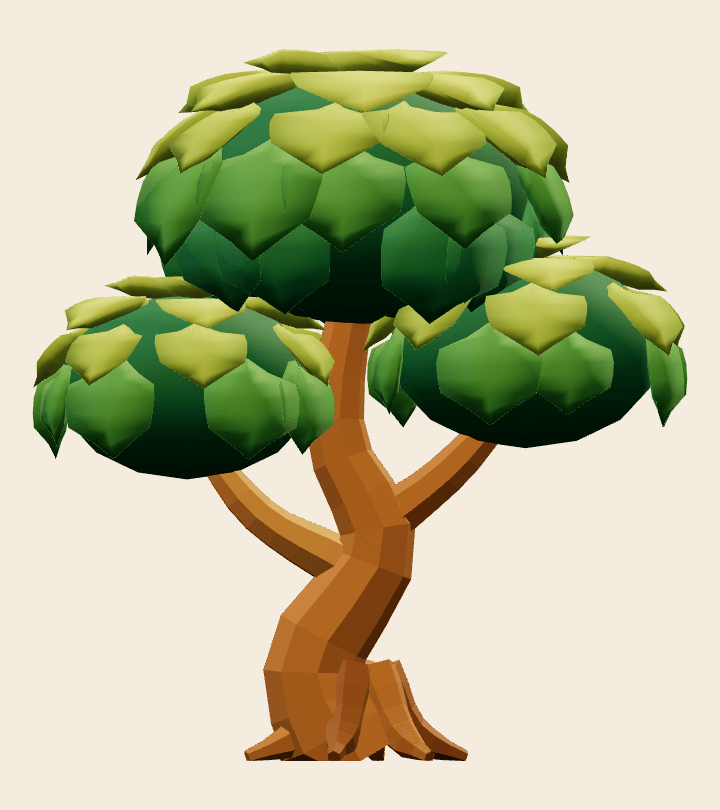<figcaption>Back</figcaption></figure>
<figure>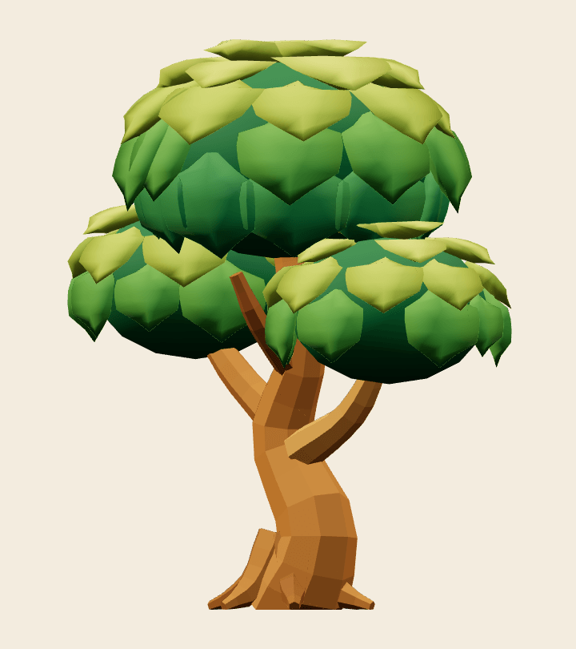<figcaption>Three-quarter</figcaption></figure>

## Cypress {#storybook-cypress}

<model-viewer src="../../media/storybook-planting-kit/v001/storybook-cypress.glb" poster="../../media/storybook-planting-kit/v001/stills/storybook-cypress-beauty.png" alt="Orbit the storybook cypress" camera-controls touch-action="pan-y" shadow-intensity="0.7"></model-viewer>

A slim S-curved trunk is visible to about 1 m. Above it sits a deep-teal flame of
long drooping leaves in three teal tones. The crown leans gently and tapers to a
3.08 m tip.
[Download GLB](../../media/storybook-planting-kit/v001/storybook-cypress.glb).

<figure>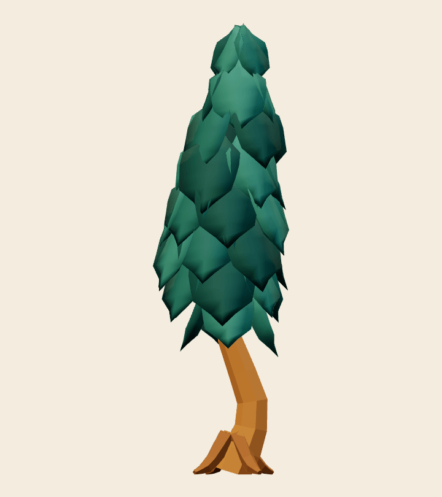<figcaption>Front</figcaption></figure>
<figure>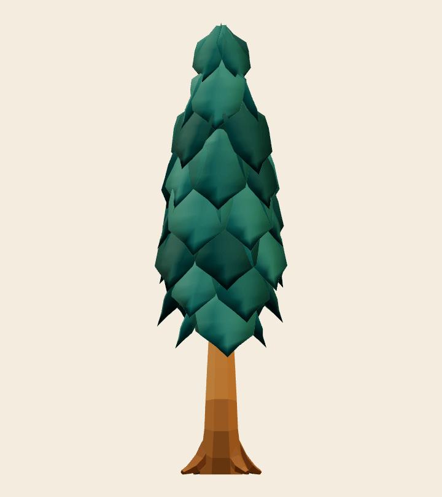<figcaption>Side</figcaption></figure>
<figure>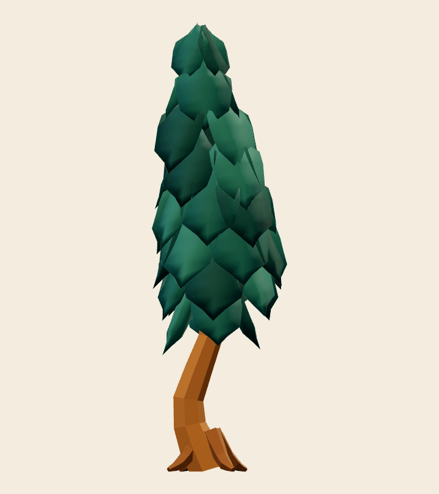<figcaption>Back</figcaption></figure>
<figure>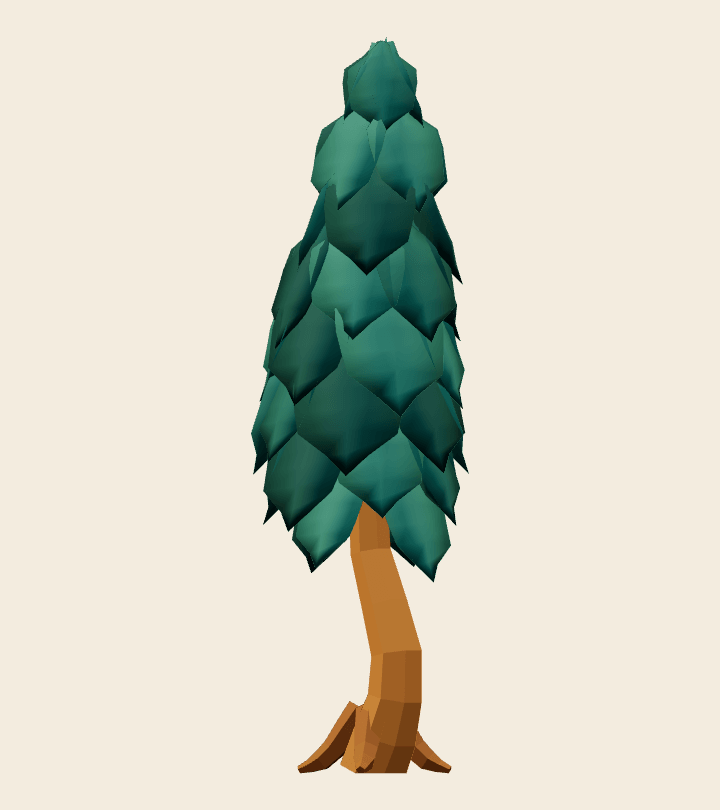<figcaption>Three-quarter</figcaption></figure>

## Flowering shrub {#storybook-flowering-shrub}

<model-viewer src="../../media/storybook-planting-kit/v001/storybook-flowering-shrub.glb" poster="../../media/storybook-planting-kit/v001/stills/storybook-flowering-shrub-beauty.png" alt="Orbit the storybook flowering shrub" camera-controls touch-action="pan-y" shadow-intensity="0.7"></model-viewer>

A rounded bouquet of broad leaves in three greens fans up and out over six brown
stems. Fourteen raspberry and cream five-petal flowers with gold centres sit on
it. It stands 0.80 m tall and about 1.1 m wide.
[Download GLB](../../media/storybook-planting-kit/v001/storybook-flowering-shrub.glb).

<figure>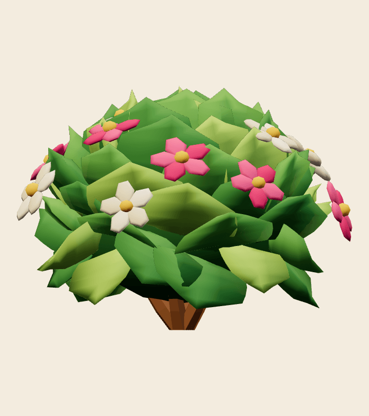<figcaption>Front</figcaption></figure>
<figure>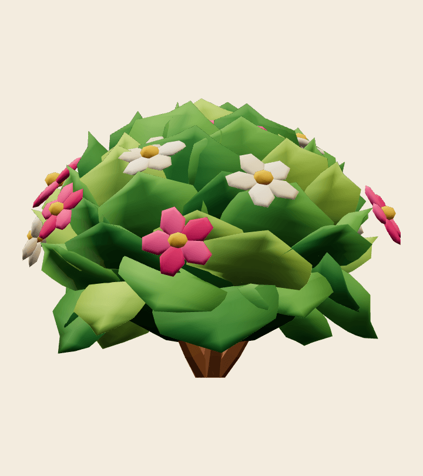<figcaption>Side</figcaption></figure>
<figure>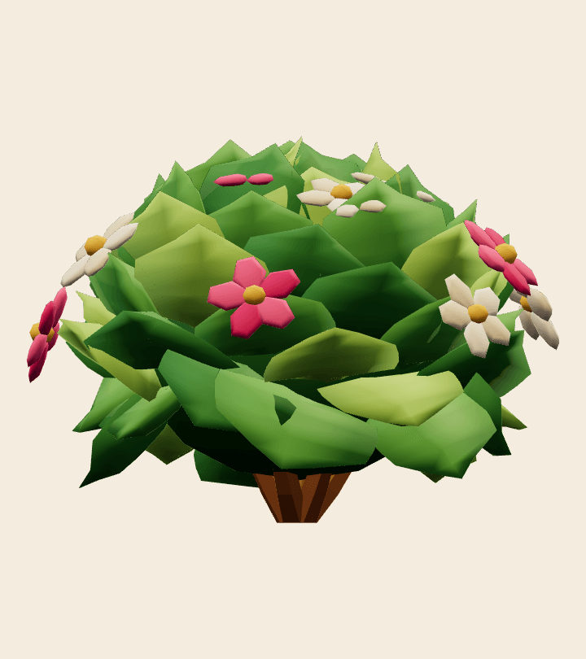<figcaption>Back</figcaption></figure>
<figure>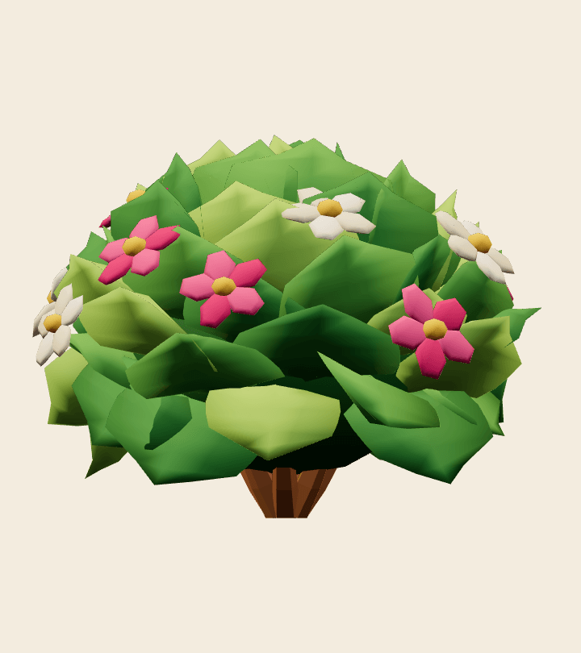<figcaption>Three-quarter</figcaption></figure>

## Technical checks

| Prop | GLB bytes · SHA-256 | Triangles | Height | Khronos |
| --- | --- | --- | --- | --- |
| `storybook-canopy-tree.glb` | 206,968 · `c37b8ebd…b74008a4` | 6,064 | 4.00 m | 0 errors, 0 warnings ([report](../../media/storybook-planting-kit/v001/validation-storybook-canopy-tree.json)) |
| `storybook-cypress.glb` | 94,368 · `4446ad06…025248a1` | 2,882 | 3.08 m | 0 errors, 0 warnings ([report](../../media/storybook-planting-kit/v001/validation-storybook-cypress.json)) |
| `storybook-flowering-shrub.glb` | 189,464 · `5d01c424…a2644d2c` | 6,660 | 0.80 m | 0 errors, 0 warnings ([report](../../media/storybook-planting-kit/v001/validation-storybook-flowering-shrub.json)) |

- Kit master `storybook-planting-kit.blend`, 370,063 bytes, SHA-256
  `5a77fe0d…69823be3c`. Each prop has its own collection at the origin, and only
  the canopy tree is visible when the file opens.
- Every GLB has one identity-transform mesh node named for the prop and one
  primitive with normals and `COLOR_0`. All three share a single opaque
  vertex-coloured material, `Storybook planting kit matte`, so each prop is one
  draw call. There are no textures, skins, animations or extensions.
- The base sits on the ground origin: every prop has its lowest vertex at 0, and
  the planting base (all vertices below 5 cm) is centred within 3 cm. There is no
  soil disc, pot or slab, so the props can stand on existing platforms. Each prop
  fits its planning box: canopy ±1.95 m × 4.4 m, cypress ±0.85 m × 3.2 m, shrub
  ±0.7 m × 0.9 m.
- three.js r186 GLTFLoader confirms one mesh and one draw primitive per prop,
  the shared vertex-coloured standard material, ground contact, a centred base
  and each height range ([report](../../media/storybook-planting-kit/v001/three-inspection.json)).
- Chromium WebGL (SwiftShader, ACES 1.15 as in the game) rendered every view,
  the lineup and the planted group with 1 draw call per prop and no console,
  HTTP or WebGL errors ([report](../../media/storybook-planting-kit/v001/browser-inspection.json)).

These checks do not include in-level placement, density or frame-time
measurement. DESIGN-029 asks the coordinator to record real frame time and draw
calls once the props are planted. Browser emulation is not physical-device
evidence.

## Coordinator intake and iteration

- **Reviewed by / date:** pending coordinator intake.
- **Iteration so far:** earlier internal drafts had brim-like crown tops, spiky
  diamond leaves, a pinecone-like cypress, a squat wide cypress and a flat-topped
  shrub. Each was corrected toward the concept before delivery. Only the final
  exports are delivered.
- **Selected for Tom's review:** pending coordinator decision.
