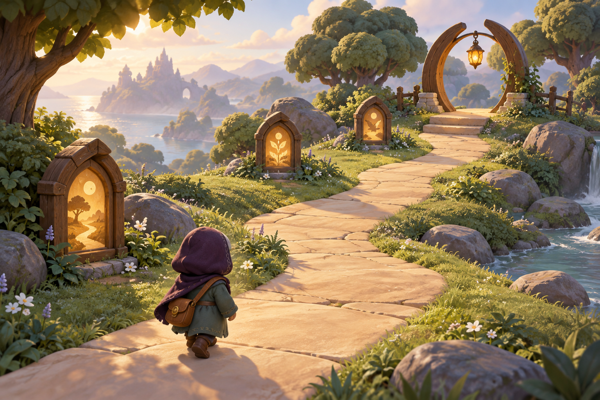
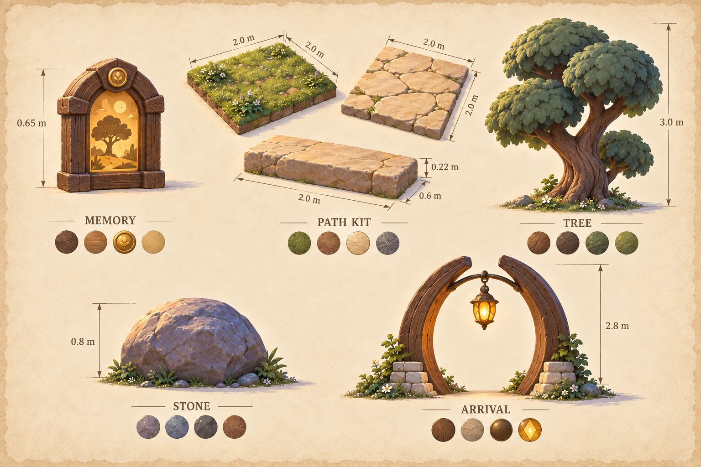

# Storybook reference · v001

**Coordinator-selected working references. Tom’s review is pending.** These original fictional images establish the common materials, proportions and shapes for the first clearing. They are concepts, not screenshots of the game or finished models.

## The clearing

The selected direction uses warm honey light, cool shaded foliage, broad sandstone paths and matte cloth and wood. The distant landscape and fine vegetation in this image are mood references; the scoped model kit stays compact. [Generation prompt](../../media/storybook-reference/v001/environment-prompt.txt).

## A traveler who grows

The infant’s larger hood and short limbs become the child’s longer, upright silhouette. Both keep the plum hood, leaf tunic, honey clasp and satchel. The right-hip satchel is the construction ruling across views. Facial identity remains mysterious; this sheet makes no claim of a real person’s likeness. [Generation prompt](../../media/storybook-reference/v001/traveler-prompt.txt).

## A shared set of materials

The common sheet establishes the set. Each modeled prop also has a separate construction sheet with identifiable views. Small embroidery, individual leaves and surface detail may be simplified for the browser models while preserving the silhouette and palette. [Generation prompt](../../media/storybook-reference/v001/props-prompt.txt).

## Provenance and review

The driving GPT-6 Astra coordinator generated these images sequentially on 2026-09-11 using the built-in image generation tool. The traveler sheet used the environment image as its reference; the prop sheet used both earlier images. No external asset or personal reference was supplied. Original files and prompts are retained; the tool supplied no reproducible seed. Use remains subject to the image-generation service’s applicable output terms; this record does not confer third-party rights.

The coordinator inspected all three outputs and selected this version for coherent shape, age proportions and palette. Exact file hashes and sizes are in the [source manifest](../../media/storybook-reference/v001/manifest.json). No image or model has Tom’s approval for final gameplay.
