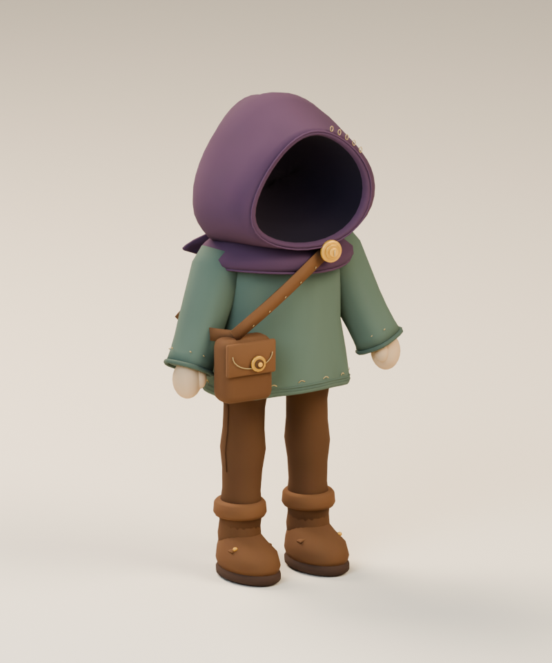
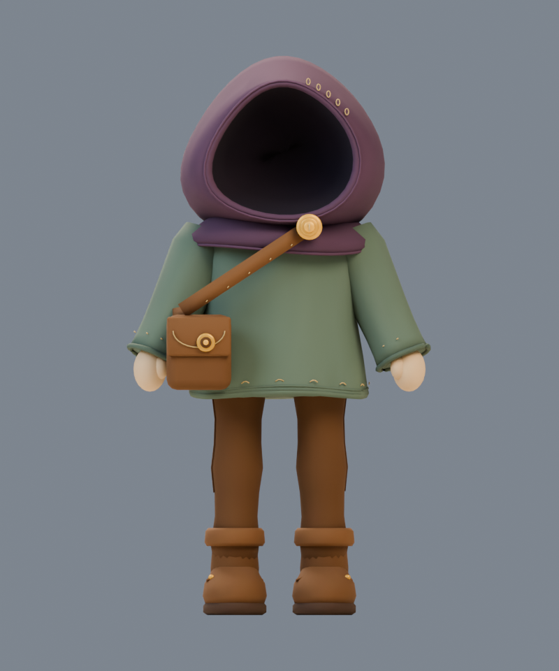
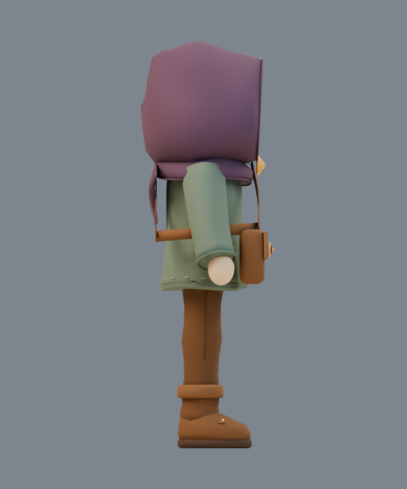
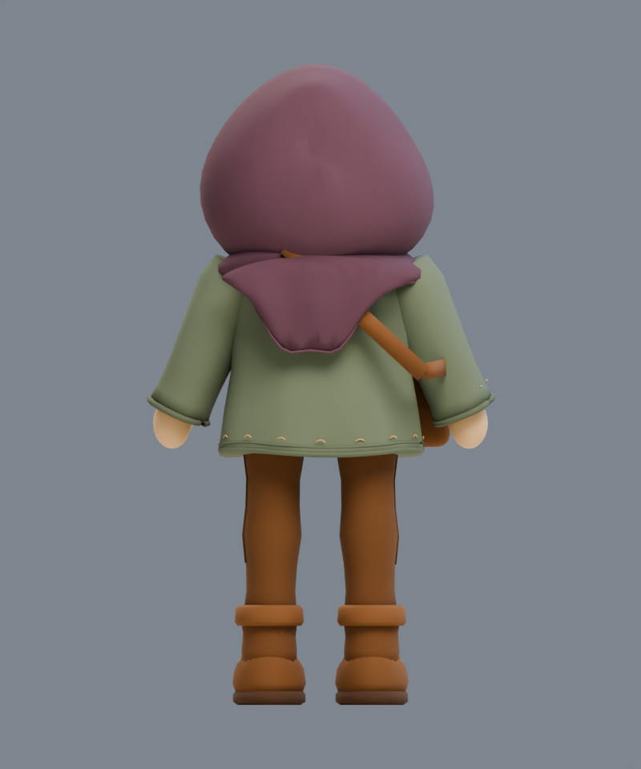

# A little taller, a little braver

**traveler-child · v001 · Coordinator intake in progress · Tom review pending**

Longer legs, a more upright posture and an added jump make this visibly older traveler part of the same character family. This is a studio candidate; gameplay still uses temporary shapes.

## From illustration to model

<figure><figcaption>Selected storybook-v001 concept, shared by both ages.</figcaption></figure>
<figure><figcaption>Exact v001 GLB, re-imported for this render.</figcaption></figure>

The plum hood, leaf tunic, honey clasp and wearer-right satchel carry through from the illustration. The model uses broad vertex-painted color, simpler cloth folds and sparse stitching. These are deliberate first-pass simplifications for a small browser asset; the concept’s fine fabric texture is not reproduced.

<model-viewer src="../../media/traveler-child/v001/traveler-child.glb" poster="../../media/traveler-child/v001/front.png" alt="Orbit the child traveler candidate" camera-controls touch-action="pan-y" data-quest-clips shadow-intensity="0.7" camera-orbit="155deg 75deg auto"></model-viewer>

[Download the GLB](../../media/traveler-child/v001/traveler-child.glb) · [Exact file manifest](../../media/traveler-child/v001/manifest.json)

<figure><figcaption>Front</figcaption></figure>
<figure><figcaption>Wearer-right side</figcaption></figure>
<figure><figcaption>Back</figcaption></figure>

## Two ages, one traveler

The infant is 0.75 m tall; the child is 1.20 m. Head-to-body ratio, leg length and posture change independently of the controller. [Compare the other age](../traveler-infant/v001.md).

## Movement

<video controls playsinline preload="metadata" poster="../../media/traveler-child/v001/motion-grid.png" aria-label="Child traveler movement reel"><source src="../../media/traveler-child/v001/animations.mp4" type="video/mp4"><a href="../../media/traveler-child/v001/animations.mp4">Download the movement reel</a></video>

The reel shows **idle**, **move**, **interact**, **jump** in order. Choose individual clips beneath the 3D viewer, or open a short video:

[Idle](../../media/traveler-child/v001/idle.mp4) · [Move](../../media/traveler-child/v001/move.mp4) · [Interact](../../media/traveler-child/v001/interact.mp4) · [Jump](../../media/traveler-child/v001/jump.mp4)

The idle is quiet, movement stays in place for an external controller, and interaction reaches toward a memory. The child adds a 1.5-second jump with a 0.17 m local pelvis lift; integration must account for that visual lift alongside controller motion. The two ages share 16 joint names, with separately authored proportions and clips; arbitrary retargeting between them is not promised.

## Technical record

| Check | Exact candidate result |
| --- | --- |
| Geometry | 11,296 triangles; eight materials; 16 joints |
| Coordinates | Y-up, meters, forward −Z; standing soles at zero |
| Textures / dependencies | Vertex color; zero image textures, external resources or required decoders |
| Runtime size | 460,616 bytes |
| Runtime SHA-256 | `4fc44919588b16ec1055bbb042fda326571ce1f4ebfc484535f102293bd7ff4e` |
| Clips | `idle`, `move`, `interact`, `jump` |
| Format validation | Khronos glTF Validator 2.0.0-dev.3.10: zero errors or warnings |
| Export inspection | Exact GLB re-imported; Three.js 0.186.0 loader and sampled skinning checks passed |
| Browser review | Separate browser intake in progress; no physical Safari result yet |

[Validator output](../../media/traveler-child/v001/validation.json) · [Export bounds and motion](../../media/traveler-child/v001/export-inspection.json) · [Three.js inspection](../../media/traveler-child/v001/three-inspection.json)

Small sampled sole penetration remains: roughly 2.3 mm during the child walk and 0.18 mm during jump landing. Collision is separate. These measurements and software renders do not establish physical iPhone/iPad frame rate.

## Source and iteration

Original fictional construction by a fresh **GPT-6 Astra, max** author, using **Blender 4.5.13 LTS** through the dedicated authoring service on September 11, 2026. The lead generated and selected the [common references](../storybook-reference/v001.md) serially; no private likeness, third-party mesh or downloaded texture was used. Concept hashes, scripts and all preview hashes are in the manifest.

Editable master: `haynes-quest/travelers/v001/traveler-child.blend` on the authoring PVC, 3,885,406 bytes, SHA-256 `6370d57445e7cc1a42877d9e257f7b37c7b31a051cbb764e373c93270a2a9138`. From dev-env, retrieve this artifact through the Blender service’s `/artifacts/haynes-quest/travelers/v001/traveler-child.blend` route and verify the hash. It is not a browser-facing private-photo store. [Source scripts and rebuild evidence](../../../../.agents/work-orders/007-blender-travelers-evidence.md) preserve the build and previous iterations.

Creator inspection corrected pale materials, shoulder joins, satchel connections, boot straps, the crown seam and jump landing. Lead inspection on September 11 compared the concept with the exported beauty, age comparison and motion sheet: the silhouette, stage difference and shared palette are coherent enough for a first review. The hood is more regular and slightly faceted at the side; cloth, mittens and satchel are simpler than the illustration. Browser clip review is the remaining intake check.

## Tom’s review

Review the overall charm of the faceless hood, the difference between the two ages, the simplified cloth finish and the movement timing.

- **Decision:** Pending.
- **Approved version/checksums:** None.
- **Integration:** Studio only. Any changed geometry, materials or clips receive a new candidate version before approval or gameplay use.
