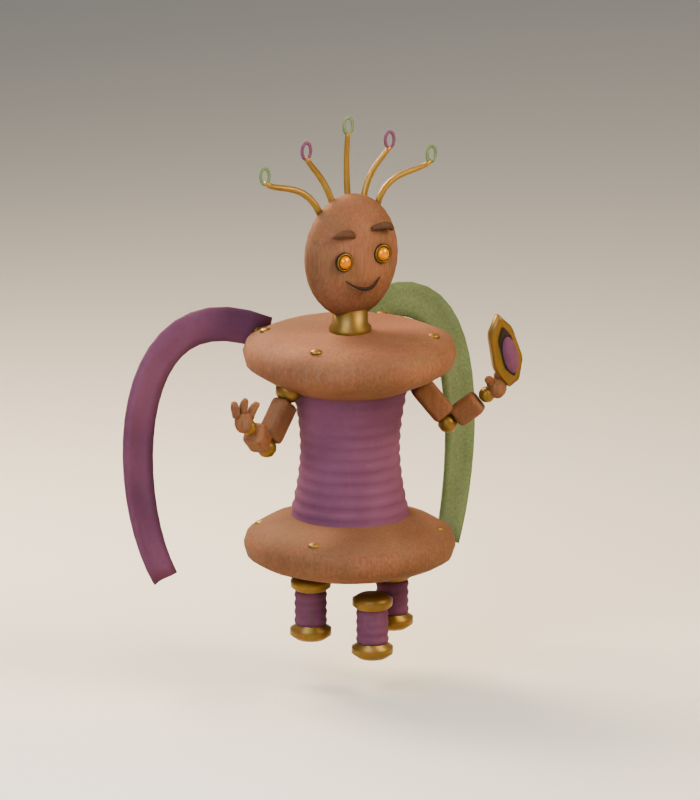
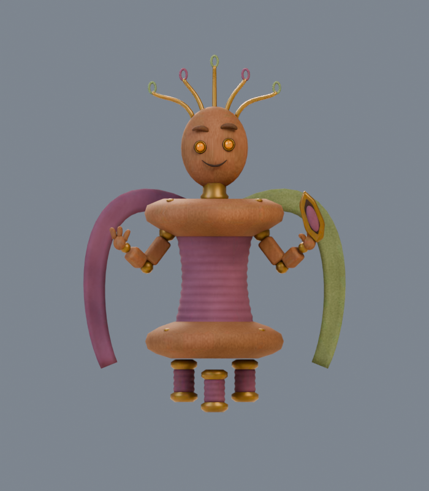
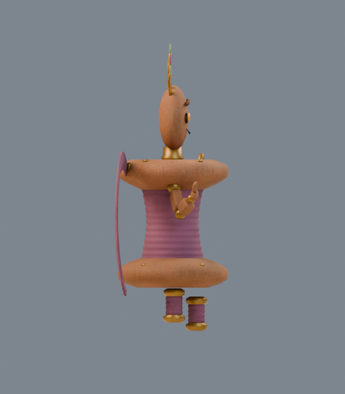
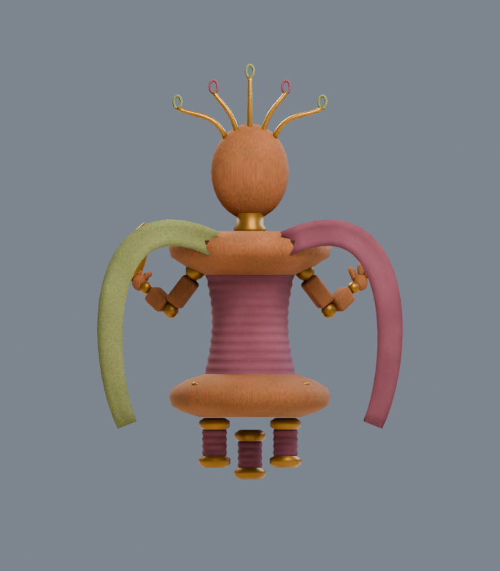

# Trendweaver

**Friendly character.** A ribbon gardener who shares a small healing bonus with considerate travelers. Harming this character costs hearts and pauses its help; make amends to restore the friendship. This role is included in the PLAN006 playtest candidate. Final artwork review remains separate.

**trendweaver · v001 · First-pass candidate · Tom’s review pending**

Trendweaver is a hovering thread spool with five crown arches, two ribbon tails and three underside bobbins. A shuttle in its left hand completes the weaving silhouette.

## Concept and exported model

<figure><figcaption>Selected construction reference.</figcaption></figure>
<figure><figcaption>Exact v001 GLB, re-imported for this render.</figcaption></figure>

The selected proportions and five crown arches remain. Overlapping thread-coil shells were replaced with continuous ribbed winding; tiny hardware was reduced to meet the geometry budget. The final surfaces are smoother and less ornate than the illustration.

<model-viewer src="../../media/trendweaver/v001/trendweaver.glb" poster="../../media/trendweaver/v001/front.png" alt="Orbit the Trendweaver candidate" camera-controls touch-action="pan-y" data-quest-clips shadow-intensity="0.7" camera-orbit="155deg 75deg auto"></model-viewer>

[Download model](../../media/trendweaver/v001/trendweaver.glb) · [Exact manifest](../../media/trendweaver/v001/manifest.json) · [Concept prompt](../../media/trendweaver/v001/prompt.txt)

<figure><figcaption>Front</figcaption></figure>
<figure><figcaption>Side</figcaption></figure>
<figure><figcaption>Back</figcaption></figure>

## Motion

<video controls playsinline preload="metadata" poster="../../media/trendweaver/v001/motion-grid.png" aria-label="Trendweaver animation reel"><source src="../../media/trendweaver/v001/animations.mp4" type="video/mp4"><a href="../../media/trendweaver/v001/animations.mp4">Download motion reel</a></video>

Choose **idle**, **move**, **attack**, **hit** or **defeat** beneath the viewer. Idle and movement repeat; other actions play once. The root stays fixed for the game controller. The contact pose occurs at 1.125 s of a 1.875 s attack. Defeat settles over two seconds, then the game holds the last pose before removal.

## Exact candidate

| Check | Result |
| --- | --- |
| Scale | 1.90 m ground-to-top; 0.12 m underside clearance; meters, Y-up, forward −Z |
| Geometry | 14,874 triangles; six materials and six primitives |
| Texture | One embedded 1024-pixel original pigment atlas; no external resources or decoder |
| Download | 1,089,712 bytes |
| SHA-256 | `2191ef48a3e71853f0e67899b9335a18b8e31c5ede33f43e39f24dcd2adc64ce` |

[Format validation](../../media/trendweaver/v001/validation.json) · [Re-imported bounds and motion](../../media/trendweaver/v001/export-inspection.json) · [Three.js deformation checks](../../media/trendweaver/v001/three-inspection.json)

Software browser checks and physical iPhone/iPad performance are separate evidence. This exact model is used as a friendly character in the PLAN006 candidate; final artwork approval remains open.

## Source and review

A fresh native **GPT-6 Astra, max** author built this original model in Blender 4.5.13 LTS. The lead generated its fictional concept serially with the built-in image tool. No family references, downloaded textures or third-party meshes were used. Editable masters, construction source and pigment data remain on the dedicated authoring PVC, with exact paths and checksums in the manifest. [Work order and production evidence](../../../../.agents/work-orders/016-blender-era-2024-evidence.md).

Lead inspection selected the final model views for first-pass packaging after the corrections described above. The lead also inspected the five-clip motion sheet. Game-scale captures and the complete catalog delivery audit remain separately recorded checks.

**Tom’s decision:** Pending. Exact final-art approval remains open; the isolated playtest uses this candidate.
