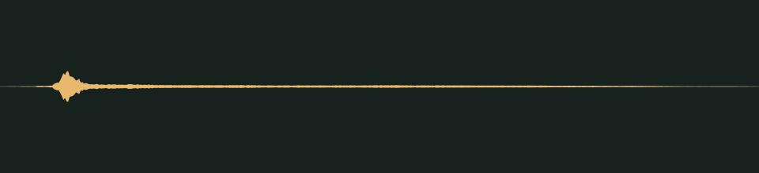

# A quiet yes · v001

**Audio candidate · listening review pending · no gameplay approval.** A quiet confirmation for an interface choice. The prompt asks for a rounded wooden tick with a tiny warm ping.

## Audition

<audio controls preload="none" aria-label="Audition ui-confirmed version one">
  <source src="../../media/ui-confirmed/v001/cue.wav" type="audio/wav">
  <a href="../../media/ui-confirmed/v001/cue.wav">Download the processed cue</a>
</audio>

[Processed cue](../../media/ui-confirmed/v001/cue.wav) · [Original five-second take](../../media/ui-confirmed/v001/source.wav)

## Exact version

| Property | Measured result |
| --- | --- |
| Stable cue / version | `ui-confirmed` / `v001` |
| Duration | 0.30 seconds |
| Format | PCM signed 16-bit WAV, stereo, 44.1 kHz |
| Download size | 52,964 bytes |
| Peak / RMS | -14.0 / -36.501 dBFS |
| Clipped samples | 0 |
| Processed SHA-256 | `e9a0541c87b518de9b7d989ae4b6ef99d3ee03e40bfc1e65855bfe9069597608` |
| Source SHA-256 | `416cdbb0fbb82da0b701f7fdac2fb4176b1f5933c4e1a236fab246e130ac941b` |

Processing selects the segment beginning at 0.415 seconds, trims it to the stated duration, applies a 0.005-second entrance and 0.050-second exit fade, then normalizes its peak. It is a one-shot cue, not a loop. The source is preserved separately. [Exact recipe](../../media/ui-confirmed/v001/processing.json), [measurements](../../media/ui-confirmed/v001/verification.json), and [reproducible processing script](../../../../scripts/assets/audio/process_cues.py).

## Source and checks

Generated on 2026-09-11 by native GPT-5.6 Sol at xhigh, following the Astra lead’s audio direction, using the separate Stable Audio 3 Small-SFX CPU service. This take used seed 104, eight steps and five seconds. It contains no supplied recording or personal reference. The [provenance record](../../media/ui-confirmed/v001/provenance.json) retains the complete prompt, service/model revisions and source terms recorded in [DESIGN-008](../../../designs/008-audio-pipeline.md). The source code, model and redistributed text component have separate terms; no broader license is asserted here.

Service/download SHA-256 checks, WAV decoding, exact duration, non-silence and zero-clipping checks passed. Re-running the processing script reproduced the same output. These measurements do not establish timbre, note count or musical quality.

## Coordinator and owner review

The coordinator inspected the records and numerical results. Both the execution agent and lead attempted the available audio-content helper; it returned **“audio content omitted because you do not support audio input.”** No listening review has occurred. The playable audition above is provided for review; sound quality and prompt fidelity remain unverified.

Review focus: Whether the confirmation is short and reassuring, with no sharp or startling transient.

- **Coordinator technical intake:** Passed; listening/creative selection pending.
- **Tom’s decision:** Pending, against the exact hash above.
- **Gameplay integration:** None. The preview’s approved cue mapping remains empty.

## Retained first attempt

The first take measured effectively silent and was rejected during technical intake. It remains available as [source attempt 1](../../media/ui-confirmed/v001/source-attempt-1.wav), with its [measurements](../../media/ui-confirmed/v001/source-attempt-1-verification.json). A second generation with the recorded seed produced the non-silent candidate above. This service result does not promise bit-for-bit determinism across generation runs.
