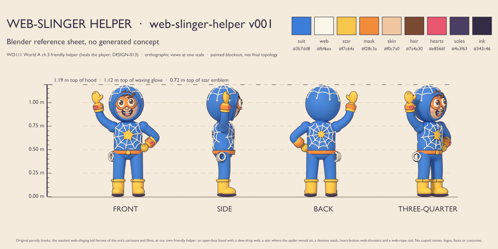
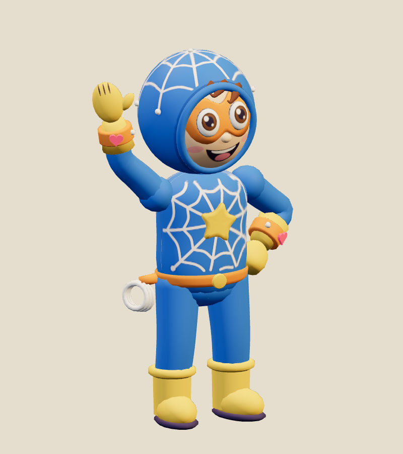
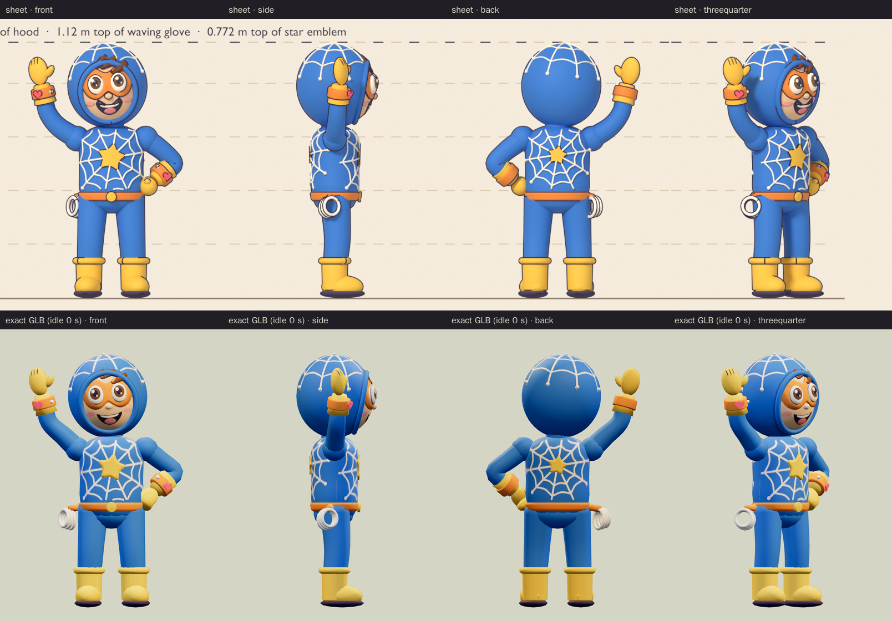
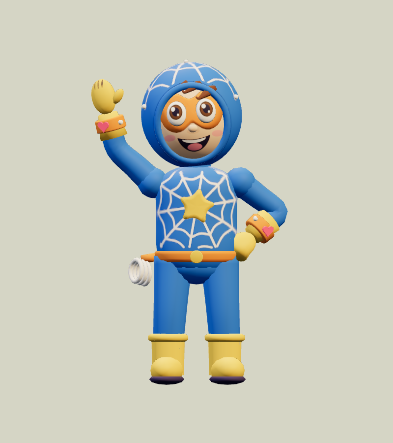
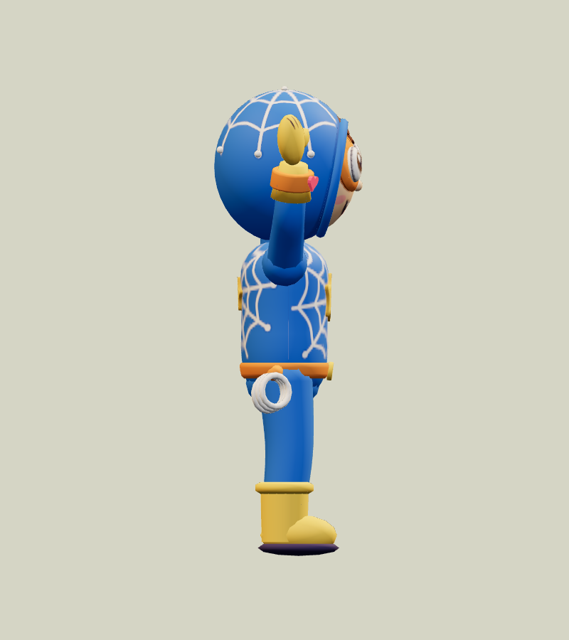
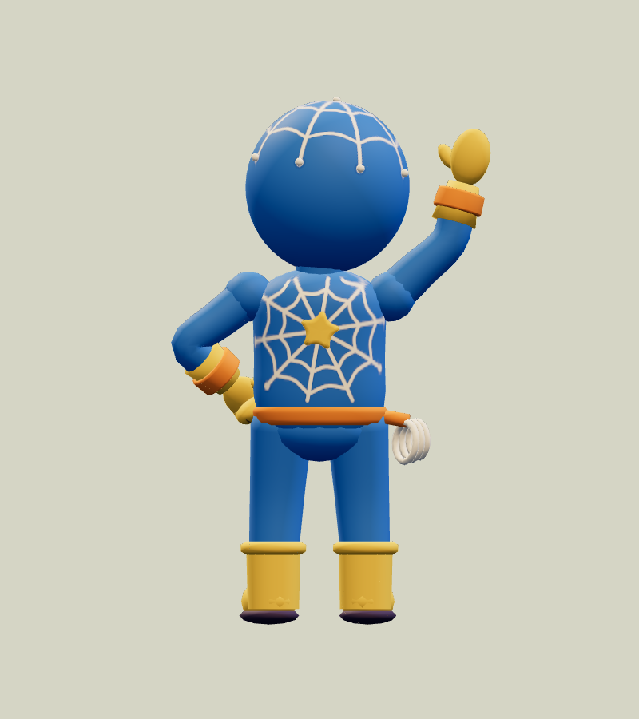
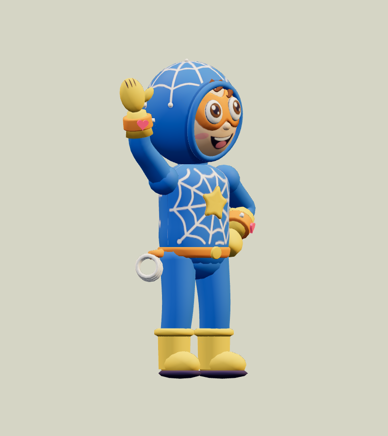
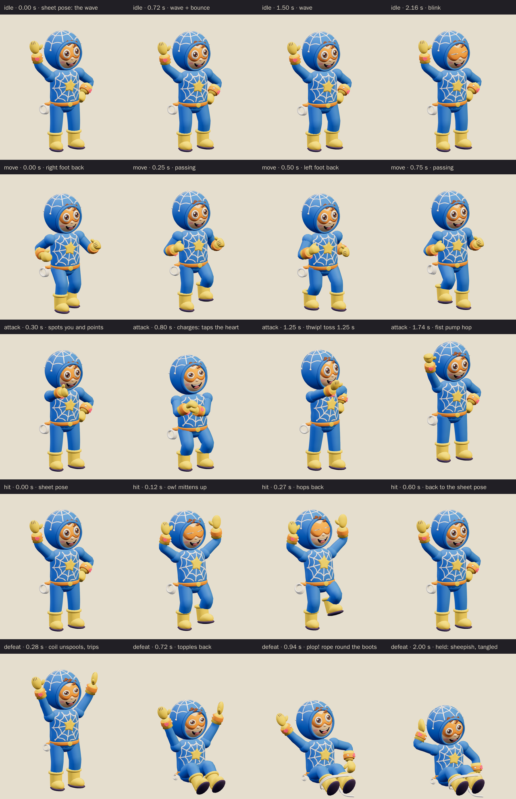
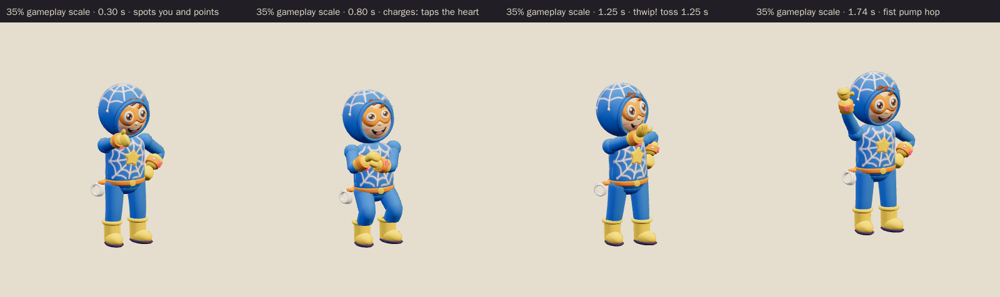

# Web-slinger Helper · v001

**Awaiting Tom's exact-version review · prepared for World A v6.** This original
masked child hero greets the player beside Hero City's vent bounce. His open
smile, waving mitten and pink heart buttons mark him as a friendly resident.
Greeting him restores two health points; deliberate harm carries the existing
recoverable penalty, and **Make amends** restores the friendship.

The helper follows [DESIGN-013](../../../designs/013-friendly-characters.md).
He does not fight the player, join automatic enemy targeting or control a boss
gate. His web motif adds character; no gap-assist mechanic is implemented.

**Source: Blender reference sheet, no generated concept.** Claude Opus 5.5
authored the reference and initial model sources. The coordinator approved the
sheet on September 26. A fresh GPT-6 Astra author rebuilt and completed the
candidate on September 29, preserving the unfinished model checkpoint and all
earlier masters. No family photograph, personal likeness, downloaded character,
copied costume, logo or audio was used.

[Reference notes](../../media/web-slinger-helper/v001/reference-notes.md) ·
[Source record](../../media/web-slinger-helper/v001/source.json) ·
[Model provenance](../../media/web-slinger-helper/v001/provenance.json)

<figure><figcaption>Approved Blender reference sheet</figcaption></figure>
<figure><figcaption>Exact v001 model, idle at 0 seconds</figcaption></figure>

<model-viewer src="../../media/web-slinger-helper/v001/web-slinger-helper.glb" poster="../../media/web-slinger-helper/v001/beauty.png" alt="Orbit the Web-slinger Helper and inspect his five animations" camera-controls touch-action="pan-y" data-quest-clips shadow-intensity="0.7" camera-orbit="155deg 78deg auto"></model-viewer>

[Download exact GLB](../../media/web-slinger-helper/v001/web-slinger-helper.glb) ·
[Editable Blender master](../../media/web-slinger-helper/v001/web-slinger-helper.blend) ·
[Construction master](../../media/web-slinger-helper/v001/web-slinger-helper-construction.blend) ·
[Reference blockout](../../media/web-slinger-helper/v001/web-slinger-helper-blockout.blend) ·
[Artifact manifest](../../media/web-slinger-helper/v001/sha256-manifest.json)

## Reference and model

The model preserves the rounded open-face hood, dew-drop web, domino mask,
large eyes and smile, raised sunny stars, heart-button cuffs, rope coil and
rain-boot silhouette. The small web lines and face details are painted into the
atlas. The hood rim, eyes, mask, fringe, stars, cuffs, hearts and coil remain
geometry. The coil sits slightly farther from the hip to clear the leg in motion.

The reference pose appears at the start of `idle`: right hand waving, left fist
on the hip, head tilted toward the wave and toes turned out. The neutral bind
pose has open hands and arms in an A-pose. In the reference pose the crown is
1.192 m high; the neutral bind pose is 1.194 m high.

<figure><figcaption>Front</figcaption></figure>
<figure><figcaption>Side</figcaption></figure>
<figure><figcaption>Back</figcaption></figure>
<figure><figcaption>Three-quarter</figcaption></figure>

## Animation

| Clip | Duration | Acting |
| --- | --- | --- |
| `idle` | 3.0 s, loop | The approved wave, a gentle weight shift, blink and heart-button pulses |
| `move` | 1.0 s, loop | A springy child jog in place |
| `attack` | 2.0 s | A friendly helping toss: point, tap the cuff heart, throw at 1.25 s, then a fist-pump hop |
| `hit` | 0.6 s | Mittens up, eyes squeezed shut and a one-foot flinch; returns to the idle pose |
| `defeat` | 2.0 s | A comic seated plop with rope around the boots, tilted mask and sheepish smile; held from 1.6 s |

The game uses idle, hit and held defeat. Move and the helping-toss `attack` are
available in the studio; they introduce no new gameplay ability. All clips keep
the floor root stationary. The seated pose remains visible until Make amends,
including when a saved game loads with this friend already defeated.

## Technical checks

| Property | Exact candidate |
| --- | --- |
| GLB | 1,159,864 bytes; self-contained, no compression decoder required |
| Geometry | 14,330 triangles, one skin, 30 joints; at most two influences per vertex |
| Surface | Two materials sharing one embedded 1024 × 1024 atlas |
| Axes | glTF +Y up, forward −Z; identity floor-centered root |
| Bind bounds | 0.914 m wide × 0.375 m deep; crown 1.194 m above the floor |
| Attack contact | 1.25 seconds in the 2.0-second helping-toss clip |
| GLB SHA-256 | `f2896efa08de53c1a94b939930071a32efeb5320a7804d5eee48dbd085b4adc3` |

[Khronos validation](../../media/web-slinger-helper/v001/validation.json) reports
zero errors, warnings, infos and hints. [Three.js inspection](../../media/web-slinger-helper/v001/three-inspection.json)
samples every exported skin vertex at 60 Hz and exercises the real FriendlyScene
and SceneAssets loader at this asset's registered URL. Every track resolves,
the idle and move loops join, the defeat holds, the root stays still and no
sampled vertex goes below the floor. Both material primitives use the fresh
whole-animation culling envelope. The runtime checks include hit-to-idle,
held defeat, defeated-at-load and return to idle after amends.

The [Blender attachment audit](../../media/web-slinger-helper/v001/attachment-inspection.json)
checks the listed part pairs on every authored frame. Limbs remain connected,
and no tested pair overlaps outside the recorded rope-opening transition. The
rope grows out of the boots over three frames in defeat; this brief overlap is
intentional. The audit is not a universal collision proof.

[Chromium playback](../../media/web-slinger-helper/v001/browser-inspection.json)
rendered all five clips at normal and 35% scale using the exact GLB, with changing
frames and zero console, HTTP or WebGL errors. These software-rendered checks
do not establish physical iPhone/iPad Safari performance or play feel. The
painted grin remains fixed while the eyes blink or squint and the mask tilts.

[Tool settings](../../media/web-slinger-helper/v001/tool-settings.json) ·
[Measured bounds](../../media/web-slinger-helper/v001/bounds.json) ·
[Visual review](../../media/web-slinger-helper/v001/visual-review.json) ·
[Scene release](../../media/web-slinger-helper/v001/scene-release.json)

## Review and integration

The driving Astra compared the approved sheet, rebuilt idle render, exact
five-clip motion sheet and small-scale toss on September 29, and approved the
candidate for the private model PR. **Tom's exact-version decision is pending.**
The candidate permission comes from [PRD-004 Q-03](../../../prds/004-family-release.md#owner-decisions).

`friendly-catalog-v2` adds this model and `family-world-a@v6` places it in Hero
City's existing `friendly-2` slot beside the vent bounce. The other friendly
slots retain their residents. Earlier catalogs, templates and published saves
retain their frozen assignments. Publication of v6 is separate from this review.
The preserved sheet and unfinished model stages remain in durable authoring
storage; the [provenance record](../../media/web-slinger-helper/v001/provenance.json)
identifies the authors and source checkpoint.
