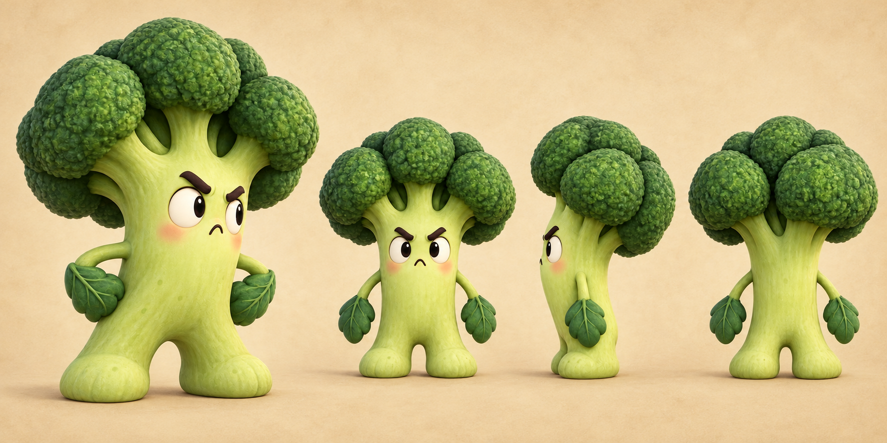
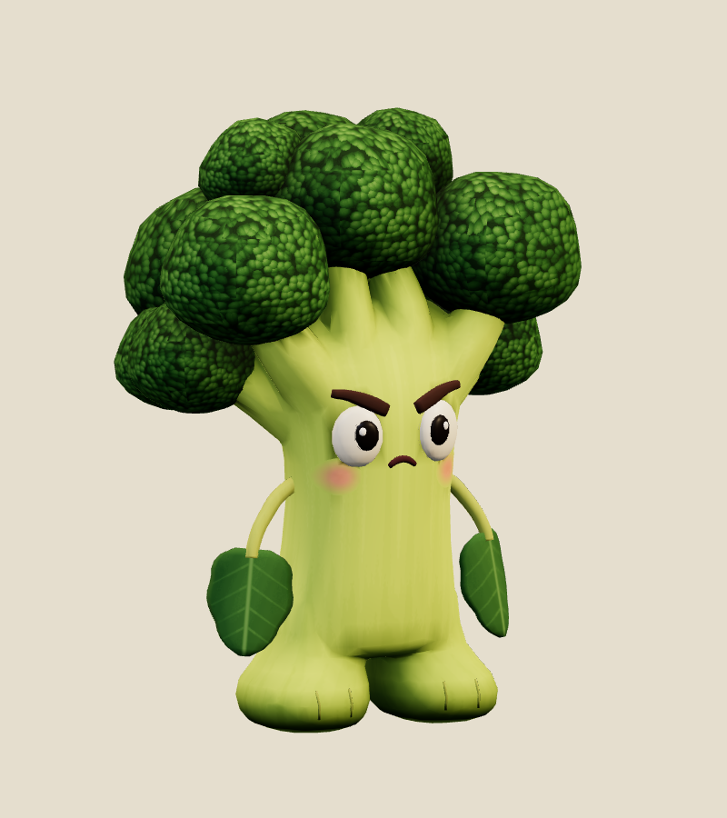
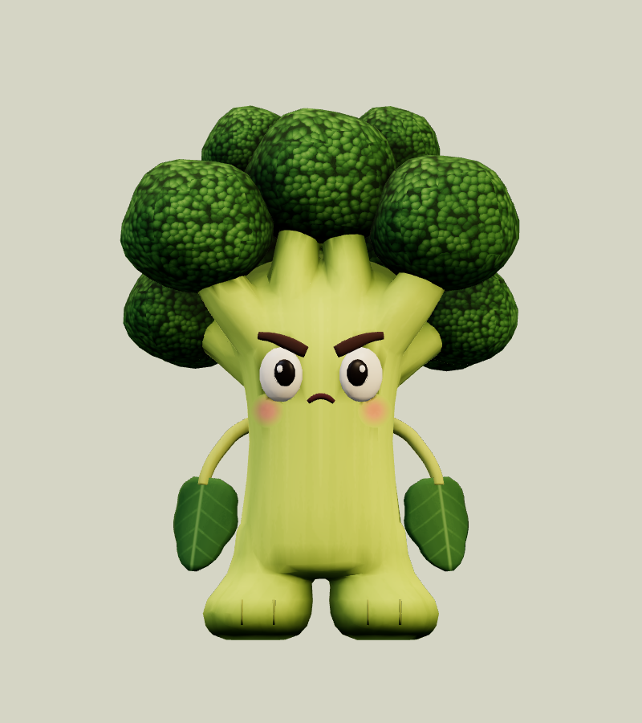
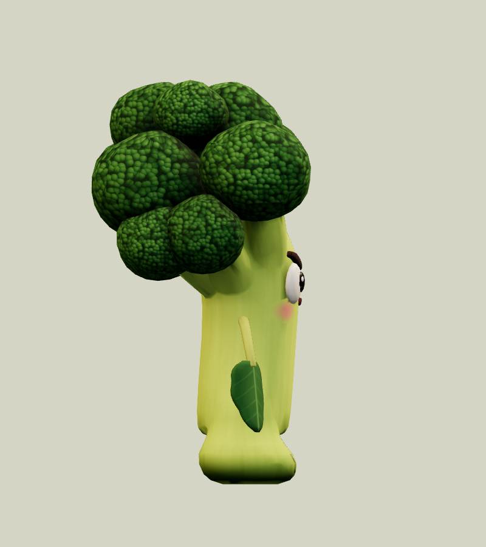
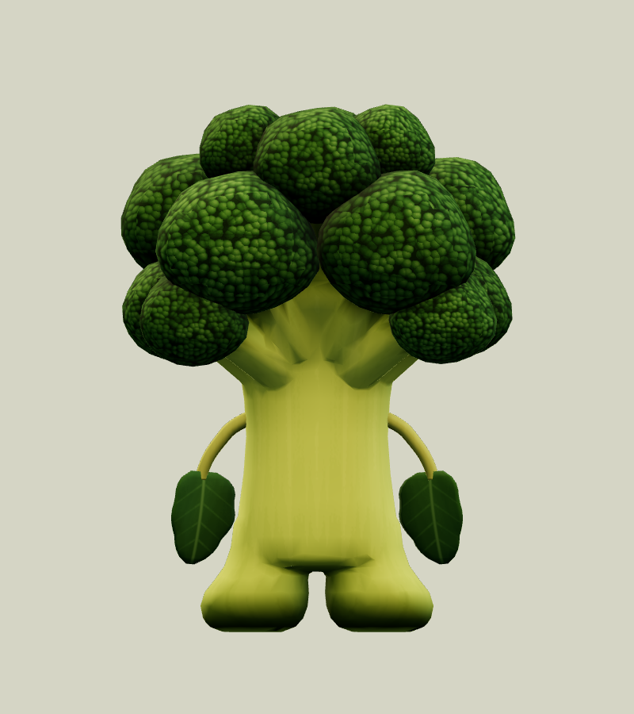
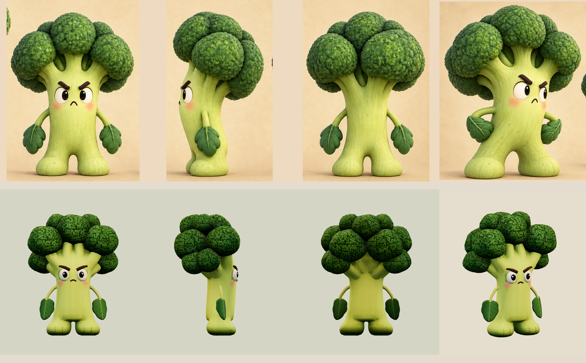
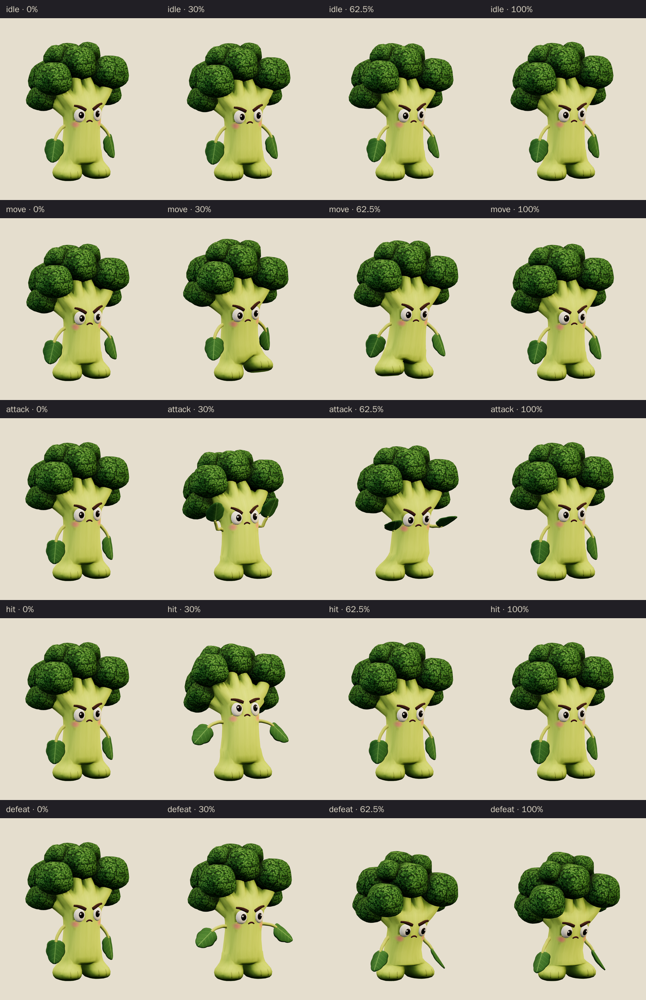
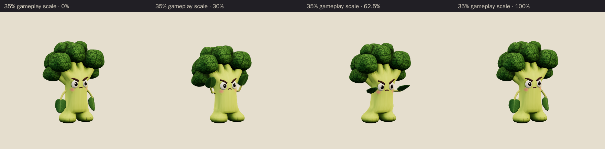

# Yes-Yes Veggie · v001

**Awaiting Tom's review · used in the family release.** This is the World B chapter 1 ordinary encounter candidate from [the locked era roster](../../../designs/026-personal-era-casts.md). The stubborn little broccoli has glaring cream eyes, heavy brows tilted to the middle, a tiny pursed frown and leaf mittens. Its broad, lumpy dark-green crown and lime stalk keep the small silhouette readable beside the chapter's Honk Bus.

[Concept prompt](../../media/yes-yes-veggie/v001/prompt.txt) · [Concept source and selection notes](../../media/yes-yes-veggie/v001/source.json) · [Model provenance](../../media/yes-yes-veggie/v001/provenance.json)

<figure><figcaption>Selected construction concept</figcaption></figure>
<figure><figcaption>Exact v001 model</figcaption></figure>

<model-viewer src="../../media/yes-yes-veggie/v001/yes-yes-veggie.glb" poster="../../media/yes-yes-veggie/v001/beauty.png" alt="Orbit Yes-Yes Veggie and inspect its five animations" camera-controls touch-action="pan-y" data-quest-clips shadow-intensity="0.7" camera-orbit="155deg 75deg auto"></model-viewer>

[Download exact GLB](../../media/yes-yes-veggie/v001/yes-yes-veggie.glb) · [Editable Blender master](../../media/yes-yes-veggie/v001/yes-yes-veggie.blend) · [Artifact manifest](../../media/yes-yes-veggie/v001/sha256-manifest.json)

<figure><figcaption>Front</figcaption></figure>
<figure><figcaption>Side</figcaption></figure>
<figure><figcaption>Back</figcaption></figure>

The Blender author compared the exact exported front, side, back and three-quarter views with the concept's construction views and hero pose before delivering. The hero pose puts the leaf mittens on its hips; the construction views, with relaxed arms, set the rest pose instead.

An earlier Opus 5.5 run built only a static first checkpoint and stopped without rigging it, animating it or releasing the scene; it left no error. The author who delivered this version confirmed that no other session was working on the veggie, took over the lease, recorded the takeover in the [scene lease](../../media/yes-yes-veggie/v001/scene-lease.json) and rebuilt the model after comparing that checkpoint with the concept:

- The stalk had ended in a flat, jagged shelf with a thin pole under the top floret. The trunk is now about 15% narrower and flares gradually into eleven thick branches separated by dark slits.
- The florets are about 10% larger and lumpier, so the crown reads as one cloud rather than mushroom caps. Two low back-corner florets now match the concept's back view.
- The curd texture changed from cell edges that read as scales to lit round bumps.
- Soft occlusion is baked into the model's vertex colours, so the slits, crevices, leg notch and foot contact read dark in the game renderer.
- After sampling the render against the concept, the stalk is greener and the leaves slightly lighter.
- The feet are bulbous, and the leaf mittens are broad and cupped.

The motion review and a source-geometry audit led to three more corrections. The weights now split smoothly between the legs, which removed a torn flap at the leg notch during the lunge and a pinch in the held defeat. The contact became a forward lunge instead of a lean-back belly bump, which had read too close to the warning pose. The audit also found a 2.6 cm leaf/stalk overlap in the defeat, so the arms now flop outward.

The first checkpoint's GLB, Blender file, construction record, texture and build script are kept alongside the early rebuild stills; the manifest lists them all.

| Exact exported model | Result |
| --- | --- |
| Size and placement | 0.747 m wide × 0.998 m tall × 0.542 m deep at rest, with the crown sitting behind the face. Floor-centered root with the feet on the floor; metre scale, Y-up, forward −Z |
| Animated reach | Across all clips the model spans −0.422 to 0.422 m sideways, 0 to 1.034 m up and −0.363 to 0.557 m front to back. The exported culling bounds cover every pose |
| Geometry | 14,354 triangles; one skin with 15 joints and at most three influences per vertex; two opaque material primitives |
| Texture | One original embedded 1024 × 1024 atlas plus baked soft occlusion in vertex colours; no external resource or required decoder |
| Download | 936,716 bytes; below the 2 MiB candidate budget |
| GLB SHA-256 | `b513172d40b1e5ba581bc99a134bd9a26a1b7cdc7775c0c1f87056e0a18bf81f` |
| Blender master SHA-256 | `332d263434c22cdb607f02ba087a20b42c19c6814237a4d40913ab19fcc34672` |

## Motion and checks

The viewer exposes `idle` (2.4 s), `move` (1.0 s), `attack` (2.0 s), `hit` (0.7 s) and `defeat` (2.4 s). In idle the broccoli gives a stubborn "no-no" head shake with its leaf hands at its sides. In move it waddles in place, lifting alternate feet. For the attack it crouches and raises both leaf mittens beside its face, holding that warning from 0.6 to 1.05 seconds. It then lunges forward with the leaves thrust out, making contact at **1.25 seconds** about 0.35 m in front of its root, before it recovers. Hit is a startled recoil with the arms flung out. Defeat is a planted squash-down sulk: the hips drop, the feet splay, the crown droops and the arms flop. The pose is held from 1.68 seconds. The brief asked for a seated sulk; the leg weights keep the lower stalk above the floor, so it squashes down rather than sitting flat. The clips leave the root stationary; gameplay controls travel and damage.

[Khronos validation](../../media/yes-yes-veggie/v001/validation.json) reports zero errors, warnings, infos and hints, and all 17 budget and identity checks pass. [Three.js inspection](../../media/yes-yes-veggie/v001/three-inspection.json) reimported the exact GLB and exercised the real enemy animation adapter. It sampled all 8,965 exported vertices at 517 animation steps and passed all 30 checks. They include a stationary root, fixed joint pivots, seamless idle and move loops, a held defeat pose, no floor penetration and feet on the floor at rest. The raised warning, the crouch and the forward shove were also checked. The [attachment audit](../../media/yes-yes-veggie/v001/attachment-inspection.json) passed all 9 checks: the leaves and forearms stay clear of the stalk, crown and eyes, the leaves never touch each other, the pupils stay inside the eyes and the brows stay seated. The closest approach is 4.9 mm between a leaf and the stalk. [Chromium playback](../../media/yes-yes-veggie/v001/browser-inspection.json) rendered changing frames for all five clips at normal and 35% scale with no page, console, HTTP or WebGL errors. [Author's visual notes](../../media/yes-yes-veggie/v001/visual-review.json) and the [scene release](../../media/yes-yes-veggie/v001/scene-release.json) record the corrections, preserved earlier masters and released Blender scene.

The catalog intake independently checked all 118 local artifact hashes against the manifest. It reran the Three.js inspection against the current enemy animation adapter and got identical bounds, contact and adapter results.

The browser evidence uses software Chromium. Physical iPad/iPhone Safari, device frame time and combat feel remain owner checks. This package contains visual animations only; it adds no sound.

## Provenance and release

Driving GPT-6 Astra generated and selected the original concept with OpenAI's built-in image tool before Codex reached its usage limit. It is a generated concept, not a Blender reference sheet. The [earlier concept](../../media/yes-yes-veggie/v001/concept-draft.png) is preserved; the selected [framing revision](../../media/yes-yes-veggie/v001/revision-prompt.txt) replaced its noisy backdrop and gave the crown clear space without changing the character.

Claude Opus 5.5 (`claude-opus-5-5`, effort `xhigh`) authored the model, atlas, rig and clips through Blender under [WO111](../../../../.agents/work-orders/111-era-cast-art-lead.md), with an exclusive scene lease. Tom ruled on September 26 that Opus 5.5 continues this Blender work while Codex is unavailable. No family photograph, personal likeness, downloaded franchise model, logo or audio was used. The source scripts live in `scripts/assets/yes-yes-veggie/v001/`; the manifest identifies the durable master and the matching authoring-service backup. Claude Opus 5.5 also completed this catalog intake without changing the model.

[PRD-004 Q-03](../../../prds/004-family-release.md#owner-decisions) permits this candidate in the family release before Tom's review. The PLAN-019 coordinator owns runtime registration and level placement; this version is not yet in a parody catalog. Tom's exact-version decision is **pending**. A rejection returns that slot to a placeholder or prior version; catalog inclusion and technical checks do not constitute approval.
