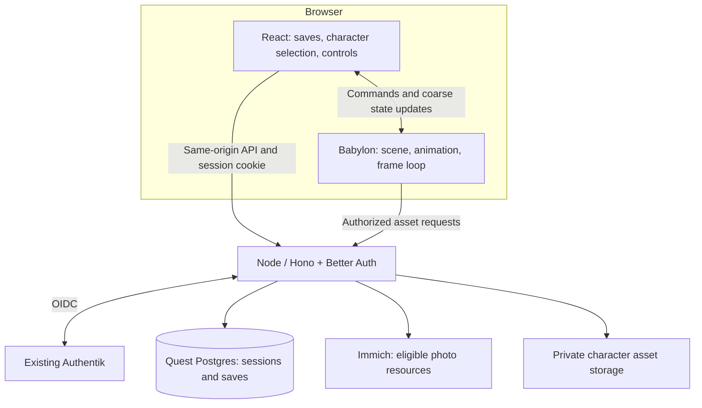

# DESIGN-001: Technical foundation and saved-game flow

- **Status:** Proposed
- **Last updated:** 2026-09-10
- **Satisfies:** [PRD-001 R-08, R-09, R-11–R-16](../prds/001-project-brief.md)
- **Governed by:** [ADR-001](../adrs/001-authentik-sign-in.md); [proposed ADR-002](../adrs/002-web-game-stack.md)

## Overview

The first technical prototype proves input, animated assets, authenticated save ownership, and resuming a game. It uses synthetic characters and collectible images. It establishes the foundation before detailed worlds, progression, or final character art.

## Player journey

1. Sign in through the existing Authentik experience. An existing Authentik session should support single sign-on.
2. See **Your saved games** and **New game**. With no saves, New game is the main action.
3. Selecting an existing save resumes its selected character and recorded progress.
4. Starting a new game offers **Jackson** and **Penelope**. Confirming a character creates a distinct save and enters the game.

The character choice belongs to the saved game. A login identity is not automatically assigned to one character. Exact screen layout, preview art, save naming, and any later character-switching feature remain for gameplay/UX design.

## Detailed design

| ID | Rule |
| --- | --- |
| D-01 | React owns the application screens and on-screen controls; Babylon owns its scene and frame loop. Mount/unmount disposes the engine, observers, timers, and input listeners. Pause input on blur, hidden tabs, and open menus. |
| D-02 | Touch and keyboard/mouse translate into the same typed game-action interface. A later gamepad adapter can use it. The prototype probes simultaneous touch movement and a second action without settling the final control layout. |
| D-03 | Saved games are server-owned records associated with the current session's user ID. List/read/write queries always scope by that owner; an owner supplied in request data is never authoritative. |
| D-04 | Character IDs are the stable values `jackson` and `penelope`. The API validates them. Save data stores the character ID, not a GLB URL, skeleton, or serialized scene. |
| D-05 | The initial save envelope contains an opaque save ID, owner ID, character ID, schema version, revision, timestamps, and a validated progress payload. Gameplay determines the final progress schema. Version and size limits apply to incoming data; TypeScript types alone are insufficient. |
| D-06 | Use transactional create/update operations and revision checks. A stale tab must not silently overwrite a newer save. An interrupted create must have a recoverable result rather than encouraging duplicate games. |
| D-07 | Authenticate and authorize protected photo/model requests on the server. Photo eligibility is a separate contract; the browser does not get an Immich API key or an unrestricted upstream proxy. Auth callback and static-shell routes must remain reachable as needed to sign in. |
| D-08 | Use one application origin for API, browser build, and authorized runtime assets. Configure required loader/decoder paths locally. A Vite development proxy must preserve the intended session/origin behavior. |

The proposed server-side Postgres store makes saves available when the same account signs in on another device. That is a technical recommendation supporting the two input modes; it does not introduce multiplayer, family-shared saves, or offline synchronization.

## Limits and failure behavior

Do not clear or overwrite a save when loading fails. A failed save must remain visibly unsaved and offer a retry. Save cadence, disconnect recovery, and session-expiry behavior during a long play session require further design; do not rely only on a browser-unload event for persistence.

Missing or incompatible character art should produce a recoverable loading state without deleting progress. The same saved character ID must work when its placeholder is replaced by a final model. Photo outages must not block the save-selection screen; the playable fallback depends on the later collectible design.

Use a small, repeatable benchmark scene. Proposed performance goals are 60 fps where practical and sustained 30 fps on the selected minimum device. Record device/OS/browser, render resolution, frame-time distribution, memory behavior, and load time; these are trial targets, not measured results. Headless or software-rendered browser results establish functional behavior only.

## Validation

- Create saves for both characters, resume each after refresh, and confirm that starting another game preserves existing saves.
- Interrupt the response to a successful new-save request, retry, and verify that recovery returns the same save instead of creating a duplicate.
- Verify persistence across a new browser session and, during the hardware trial, another device signed into the same account.
- Test two separate accounts against list/read/write routes, including guessed IDs, invalid character IDs, malformed progress, and stale revisions.
- Exercise fresh Authentik login, existing-session SSO, logout, and expired sessions. Before live authentication, agree the game's admitted-player policy and provision its separate client.
- Probe keyboard/mouse and simultaneous touch actions, input cancellation on blur, and repeated scene entry/exit without duplicated listeners or render loops.
- Load an animated synthetic GLB with locally served dependencies and no unplanned CDN requests; measure on actual touch hardware before accepting ADR-002.

## Open and deferred decisions

| ID | Question | Needed by | Status / resolution |
| --- | --- | --- | --- |
| Q-01 | Which touchscreen devices and browsers define the minimum baseline? | Hardware trial | Asked on 2026-09-10. Pending; use the provisional cross-platform scope in ADR-002 until specified. |
| Q-02 | Which authenticated users may enter the game? | Live authentication provisioning | Deferred to access design; Authentik-only login is already settled. |
| Q-03 | How often is progress saved, how are saves named, and how are concurrent sessions handled in the UI? | Playable save design | Deferred; no save-slot count or autosave timing has been assumed. |
| Q-04 | Which photos are eligible, and what progress does collection record? | Immich integration | Deferred to the photo and gameplay brief. |
