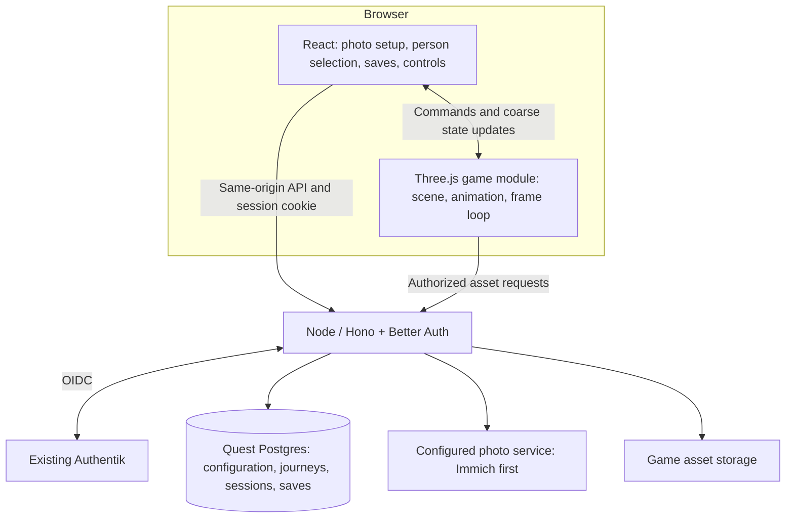

# DESIGN-001: Technical foundation and saved-game flow

- **Status:** Proposed
- **Last updated:** 2026-09-10
- **Satisfies:** [PRD-001 R-01, R-08, R-09, R-11–R-14, R-16–R-24](../prds/001-project-brief.md)
- **Governed by:** [ADR-001](../adrs/001-authentik-sign-in.md); [proposed ADR-002](../adrs/002-web-game-stack.md)

## Overview

After requirements documentation and tool setup, the planned first technical prototype proves input, animated assets, configured people and timelines, authenticated save ownership, and resuming a memory journey. It uses synthetic photo connections and a prepared shared avatar to establish the data and asset contracts. The family PoC uses a generic mysterious avatar, independent of the selected person; automatic person-specific generation is [conditional future backlog BL-01](../BACKLOG.md#bl-01-automatic-playable-character-generation).

## Player journey

1. Sign in through the existing Authentik experience. An existing Authentik session should support single sign-on.
2. See **Your saved games** and **New game**. With no saves, New game is the main action.
3. Selecting an existing save resumes its selected subject, chapter, and collected memories.
4. Starting a new game offers the configured people as journey subjects and previews their usable photo coverage. Confirming an eligible subject creates a distinct save and enters the earliest chapter with the shared mysterious avatar. If photo setup or the shared asset is missing, show the setup state described in [DESIGN-003](003-photo-connections-and-people.md). [DESIGN-004](004-memory-journey.md) defines chronology and missing-period behavior.

The subject choice belongs to the saved game. Login identity, journey subject, and avatar are separate concepts. Another subject starts a separate journey. Exact screen layout, timeline previews, and save naming remain for gameplay/UX design.

## Detailed design

| ID | Rule |
| --- | --- |
| D-01 | React owns the application screens and on-screen controls; a Three.js game module owns the scene and frame loop. Unmount stops the loop and releases renderer, geometry, material, texture, observer, timer, and input resources. Pause input on blur, hidden tabs, and open menus. |
| D-02 | Touch and keyboard/mouse translate into the same typed game-action interface. A later gamepad adapter can use it. The prototype probes simultaneous touch movement and a second action without settling the final control layout. |
| D-03 | Saved games are server-owned records associated with the current session's user ID. List/read/write queries always scope by that owner; an owner supplied in request data is never authoritative. |
| D-04 | The subject uses an opaque game-owned configured-person ID. Validate ownership and usable content, not membership in a hard-coded name enum. Saves reference a versioned journey definition and stable chapter/memory identities. Display names, URLs, and array positions are not durable keys; the avatar asset is independent of the subject. |
| D-05 | The initial save envelope contains an opaque save ID, owner ID, subject ID, journey-definition version, schema version, revision, timestamps, and validated chapter/memory progress. Detailed gameplay determines the remaining progress schema. Version and size limits apply to incoming data; TypeScript types alone are insufficient. |
| D-06 | Use transactional create/update operations and revision checks. A stale tab must not silently overwrite a newer save. An interrupted create must have a recoverable result rather than encouraging duplicate games. |
| D-07 | Authenticate and authorize protected media requests on the server. The setup form submits a user-provided key, but saved credentials never appear in read responses, browser storage, or gameplay code. Photo queries use the configured connection and resolved people under DESIGN-003. Auth callback and static-shell routes remain reachable as needed to sign in. |
| D-08 | Use one application origin for API, browser build, and authorized runtime assets. Configure required loader/decoder paths locally. A Vite development proxy must preserve the intended session/origin behavior. |

The proposed server-side Postgres store makes saves available when the same account signs in on another device. That is a technical recommendation supporting the two input modes; it does not introduce multiplayer, family-shared saves, or offline synchronization.

## Limits and failure behavior

Do not clear or overwrite a save when loading fails. A failed save must remain visibly unsaved and offer a retry. Save cadence, disconnect recovery, and session-expiry behavior during a long play session require further design; do not rely only on a browser-unload event for persistence.

Missing or incompatible character art should produce a recoverable loading state without deleting progress. The same saved subject, chapter, and memories must survive a validated avatar replacement or a person's name change. Late uploads and date corrections follow DESIGN-004 without silently rewriting completed chapters. Missing assets and photo outages must not block the save-selection screen. A disconnected or deleted source person must never resolve silently to someone else.

Use a small, repeatable benchmark scene on actual iPad, iPhone, and PC hardware. Safari is the touch-browser baseline; record the selected PC browsers and exact device/OS/browser versions. Proposed performance goals are 60 fps where practical and sustained 30 fps on the selected minimum device. Record render resolution, frame-time distribution, memory behavior, and load time; these are trial targets, not measured results. Headless or software-rendered browser results establish functional behavior only.

## Validation

- Create journeys for configured-person lists of different sizes using the same avatar. Resume each after refresh, and confirm that adding a person or starting another journey preserves existing saves.
- Interrupt the response to a successful new-save request, retry, and verify that recovery returns the same save instead of creating a duplicate.
- Verify persistence across a new browser session and, during the hardware trial, another device signed into the same account.
- Test two separate accounts against list/read/write routes, including guessed IDs, invalid subject IDs, malformed progress, and stale revisions.
- Exercise synthetic connection setup, missing/duplicate names, timeline dates, and unavailable photos/assets; test owner isolation across connections, people, journeys, memories, and saves. Confirm that a name edit or validated avatar replacement preserves subject and progress. Test sparse/single-year timelines, late older uploads, date corrections, and revoked photos under DESIGN-004.
- Exercise fresh Authentik login, existing-session SSO, logout, and expired sessions. Before live authentication, agree the game's admitted-player policy and provision its separate client.
- Probe keyboard/mouse and simultaneous touch actions, input cancellation on blur, and repeated scene entry/exit without duplicated listeners or render loops.
- Open the homelab HTTPS URL in regular Safari on both iPad and iPhone and in the selected PC browsers. Validate sign-in redirects, setup, new/resume flows, phone/tablet control layouts, and returning after backgrounding the browser. No installed app or TestFlight build is a test prerequisite.
- Load an animated synthetic GLB with locally served dependencies and no unplanned CDN requests; measure on actual touch hardware before accepting ADR-002.
- Evaluate movement, camera, collision behavior, and the cost of integrating them against the agreed gameplay. The [community evidence](../reference/astra-game-workflows.md) informs the starting choice; costly integration or device failures are reasons to revisit Three.js before building out the world.

## Open and deferred decisions

| ID | Question | Needed by | Status / resolution |
| --- | --- | --- | --- |
| Q-01 | Which touchscreen devices and browsers define the minimum baseline? | Hardware trial | Device families resolved by Tom on 2026-09-10: iPad, iPhone, and PC, browser-only, hosted on the homelab. Use Safari for the touch baseline; exact device models, version floors, and PC browsers remain to be recorded for testing. |
| Q-02 | Which authenticated users may enter the game? | Live authentication provisioning | Deferred to access design; Authentik-only login is already settled. |
| Q-03 | How often is progress saved, how are saves named, and how are concurrent sessions handled in the UI? | Playable save design | Deferred; no save-slot count or autosave timing has been assumed. |
| Q-04 | Which photos are eligible, and what progress does collection record? | Photo integration | Configured connection, people, and chronological memory collection are established. Exact filters, chapter grouping/completion, and refresh behavior remain deferred. See DESIGN-003 and DESIGN-004. |
