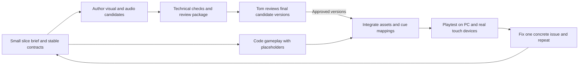

# DESIGN-007: Playable proof of concept and development loop

- **Status:** Proposed
- **Last updated:** 2026-09-11
- **Source:** Tom's instruction to defer level detail and focus on a playable PoC, an Astra development team, audio tooling, and owner review of final assets
- **Satisfies:** [PRD-001 R-06, R-08, R-09, R-13, R-16, R-30–R-39](../prds/001-project-brief.md)
- **Related:** [Stack](../adrs/002-web-game-stack.md), [asset pipeline](002-asset-pipeline.md), [age and abilities](006-memory-age-and-abilities.md), [audio](008-audio-pipeline.md), [PLAN-002](../../.agents/plans/002-foundation-prototype.md)

## Scope now

The immediate goal is to get the core gameplay flowing and establish a repeatable build, author, review, and test loop. Tom explicitly deferred detailed fighting and additional collectibles. Full story, enemy/boss content, and level dressing are recorded in the [backlog](../BACKLOG.md); finishing those designs is not a prerequisite for starting this narrow PoC.

The earlier requirement to finish all technical and nontechnical documentation before any prototype is narrowed to the PoC contracts and workflow. Tom subsequently prioritized PLAN-003 dependency setup before development dispatch. Once that checkpoint is reached, implement the small playable slice with synthetic placeholders while final asset candidates are authored and reviewed. PLAN-003 now targets a dedicated cluster Blender service and explicit remote artifact transfer, with independently upgradeable authoring workloads. Historical tool-image tests do not establish the new service's readiness; final assets and the game remain unimplemented.

## Proposed first playable slice

Use one compact original test level, one generic placeholder/avatar, a synthetic person with an explicit fictional birth date, and three dated synthetic memories. Prototype dates and thresholds are test data, not final developmental milestones or an answer to the product's pending age-source policy.

1. Start at memory age zero with a small baby movement/interaction set.
2. Reach the first memory with the starting actions and show visual collection feedback.
3. Reach the next chronological memory and unlock one new movement action, initially proposed as jumping.
4. Use the new action and an earlier retained action to reach the final memory and a clear finish point. The route to an unlock never requires that same unlock.
5. Save, exit, and resume with the same subject, age, abilities, and collected memories.
6. Complete the same route with iPad/iPhone touch controls and PC keyboard/mouse, including with sound muted.

Three memories, one unlock, and the exact test layout are implementation defaults chosen to keep the probe small. They do not establish the full game's level size, age thresholds, or collectible quota. Use simple geometry and clearly marked synthetic media first; candidate final art is reviewed separately before integration.

The slice needs sound cues for collection, unlocking, movement/landing as appropriate, and UI confirmation. A short ambience loop is optional. Combat, bosses, extra pickups, multiple cultural eras, final music, dialogue, and a full story campaign are not PoC completion criteria.

The existing premise supplies enough story for the slice: a character without memories recovers photos and regains abilities. Keep the objective to recovering the next memory. The avatar's final identity, world history, ending, named characters, and spoken narration remain open.

## Development cycle

Code and candidate authoring can progress independently behind stable asset, ability, memory, and cue IDs. Changes to those contracts are agreed by the driving Astra before parallel implementation diverges. Keep iterations reviewable: one mechanic or small asset set, its evidence, and a runnable checkpoint.

The local greybox can establish feel using development-only synthetic adapters. A temporary fixture save is not evidence of durable persistence, and a development identity is never an alternative player login. The hosted PoC uses the game's Authentik-only admission and server-owned saves under DESIGN-001 before it is presented as the homelab game. Real Immich access is a later integration milestone.

## Astra team and coordination

All project development lanes use **GPT-6 Astra**, following Tom's current instruction. Start native Codex development agents with empty conversation windows (`fork_turns: "none"`) and explicit self-contained work orders; do not inherit this planning thread. Agents read the applicable instructions and the documents/inputs listed in their work order. Use bounded parallel tasks; separate Claude sessions are not the default team for this project. The available concurrency determines how many lanes run at once, not a promise to keep a permanent agent for every role.

| Lane | Responsibility and handoff |
| --- | --- |
| Driving Astra / integration | Own scope, architecture, shared contracts, user-facing design, and the current runnable checkpoint. Review findings and integrate work without waiting for unrelated backlog items. |
| Gameplay/code Astra | Implement the scene, input, chronology, unlocks, save boundaries, and focused verification. Return a branch/diff, commands/results, and a runnable demonstration. |
| Visual-assets Astra | Use image generation for concept/reference sheets, then Blender for authored geometry, materials, rigs, animations, and GLB export. Return editable masters, validated candidates, and a review package. |
| Audio Astra | Author cue candidates, clean/export them, retain provenance, and map them to stable cue IDs. Return audition files and processing/level notes under DESIGN-008. |
| Story/design Astra | Maintain the small premise and objective text; record later story and level ideas in the backlog. Draft user-facing text at Astra quality for the driving Astra's review. Full narrative production is deferred. |
| Verification Astra | Independently check the slice, asset contracts, save behavior, audio lifecycle, and reported evidence. Distinguish automated checks from actual device or owner playtests. |

Use the [work-order template](../../.agents/work-orders/000-template.md) for scope, owned paths, dependencies, outputs, and acceptance. Avoid concurrent edits to shared files; use a worktree/branch per implementation task and communicate contract changes through the driving agent. Work orders must supply the verified remote MCP endpoint, remote workspace and artifact upload/download conventions, and exact input versions; local worktree paths are not service paths. A shared Blender session is a mutable resource: serialize its use or use isolated sessions/files. Do not run competing authoring commands against one scene.

## Tom's asset-review requirement

Tom reviews final assets **before they are used in gameplay**. This applies to the version being promoted: models, materials, animation, sounds, and any later music/voice. A successful export, automated check, or another agent's review does not substitute for his review.

Prepare a [review record](../assets/000-review-template.md) with a stable asset/cue ID, version/checksum, purpose, source/license or generation provenance, technical results, and concrete previews. Visual review includes useful stills/turntable and animation examples; audio review includes an isolated audition and, where useful, a short contextual preview. Include a focused list of requested judgments. Do not ask Tom to approve an abstract asset plan instead of a viewable/listenable candidate.

Candidates may be shown in an isolated, clearly labeled review preview. Until Tom approves, gameplay uses synthetic placeholders or a previously approved version. Record approval against the exact candidate version; a materially changed candidate returns to review. A rejected or pending asset does not stop unrelated code work.

Normal documentation and code PRs still follow checks and autonomous squash merge. The review gate is promotion of final assets into gameplay, not a new requirement for Tom to approve every PR or implementation choice. No candidate asset is being submitted for approval in this documentation task.

## PoC acceptance

| ID | Observable result |
| --- | --- |
| AC-01 | The compact synthetic route runs from age zero through three chronological memories, one new ability, retained earlier actions, and a reachable finish point. |
| AC-02 | The route works with touch on actual iPad/iPhone Safari and keyboard/mouse on the selected PC browser; exact tested devices/versions are recorded. |
| AC-03 | The hosted slice signs in through Authentik only and restores server-owned memory, age, and ability progress after leaving and resuming. Ownership/retry checks pass. |
| AC-04 | Approved prepared cues play after user interaction, mute persists, and browser interruption/resume produces no duplicate loops or queued bursts. The route is playable muted. |
| AC-05 | Final integrated visual/audio versions have Tom's recorded review, reproducible source/export metadata, and relevant technical checks. Placeholders are identified honestly and do not stand in for approved final-asset evidence. |
| AC-06 | The repository has working build/test commands and a reproducible asset/cue handoff. The release is verified through the existing GitOps/browser process; no untested deployment or actual-device claim is made. |

Final combat mechanics, production story, extra collectibles, and the full era catalog remain later work after this loop has been evaluated. PLAN-002 defines the staged delivery. Tom subsequently prioritized [PLAN-003 dependency setup](../../.agents/plans/003-authoring-tool-setup.md) before development dispatch. Once that setup checkpoint is reached, the first coding milestone can use placeholders while candidate assets and their reviews proceed; full game content still does not gate the loop.
