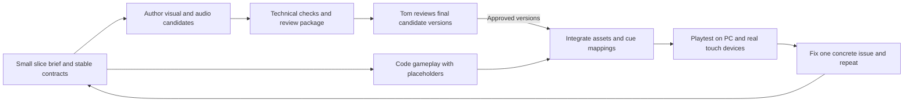

# DESIGN-007: Playable proof of concept and development loop

- **Status:** Proposed
- **Last updated:** 2026-09-11
- **Source:** Tom's instruction to defer level detail and focus on a playable PoC, an Astra development team, audio tooling, and owner review of final assets
- **Satisfies:** [PRD-001 R-06, R-08, R-09, R-13, R-16, R-30–R-39](../prds/001-project-brief.md)
- **Related:** [Stack](../adrs/002-web-game-stack.md), [asset pipeline](002-asset-pipeline.md), [age and abilities](006-memory-age-and-abilities.md), [audio](008-audio-pipeline.md), [PLAN-002](../../.agents/plans/002-foundation-prototype.md)

## Scope now

Tom's September 11 review corrected the prototype scope: the coming-of-age arc depends on useful equipment, period enemies, a boss, then post-boss memories that advance age and the next period. These are the core playable loop. The earlier collection-and-jump route was technically functional but did not demonstrate that loop; its tests remain historical evidence.

[PLAN-005](../../.agents/plans/completed/005-era-combat-loop.md) and [DESIGN-010](010-era-combat-loop.md) now govern the bounded rebuild. The fixture keeps three fictional memories and demonstrates two periods: age zero in 2020, then age four in 2024, ending at age seven. Exact thresholds and combat balance are provisional. A full lifetime campaign and complete historical catalog are additional work; the current fights and useful pickups cannot be postponed as though they were unrelated polish.

## Corrected playable slice

1. Start at age zero with movement and interaction.
2. Explore the period, find an attack tool and optionally a shield, and face two ordinary enemies.
3. Defeat the boss using available equipment and readable attack warnings. Provide health, avoidance, guarding and a safe retry after defeat.
4. Show the released pictures after victory. Revealing a picture preserves the current age. Absorb the completed bundle to grow, retain gear and abilities, and enter the next period.
5. Complete that period and end at the age represented by the last selected memory. Do not invent adulthood or more photos.
6. Save, leave and resume with the same health, equipment, encounters, phase, pictures, age and abilities. Preserve earlier prototype saves as read-only albums.
7. Play the sequence through keyboard/mouse and simultaneous touch controls. Use actual browser images and loading-failure checks to assess the result.

The local candidate review may use the catalog's prepared traveler and environment models. Promotion to the normal private demo still requires the existing exact-version owner decision. New encounter/equipment studies are explicitly temporary; their finished asset production remains part of PLAN-005 and must be reported as incomplete if authoring is blocked. Audio remains silent until approved cues are mapped; persistent sound preferences and visible feedback are retained.

## Development cycle

Code and candidate authoring can progress independently behind stable asset, ability, memory, and cue IDs. Changes to those contracts are agreed by the driving Astra before parallel implementation diverges. Keep iterations reviewable: one mechanic or small asset set, its evidence, and a runnable checkpoint.

The local greybox can establish feel using development-only synthetic adapters. A temporary fixture save is not evidence of durable persistence, and a development identity is never an alternative player login. The eventual player release uses Authentik-only admission and server-owned saves under DESIGN-001. PLAN-004 now implements the Immich adapter overnight and permits a private synthetic fixture demo while OAuth waits until tomorrow; that fixture process must not receive the live Immich secret.

## Astra team and coordination

[TEAM.md](../../.agents/TEAM.md) is the canonical model/dispatch and recovery policy. Astra coordinates with full project context; bounded development agents start fresh with self-contained work orders. Tom's latest project exceptions require Astra for all Blender tasks and authorize separate Fable sessions for review/coding. The lead owns style, user-facing design/text, architecture, integration and final review.

| Lane | Responsibility and handoff |
| --- | --- |
| Driving Astra / art direction | Scope, shared contracts, story/text, sequential image generation, coherent references, model intake/iteration and final integration. |
| Native Sol coding/verification | Bounded game/server/tooling code and independent focused checks; return branch/diff, real commands/results and runnable evidence. |
| Native Astra Blender | Model, materials, rigs, animations, renders and exports from the lead's exact references; return editable masters, GLBs and previews. One exclusive scene owner. |
| Native Sol audio, Astra direction | Generate/process cue candidates, retain sources/terms and checksums, prepare audible catalog entries under DESIGN-008. |
| Separate Fable 5.1 at xhigh | Adversarial review or coding via `agent-run` to balance the plans; use a fresh scoped work order, verify actual session startup, and integrate evidenced findings. |

Astra generates images one at a time. Modeling an already selected concept, coding and audio may proceed in parallel; competing image generations or Blender scene mutations may not. Record working reference versions and lease ownership in work orders, then release the scene at handoff.

Use the [work-order template](../../.agents/work-orders/000-template.md) for scope, owned paths, dependencies, outputs, and acceptance. Avoid concurrent edits to shared files; use a worktree/branch per implementation task and communicate contract changes through the driving agent. Work orders must supply the verified remote MCP endpoint, remote workspace and artifact upload/download conventions, and exact input versions; local worktree paths are not service paths. A shared Blender session is a mutable resource: serialize its use or use isolated sessions/files. Do not run competing authoring commands against one scene.

## Tom's asset-review requirement

Tom reviews final assets **before they are used in gameplay**. This applies to the version being promoted: models, materials, animation, sounds, and any later music/voice. A successful export, automated check, or another agent's review does not substitute for his review.

Tom also authorizes first-pass candidate production and iteration before his review: coordinator-selected concepts may proceed directly to Astra Blender modeling. Use the MkDocs Material [asset studio](../assets/README.md) to catalog every scoped source image, model and sound. Prepare a [review record](../assets/000-review-template.md) with a stable asset/cue ID, version/checksum, purpose, source/license or generation provenance, technical results, and concrete previews. Visual review includes useful stills/turntable and animation examples; audio review includes an isolated audition and, where useful, a short contextual preview. Include a focused list of requested judgments. Do not ask Tom to approve an abstract asset plan instead of a viewable/listenable candidate.

Candidates may be shown in an isolated, clearly labeled review preview. Until Tom approves, gameplay uses synthetic placeholders or a previously approved version. Record approval against the exact candidate version; a materially changed candidate returns to review. A rejected or pending asset does not stop unrelated code work.

Normal documentation and code PRs still follow checks and autonomous squash merge. The review gate is promotion of final assets into gameplay, not a new requirement for Tom to approve every PR or implementation choice. Tom has been asked about demo use of the existing exact-version candidates; the handoff records whether a response has arrived.

## PoC acceptance

The table includes eventual player-ready acceptance: OAuth, owner-approved artwork and physical-device checks remain separate from the private synthetic review. PLAN-005 governs the corrected loop. PLAN-004 and its earlier tests do not establish acceptance of that corrected gameplay.

| ID | Observable result |
| --- | --- |
| AC-01 | The two-period route runs through useful equipment, ordinary encounters, boss victory, visible released pictures, deliberate bundle consumption and a new age/period. Boss defeat and individual revelation never age the traveler; gear, abilities and saved progress persist. |
| AC-02 | The route works with touch on actual iPad/iPhone Safari and keyboard/mouse on the selected PC browser; exact tested devices/versions are recorded. |
| AC-03 | The hosted slice signs in through Authentik only and restores server-owned memory, age, and ability progress after leaving and resuming. Ownership/retry checks pass. |
| AC-04 | Approved prepared cues play after user interaction, mute persists, and browser interruption/resume produces no duplicate loops or queued bursts. The route is playable muted. |
| AC-05 | Final integrated visual/audio versions have Tom's recorded review, reproducible source/export metadata, and relevant technical checks. Placeholders are identified honestly and do not stand in for approved final-asset evidence. |
| AC-06 | The repository has working build/test commands and a reproducible asset/cue handoff. The release is verified through the existing GitOps/browser process; no untested deployment or actual-device claim is made. |

The complete historical catalog, final balance, production story and additional activities remain later work. The current equipment/enemy/boss loop is required now. The dedicated authoring services were established under [completed PLAN-003](../../.agents/plans/completed/003-authoring-tool-setup.md); current resource ownership and tool failures belong in the active work orders.
