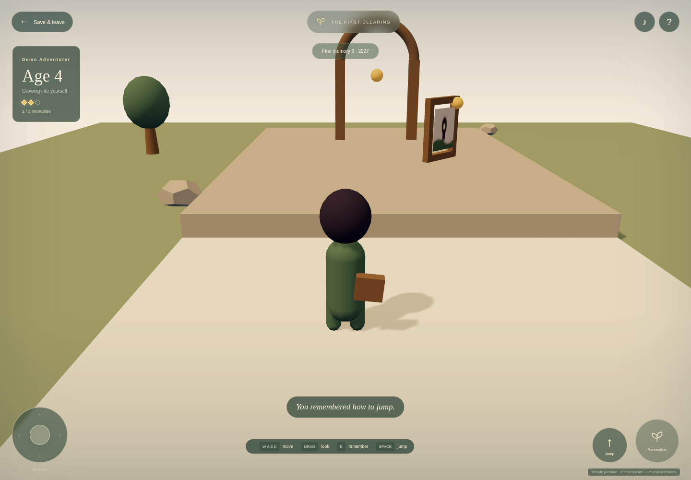
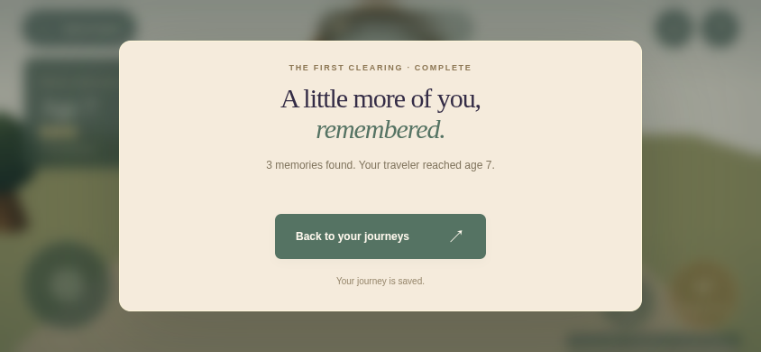
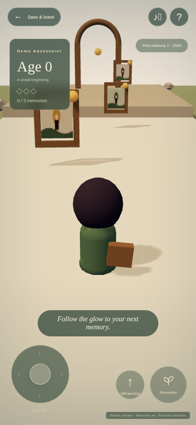

# Overnight MVP verification

The private [game](https://haynes-quest.haynesops.com) and [asset studio](https://haynes-quest.haynesops.com/studio/assets/catalog.html) are reachable through the home network’s internal ingress. All player records and pictures used for these checks were fictional. Gameplay uses temporary code-built art and remains silent while candidate assets await review.

## Build and deployment

Application [PR #21](https://github.com/thaynes43/haynes-quest/pull/21) merged as `6263dc42443eb5c33943d26f668da386df4900d4`. Its exact-head checks passed typecheck, lint, all 45 tests including three fresh PostgreSQL 16 integration tests, client/server build, strict documentation/media links and the container build. The [main image workflow](https://github.com/thaynes43/haynes-quest/actions/runs/34564020967) published the immutable image with provenance and keyless signing.

Initial deployed image: `ghcr.io/thaynes43/haynes-quest:sha-6263dc42443eb5c33943d26f668da386df4900d4@sha256:36b363a9e43912691d93a65c776cc9d958101a9d3a4379b7e1f4737e0a3f23b0`. Anonymous manifest, architecture, configuration and layer retrieval passed. Independent attestation download from dev-env was blocked by its existing Azure egress restriction; the successful signing/provenance workflow is the available evidence, and no egress policy was changed for that optional check.

Deployment [haynes-ops #2851](https://github.com/thaynes43/haynes-ops/pull/2851) merged as `6622a9b0988c69de2c9dedd7e51626ed439d2aea` after all nine required checks passed. Flux and Helm became Ready at the expected revision/chart. Normal HTTPS requests passed health, database readiness, studio and catalog checks. The fixture process receives its dedicated application Secret only, with internal-Traefik ingress and DNS/Postgres egress. It has no Immich or database administrator Secret.

## Live play

The coordinator completed the live browser run at **2026-09-11 05:13:46.653 UTC**, using Playwright 1.63.0 and Chromium 153.0.8010.12 with ANGLE SwiftShader rendering.

| Journey | Observed result |
| --- | --- |
| Keyboard | All three chronological memories, visible age-four growth, jump unlock, low-step crossing and finish |
| Save/resume | Leave, reload and continue preserve progress; the next memory remains reachable |
| Touch, 844 × 390 | Complete route with simultaneous stick/camera and stick/jump contacts |
| Portrait, 390 × 844 | Home and game have no horizontal overflow; movement and action controls fit the viewport |
| Cleanup | Pointer cancellation, focus loss and leaving desktop/touch/portrait scenes release inputs/canvases |
| Preferences | Mute and 0.65 volume survive game remount through local storage |
| Browser errors | Zero page errors |

[Machine-readable summary](media/overnight-mvp/journey-evidence.json)

## Persistence and isolation

The deployment lane retained one private signed cookie while creating a three-memory synthetic save and recovering its first two memories. After replacing only the application pod, it verified that the new pod had a different UID and was Ready. The same cookie resolved the same player and identical save state: selected manifest, recovery order, revision, age, abilities, appearance, rule versions and timestamps. The route then recovered its third memory and finished at revision four. A fresh independent session received 404 for both the other player’s save and its media. [Durable ops evidence](https://github.com/thaynes43/haynes-ops/pull/2852) merged as `8a37feb512f4c83a269789d8f705c3b5bfe09681`.

The audit left two synthetic saves: one completed and one partial from an earlier local assertion failure. The browser journeys added two completed saves and one portrait setup save. No direct database deletion was used to tidy these records. Private audit cookie files were removed, no temporary Jobs remained and the scoped activity declaration ended.

Dev-env was not restarted: the coordinator verified its original pod UID and zero container restart counts after the live browser run.

## Limits

Chromium touch emulation and software rendering do not establish physical iPhone/iPad Safari compatibility or frame rate. OAuth, admitted-player access, actual private subject setup/media and photo-derived likeness remain tomorrow’s work. An isolated Immich schema/thumbnail transport smoke is recorded in the handoff; it is not evidence of a real-player application journey. Candidate audio decoding and waveform measurements do not replace listening review, and no candidate model or sound is approved for gameplay.
