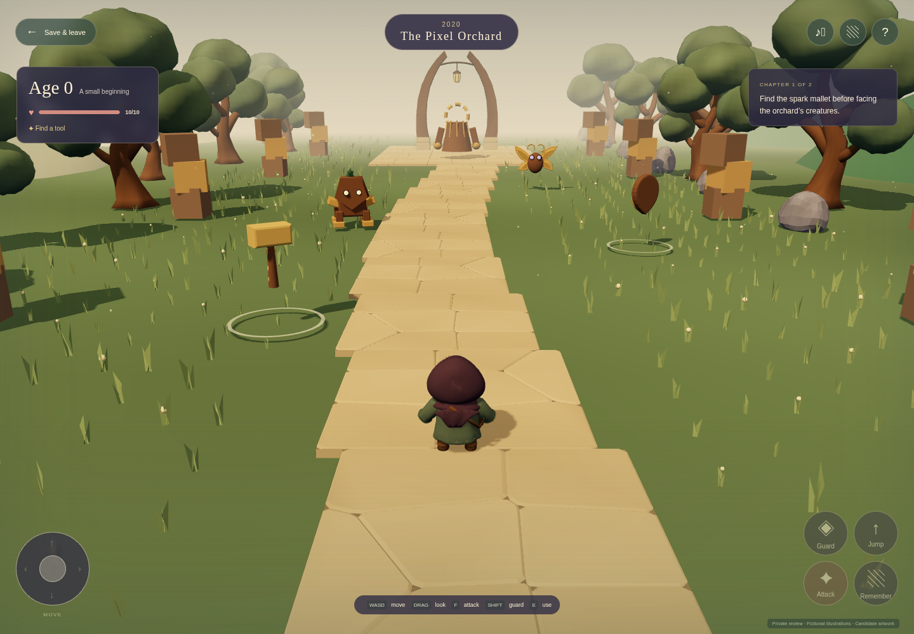
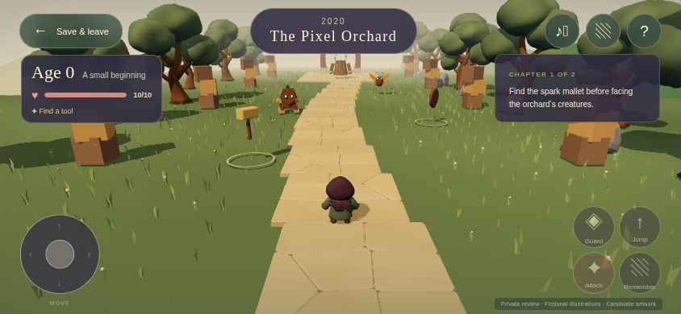
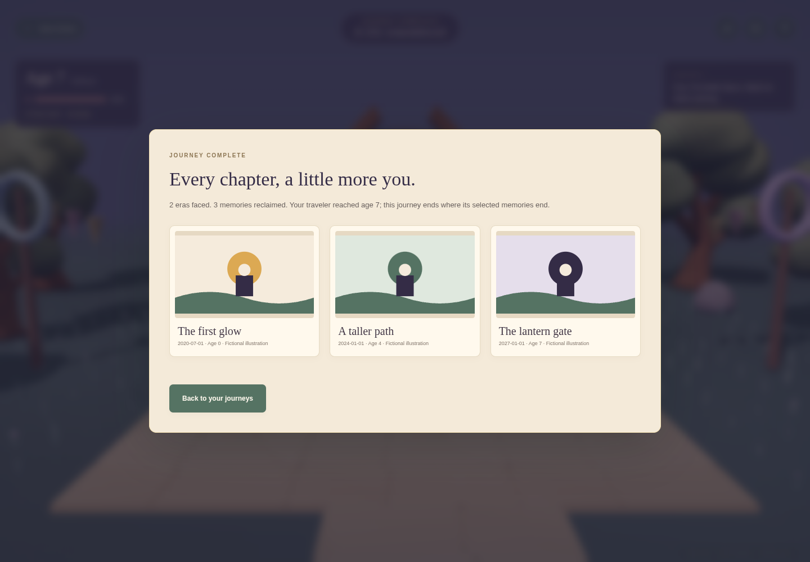

# Era combat verification

This record concerns the PLAN-005 correction: useful gear → era encounters → boss victory → released pictures → memory consumption → age and next period. It does not replace the separate evidence for the currently deployed historical prototype.

**Current state:** the corrected core code has passed isolated review and is ready for checked PR handling. Current creature/equipment asset production and visual review are still in progress. No PLAN-005 release has been deployed. The local game uses existing candidate GLBs and temporary enemy/equipment studies; owner approval for demo use remains pending. Real library photos, admitted-player OAuth and physical Safari have not been validated by these checks.

## Source and checks

Root worktree: `/home/dev/work/quest-era-boss-loop`, branch `agent/quest-era-boss-loop`, based on `3502ac7`. The integrated server/migration is `f7df719`, stored-state/PostgreSQL fixes `d25377d`, scene and UI `faa8bab`, low-frame-rate timing correction `08e1337`, and media regression test `88cdcec`.

TypeScript, lint and production build passed. The local suite passed 65 tests with eight PostgreSQL tests skipped because the local run had no database URL. The separate real-database result below covers those eight tests. Actual keyboard and emulated-touch gameplay passed both bosses and final age-seven completion, with all completion pictures decoded. Independent technical findings were recovered and fixed; the original separate Fable browser lane timed out and is not claimed complete.

The isolated test harness serves synthetic fixtures with in-memory storage at `127.0.0.1:4390`. It now runs in tmux window `main:quest-era-fixture`, with log `/tmp/quest-era-fixture.log`. Two earlier tool-owned processes ended with signal 143; their in-memory saves were discarded. This was a local test interruption, not a live application or dev-env restart. In-memory reload tests demonstrate application save/resume semantics within that process; they do not establish persistence across process replacement.

## Real PostgreSQL

The server lane ran `QUEST_TEST_DATABASE_URL=postgres://quest_test@127.0.0.1:5432/quest_test pnpm test:db` against PostgreSQL **16.14** in disposable Job `dev/quest-era-pg16-validation-0911`, using `postgres:16-alpine` and `/tmp/pgdata`. Result: **8 passed**, 36 skipped by the Postgres test-name filter, 3.94 seconds.

Coverage included owner isolation and state persistence, save-scoped action receipts, stale-tab serialization, simultaneous one-time bundle consumption, bounded receipt pruning, invalid persisted state, and migration of v1 saves without fabricated boss progress. The test used no application database or secrets.

The Job was deleted after verification. Scoped activity `act-131053-68425`, declared at `2026-09-11T13:10:53Z` for `dev`, was ended. The server lane retained the result in the task transcript; there is no archived raw Job log. CI will run the database suite again against the PR revision.

## Media delivery and failure recovery

Command: `QUEST_E2E_URL=http://127.0.0.1:4390 node tests/e2e/media.mjs`, test commit `88cdcec`, Chromium 153 / Playwright 1.63. Passed against the isolated candidate build:

- Three of three setup illustrations decoded.
- Two released owner-scoped media routes returned image bytes. Both photo canvases successfully reached actual WebGL texture uploads.
- Four deliberately aborted image requests recovered through bounded automatic retries.
- A picture held in permanent failure showed an explicit fallback; manual retry then decoded it.
- An aborted infant GLB load recovered through manual retry. Double-clicking retry created one replacement request, without duplicate attachment.
- Eight injected request failures and their corresponding browser/Three warnings were classified as expected. There were no unexpected console, page or network failures.

This test used API commands to arrange post-boss state solely for media delivery checks. It is not evidence of playable combat; the separate journey uses actual controls. The new image path fetches owner-authorized bytes, decodes through a document-origin blob, checks readable canvas pixels and applies the image to the keepsake’s named photo surface. Failures remain visible and retryable.

## Rendering measurements

Before static-model batching, two eight-second samples per viewport on build `index-B9Quey_b.js` measured 360 draw calls and 147,016 triangles per desktop frame (1440 × 1000, DPR 1), and 366 calls / 152,620 triangles in touch landscape (844 × 390, DPR 1). Desktop mean was 7.6–8.1 FPS; touch landscape was 11.2–14.6 FPS. Median callback CPU time was approximately 2–3 ms. The repeated static models and their shadow passes were the principal measured draw-call target.

These are Chromium SwiftShader software-rendering measurements. They are not physical-device acceptance or a claim of playable hardware performance. The measured batching result is below; actual device checks remain outstanding.

After batching repeated static GLBs, desktop draw calls fell from 360 to 222 and touch landscape from 366 to 225. Buffers fell about 40%; texture count remained 15. Two samples measured desktop 9.9–10.8 FPS and touch landscape 14.3–16.2 FPS. Submitted triangles increased by 10.9% / 7.2% because an instanced batch has a shared visibility bound. This trades fewer draw calls for coarser culling; spatial batches remain an option if real-device measurements warrant them.

[Exact sanitized renderer/media report](media/era-combat/render-media-report.json). Baseline bundle: `index-B9Quey_b.js`; batched candidate: `index-BXPUs-MN.js`. The media regression passed again on the candidate with no unexpected failures. These initial-scene captures confirm batch delivery; they show temporary encounter/equipment studies and do not establish finished art quality.

## Adversarial review and later corrections

[WO-015 results](../../.agents/work-orders/015-era-adversarial-results.md) records recovered independent client/server findings and lead dispositions. The Fable parent timed out waiting for its browser lane; that lane is not claimed complete. Concrete fixes cover secure UUID availability, stale-tab enemy revival, retained pending contact, fair pause telegraphs, cached-picture display, model retry/texture ownership, and dialog feedback. The subsequent combined local suite passed 82 tests with eight database tests skipped. Remote-retry regressions are integrated as `46ad8b9`, cached-picture fixes as `c5d217c`, and the bounded Fable server follow-up as `abee156`. The resulting full local suite passed **91 tests**, with **eight PostgreSQL tests skipped** pending PR CI. Typecheck, lint and production build passed.

## Final control journeys for the code PR

[Keyboard evidence](media/era-combat/journey-keyboard-evidence.json), completed `2026-09-11T14:10:04Z`; [touch evidence](media/era-combat/journey-touch-evidence.json), completed `2026-09-11T14:11:54Z`. Both use Chromium `153.0.8010.12`, final client bundle `index-C3rM52AX.js`, and real movement/actions through both periods. Read-only save assertions verified equipment, encounter/boss gates, unchanged age through victory and revelation, absorption from 0 → 4 → 7, save/leave/resume and the retained final 2024 world. Touch used 844 × 390 emulation with simultaneous controls, guard/jump and pointer cancellation. There were zero page errors. Keyboard also forced picture failures and recovered through the in-dialog retry.

These journeys ran on the in-memory harness before the final server clock/write-validation follow-up. After integrating `abee156`, root restarted only that owned local harness, repeated the media/first-boss action regression against the updated server and received the same passing counts: three previews, two released pictures, two actual WebGL uploads, bounded automatic/manual retries, no unexpected errors. PR CI verifies the full updated server and database suite. This distinction avoids claiming the earlier browser run used code that had not yet been loaded by the server.

These captures show fixture illustrations, not imported family photographs. The completion dialog scrolls within the touch viewport to reveal its captions and return control.
