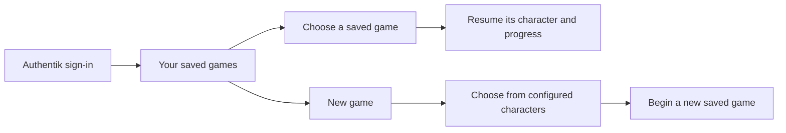

# PRD-001: Haynes Quest — initial project brief

- **Status:** Draft
- **Owner:** Tom Haynes
- **Last updated:** 2026-09-10
- **Source:** Owner's project kickoff and subsequent controls, saves, configurable-people, browser-device, asset-authoring, and family-PoC scope rulings on 2026-09-10

## Summary

A novelty 3D web game for the family's proof of concept, with Roblox as the style reference. Personalization comes from a self-hosted photo service: users configure a service URL, API key, and people's names for photos used in the game. Immich is the first integration. The PoC's playable character assets are authored through image generation and Blender MCP, then assigned to the configured roster. Players use on-screen controls on a touchscreen or a keyboard and mouse at a computer, and sign in through Authentik using the same approach as Haynes Network. The project has its own GitHub repository and will run on the local cluster through `haynes-ops`.

Tom selected **Haynes Quest**, repository slug **`haynes-quest`**, on 2026-09-10. The repository and documentation scaffold are established, and the game brief is being developed with Tom.

After signing in, players choose an existing saved game or start a new one using a configured character with an available authored model. The roster remains data-configured, with no built-in personal names or fixed two-character limit. Automatic model generation is [future backlog BL-01](../BACKLOG.md), to revisit only if Tom chooses to release the game beyond the family PoC. It does not block the PoC or require a generation trial now.

## Confirmed requirements

| ID | Requirement | Priority |
| --- | --- | --- |
| R-01 | The game is a 3D web application playable on iPad, iPhone, and PC. | Must |
| R-02 | The intended players are Tom's kids; this is a novelty family game. | Must |
| R-03 | Players collect real photos from the configured self-hosted photo service, with Immich as the first integration. Configured people also drive photo queries for other game uses as those are designed. | Must |
| R-04 | The project gets its own GitHub repository, with hosting on Tom's homelab managed through `haynes-ops`. | Must |
| R-05 | Repository and documentation conventions stay consistent with Tom's existing projects. | Must |
| R-06 | GPT-6 Astra leads the project end to end. | Must |
| R-07 | Use Roblox as the reference for the game's style. The specific look, camera, movement, and game world will be defined in the gameplay design. | Must |
| R-08 | Support touchscreen play with on-screen gameplay controls. | Must |
| R-09 | Support play with a keyboard and mouse at a computer. | Must |
| R-10 | Consider gamepad support after the initial playable scope; it is optional future work. | Later option |
| R-11 | Require players to sign in through Authentik, following Haynes Network's sign-in approach. Authentik is the only login method; do not add game-local passwords or separate login providers. | Must |
| R-12 | Use a data-configured playable-character roster linked to configured people, with authored assets for the family PoC and no hard-coded personal names or fixed two-character limit. | Must |
| R-13 | After login, let the player select one of their saved games or start a new game. | Must |
| R-14 | Starting a new game includes choosing an available character from the configured roster. The saved game retains that character's identity when resumed. | Must |
| R-15 | Automatically generate playable character models from configured people's photos. | Deferred; conditional future [BL-01](../BACKLOG.md), outside family PoC |
| R-16 | Establish the technical direction and document both technical and nontechnical requirements before setting up asset tools or starting production/prototype work. Tom will arrange tool setup after the documentation phase. | Current priority |
| R-17 | Let users configure the photo-service URL, API key, and people's names used to populate the game. | Must |
| R-18 | Resolve configured names to people in the connected photo service and retrieve their photos for gameplay content. Photos may also serve as references during developer asset authoring. | Must |
| R-19 | Deliver the game through a normal browser URL. Do not require a native iOS app, TestFlight, sideloading, or an app-install workaround. | Must |

## Saved games and characters

The signed-in player, the configured person in the photo library, and the playable character are separate concepts. New game uses roster entries with validated authored assets. If no character is available, explain the missing setup while keeping existing saves visible; do not show a generation queue or promise automatic creation. Adding a photo-library person does not supply a 3D model. Character selection is not an account login. The number of save slots, save naming, save timing, and any later character-switching behavior remain for design.

Names are user-facing configuration, not permanent save keys. The proposed integration resolves them to source people and assigns stable game character IDs. It must handle missing or duplicate names without silently selecting an unrelated person. A name change or replacement authored model must not turn an existing save into a different character. See [DESIGN-003](../designs/003-photo-connections-and-people.md).

## Input and sign-in direction

Touchscreen play on **iPad and iPhone** and keyboard/mouse play on **PC** are required for the first playable slice. Tom confirmed these device families and browser-only delivery on 2026-09-10. Players open the homelab-hosted HTTPS URL in their browser; a native iOS build or TestFlight distribution is not part of the project.

Use Safari on iPad/iPhone as the touch-browser validation baseline and a desktop browser on PC. Exact hardware models, OS/browser version floors, and the PC browser matrix will be recorded for the prototype. Touch layout, keyboard bindings, and camera controls still need gameplay design. Optional gamepad support does not block that slice.

The Roblox reference establishes a style direction. It does not yet specify a camera viewpoint, character design, building system, multiplayer mode, or support for user-created games.

The Authentik decision is recorded in [ADR-001](../adrs/001-authentik-sign-in.md). The identity provider is settled; the policy for which signed-in people may enter this family game still needs to be defined. An existing Haynes Network account does not by itself establish permission to access the game's photos.

## Acceptance criteria for the first playable slice

These are requirements for future implementation, not completed checks. The playable loop and exact hardware/browser versions must be recorded before validating them against the confirmed iPad, iPhone, and PC targets.

| ID | Criterion | Requirements |
| --- | --- | --- |
| AC-01 | On both an iPad and an iPhone using the Safari baseline, a player can complete the core play-and-collect loop using touch and the on-screen controls without a keyboard or mouse. | R-01, R-03, R-08 |
| AC-02 | In an agreed PC browser, a player can complete the same loop using a keyboard and mouse without a touchscreen. | R-01, R-03, R-09 |
| AC-03 | A signed-out visitor must sign in through Authentik before entering gameplay or accessing protected collectible photos. The game offers no alternative login method. | R-11 |
| AC-04 | A player admitted by the game's eventual access policy can sign in with their existing Authentik identity without setting up a game-local password. | R-11 |
| AC-05 | After login, the player can see their saved games and a New game action. Missing photo setup or authored character assets have clear states; available saves remain listed. | R-13, R-17 |
| AC-06 | New game uses the configured roster and records the selected available character in a distinct save. Adding another roster entry uses data and an authored asset without adding a character name to application logic. | R-12, R-14 |
| AC-07 | Resuming a save restores its character and recorded progress without creating a new save or requiring character selection again. | R-13, R-14 |
| AC-08 | One signed-in player cannot list, read, or modify another player's saves by changing an identifier. | R-11, R-13 |
| AC-09 | A user can configure their service URL, API key, and people. Missing or ambiguous people and invalid connections produce actionable setup states instead of unrelated photo results. | R-17, R-18 |
| AC-11 | Gameplay photo requests use the configured connection and resolved people; they do not fall back to another account's library or an unrestricted image search. | R-03, R-18 |
| AC-12 | Renaming a source person or replacing their authored character asset preserves the game's character identity and saved progress. | R-14 |
| AC-13 | On iPad, iPhone, and PC, opening the homelab-hosted HTTPS URL supports sign-in, setup, new-game selection, and resuming a ready save in the browser without installing an app or using TestFlight. | R-01, R-04, R-19 |

## Conditional future acceptance

These criteria are retained for the [backlog](../BACKLOG.md), not for PoC acceptance.

| ID | Criterion | Requirements |
| --- | --- | --- |
| AC-10 | If automatic character generation is pursued for a broader release, the application retrieves a configured person's eligible photos and produces a validated, usable character model, with visible progress and recoverable failures that preserve existing characters and saves. | R-15; BL-01 |

## Current scope

The bootstrap established the name, contributor guide, document templates, project brief, vocabulary, handoff, and completion record after reviewing sibling repositories. Continue documenting the technical and nontechnical requirements, including the [technology stack](../adrs/002-web-game-stack.md), [technical foundation](../designs/001-technical-foundation.md), [asset pipeline](../designs/002-asset-pipeline.md), [photo-connection/person contract](../designs/003-photo-connections-and-people.md), and remaining player experience. Tool setup, asset production, and prototype implementation follow completion of this documentation phase.

Tom proposed generating asset sketches with image generation, then having the agent create the assets in Blender through MCP. This is the PoC authoring direction for characters and shared game assets in DESIGN-002. His subsequent scope ruling defers automatic character generation to a possible release beyond the family PoC; its workers, job simulation, and provider trials are not active requirements. No tooling has been connected or installed for this proposal.

The recommended stack is a proposal to validate in a small technical prototype, not an implemented runtime. Further gameplay acceptance criteria, viewpoint, progression, and multiplayer decisions will follow the remaining brief.

## Open and deferred decisions

| ID | Decision | Needed by | Status / resolution |
| --- | --- | --- | --- |
| Q-01 | Project name and repository slug | Repository creation | Resolved by Tom on 2026-09-10: `haynes-quest` (Haynes Quest). |
| Q-02 | Game world, player loop, controls, and target devices | Product/design phase | Partially resolved by Tom on 2026-09-10: Roblox-style direction; iPad/iPhone touch and PC keyboard/mouse in a normal web app; homelab hosting; no native iOS/TestFlight path. Gamepad is a later option. World, loop, precise controls, and exact hardware/browser versions remain for design and testing. |
| Q-03 | Which source photos are eligible and how they become collectibles | Integration design | Partially resolved by Tom on 2026-09-10: use the configured service/key and named people for photo lookup. Detailed content filters and the game's uses of these photos remain for design. |
| Q-04 | Engine, app structure, persistence, and access model | Architecture phase | Authentik-only login is resolved by Tom. Saved games are now required. ADR-002 proposes the engine, application structure, and storage; admission rules still need design. |
| Q-05 | Characters and new/resume game flow | Foundation design | Resolved by Tom's revised brief on 2026-09-10: select an existing save or start new after login; use a data-configured roster with developer-authored models for the family PoC. Automatic models move to conditional future BL-01. |
