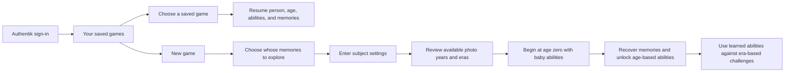

# PRD-001: Haynes Quest — initial project brief

- **Status:** Draft
- **Owner:** Tom Haynes
- **Last updated:** 2026-09-11
- **Source:** Owner's project kickoff and subsequent platform, memory-journey, era/ability, and playable-PoC/Astra-team/audio brief on 2026-09-10

## Summary

A novelty 3D web game for the family's proof of concept, with Roblox-like gameplay and a polished storybook visual direction, using Disney Dreamlight Valley as a broad mood reference. The player controls a generic, mysterious character who begins at memory age zero with no memories and only baby abilities. Starting a game selects a person from a configured self-hosted photo library; their photos become memories collected through a chronological journey across the years available for that person. The player finds useful gear and defeats each period’s boss before consuming its released memory bundle to advance age, unlock lasting abilities and enter the next period. Immich is the first integration. Enemies and bosses are recognizable, funny parodies of pop culture from the years represented in each journey. The shared avatar, enemies, bosses, and world assets are authored through image generation and Blender MCP. Players use touch controls or a keyboard and mouse, sign in through Authentik as on Haynes Network, and play a normal browser app hosted through `haynes-ops`.

Tom selected **Haynes Quest**, repository slug **`haynes-quest`**, on 2026-09-10. The repository and documentation scaffold are established, and the game brief is being developed with Tom.

After signing in, players choose an existing saved game or start a new person's memory journey. The selected person supplies the photos and timeline; they do not need a playable likeness model. The avatar remains independent of that selection. Names are configured data. Automatic person-specific models remain [conditional future backlog BL-01](../BACKLOG.md), and would require reconsidering this generic-avatar premise if pursued.

## Latest owner correction

On September 11, Tom clarified the core arc: find useful equipment during the level, fight enemies drawn from that period’s pop culture, defeat its boss, then consume enough memories to advance to the next age bracket. The next level takes place in the period of that advanced age. Equipment, enemies and the boss are essential to the playable slice. Individual memory pickups must not grow the avatar during the level. [DESIGN-010](../designs/010-era-combat-loop.md) supersedes the earlier simplified loop below.

Tom further clarified that the enemies must be recognizable pop-culture parodies, using photo capture metadata and the person's birthday to place the journey in calendar periods and age brackets. The six friendly residents provide optional healing gifts and recoverable penalties for deliberate harm under DESIGN013. The earlier broad-inspiration-only interpretation is superseded; [DESIGN-005](../designs/005-era-enemy-catalog.md) records the correction.

Tom also requires Roblox-style obby gameplay mixed with goofy fights: hazards, movement timing and jumps, tuned for his six-year-old daughter. Short forgiving sections, broad landing areas and nearby recovery are part of the core slice under [DESIGN-011](../designs/011-forgiving-obby.md).

## Future lifetime direction

Tom has explicitly placed age-based challenge growth and real-life continuation in [BL-06](../BACKLOG.md#bl-06-a-lifetime-campaign-that-grows-with-the-player). Later recovered ages bring more abilities and demanding content; a child may need to live more years before continuing, while an adult can explore decades of existing memories. His proposed 37-year private archive will support a future infancy-to-adulthood playtest after the private photo flow is ready. This is product direction, not a current MVP implementation or completed real-photo test.

## Confirmed requirements

The September 12 builder pivot in [DESIGN016](../designs/016-authored-levels.md) supersedes automatic photo grouping as the central setup experience. Authors can build a different adventure for each person, place integrated or uploaded memories, and choose from period suggestions or the wider authorized catalog. PLAN008 fixes the reported mobile failures before richer level construction.

The established platform constraints remain in force. R-12, R-14, and R-20–R-34 express Tom's narrative and gameplay direction within this draft. Memory-age progression now adds an age-zero start and accumulating abilities to decade-like/proportional levels and the era enemy/boss catalog. Exact abilities, age thresholds, grouping, personalization weights, and encounter mechanics remain proposed in DESIGN-004–DESIGN-006.

| ID | Requirement | Priority |
| --- | --- | --- |
| R-01 | The game is a 3D web application playable on iPad, iPhone, and PC. | Must |
| R-02 | The intended players are Tom's kids; this is a novelty family game. | Must |
| R-03 | Authors place collectible memories from authorized photo integrations, with Immich first, or manual uploads. Configured people support photo lookup when using an integration; an upload-only draft does not require Immich. | Must |
| R-04 | The project gets its own GitHub repository, with hosting on Tom's homelab managed through `haynes-ops`. | Must |
| R-05 | Repository and documentation conventions stay consistent with Tom's existing projects. | Must |
| R-06 | GPT-6 Astra leads the project end to end. | Must |
| R-07 | Use Roblox-like gameplay with a polished storybook look and feel inspired broadly by Disney Dreamlight Valley. Maintain an original visual identity and coherent reference set under the asset art brief. | Must |
| R-08 | Support touchscreen play with on-screen gameplay controls. | Must |
| R-09 | Support play with a keyboard and mouse at a computer. | Must |
| R-10 | Consider gamepad support after the initial playable scope; it is optional future work. | Later option |
| R-11 | Require players to sign in through Authentik, following Haynes Network's sign-in approach. Authentik is the only login method; do not add game-local passwords or separate login providers. | Must |
| R-12 | Begin with a mysterious avatar at memory age zero without memories and with baby abilities; as memories recover identity, its appearance should evolve toward the represented age and likeness. PLAN-004 uses synthetic age stages for the overnight proof while final likeness design remains open. | Must |
| R-13 | After login, let the player select one of their saved games or start a new game. | Must |
| R-14 | Starting a new game includes choosing whose memories to explore from the configured people. The saved game retains that person's identity and journey progress when resumed. | Must |
| R-15 | Consider automatically generating playable age/likeness variants from configured people’s photos. Personalization is now product direction, but automatic model generation remains deferred under [BL-01](../BACKLOG.md). | Later; not an overnight dependency |
| R-16 | Define the technical and nontechnical contracts for the next playable slice. Tom now prioritizes the PLAN-003 dependency checkpoint before fresh-context development dispatch. Full gameplay/story detail remains deferred; after setup, synthetic placeholders allow code work while final assets are produced and reviewed. | Current priority |
| R-17 | Let users configure the photo-service URL, API key, and people's names used to populate the game. | Must |
| R-18 | Resolve configured names to people in the connected photo service and retrieve their eligible photos and usable dates for gameplay content and timeline construction. | Must |
| R-19 | Deliver the game through a normal browser URL. Do not require a native iOS app, TestFlight, sideloading, or an app-install workaround. | Must |
| R-20 | Organize collected memories into chronological chapters, beginning with baby photos when available and continuing through the latest available photos of the selected person. | Must |
| R-21 | Tailor the chapter coverage to the person's represented years. A short childhood library and a library spanning decades must not be forced into the same fixed lifespan or empty future stages. | Must |
| R-22 | Distinguish photo-date coverage from the person's age. Do not treat the earliest photo as birth or infer age from appearance. Use the selected person's birthday with photo capture metadata for age calculation, labels and ability progression; calendar-year labels alone cannot determine abilities. | Must; birthday confirmed |
| R-23 | Collecting photos recovers memories and advances the selected journey. Preserve collected-memory and chapter progress across save/resume and avatar asset replacement. | Must |
| R-24 | Handle missing early photos, sparse years, date problems, and later library changes without inventing memories, silently resetting progress, or requiring empty chapters. | Must |
| R-25 | Group levels around decades or proportions of the available history, tailoring pacing to known age and photo coverage. Exact boundaries and count remain for design; a short history may have several levels within one era and no fixed ten-level rule is required. | Must; grouping details open |
| R-26 | Support explicitly entering the selected subject's gender at new-game setup to inform personalization within the eligible era catalog. Curate variety across genders; input options, requiredness, and preference rules remain for design. Do not infer gender from photos or names; difficulty is separate. | Must; setup details open |
| R-27 | Enemies and bosses are recognizable, funny pop-culture parodies. Suggest entries relevant to a level's represented calendar period using original dates and curated relevance windows. Authors can use Show more for an explicit wider choice without rewriting history. | Must |
| R-28 | Use a finite, authored catalog of prepared enemies and bosses with historical relevance metadata. Authors select encounters or confirm suggested choices for each journey; runtime trend retrieval and automatic enemy generation are not required. | Must |
| R-29 | Author recognizable parodies with a specific cultural target, visual joke and encounter behavior. Preserve reference and production provenance. Generic creatures with vague cultural labels do not satisfy the enemy vision. See DESIGN-005 and the asset pipeline. | Must |
| R-30 | Every new save starts at memory age zero with no collected memories and a playable baby ability set. The first memory must be reachable with that set. | Must |
| R-31 | Only after defeating the level boss does consuming its required memories advance the character into the next age bracket. The next level uses that age’s corresponding calendar period. Photo reveal/pickup alone cannot grow the avatar mid-level. Preserve chronological and explicit age-source consistency. | Must |
| R-32 | Unlock abilities appropriate to the recovered age and retain earlier abilities into later stages. No later-age power is usable before its progression requirement; exact abilities and thresholds remain for design. | Must |
| R-33 | Routes, objectives, enemies, and bosses must be solvable with abilities available at that point. Missing infancy, age gaps, and short child histories cannot require nonexistent memories or unearned future abilities to finish. | Must |
| R-34 | Persist memory age, unlocked abilities, and progression-rule/age-source revisions with memory and encounter progress. Recovery and unlocks remain consistent across retries, resume, devices, and explicit library/rule reconciliation. | Must |
| R-35 | The bounded playable slice includes useful equipment, era enemies, a boss and post-boss memory consumption/age progression. These establish the core loop. Broader rosters and full story may follow; do not defer the combat and boss that make the slice meaningful. | Current priority |
| R-36 | Driving Astra generates concept images serially to keep the visual direction consistent, then delegates every Blender task to a fresh Astra subagent. It can create and iterate the entire scoped first pass before Tom reviews; his exact-version review still precedes final visual/audio promotion into gameplay. | Must |
| R-37 | Establish an audio-authoring tool and repeatable cue workflow alongside visual authoring. Prepare and review files during development; the game need not generate audio while playing. Full music and narration can follow later. | Must; self-hosted authoring selected |
| R-38 | GPT-6 Astra coordinates and delegates bounded work with fresh contexts and self-contained work orders. Sol at `xhigh` is the default native lane; Blender always uses Astra. Separate Fable 5.1 at `xhigh` via `agent-run` is authorized for adversarial reviews and coding to balance plan use. Follow TEAM.md for serial resources and durable checkpoints. | Must |
| R-39 | Support user-started browser audio, persistent mute/volume preferences, visible equivalents for required cues, and safe interruption/resume on touch and PC. Missing or blocked audio must not prevent play. | Must |
| R-40 | Support finite configured photo journeys; store entered person names, resolved identities and private photo/age configuration server-side. Reuse AppDaemon’s Immich connection for the family PoC through ExternalSecrets/1Password. Use fictional repository fixtures. | Must |
| R-41 | Maintain a Material for MkDocs documentation site in `docs/`, cataloging all scoped source concepts, generated models and audio with concrete previews, provenance, versions, feedback and approval state. Keep personal assets outside public git and static site output. | Must |
| R-42 | In the future lifetime campaign, increase challenge and combinations of retained abilities as recovered age advances, supporting more demanding later childhood and adult play while retaining appropriate assistance. | Future; BL-06 |
| R-43 | Let a journey through one's own life catch up to available lived memories, then support explicit saved continuation when real age, curated photos and authored content permit. Preserve completed progress and never invent future memories or grant abilities merely for elapsed time. | Future; BL-06 |
| R-44 | Humans and agents can author personalized levels using reusable pieces and a shared validated level document. Place obstacles, equipment, encounters and memories with guardrails for reachability, required abilities, collision, combat and progression. | Future implementation; BL-07 |
| R-45 | Each level records its represented period. Suggest relevant photos and bosses, with Show more for other authorized selections. Authors can assign integrated or manually uploaded pictures to memory roles and positions. | Future implementation; BL-07 |

The completed overnight milestone is [PLAN-004](../../.agents/plans/completed/004-overnight-mvp.md). Tom permits a private placeholder account for coding/testing and defers OAuth setup until tomorrow; Authentik remains the eventual sole player login. Older scope paragraphs describe the preceding synthetic-only milestone.

## Saved games and memory journeys

The signed-in player, the person whose memories are explored, and the avatar are separate concepts. Adding a resolved person with usable photos makes another journey possible without authoring a new character model. The player chooses the journey's subject, while the same generic avatar can be used across subjects. Whether the story ultimately reveals that the avatar is the selected person remains undecided.

Names are editable labels, not permanent save keys. Resolve them to the correct source person and retain a stable game-owned subject ID. A rename, replacement avatar asset, or newly imported photo must not change whose journey a save belongs to or erase its age, abilities, or other progress. Starting another person's journey creates a separate game. Missing photo setup or an unavailable avatar must leave existing saves visible. Save-slot count, naming, cadence, and refresh policy remain for design.

The photo range determines which years are represented, not the person's actual age or a complete biography. Start with the earliest eligible dated memories; if infancy is absent, do not label the earliest available adult photos as babyhood. End at the latest represented period. [DESIGN-006](../designs/006-memory-age-and-abilities.md) uses the person's birthday before age-gated play. Calendar-year coverage remains useful for previews and era selection but cannot replace the age needed to unlock abilities. Exact chapter boundaries, required collectibles, and the world and challenges within each chapter remain for gameplay design.

Tom's revised direction is decade-like or proportional chapters across available photo coverage, with counts and boundaries adapted to the history. Short histories can have several levels within an era; long histories span successive eras. Combine sparse periods and bound required memories in dense ones. Exact grouping rules remain open; ten levels is not a requirement.

Enemies and bosses come from a static, authored catalog of recognizable parodies of period-relevant pop culture. The photo dates select the eligible era pool, and explicitly entered subject gender/settings can inform personalization within it. The catalog offers variety across genders. A childhood in the 1990s draws different influences from a childhood in a later decade; later photos advance the cast toward later eras. [DESIGN-005](../designs/005-era-enemy-catalog.md) defines the proposed catalog contract. The current two-period roster studies and provisional combat/boss mechanics are in DESIGN-005 and DESIGN-010; finished new assets, broader historical references and preference weighting remain outstanding.

## Memory age and abilities

Each new journey begins with the generic avatar at age zero, no memories, and a small playable baby ability set. After finding useful gear and defeating the current period’s boss, the player reveals and consumes its memory bundle to advance to the represented age and the next period. Individual photo revelation does not change age. New movement, interaction, tool, and puzzle abilities build on earlier skills, and the player carries them into later periods. Exact actions and thresholds are still to be designed in [DESIGN-006](../designs/006-memory-age-and-abilities.md).

Calendar dates determine the cultural-era enemy pool; recovered age determines the character's abilities and, in the future lifetime campaign, increasing challenge and content complexity. The human player's challenge/assistance settings remain separate, while every required encounter must fit the abilities currently available. Entering a chapter does not grant all powers from its latest photos. Missing infancy still permits a journey that starts at zero: a short opening and guided catch-up to the earliest real memory's age are proposed, with no fabricated baby photos.

## Input and sign-in direction

Touchscreen play on **iPad and iPhone** and keyboard/mouse play on **PC** are required for the first playable slice. Tom confirmed these device families and browser-only delivery on 2026-09-10. Players open the homelab-hosted HTTPS URL in their browser; a native iOS build or TestFlight distribution is not part of the project.

Use Safari on iPad/iPhone as the touch-browser validation baseline and a desktop browser on PC. Exact hardware models, OS/browser version floors, and the PC browser matrix will be recorded for the prototype. Touch layout, keyboard bindings, and camera controls still need gameplay design. Optional gamepad support does not block that slice.

The Roblox reference establishes a style direction. It does not yet specify a camera viewpoint, character design, building system, multiplayer mode, or support for user-created games.

The Authentik decision is recorded in [ADR-001](../adrs/001-authentik-sign-in.md). The identity provider is settled; the policy for which signed-in people may enter this family game still needs to be defined. An existing Haynes Network account does not by itself establish permission to access the game's photos.

## Acceptance criteria for the family game

These are requirements for future implementation, not completed checks or a demand to implement the whole game before its first prototype. The bounded initial PoC has its own [DESIGN-007 acceptance criteria](../designs/007-poc-development-loop.md#poc-acceptance), using synthetic memories. Real photo integration, full chapter coverage, and enemy content follow in later milestones. Record the exact tested hardware/browser versions for each trial.

| ID | Criterion | Requirements |
| --- | --- | --- |
| AC-01 | On both an iPad and an iPhone using the Safari baseline, a player can complete the core play-and-collect loop using touch and the on-screen controls without a keyboard or mouse. | R-01, R-03, R-08 |
| AC-02 | In an agreed PC browser, a player can complete the same loop using a keyboard and mouse without a touchscreen. | R-01, R-03, R-09 |
| AC-03 | A signed-out visitor must sign in through Authentik before entering gameplay or accessing protected collectible photos. The game offers no alternative login method. | R-11 |
| AC-04 | A player admitted by the game's eventual access policy can sign in with their existing Authentik identity without setting up a game-local password. | R-11 |
| AC-05 | After login, the player can see their saved games and a New game action. Missing photo setup, usable memories, or shared avatar assets have clear states; saves remain listed. | R-13, R-17, R-24 |
| AC-06 | New game selects a configured person and records that subject in a distinct save. Selecting another eligible person requires configuration and photos, with no person-specific model or hard-coded name. | R-12, R-14 |
| AC-07 | Resuming a save restores its selected person, chapter, and collected memories without creating a new save or requiring subject selection again. | R-13, R-14, R-23 |
| AC-08 | One signed-in player cannot list, read, or modify another player's saves by changing an identifier. | R-11, R-13 |
| AC-09 | A user can configure their service URL, API key, and people. Missing or ambiguous people and invalid connections produce actionable setup states instead of unrelated photo results. | R-17, R-18 |
| AC-11 | Gameplay photo requests use the configured connection and resolved people; they do not fall back to another account's library or an unrestricted image search. | R-03, R-18 |
| AC-12 | Renaming a source person or replacing the generic avatar asset preserves the selected subject, chapter, and collected-memory progress. | R-14, R-23 |
| AC-13 | On iPad, iPhone, and PC, opening the homelab-hosted HTTPS URL supports sign-in, setup, new-game selection, and resuming a ready save in the browser without installing an app or using TestFlight. | R-01, R-04, R-19 |
| AC-14 | The same generic avatar supports journeys for different configured people and begins each new journey without memories; selecting a person does not select a likeness model. | R-12, R-14 |
| AC-15 | A test library spanning multiple periods produces ordered chapters from its earliest eligible photos to its latest; collecting memories and resuming a save preserve the intended chronology and progress. | R-20, R-23 |
| AC-16 | Photo coverage is separate from age. A supported age source produces ages for labels and ability progression. Missing age information produces an actionable setup state for age-gated play; the earliest photo is never assumed to depict birth. | R-22 |
| AC-17 | Libraries with missing infancy, sparse decades, a single represented year, or no usable dates produce supported chapters or an actionable setup state, with no invented or mandatory empty life stage. | R-21, R-24 |
| AC-18 | New uploads, corrected dates, and removed photos cannot silently switch a save's subject, reorder completed chapters, erase collection credit, or award the same memory twice. | R-23, R-24 |
| AC-19 | The chosen chapter policy produces a preview consistent with the saved journey for short, long, single-year, and sparse libraries. It avoids mandatory empty chapters and unbounded collection targets; exact expected counts follow the eventual grouping decision. | R-21, R-24, R-25 |
| AC-20 | Setup supports explicit subject gender/settings, with a supported path for unknown information under the eventual input policy. Personalization selects within the era-eligible pool, survives resume, and does not alter subject identity, memory progress, or difficulty. Gender is not inferred from names or images. | R-26 |
| AC-21 | Synthetic subjects at the same age in different calendar periods receive era-appropriate enemy and boss pools. Test mid-decade introductions, cross-era chapters, old photos uploaded later, and journeys ending before the present day. | R-25, R-27 |
| AC-22 | Runtime encounters use prepared catalog entries and assets without live trend feeds, reference-video downloads, or generation jobs. Missing period coverage uses the designed neutral fallback or an actionable availability state without skipping memories or selecting later-era enemies. | R-27, R-28 |
| AC-23 | Catalog updates and profile edits do not reroll saved enemy/boss selections or reset encounter/memory progress. Unavailable assets have a compatible replacement or recoverable state that preserves progress. | R-23, R-28 |
| AC-24 | Enemy/boss entries have historical eligibility evidence, original design or license provenance, and validated asset versions before use. Passing these authoring checks is not described as a legal guarantee. | R-27–R-29 |
| AC-25 | On touch and keyboard/mouse, a new save starts at zero with no memories and only its baby abilities, and the first memory can be reached using those abilities. Another save does not inherit its unlocks. | R-08, R-09, R-30 |
| AC-26 | Boss defeat and individual photo revelation leave age unchanged. Consuming the completed released bundle advances age and unlocks eligible abilities; earlier abilities remain available across chapters and eras. Chapter entry, photo count, same-age photos, and elapsed time do not independently award later abilities. | R-31, R-32 |
| AC-27 | Required paths and boss/enemy solutions never depend on an ability obtainable only beyond the obstacle. A child journey can finish without adult abilities, and missing infancy or large gaps use the designed reachable progression path. | R-24, R-33 |
| AC-28 | Memory recovery, age, and ability unlocks save consistently across retry, stale tabs, reload, and another device. Duplicate or out-of-order requests and forged client ages/unlocks cannot bypass progression; older revisits cannot remove earned abilities. | R-31, R-32, R-34 |
| AC-29 | Age-source/date corrections, catalog or progression-rule updates, and asset replacement follow explicit reconciliation while retaining saved identities and progress. Unavailable photos stay inaccessible without silently revoking recorded abilities. | R-24, R-34 |
| AC-30 | A bounded two-period route demonstrates useful equipment, era enemies and a boss, visible post-boss pictures, deliberate memory consumption, age/appearance/ability growth and the next period, with retained gear and server-owned resume on both input modes. | R-35 |
| AC-31 | Every final visual/audio version promoted into gameplay has Tom's recorded approval and reproducible review evidence. Pending/rejected candidates remain outside normal gameplay; placeholders or prior approved versions keep code iterations usable. | R-36 |
| AC-32 | Prepared audio cues work after user interaction, retain mute/volume preferences, survive scene/background transitions without duplicate or stale playback, and leave the route completable when muted or unavailable. No authoring key is shipped to the browser. | R-37, R-39 |
| AC-33 | Agent work orders identify scope, owned files/resources, stable asset/cue/ability contracts, and verifiable handoff results. The team can repeat the code, author, review, integrate, and playtest cycle for one small slice. | R-38 |
| AC-34 | The Material asset studio links every scoped candidate to its source concepts, model/animation views or playable audio, exact artifacts, technical evidence and separate coordinator/owner decisions. Public output contains no personal references or secret material. | R-36, R-38, R-41 |

## Conditional future acceptance

These criteria are retained for the [backlog](../BACKLOG.md), not for PoC acceptance.

| ID | Criterion | Requirements |
| --- | --- | --- |
| AC-10 | If person-specific playable models are separately reintroduced for a broader release, automatic generation produces validated models from eligible photos, with progress and recoverable failures that preserve existing journeys. This is outside the generic-avatar PoC. | R-15; BL-01 |
| AC-35 | A future synthetic archive spanning 37 years demonstrates infancy-to-adulthood progression, escalating obby/combat complexity and taught, retained abilities. A subsequent authorized private archive test validates real chronology and curation; neither test is required for the current MVP. | R-42; BL-06 |
| AC-36 | A future child journey reaches a satisfying current endpoint, grants no progress simply when a birthday passes, and can be explicitly extended with eligible new memories/content without changing completed chapters, identities, victories or learned abilities. | R-43; BL-06 |

## Current scope

Tom confirms the mobile repair and audible sound on his iPhone. The next family MVP is designed for his six-year-old daughter: [PLAN009](../../.agents/plans/009-daughter-playground-mvp.md) and [DESIGN017](../designs/017-daughter-playgrounds.md) deliver longer, more varied and forgiving levels first. Identity and deliberately curated personal photos are the following required MVP stage. The full lifetime campaign and the older-child difficulty curve remain future extensions.

The bootstrap established the repository and documentation conventions. The current focus is a [small playable PoC and development loop](../designs/007-poc-development-loop.md), with [audio authoring/playback](../designs/008-audio-pipeline.md) alongside the existing visual pipeline. PLAN-003 tool setup and the PLAN-004 private synthetic slice are complete; the handoff records deployed behavior and the remaining player-ready gates. Finishing all combat, collectibles, era content, or story design is no longer a prerequisite; those details are [backlogged](../BACKLOG.md).

Tom confirmed image-generated sketches followed by Blender MCP models and his review before final assets are used. Astra coordinates using the project team routing: serial concept generation by the lead, Astra-only Blender tasks, Sol for default bounded work and authorized Fable sessions for review/coding. The first-pass catalog is required alongside the playable slice. DESIGN-008 selects a separate self-hosted Stable Audio Small-SFX service using the official optimized CPU distribution. FFmpeg processing and prepared browser playback remain the workflow. PLAN-003 records completed live readiness and the earlier authorized tool activation. Automatic character generation remains conditional future BL-01. Blender and audio run separately from dev-env. The private MVP and first-pass catalog are deployed; no final game asset is approved.

The recommended stack remains a proposal to validate. DESIGN-007 uses one test level, three synthetic memories, and one new movement ability as small implementation defaults, not final game quotas or age milestones. A fictional known birth date supplies the test age mapping without settling the real-person setup policy. The premise already motivates collection; a complete narrative and identity reveal are not needed for this probe. [PLAN-002](../../.agents/plans/002-foundation-prototype.md) separates the first coding milestone from hosted Authentik/save validation and reviewed-asset integration.

## Open and deferred decisions

| ID | Decision | Needed by | Status / resolution |
| --- | --- | --- | --- |
| Q-01 | Project name and repository slug | Repository creation | Resolved by Tom on 2026-09-10: `haynes-quest` (Haynes Quest). |
| Q-02 | Game world, player loop, controls, and target devices | Product/design phase | Partially resolved by Tom on 2026-09-10: Roblox-style direction; iPad/iPhone touch and PC keyboard/mouse in a normal web app; homelab hosting; no native iOS/TestFlight path. Gamepad is a later option. Chronological memory collection now establishes progression direction. World, challenges, precise controls, and exact hardware/browser versions remain for design and testing. |
| Q-03 | Which source photos are eligible and how they become collectibles | Integration design | Partially resolved by Tom on 2026-09-10: use the configured service/key and named people for photo lookup. Photos now represent memories in chronological chapters. Detailed content filters, date handling, and chapter completion remain for design. |
| Q-04 | Engine, app structure, persistence, and access model | Architecture phase | Authentik-only login is resolved by Tom. Saved games are now required. ADR-002 proposes the engine, application structure, and storage; admission rules still need design. |
| Q-05 | Characters and new/resume game flow | Foundation design | Revised by Tom on 2026-09-10: generic mysterious avatar with no memory; select whose chronological photo journey to explore. Per-person playable models are no longer part of the PoC. See DESIGN-004. |
| Q-06 | How is the person's age established when photos do not begin at birth? | Age/progression setup design | Updated question asked Tom on 2026-09-10 because ages now unlock abilities: require a birth date or allow an entered age for the earliest photo. Birth date is recommended, pending his answer. Calendar-year labels alone no longer suffice for age-gated play. |
| Q-07 | How should decades and proportional time determine levels? | Chapter design | Revised by Tom on 2026-09-10: decade-like or proportional levels with enemies tied to the represented era. Exact grouping and counts remain open; ten levels is not a requirement. See DESIGN-004. |
| Q-08 | Whose gender or preferences determine enemy personalization? | Enemy design | Direction clarified by Tom on 2026-09-10: manual entry for the selected person at new-game setup, within a catalog offering variety across genders. Era is the primary eligibility rule. Input options, requiredness, preference weighting, and overrides remain for DESIGN-005/setup design. |
| Q-09 | Which abilities unlock at each recovered age, and how is growth introduced? | Ability and level design | Age-zero baby start, chronological unlocks, and retaining earlier abilities are established by Tom. Exact abilities, thresholds, missing-period catch-up, and visible growth remain for DESIGN-006. |
| Q-10 | Must all level and story details be settled before a playable PoC? | Current workflow | Resolved by Tom on 2026-09-10: defer fighting/extra-collectible details and focus on the core development loop. DESIGN-007 proposes a bounded slice; unfinished broader requirements do not gate it. |
| Q-11 | Which audio tool should the team use? | Audio authoring setup | Resolved direction: Tom requested self-hosted audio setup before the single dev-env restart. DESIGN-008 selects Stable Audio Small-SFX's official optimized CPU distribution in a separate service. PLAN-003 tracks actual deployment and generation evidence. ElevenLabs remains optional; no subscription or GPU assignment is required for this route. |
