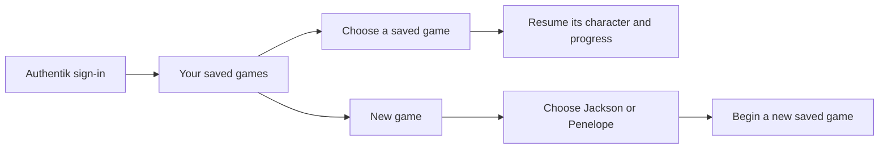

# PRD-001: Haynes Quest — initial project brief

- **Status:** Draft
- **Owner:** Tom Haynes
- **Last updated:** 2026-09-10
- **Source:** Owner's project kickoff, controls/login brief, and characters/save-flow brief on 2026-09-10

## Summary

A novelty 3D web game for Tom's kids, with Roblox as the style reference. Real photos from the household's Immich instance are the things players collect. Players use on-screen controls on a touchscreen or a keyboard and mouse at a computer, and sign in through Authentik using the same approach as Haynes Network. The project has its own GitHub repository and will run on the local cluster through `haynes-ops`.

Tom selected **Haynes Quest**, repository slug **`haynes-quest`**, on 2026-09-10. The repository and documentation scaffold are established, and the game brief is being developed with Tom.

After signing in, players choose an existing saved game or start a new one. Each new game begins with a choice between the two playable characters, **Jackson** and **Penelope**. Character likenesses will be developed later from family-provided photos, starting with generated reference images. The current priority is the technology stack and asset workflow, before further gameplay design.

## Confirmed requirements

| ID | Requirement | Priority |
| --- | --- | --- |
| R-01 | The game runs in a web browser and uses 3D. | Must |
| R-02 | The intended players are Tom's kids; this is a novelty family game. | Must |
| R-03 | Players collect real photos sourced from Immich. | Must |
| R-04 | The project gets its own GitHub repository, with local hosting managed through `haynes-ops`. | Must |
| R-05 | Repository and documentation conventions stay consistent with Tom's existing projects. | Must |
| R-06 | GPT-6 Astra leads the project end to end. | Must |
| R-07 | Use Roblox as the reference for the game's style. The specific look, camera, movement, and game world will be defined in the gameplay design. | Must |
| R-08 | Support touchscreen play with on-screen gameplay controls. | Must |
| R-09 | Support play with a keyboard and mouse at a computer. | Must |
| R-10 | Consider gamepad support after the initial playable scope; it is optional future work. | Later option |
| R-11 | Require players to sign in through Authentik, following Haynes Network's sign-in approach. Authentik is the only login method; do not add game-local passwords or separate login providers. | Must |
| R-12 | Provide exactly two playable characters: Jackson and Penelope. | Must |
| R-13 | After login, let the player select one of their saved games or start a new game. | Must |
| R-14 | Starting a new game includes choosing Jackson or Penelope. The saved game retains that character choice when resumed. | Must |
| R-15 | Develop the character models later from family-provided photos, generating reference images before modeling. | Must; later production stage |
| R-16 | Establish the technology stack and asset-production workflow before expanding the detailed game design. | Current priority |

## Saved games and characters

The signed-in player and the selected character are separate concepts. A player chooses a character for a new game; choosing Jackson or Penelope is not an account login. The number of save slots, save naming, save timing, and any later character-switching behavior remain for design.

## Input and sign-in direction

Touchscreen and keyboard/mouse are both required ways to play the first playable slice. Design the core interactions for both from the start. Exact devices, supported browsers, touch layout, keyboard bindings, and camera controls will follow the gameplay design. Optional gamepad support does not block that slice.

The Roblox reference establishes a style direction. It does not yet specify a camera viewpoint, character design, building system, multiplayer mode, or support for user-created games.

The Authentik decision is recorded in [ADR-001](../adrs/001-authentik-sign-in.md). The identity provider is settled; the policy for which signed-in people may enter this family game still needs to be defined. An existing Haynes Network account does not by itself establish permission to access the game's photos.

## Acceptance criteria for the first playable slice

These are requirements for future implementation, not completed checks. The playable loop and device/browser matrix must be defined before validating them.

| ID | Criterion | Requirements |
| --- | --- | --- |
| AC-01 | On an agreed touchscreen device, a player can complete the core play-and-collect loop using touch and the on-screen controls without a keyboard or mouse. | R-03, R-08 |
| AC-02 | On an agreed desktop browser, a player can complete the same loop using a keyboard and mouse without a touchscreen. | R-03, R-09 |
| AC-03 | A signed-out visitor must sign in through Authentik before entering gameplay or accessing protected collectible photos. The game offers no alternative login method. | R-11 |
| AC-04 | A player admitted by the game's eventual access policy can sign in with their existing Authentik identity without setting up a game-local password. | R-11 |
| AC-05 | After login, the player can see their saved games and a New game action. With no saves, they can start a new game. | R-13 |
| AC-06 | New game offers exactly Jackson and Penelope, and starting it records the chosen character in a distinct save. | R-12, R-14 |
| AC-07 | Resuming a save restores its character and recorded progress without creating a new save or requiring character selection again. | R-13, R-14 |
| AC-08 | One signed-in player cannot list, read, or modify another player's saves by changing an identifier. | R-11, R-13 |

## Current scope

The bootstrap established the name, contributor guide, document templates, project brief, vocabulary, handoff, and completion record after reviewing sibling repositories. The current phase records the new save/character requirements and proposes the [technology stack](../adrs/002-web-game-stack.md), [technical foundation](../designs/001-technical-foundation.md), and [asset pipeline](../designs/002-asset-pipeline.md). Character modeling and further game mechanics are deferred while this foundation is established.

The recommended stack is a proposal to validate in a small technical prototype, not an implemented runtime. Further gameplay acceptance criteria, viewpoint, progression, and multiplayer decisions will follow the remaining brief.

## Open and deferred decisions

| ID | Decision | Needed by | Status / resolution |
| --- | --- | --- | --- |
| Q-01 | Project name and repository slug | Repository creation | Resolved by Tom on 2026-09-10: `haynes-quest` (Haynes Quest). |
| Q-02 | Game world, player loop, controls, and target devices | Product/design phase | Partially resolved by Tom on 2026-09-10: Roblox-style direction, touchscreen with on-screen controls, and keyboard/mouse are required; gamepad is a later option. World, loop, precise controls, and device/browser matrix remain deferred to the gameplay brief. |
| Q-03 | Which Immich photos are eligible and how they become collectibles | Integration design | Deferred to the game and photo-selection brief. |
| Q-04 | Engine, app structure, persistence, and access model | Architecture phase | Authentik-only login is resolved by Tom. Saved games are now required. ADR-002 proposes the engine, application structure, and storage; admission rules still need design. |
| Q-05 | Characters and new/resume game flow | Foundation design | Resolved by Tom on 2026-09-10: select an existing save or start new after login; new game offers Jackson and Penelope. Likeness modeling follows reference-image generation later. |
