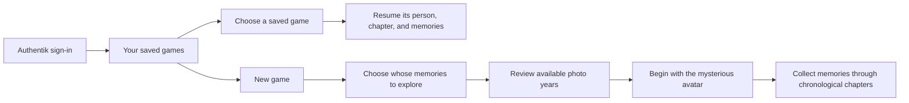

# PRD-001: Haynes Quest — initial project brief

- **Status:** Draft
- **Owner:** Tom Haynes
- **Last updated:** 2026-09-10
- **Source:** Owner's project kickoff and subsequent controls, saves, configurable-people, browser-device, asset-authoring, family-PoC scope, and memory-journey brief on 2026-09-10

## Summary

A novelty 3D web game for the family's proof of concept, with Roblox as the style reference. The player controls a generic, mysterious character who begins without memories. Starting a game selects a person from a configured self-hosted photo library; their photos become memories collected through a chronological journey across the years available for that person. Immich is the first integration. The shared avatar and world assets are authored through image generation and Blender MCP. Players use touch controls or a keyboard and mouse, sign in through Authentik as on Haynes Network, and play a normal browser app hosted through `haynes-ops`.

Tom selected **Haynes Quest**, repository slug **`haynes-quest`**, on 2026-09-10. The repository and documentation scaffold are established, and the game brief is being developed with Tom.

After signing in, players choose an existing saved game or start a new person's memory journey. The selected person supplies the photos and timeline; they do not need a playable likeness model. The avatar remains independent of that selection. Names are configured data. Automatic person-specific models remain [conditional future backlog BL-01](../BACKLOG.md), and would require reconsidering this generic-avatar premise if pursued.

## Confirmed requirements

The established platform constraints remain in force. R-12, R-14, and R-20–R-24 express Tom's latest narrative direction within this draft; detailed chapter rules and any eventual avatar identity reveal remain for design.

| ID | Requirement | Priority |
| --- | --- | --- |
| R-01 | The game is a 3D web application playable on iPad, iPhone, and PC. | Must |
| R-02 | The intended players are Tom's kids; this is a novelty family game. | Must |
| R-03 | Players collect real photos from the configured self-hosted photo service, with Immich as the first integration. Configured people also drive photo queries for other game uses as those are designed. | Must |
| R-04 | The project gets its own GitHub repository, with hosting on Tom's homelab managed through `haynes-ops`. | Must |
| R-05 | Repository and documentation conventions stay consistent with Tom's existing projects. | Must |
| R-06 | GPT-6 Astra leads the project end to end. | Must |
| R-07 | Use Roblox as the reference for the game's style. The specific look, camera, movement, and game world will be defined in the gameplay design. | Must |
| R-08 | Support touchscreen play with on-screen gameplay controls. | Must |
| R-09 | Support play with a keyboard and mouse at a computer. | Must |
| R-10 | Consider gamepad support after the initial playable scope; it is optional future work. | Later option |
| R-11 | Require players to sign in through Authentik, following Haynes Network's sign-in approach. Authentik is the only login method; do not add game-local passwords or separate login providers. | Must |
| R-12 | Use a generic, mysterious playable avatar who begins without memories. Its model is independent of the selected photo-library person; no likeness or per-person character asset is required. | Must |
| R-13 | After login, let the player select one of their saved games or start a new game. | Must |
| R-14 | Starting a new game includes choosing whose memories to explore from the configured people. The saved game retains that person's identity and journey progress when resumed. | Must |
| R-15 | Automatically generate playable character models from configured people's photos if person-specific avatars are separately reintroduced. | Deferred; conditional future [BL-01](../BACKLOG.md), outside family PoC |
| R-16 | Establish the technical direction and document both technical and nontechnical requirements before setting up asset tools or starting production/prototype work. Tom will arrange tool setup after the documentation phase. | Current priority |
| R-17 | Let users configure the photo-service URL, API key, and people's names used to populate the game. | Must |
| R-18 | Resolve configured names to people in the connected photo service and retrieve their eligible photos and usable dates for gameplay content and timeline construction. | Must |
| R-19 | Deliver the game through a normal browser URL. Do not require a native iOS app, TestFlight, sideloading, or an app-install workaround. | Must |
| R-20 | Organize collected memories into chronological chapters, beginning with baby photos when available and continuing through the latest available photos of the selected person. | Must |
| R-21 | Tailor the chapter coverage to the person's represented years. A short childhood library and a library spanning decades must not be forced into the same fixed lifespan or empty future stages. | Must |
| R-22 | Distinguish photo-date coverage from the person's age. Do not treat the earliest photo as birth or infer age from appearance. Use known birth information for age labels; see the proposed optional-birth-date policy in DESIGN-004. | Must; setup policy proposed |
| R-23 | Collecting photos recovers memories and advances the selected journey. Preserve collected-memory and chapter progress across save/resume and avatar asset replacement. | Must |
| R-24 | Handle missing early photos, sparse years, date problems, and later library changes without inventing memories, silently resetting progress, or requiring empty chapters. | Must |

## Saved games and memory journeys

The signed-in player, the person whose memories are explored, and the avatar are separate concepts. Adding a resolved person with usable photos makes another journey possible without authoring a new character model. The player chooses the journey's subject, while the same generic avatar can be used across subjects. Whether the story ultimately reveals that the avatar is the selected person remains undecided.

Names are editable labels, not permanent save keys. Resolve them to the correct source person and retain a stable game-owned subject ID. A rename, replacement avatar asset, or newly imported photo must not change whose journey a save belongs to or erase its progress. Starting another person's journey creates a separate game. Missing photo setup or an unavailable avatar must leave existing saves visible. Save-slot count, naming, cadence, and refresh policy remain for design.

The photo range determines which years are represented, not the person's actual age or a complete biography. Start with the earliest eligible dated memories; if infancy is absent, do not label the earliest available adult photos as babyhood. End at the latest represented period. [DESIGN-004](../designs/004-memory-journey.md) proposes optional birth-date setup for age-based stages, with calendar-year chapters when it is unknown, and records the clarification asked of Tom. Exact chapter boundaries, required collectibles, and the world and challenges within each chapter remain for gameplay design.

## Input and sign-in direction

Touchscreen play on **iPad and iPhone** and keyboard/mouse play on **PC** are required for the first playable slice. Tom confirmed these device families and browser-only delivery on 2026-09-10. Players open the homelab-hosted HTTPS URL in their browser; a native iOS build or TestFlight distribution is not part of the project.

Use Safari on iPad/iPhone as the touch-browser validation baseline and a desktop browser on PC. Exact hardware models, OS/browser version floors, and the PC browser matrix will be recorded for the prototype. Touch layout, keyboard bindings, and camera controls still need gameplay design. Optional gamepad support does not block that slice.

The Roblox reference establishes a style direction. It does not yet specify a camera viewpoint, character design, building system, multiplayer mode, or support for user-created games.

The Authentik decision is recorded in [ADR-001](../adrs/001-authentik-sign-in.md). The identity provider is settled; the policy for which signed-in people may enter this family game still needs to be defined. An existing Haynes Network account does not by itself establish permission to access the game's photos.

## Acceptance criteria for the first playable slice

These are requirements for future implementation, not completed checks. The playable loop and exact hardware/browser versions must be recorded before validating them against the confirmed iPad, iPhone, and PC targets.

| ID | Criterion | Requirements |
| --- | --- | --- |
| AC-01 | On both an iPad and an iPhone using the Safari baseline, a player can complete the core play-and-collect loop using touch and the on-screen controls without a keyboard or mouse. | R-01, R-03, R-08 |
| AC-02 | In an agreed PC browser, a player can complete the same loop using a keyboard and mouse without a touchscreen. | R-01, R-03, R-09 |
| AC-03 | A signed-out visitor must sign in through Authentik before entering gameplay or accessing protected collectible photos. The game offers no alternative login method. | R-11 |
| AC-04 | A player admitted by the game's eventual access policy can sign in with their existing Authentik identity without setting up a game-local password. | R-11 |
| AC-05 | After login, the player can see their saved games and a New game action. Missing photo setup, usable memories, or shared avatar assets have clear states; saves remain listed. | R-13, R-17, R-24 |
| AC-06 | New game selects a configured person and records that subject in a distinct save. Selecting another eligible person requires configuration and photos, with no person-specific model or hard-coded name. | R-12, R-14 |
| AC-07 | Resuming a save restores its selected person, chapter, and collected memories without creating a new save or requiring subject selection again. | R-13, R-14, R-23 |
| AC-08 | One signed-in player cannot list, read, or modify another player's saves by changing an identifier. | R-11, R-13 |
| AC-09 | A user can configure their service URL, API key, and people. Missing or ambiguous people and invalid connections produce actionable setup states instead of unrelated photo results. | R-17, R-18 |
| AC-11 | Gameplay photo requests use the configured connection and resolved people; they do not fall back to another account's library or an unrestricted image search. | R-03, R-18 |
| AC-12 | Renaming a source person or replacing the generic avatar asset preserves the selected subject, chapter, and collected-memory progress. | R-14, R-23 |
| AC-13 | On iPad, iPhone, and PC, opening the homelab-hosted HTTPS URL supports sign-in, setup, new-game selection, and resuming a ready save in the browser without installing an app or using TestFlight. | R-01, R-04, R-19 |
| AC-14 | The same generic avatar supports journeys for different configured people and begins each new journey without memories; selecting a person does not select a likeness model. | R-12, R-14 |
| AC-15 | A test library spanning multiple periods produces ordered chapters from its earliest eligible photos to its latest; collecting memories and resuming a save preserve the intended chronology and progress. | R-20, R-23 |
| AC-16 | Photo coverage is presented separately from age. Known birth information gives appropriate age labels; absent birth information does not cause the earliest photo to be treated as birth. The proposed fallback uses calendar years. | R-22 |
| AC-17 | Libraries with missing infancy, sparse decades, a single represented year, or no usable dates produce supported chapters or an actionable setup state, with no invented or mandatory empty life stage. | R-21, R-24 |
| AC-18 | New uploads, corrected dates, and removed photos cannot silently switch a save's subject, reorder completed chapters, erase collection credit, or award the same memory twice. | R-23, R-24 |

## Conditional future acceptance

These criteria are retained for the [backlog](../BACKLOG.md), not for PoC acceptance.

| ID | Criterion | Requirements |
| --- | --- | --- |
| AC-10 | If person-specific playable models are separately reintroduced for a broader release, automatic generation produces validated models from eligible photos, with progress and recoverable failures that preserve existing journeys. This is outside the generic-avatar PoC. | R-15; BL-01 |

## Current scope

The bootstrap established the name, contributor guide, document templates, project brief, vocabulary, handoff, and completion record after reviewing sibling repositories. Continue documenting the technical and nontechnical requirements, including the [technology stack](../adrs/002-web-game-stack.md), [technical foundation](../designs/001-technical-foundation.md), [asset pipeline](../designs/002-asset-pipeline.md), [photo-connection/person contract](../designs/003-photo-connections-and-people.md), [memory journeys](../designs/004-memory-journey.md), and remaining player experience. Tool setup, asset production, and prototype implementation follow completion of this documentation phase.

Tom proposed generating asset sketches with image generation, then having the agent create the assets in Blender through MCP. This is the PoC authoring direction for the shared avatar and world assets in DESIGN-002. His subsequent scope ruling defers automatic character generation to a possible release beyond the family PoC; its workers, job simulation, and provider trials are not active requirements. No tooling has been connected or installed for this proposal.

The recommended stack is a proposal to validate in a small technical prototype, not an implemented runtime. The memory-journey direction establishes why photos are collected and how time shapes progression. World layout, challenges, camera, chapter completion rules, and the ending still need design.

## Open and deferred decisions

| ID | Decision | Needed by | Status / resolution |
| --- | --- | --- | --- |
| Q-01 | Project name and repository slug | Repository creation | Resolved by Tom on 2026-09-10: `haynes-quest` (Haynes Quest). |
| Q-02 | Game world, player loop, controls, and target devices | Product/design phase | Partially resolved by Tom on 2026-09-10: Roblox-style direction; iPad/iPhone touch and PC keyboard/mouse in a normal web app; homelab hosting; no native iOS/TestFlight path. Gamepad is a later option. Chronological memory collection now establishes progression direction. World, challenges, precise controls, and exact hardware/browser versions remain for design and testing. |
| Q-03 | Which source photos are eligible and how they become collectibles | Integration design | Partially resolved by Tom on 2026-09-10: use the configured service/key and named people for photo lookup. Photos now represent memories in chronological chapters. Detailed content filters, date handling, and chapter completion remain for design. |
| Q-04 | Engine, app structure, persistence, and access model | Architecture phase | Authentik-only login is resolved by Tom. Saved games are now required. ADR-002 proposes the engine, application structure, and storage; admission rules still need design. |
| Q-05 | Characters and new/resume game flow | Foundation design | Revised by Tom on 2026-09-10: generic mysterious avatar with no memory; select whose chronological photo journey to explore. Per-person playable models are no longer part of the PoC. See DESIGN-004. |
| Q-06 | How is the person's age established when photos do not begin at birth? | Timeline setup design | Asked Tom on 2026-09-10: optional birth date with calendar-year fallback versus required birth date. Optional is the documented proposal pending his response; photo range alone is not age evidence. |
